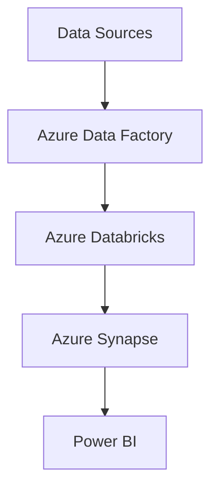

# Azure Data Services Guide – Basic → Architect

## Level 1 – Launch & Basics

### 1. **Setup**
```bash
# Install Azure CLI
curl -sL https://aka.ms/InstallAzureCLIDeb | sudo bash

# Login
az login

# Set subscription
az account set --subscription "My Subscription"
```

### 2. **Data Factory Basics**
```python
from azure.identity import DefaultAzureCredential
from azure.mgmt.datafactory import DataFactoryManagementClient

credential = DefaultAzureCredential()
adf_client = DataFactoryManagementClient(credential, subscription_id)

# Create pipeline
pipeline_resource = {
    "properties": {
        "activities": [{
            "name": "CopyData",
            "type": "Copy",
            "inputs": [{"referenceName": "inputDataset"}],
            "outputs": [{"referenceName": "outputDataset"}]
        }]
    }
}

adf_client.pipelines.create_or_update(
    resource_group_name="my-rg",
    factory_name="my-factory",
    pipeline_name="my-pipeline",
    pipeline=pipeline_resource
)
```

### 3. **Databricks Basics**
```python
# In Databricks notebook
df = spark.read.table("samples.nyctaxi.trips")
df_filtered = df.filter(df.trip_distance > 5)
df_filtered.write.format("delta").saveAsTable("filtered_trips")
```

### 4. **Synapse Analytics**
```sql
-- Create table
CREATE TABLE dbo.Sales (
    SaleID INT PRIMARY KEY,
    SaleDate DATE,
    Amount DECIMAL(10,2)
)
WITH (
    DISTRIBUTION = HASH(SaleID),
    CLUSTERED COLUMNSTORE INDEX
);

-- Load data
COPY INTO dbo.Sales
FROM 'https://storageaccount.blob.core.windows.net/container/data.csv'
WITH (
    FILE_TYPE = 'CSV',
    FIRSTROW = 2
);
```

## Level 2 – Production Patterns

### Data Factory Advanced
```python
# Parameterized pipeline
pipeline_resource = {
    "properties": {
        "parameters": {
            "sourceTable": {"type": "String"},
            "targetTable": {"type": "String"}
        },
        "activities": [{
            "name": "CopyData",
            "type": "Copy",
            "typeProperties": {
                "source": {
                    "type": "AzureSqlSource",
                    "sqlReaderQuery": "@concat('SELECT * FROM ', pipeline().parameters.sourceTable)"
                },
                "sink": {
                    "type": "AzureSqlSink",
                    "tableName": "@{pipeline().parameters.targetTable}"
                }
            }
        }]
    }
}
```

### Event Hubs Streaming
```python
from azure.eventhub import EventHubProducerClient, EventData

client = EventHubProducerClient.from_connection_string(
    conn_str="Endpoint=sb://...",
    eventhub_name="my-hub"
)

with client:
    event_data_batch = client.create_batch()
    event_data_batch.add(EventData("Hello"))
    event_data_batch.add(EventData("World"))
    client.send_batch(event_data_batch)
```

### Stream Analytics
```sql
SELECT
    System.Timestamp() AS WindowEnd,
    COUNT(*) AS EventCount
INTO
    [output-blob]
FROM
    [input-hub]
TIMESTAMP BY EventEnqueuedUtcTime
GROUP BY
    TumblingWindow(second, 60)
```

## Level 3 – Architect Playbook

### Medallion Architecture
```python
# Bronze: Raw data ingestion
bronze_df = spark.readStream.format("cloudFiles") \
    .option("cloudFiles.format", "json") \
    .load("abfss://bronze@storage.dfs.core.windows.net/")

# Silver: Cleaned data
silver_df = bronze_df \
    .dropDuplicates(["id"]) \
    .withColumn("processed_at", current_timestamp())

# Gold: Aggregated data
gold_df = silver_df \
    .groupBy("date", "region") \
    .agg(sum("amount").alias("total"))
```

### Azure ML Integration
```python
from azure.ai.ml import MLClient
from azure.identity import DefaultAzureCredential

ml_client = MLClient(
    DefaultAzureCredential(),
    subscription_id="sub-id",
    resource_group_name="rg-name",
    workspace_name="ws-name"
)

# Register dataset
dataset = ml_client.data.create_or_update(
    name="my-dataset",
    path="azureml://datastores/workspaceblobstore/paths/data"
)
```

## Ops Cheat Sheet

| Task | Command | Notes |
| --- | --- | --- |
| List resources | `az resource list` | List all resources |
| Create resource group | `az group create` | Create RG |
| Deploy template | `az deployment group create` | Deploy ARM template |
| List pipelines | `az datafactory pipeline list` | List ADF pipelines |
| Trigger pipeline | `az datafactory pipeline create-run` | Run pipeline |

## Architecture Patterns



## Checklist Before Production

- [ ] Set up proper resource groups and naming
- [ ] Configure managed identities
- [ ] Set up Key Vault for secrets
- [ ] Configure network security
- [ ] Implement proper monitoring and alerting
- [ ] Set up cost management and budgets
- [ ] Configure backup and disaster recovery
- [ ] Implement proper access controls
- [ ] Set up CI/CD pipelines
- [ ] Configure logging and auditing
