# BigQuery - Visual Learning Guide

## 🎨 Visual Learning: Data Flow, Architecture, Query Processing

---

## 📊 BigQuery Architecture

### High-Level Architecture

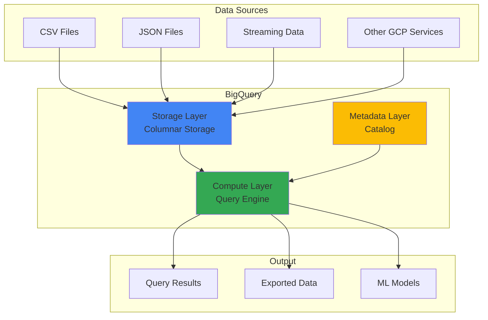

### Storage and Compute Separation

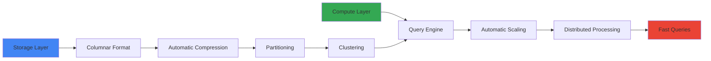

---

## 🔄 Data Ingestion Flow

### Batch Loading Flow

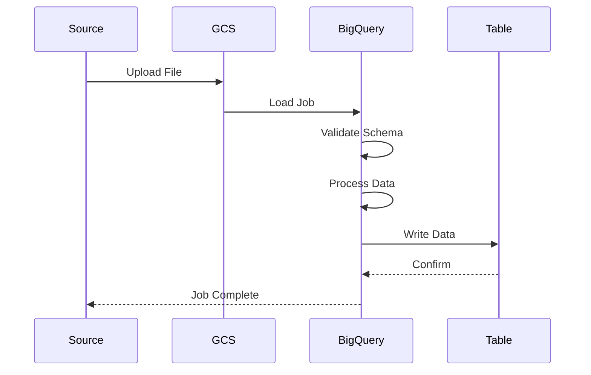

### Streaming Insert Flow

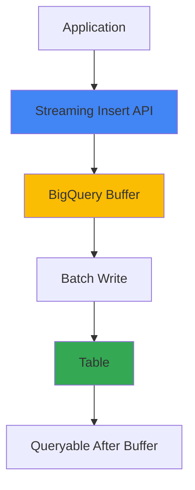

---

## 🔍 Query Processing Flow

### Query Execution Flow

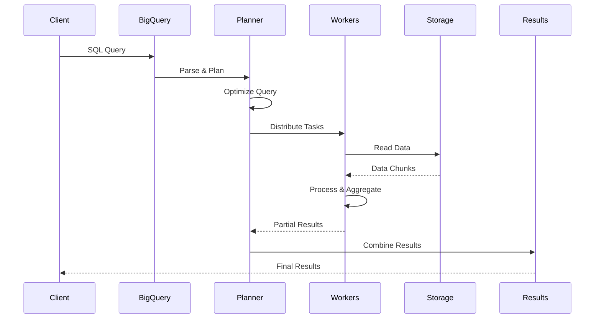

### Query Optimization

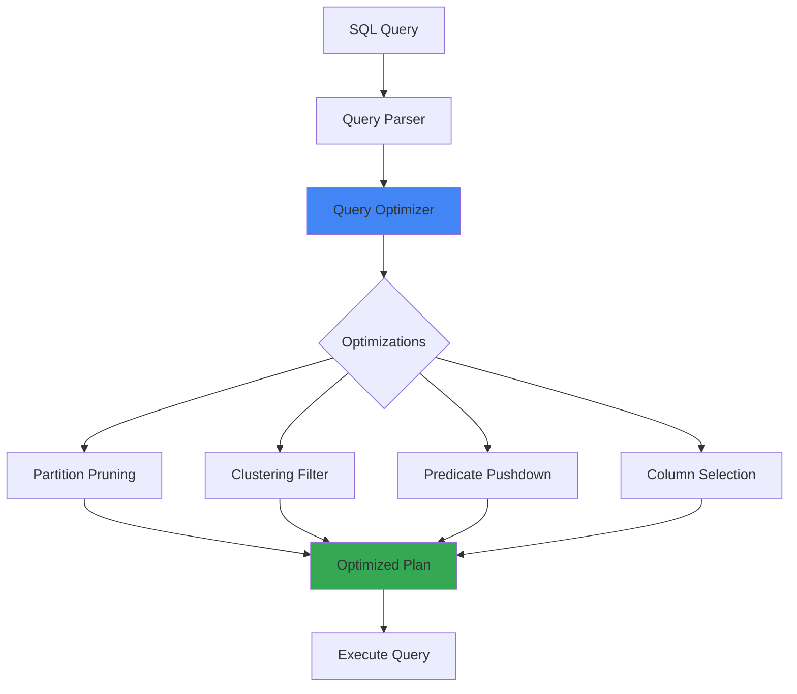

---

## 📊 Partitioning and Clustering

### Partitioning Strategy

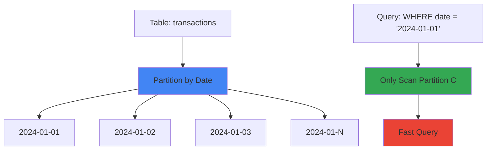

### Clustering Strategy

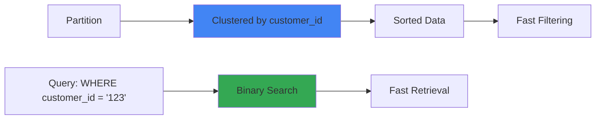

---

## 🔄 ETL Pipeline Flow

### Data Transformation Pipeline

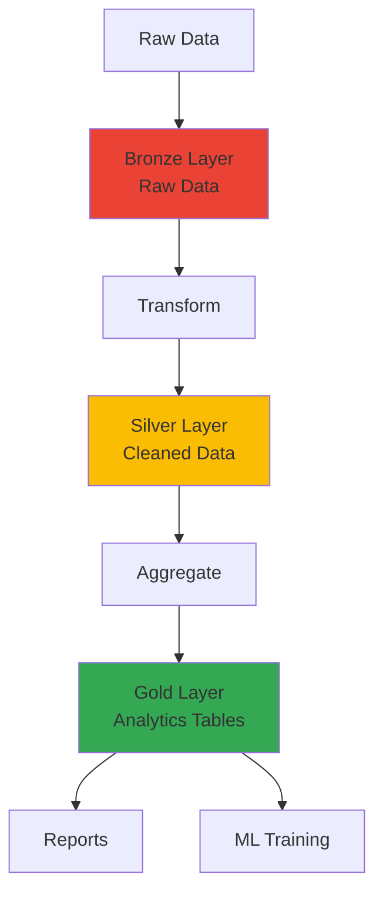

---

## 🎯 Query Types

### Query Execution Comparison

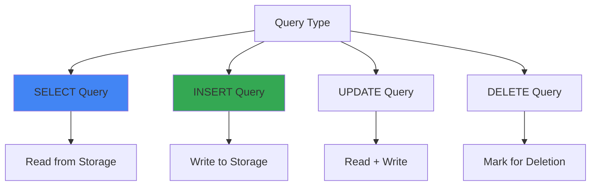

---

## 💰 Cost Optimization Flow

### Cost Optimization Strategies

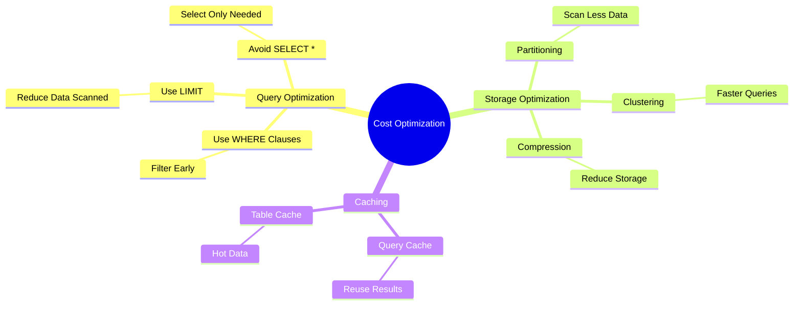

---

## 🎯 Key Visual Takeaways

1. **Storage + Compute Separation**: Independent scaling
2. **Columnar Storage**: Fast analytical queries
3. **Partitioning**: Query only relevant data
4. **Clustering**: Faster filtering
5. **Automatic Optimization**: Query engine optimizes

---

## 📚 Next Steps

1. ✅ Review these diagrams
2. 🏗️ Draw them yourself
3. 💬 Use in interviews
4. 🔗 Connect to your POCs

---

**Visual learning helps!** Use these to explain BigQuery in interviews.

