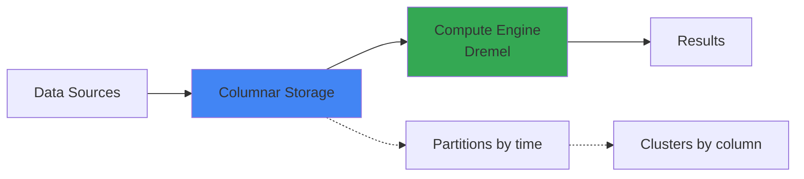

# BigQuery -- Cheatsheet

## Architecture (30-second mental model)

Storage and compute are fully separated -- storage scales independently, compute spins up per-query and dies.

## When to use vs alternatives
| Need | Use | Not |
|------|-----|-----|
| Ad-hoc SQL on petabytes, zero ops | BigQuery | Redshift (need to size clusters) |
| Sub-second OLTP queries | Cloud SQL / Spanner | BigQuery (scan latency floor ~1s) |
| Streaming with <100ms latency | Bigtable / Pub-Sub | BigQuery (streaming buffer delay) |
| Multi-cloud warehouse | Snowflake | BigQuery (GCP-locked) |
| Cost-predictable flat rate | BigQuery slots | BigQuery on-demand (unpredictable) |

## 5 things you always forget
1. `maximum_bytes_billed` in QueryJobConfig -- set it or one bad `SELECT *` on a 10TB table costs $50.
2. Streaming inserts land in a buffer that is NOT immediately available for DML (UPDATE/DELETE); batch loads are immediately consistent.
3. Clustering only kicks in when the table exceeds ~1GB; on small tables it does nothing and you waste design time.
4. Materialized views auto-refresh but count as query bytes billed -- monitor them or they silently inflate cost.
5. `MERGE` statements scan the full target table even with partitions unless you add an explicit partition filter in the `ON` clause.

## Interview killer answer
> "In production I partition by ingestion date and cluster by the highest-cardinality filter column, which dropped our scan from 2TB to ~40GB per query. The real lesson was that clustering order matters -- BigQuery sorts left to right, so putting the most selective column first cut our cost another 30%. We also set `maximum_bytes_billed` as a circuit breaker so a single analyst mistake couldn't blow through our monthly budget."
