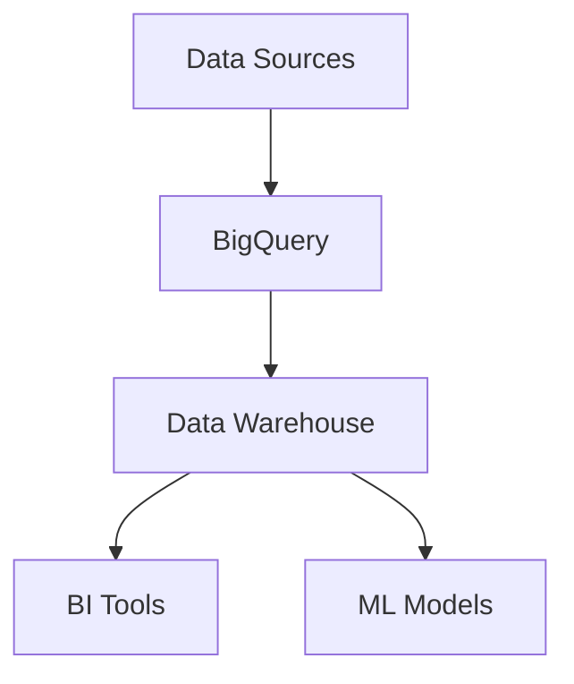

# BigQuery Guide – Basic → Architect

## Level 1 – Launch & Basics

### 1. **Setup**
```bash
# Install SDK
pip install google-cloud-bigquery

# Authenticate
gcloud auth application-default login
```

### 2. **Basic Queries**
```python
from google.cloud import bigquery

client = bigquery.Client(project="my-project")

# Run query
query = """
    SELECT name, COUNT(*) as count
    FROM `my-project.dataset.table`
    GROUP BY name
    LIMIT 10
"""

results = client.query(query)
for row in results:
    print(row.name, row.count)
```

### 3. **Load Data**
```python
# Load from CSV
job_config = bigquery.LoadJobConfig(
    source_format=bigquery.SourceFormat.CSV,
    skip_leading_rows=1,
    autodetect=True
)

with open("data.csv", "rb") as source_file:
    job = client.load_table_from_file(
        source_file,
        "my-project.dataset.table",
        job_config=job_config
    )
job.result()
```

## Level 2 – Production Patterns

### Partitioning & Clustering
```sql
-- Create partitioned table
CREATE TABLE `my-project.dataset.events`
(
    event_date DATE,
    event_id STRING,
    user_id STRING,
    value FLOAT64
)
PARTITION BY event_date
CLUSTER BY user_id
AS
SELECT * FROM source_table;
```

### BigQuery ML
```sql
-- Create ML model
CREATE MODEL `my-project.dataset.churn_model`
OPTIONS(
    model_type='logistic_reg',
    input_label_cols=['churned']
) AS
SELECT
    age,
    tenure,
    monthly_charges,
    churned
FROM `my-project.dataset.customers`;

-- Predict
SELECT
    user_id,
    predicted_churned,
    predicted_churned_probs[OFFSET(0)].prob AS churn_probability
FROM ML.PREDICT(
    MODEL `my-project.dataset.churn_model`,
    (SELECT * FROM `my-project.dataset.new_customers`)
);
```

### Streaming Inserts
```python
from google.cloud import bigquery

client = bigquery.Client()
table = client.get_table("my-project.dataset.table")

rows_to_insert = [
    {"id": 1, "name": "John"},
    {"id": 2, "name": "Jane"}
]

errors = client.insert_rows_json(table, rows_to_insert)
if errors:
    print(f"Errors: {errors}")
```

## Level 3 – Architect Playbook

### External Tables
```sql
-- Create external table
CREATE EXTERNAL TABLE `my-project.dataset.external_table`
OPTIONS (
    format = 'PARQUET',
    uris = ['gs://bucket/data/*.parquet']
);

-- Query external table
SELECT * FROM `my-project.dataset.external_table`
WHERE date = '2024-01-01';
```

### Materialized Views
```sql
CREATE MATERIALIZED VIEW `my-project.dataset.daily_sales`
PARTITION BY sale_date
AS
SELECT
    sale_date,
    region,
    SUM(amount) as total_sales
FROM `my-project.dataset.sales`
GROUP BY sale_date, region;

-- Query materialized view (faster)
SELECT * FROM `my-project.dataset.daily_sales`
WHERE sale_date = '2024-01-01';
```

### Cost Optimization
```python
# Use query caching
job_config = bigquery.QueryJobConfig(use_query_cache=True)

# Use dry run to estimate cost
job_config.dry_run = True
job = client.query(query, job_config=job_config)
print(f"Bytes processed: {job.total_bytes_processed}")
```

## Ops Cheat Sheet

| Task | Command | Notes |
| --- | --- | --- |
| List datasets | `client.list_datasets()` | List all datasets |
| Create table | `client.create_table()` | Create new table |
| Load data | `client.load_table_from_file()` | Load from file |
| Export data | `client.extract_table()` | Export to GCS |
| Get table | `client.get_table()` | Get table info |

## Architecture Patterns



## Checklist Before Production

- [ ] Set up proper dataset organization
- [ ] Configure partitioning and clustering
- [ ] Implement proper access controls
- [ ] Set up cost monitoring and budgets
- [ ] Configure data retention policies
- [ ] Set up scheduled queries
- [ ] Implement proper error handling
- [ ] Set up monitoring and alerting
- [ ] Configure backup and recovery
- [ ] Optimize query performance
