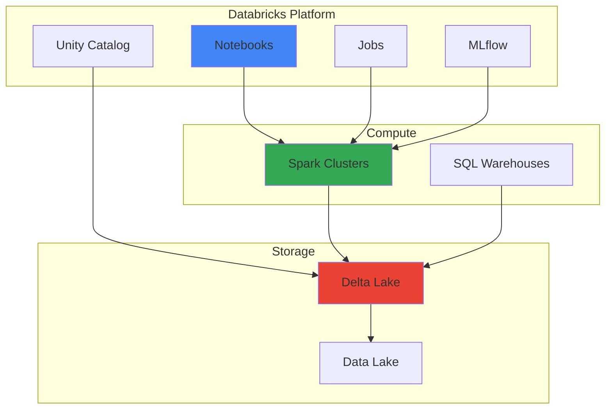
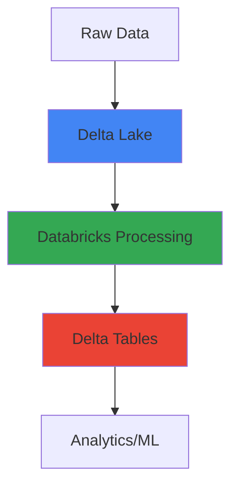

# Databricks - Visual Learning Guide

## 🎨 Visual Learning: Architecture, Data Flow, Lakehouse

---

## 📊 Databricks Architecture

### High-Level Architecture

---

## 🔄 Lakehouse Flow

### Data Flow

---

## 🎯 Key Visual Takeaways

1. **Databricks = Unified Platform**
2. **Delta Lake = ACID Data Lake**
3. **Unity Catalog = Governance**
4. **MLflow = ML Lifecycle**

---

## 📚 Next Steps

1. ✅ Review these diagrams
2. 🏗️ Draw them yourself
3. 💬 Use in interviews
4. 🔗 Connect to your projects

---

**Visual learning helps!** Use these to explain Databricks in interviews.

