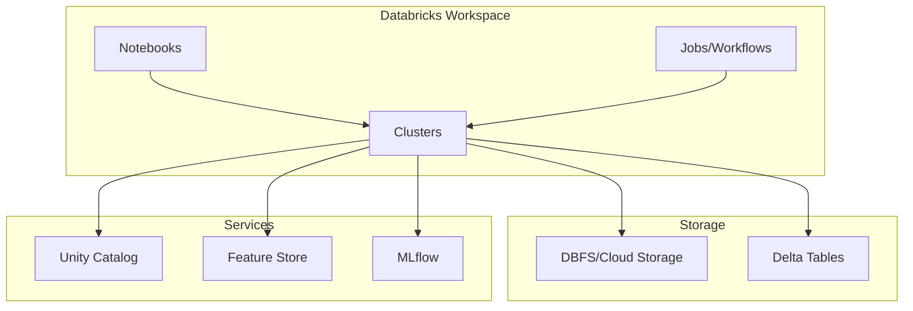

# Databricks Guide – Basic → Architect

## Level 1 – Launch & Basics

### 1. **Workspace Setup**
```python
# Create cluster
# Via UI: Compute → Create Cluster
# Or via API:
from databricks_cli.clusters.api import ClusterApi
from databricks_cli.sdk import ApiClient

client = ApiClient(host=workspace_url, token=token)
clusters_api = ClusterApi(client)

cluster_config = {
    "cluster_name": "my-cluster",
    "spark_version": "13.3.x-scala2.12",
    "node_type_id": "i3.xlarge",
    "num_workers": 2
}
cluster_id = clusters_api.create_cluster(cluster_config)
```

### 2. **First Notebook**
```python
# Read data
df = spark.read.table("samples.nyctaxi.trips")

# Transform
df_filtered = df.filter(df.trip_distance > 5)

# Write to Delta
df_filtered.write.format("delta").mode("overwrite").saveAsTable("my_table")
```

### 3. **Delta Lake Basics**
```python
# Create Delta table
df.write.format("delta").save("/delta/events")

# Read Delta table
df = spark.read.format("delta").load("/delta/events")

# Time travel
df = spark.read.format("delta").option("versionAsOf", 0).load("/delta/events")

# Vacuum old files
spark.sql("VACUUM delta.`/delta/events` RETAIN 168 HOURS")
```

## Level 2 – Production Patterns

### Unity Catalog
```python
# Create catalog
spark.sql("CREATE CATALOG IF NOT EXISTS production")

# Create schema
spark.sql("CREATE SCHEMA IF NOT EXISTS production.analytics")

# Create table
spark.sql("""
    CREATE TABLE production.analytics.events (
        id STRING,
        timestamp TIMESTAMP,
        value DOUBLE
    ) USING DELTA
""")
```

### Delta Live Tables (DLT)
```python
import dlt
from pyspark.sql.functions import *

@dlt.table(
    name="bronze_events",
    comment="Raw events from source"
)
def bronze_events():
    return spark.readStream.format("kafka") \
        .option("kafka.bootstrap.servers", "broker:9092") \
        .option("subscribe", "events") \
        .load()

@dlt.table(
    name="silver_events",
    comment="Cleaned and validated events"
)
@dlt.expect("valid_timestamp", "timestamp IS NOT NULL")
@dlt.expect_or_drop("valid_value", "value > 0")
def silver_events():
    return dlt.read("bronze_events") \
        .withColumn("processed_at", current_timestamp())
```

### Workflows (Jobs)
```python
# Create job via API
from databricks_cli.jobs.api import JobsApi

jobs_api = JobsApi(client)

job_config = {
    "name": "daily_etl",
    "tasks": [{
        "task_key": "extract",
        "notebook_task": {
            "notebook_path": "/Users/user/extract"
        },
        "existing_cluster_id": cluster_id
    }],
    "schedule": {
        "quartz_cron_expression": "0 0 0 * * ?",
        "timezone_id": "UTC"
    }
}
job_id = jobs_api.create_job(job_config)
```

## Level 3 – Architect Playbook

### Medallion Architecture
```python
# Bronze: Raw data
@dlt.table(name="bronze_sales")
def bronze_sales():
    return spark.readStream.format("cloudFiles") \
        .option("cloudFiles.format", "json") \
        .load("s3://bucket/raw/")

# Silver: Cleaned data
@dlt.table(name="silver_sales")
def silver_sales():
    return dlt.read("bronze_sales") \
        .withColumn("sale_date", to_date("timestamp")) \
        .dropDuplicates(["id"])

# Gold: Aggregated data
@dlt.table(name="gold_daily_sales")
def gold_daily_sales():
    return dlt.read("silver_sales") \
        .groupBy("sale_date", "region") \
        .agg(sum("amount").alias("total_sales"))
```

### Feature Store
```python
from databricks.feature_store import FeatureStoreClient

fs = FeatureStoreClient()

# Create feature table
fs.create_table(
    name="user_features",
    primary_keys=["user_id"],
    df=feature_df,
    description="User features for ML"
)

# Write features
fs.write_table(
    name="user_features",
    df=updated_features,
    mode="merge"
)
```

### MLflow Integration
```python
import mlflow
from mlflow.tracking import MlflowClient

# Log model
with mlflow.start_run():
    mlflow.log_param("n_estimators", 100)
    mlflow.log_metric("accuracy", 0.95)
    mlflow.sklearn.log_model(model, "model")

# Register model
client = MlflowClient()
client.create_model_version(
    name="churn_model",
    source=f"runs:/{run_id}/model"
)
```

## Ops Cheat Sheet

| Task | Command | Notes |
| --- | --- | --- |
| List clusters | `databricks clusters list` | View all clusters |
| Create cluster | Via UI or API | Configure auto-termination |
| Run notebook | `databricks jobs run-now --job-id 123` | Trigger job |
| View logs | Via UI: Jobs → Run → Logs | Check execution logs |
| Optimize table | `OPTIMIZE delta.`/path/to/table`` | Compact small files |
| Z-order | `OPTIMIZE ... ZORDER BY (col1, col2)` | Improve query performance |
| Vacuum | `VACUUM delta.`/path/to/table`` | Remove old files |

## Architecture Patterns



## Checklist Before Production

- [ ] Set up Unity Catalog for governance
- [ ] Configure cluster auto-termination
- [ ] Implement medallion architecture (Bronze/Silver/Gold)
- [ ] Set up Delta Live Tables for pipelines
- [ ] Configure job schedules and dependencies
- [ ] Set up monitoring and alerting
- [ ] Implement proper access controls
- [ ] Use feature store for ML features
- [ ] Set up MLflow for model tracking
- [ ] Configure cost monitoring and optimization
