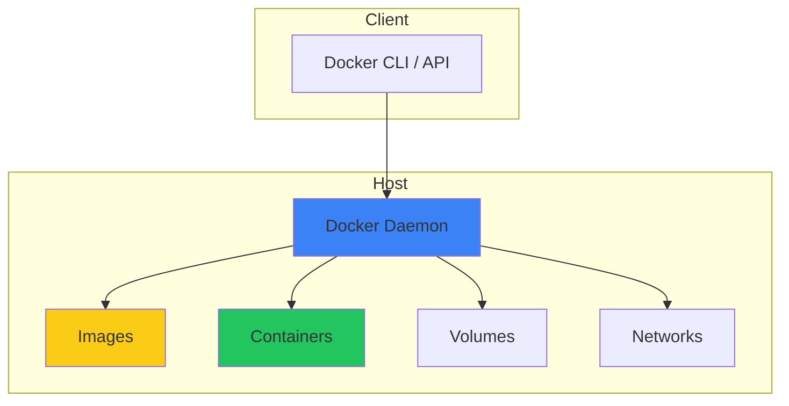
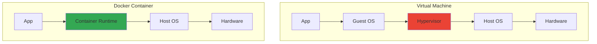
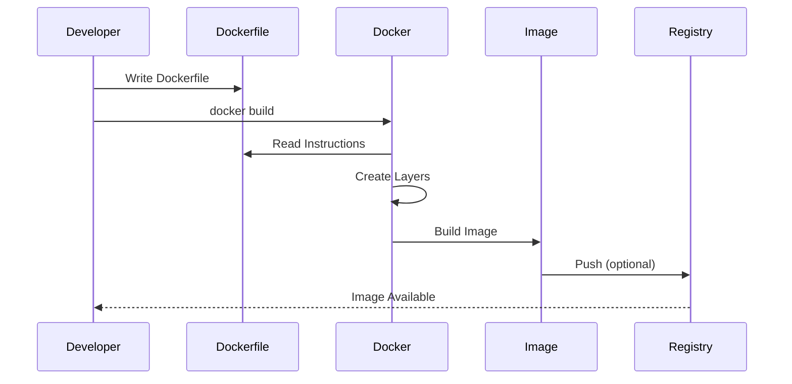
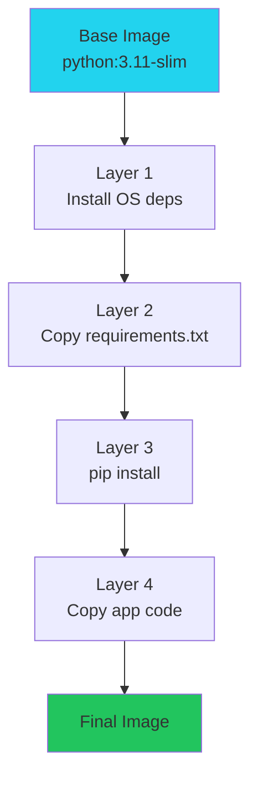
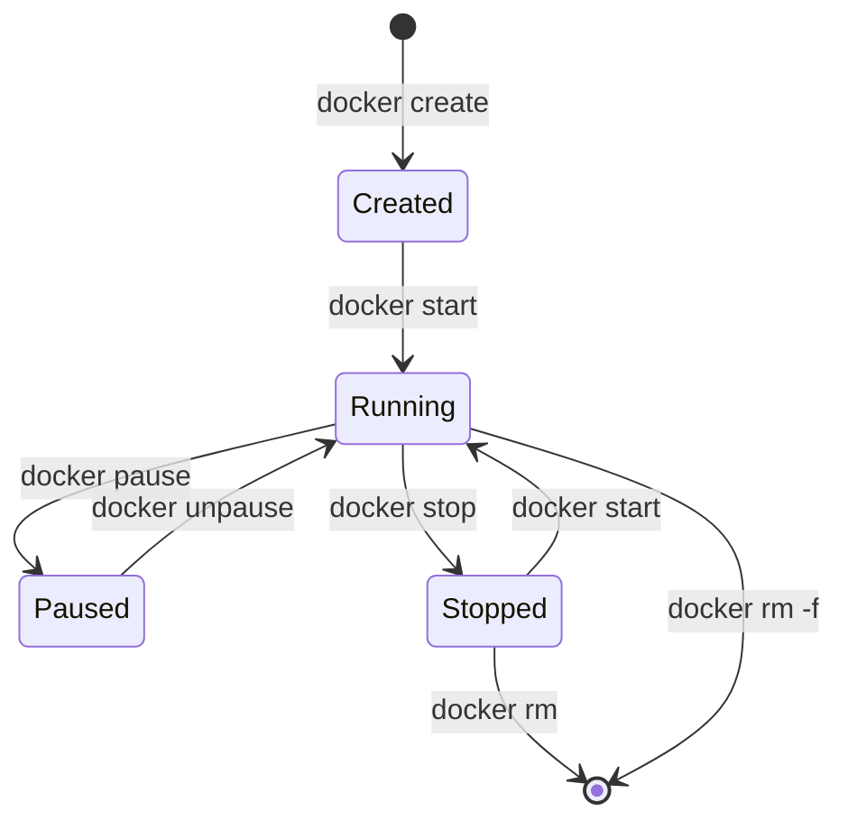
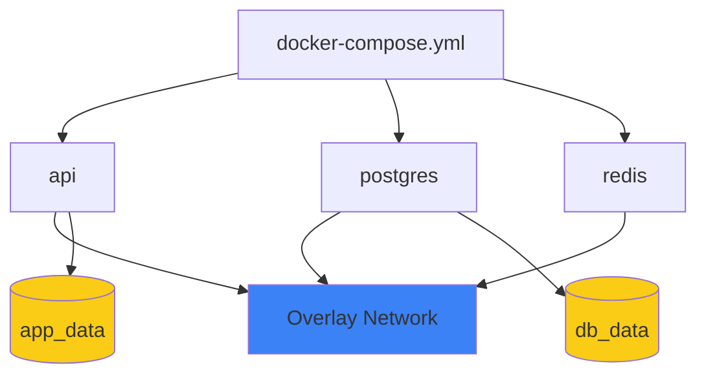

# Docker - Visual Learning Guide

## 🎨 Visual Learning: Container Architecture, Build Process, Deployment

---

## 📊 Docker Architecture

### High-Level Architecture



### Container vs VM



---

## 🔨 Build Process & Pipelines

### Docker Build Flow



### Image Layers



---

## 🚀 Container Lifecycle & Promotion

### Container States



---

## 🔄 Docker Compose & Orchestrators

### Compose vs K8s (High-Level)
```mermaid
graph LR
    subgraph Compose (Local)
        Yaml[docker-compose.yml]
        Yaml --> ServiceA
        Yaml --> ServiceB
        ServiceA --> LocalNet
        ServiceB --> LocalNet
    end
    subgraph Kubernetes (Prod)
        Deploy[Deployment]
        Service[Service]
        Ingress[Ingress]
    end
    ServiceA -.container image.-> Deploy
    Deploy --> Service --> Ingress
```

### Multi-Container Architecture



---

## 🎯 Key Visual Takeaways

1. **Image = Template**
2. **Container = Running Instance**
3. **Layers = Efficient Storage**
4. **Compose = Multi-Container**
5. **Volumes = Persistent Data**

---

## 📚 Next Steps

1. ✅ Review these diagrams
2. 🏗️ Draw them yourself
3. 💬 Use in interviews
4. 🔗 Connect to your POCs

---

**Visual learning helps!** Use these to explain Docker in interviews.

