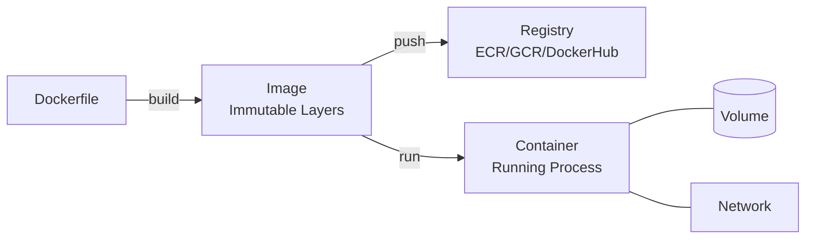

# Docker -- Cheatsheet

## Architecture (30-second mental model)

## When to use vs alternatives
| Need | Use | Not |
|------|-----|-----|
| Reproducible dev/CI environments | Docker | Virtualenv/nvm (no OS-level parity) |
| Run Linux workloads on any host | Docker | Vagrant/VMs (10x heavier) |
| Multi-service local stack | Docker Compose | Manually running processes |
| Production orchestration at scale | Kubernetes / ECS | Docker Compose (no HA, no auto-heal) |
| Hermetic builds without daemon | Podman / Buildah | Docker (requires root daemon) |

## 5 things you always forget
1. Layer cache invalidation is order-sensitive: `COPY requirements.txt` before `COPY . .` -- otherwise every code change re-runs `pip install`.
2. `apt-get update && apt-get install` must be in the SAME `RUN` instruction; splitting them lets a stale package index get cached forever.
3. The default user is root -- always add `USER nonroot` after setup steps; image scanners will flag this and many registries reject root images in prod.
4. `docker system prune -a` reclaims disk but also wipes ALL unused images and build cache -- add `--filter "until=24h"` to keep recent work.
5. Multi-stage builds can reference any earlier stage by name (`COPY --from=builder`), but the final image only contains the last stage -- intermediate stages are discarded, keeping the runtime image slim.

## Interview killer answer
> "We cut our CI build time from 12 minutes to 90 seconds by restructuring our Dockerfile layer order and leveraging BuildKit cache mounts for package managers. The real production lesson was secrets: we caught credentials baked into an intermediate layer during a Trivy scan -- even though they were deleted in a later RUN step, they were still extractable via `docker history`. We moved to multi-stage builds with a scratch-based final stage and injected secrets at runtime through mounted volumes from our vault, which eliminated that entire class of vulnerabilities."
