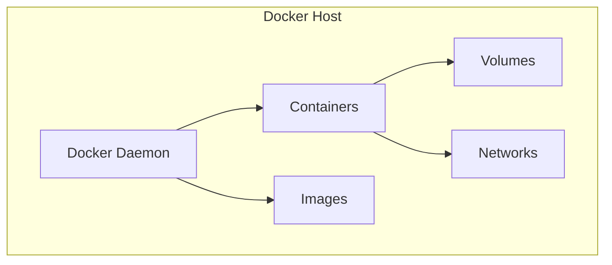

# Docker Guide – Basic → Architect

## Level 1 – Launch & Basics

### 1. **Quick Setup**
```bash
# Install Docker
# macOS: Download Docker Desktop
# Linux:
curl -fsSL https://get.docker.com -o get-docker.sh
sh get-docker.sh

# Verify
docker --version
docker run hello-world
```

### 2. **First Container**
```bash
# Run container
docker run -d -p 8080:80 --name nginx nginx:latest

# List containers
docker ps

# Stop container
docker stop nginx

# Remove container
docker rm nginx
```

### 3. **Dockerfile Basics**
```dockerfile
FROM python:3.9-slim

WORKDIR /app

COPY requirements.txt .
RUN pip install --no-cache-dir -r requirements.txt

COPY . .

CMD ["python", "app.py"]
```

```bash
# Build image
docker build -t my-app:latest .

# Run container
docker run -p 5000:5000 my-app:latest
```

## Level 2 – Production Patterns

### Multi-Stage Builds
```dockerfile
# Build stage
FROM node:16 AS builder
WORKDIR /app
COPY package*.json ./
RUN npm install
COPY . .
RUN npm run build

# Production stage
FROM nginx:alpine
COPY --from=builder /app/dist /usr/share/nginx/html
EXPOSE 80
CMD ["nginx", "-g", "daemon off;"]
```

### Docker Compose
```yaml
version: '3.8'
services:
  web:
    build: .
    ports:
      - "5000:5000"
    environment:
      - DATABASE_URL=postgresql://db:5432/mydb
    depends_on:
      - db
  
  db:
    image: postgres:13
    environment:
      POSTGRES_DB: mydb
      POSTGRES_USER: user
      POSTGRES_PASSWORD: password
    volumes:
      - postgres_data:/var/lib/postgresql/data

volumes:
  postgres_data:
```

```bash
# Start services
docker-compose up -d

# View logs
docker-compose logs -f

# Stop services
docker-compose down
```

### Volumes & Networking
```bash
# Named volume
docker volume create mydata
docker run -v mydata:/data my-app

# Bind mount
docker run -v /host/path:/container/path my-app

# Network
docker network create mynetwork
docker run --network mynetwork my-app
```

## Level 3 – Architect Playbook

### Health Checks
```dockerfile
FROM python:3.9
HEALTHCHECK --interval=30s --timeout=3s \
  CMD curl -f http://localhost:5000/health || exit 1
```

### Security Best Practices
```dockerfile
# Use non-root user
FROM python:3.9-slim
RUN useradd -m -u 1000 appuser
USER appuser
WORKDIR /home/appuser
```

### BuildKit Optimization
```bash
# Enable BuildKit
export DOCKER_BUILDKIT=1

# Build with cache
docker build --cache-from my-app:latest -t my-app:latest .
```

## Ops Cheat Sheet

| Task | Command | Notes |
| --- | --- | --- |
| Build image | `docker build -t name:tag .` | Build from Dockerfile |
| Run container | `docker run -d -p host:container image` | Run detached |
| List containers | `docker ps -a` | All containers |
| View logs | `docker logs <container>` | Container logs |
| Exec into container | `docker exec -it <container> /bin/bash` | Interactive shell |
| Remove image | `docker rmi <image>` | Delete image |
| Prune | `docker system prune -a` | Clean up unused |

## Architecture Patterns



## Checklist Before Production

- [ ] Use multi-stage builds for smaller images
- [ ] Implement health checks
- [ ] Use non-root users
- [ ] Scan images for vulnerabilities
- [ ] Optimize layer caching
- [ ] Use .dockerignore
- [ ] Set resource limits
- [ ] Use secrets management
- [ ] Implement proper logging
- [ ] Set up image registry
