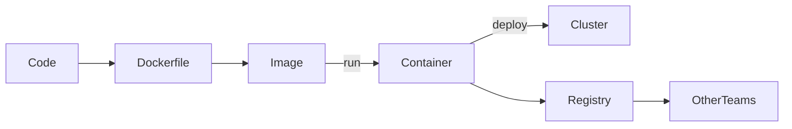

# Docker – Snapshot
> Package app + dependencies once; run it identically on laptops, CI, and prod clusters.

## TL;DR
- 🔁 Consistency: same image across environments
- 🧩 Isolation: each container has clean deps
- 🌍 Portability: any host with Docker Engine
- ⚡ Speed: lighter than full VMs
- 📦 Scale: compose multi-service stacks in minutes

## When to Reach for Docker
| Scenario | Why Docker | Alternative |
| --- | --- | --- |
| Ship ML API | Freeze Python libs, CUDA, model files | Conda env (less portable) |
| Reproduce prod bug | Snapshot prod image & run locally | Manual VM |
| CI smoke tests | Deterministic env per pipeline | Self-hosted runner |

## First 60 Seconds
```bash
docker build -t ml-api:1.0 .
docker compose up -d
docker logs -f ml-api
docker stop ml-api && docker rm ml-api
```

## Diagram


## Learning Path – Basic → Advanced

### Level 1 – Foundations
- Concepts: image, container, registry, Dockerfile
- Dockerfile starter:
```dockerfile
FROM python:3.11-slim
WORKDIR /app
COPY requirements.txt .
RUN pip install --no-cache-dir -r requirements.txt
COPY . .
EXPOSE 8000
CMD ["python", "app.py"]
```
- Inspect containers:
```bash
docker ps -a
docker exec -it ml-api bash
docker images
```

### Level 2 – Production Patterns
- **Multi-stage builds** to keep runtime slim.
```dockerfile
FROM node:18 AS build
WORKDIR /src
COPY package*.json ./
RUN npm ci
COPY . .
RUN npm run build

FROM nginx:1.25-alpine
COPY --from=build /src/dist /usr/share/nginx/html
```
- **Compose stack** for API + DB.
```yaml
services:
  api:
    build: .
    ports: ["8000:8000"]
    env_file: .env
    depends_on: [db]
  db:
    image: postgres:16
    volumes: [pg_data:/var/lib/postgresql/data]
volumes:
  pg_data:
```
- Parameterize with `docker compose --profile dev`.

### Level 3 – Architect Playbook
- Health & readiness:
```dockerfile
HEALTHCHECK --interval=30s --timeout=5s \
  CMD curl -f http://localhost:8000/health || exit 1
```
- Security:
```dockerfile
RUN useradd -m app && chown -R app /app
USER app
```
- Storage:
```bash
docker volume create feature-store
docker run -v feature-store:/data ml-api
```
- Promotion pipeline: build → scan → sign → push to registry → deploy (ECS/GKE/K8s).

## Interview Hooks
1. **Image vs Container** – immutable template vs running instance.
2. **Optimize Dockerfile** – use slim base, `.dockerignore`, multi-stage, combine RUN.
3. **Secrets Management** – inject via env/secret store, never bake into layers.
4. **Compose vs Kubernetes** – Compose for local dev, K8s for HA/auto-heal.
5. **Layer caching pitfalls** – change frequency order; COPY package files before source.

## POC Integration
- `01-ML-Fundamentals` – package Iris classifier for local demos.
- `04-End-to-End-ML-Pipeline` – build Cloud Run artifact from CI.
- `POC-05-LLM-Agent` – containerize FastAPI + LangChain agents for autoscaling.

## Best Practices Checklist
| Area | Checklist |
| --- | --- |
| Build | `.dockerignore`, pinned base, multi-stage, tag `app:env-sha` |
| Runtime | healthchecks, resource limits, env overrides, logging driver |
| Security | non-root user, image scanning, signed pushes, secrets from vault |
| Ops | prune unused images, backup named volumes, version registries |

## Next Steps
1. Review `Visual.md` for architect diagrams.  
2. Launch `interactive-docker.html` playground.  
3. Practice `Interview.md` Q&A.  
4. Deploy sample ML API to Cloud Run/ECS using this Dockerfile.  
5. Update guide once you adopt NVIDIA/containerd patterns.

