# FastAPI - Visual Learning Guide

## 🎨 Visual Learning: Request Flows, Architecture, and Patterns

---

## 📊 Request Flow Diagrams

### Basic Request Flow

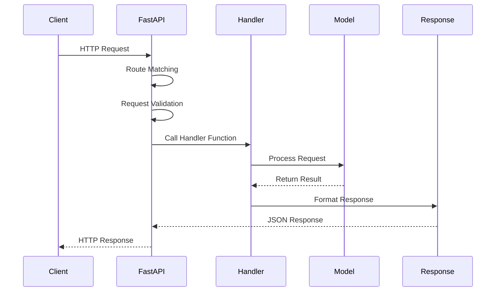

### Request with Validation

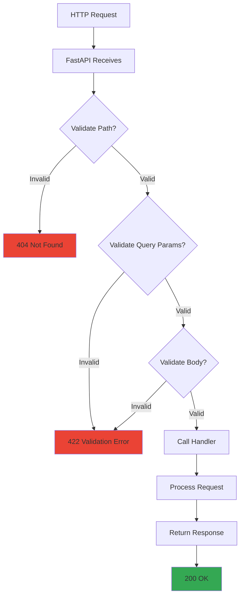

### Request with Dependencies

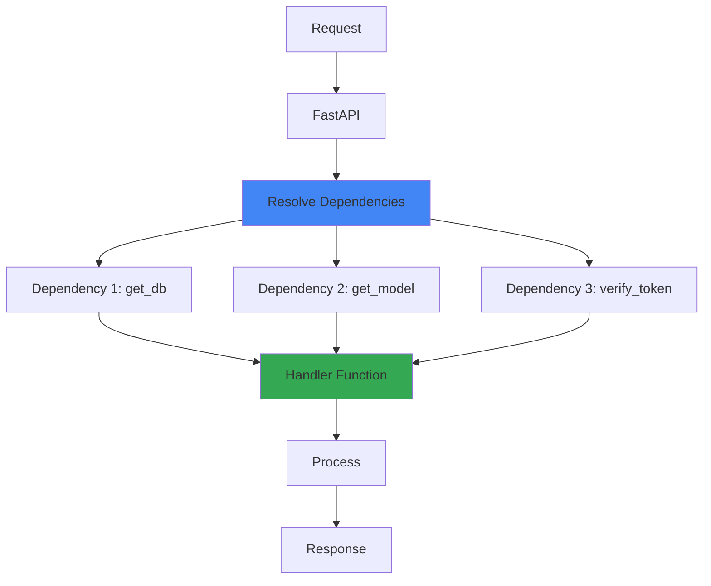

---

## 🏗️ Architecture Patterns

### Simple API Architecture

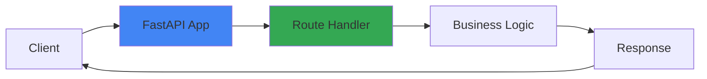

### API with Database

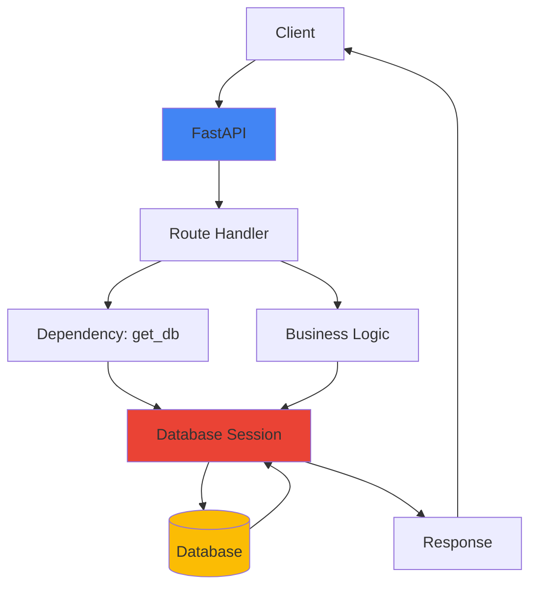

### API with Caching

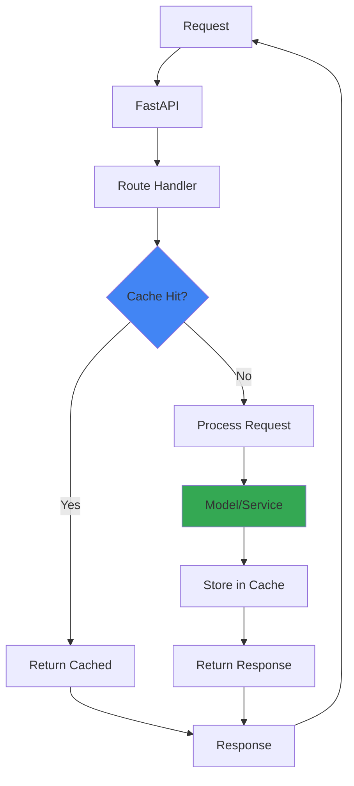

### Microservices Architecture
### Event-Driven Pipeline

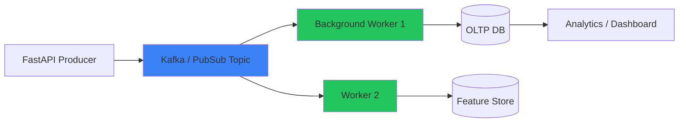

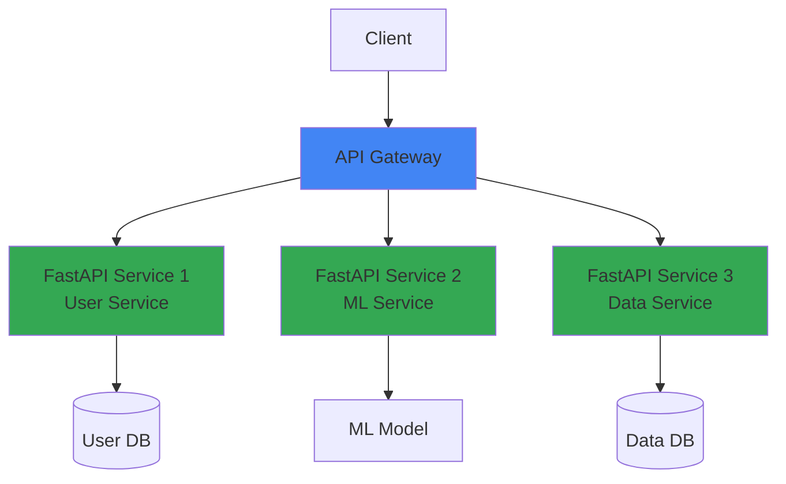

---

## 🔄 Async Request Flow

### Async vs Sync

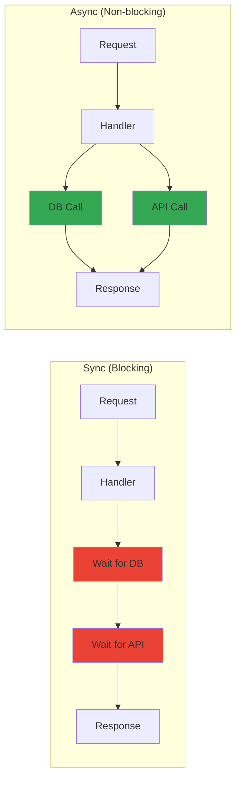

### Async Execution Flow

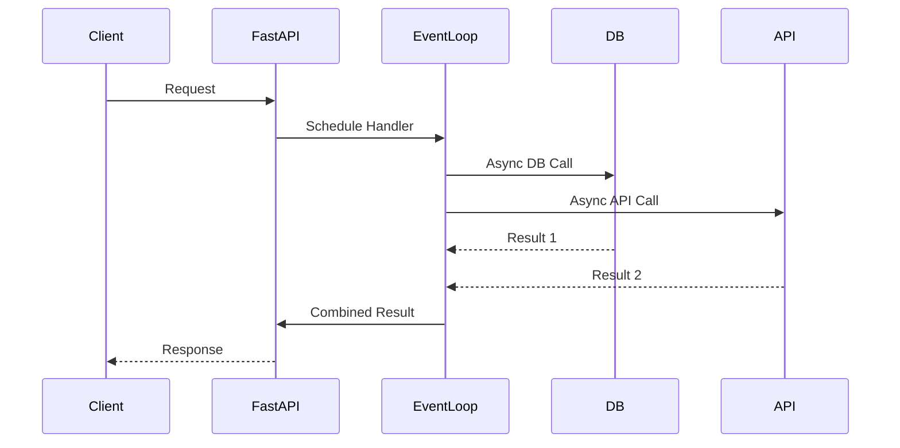

---

## 🎯 ML API Architecture (Your POCs)
### Event Streaming API (WebSocket)
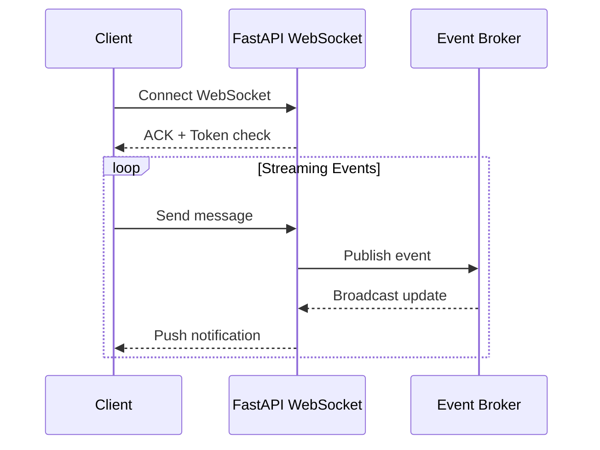

### Module 04: ML Pipeline API

```mermaid
graph TB
    A[Client] --> B[FastAPI App]
    B --> C[/predict endpoint]
    C --> D[Validate Request]
    D --> E[Load Model]
    E --> F[Preprocess Features]
    F --> G[Model Prediction]
    G --> H[Post-process]
    H --> I[Format Response]
    I --> J[Log Prediction]
    J --> K[Return JSON]
    K --> A
    
    style B fill:#4285f4
    style G fill:#34a853
    style J fill:#fbbc04
```

### Module 05: RAG API

```mermaid
graph TB
    A[Client] --> B[FastAPI App]
    B --> C[/query endpoint]
    C --> D[Validate Query]
    D --> E[Embed Query]
    E --> F[Vector Search]
    F --> G[Retrieve Context]
    G --> H[LLM Generation]
    H --> I[Format Response]
    I --> J[Return Answer]
    J --> A
    
    style B fill:#4285f4
    style F fill:#34a853
    style H fill:#ea4335
```

---

## 🔐 Security Flow
### Multi-Tenant Routing
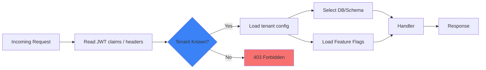

### Authentication Flow

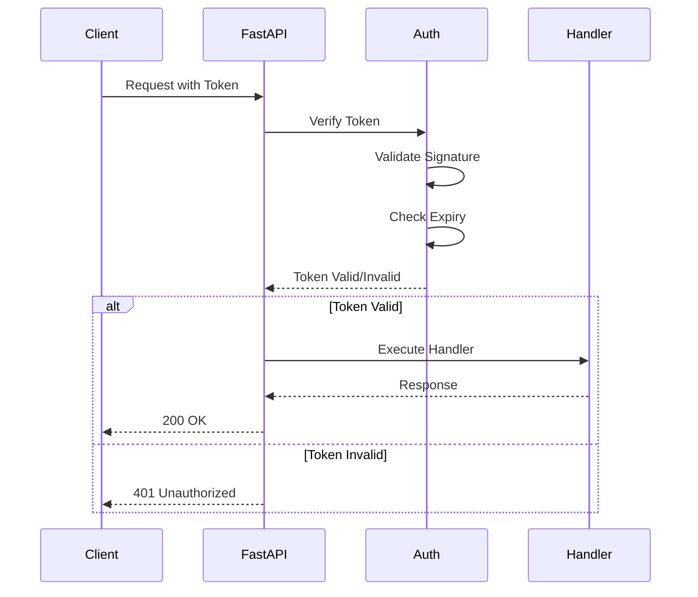

### CORS Flow

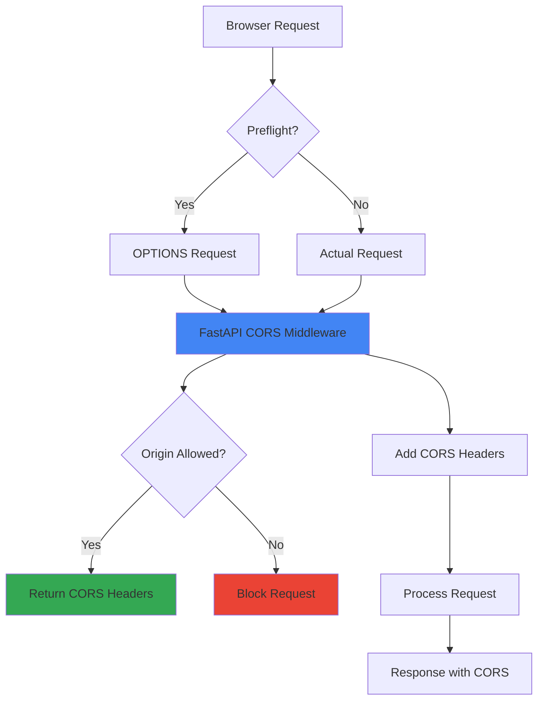

---

## 📊 Error Handling Flow

### Error Handling Architecture

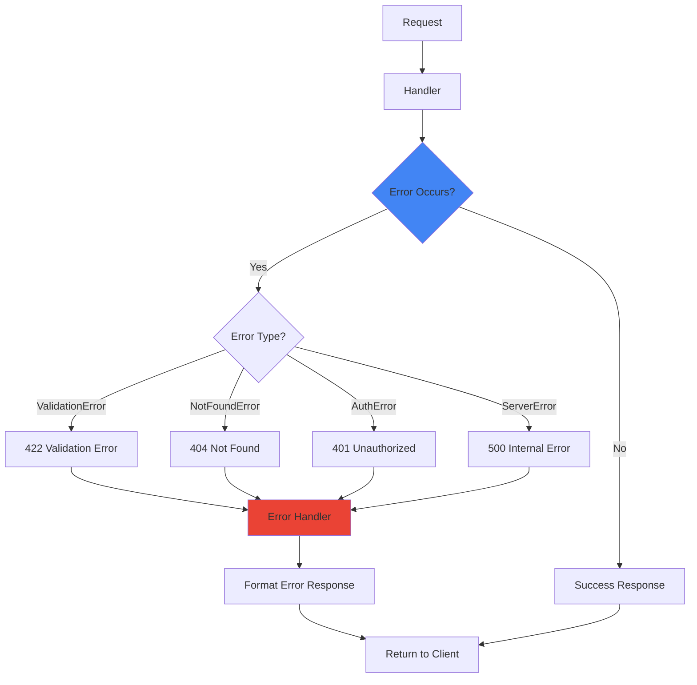

---

## 🚀 Deployment Architecture

### Docker Deployment

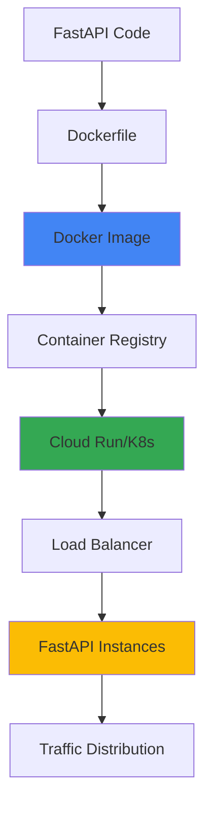

### Scaling Architecture
### Observability Stack
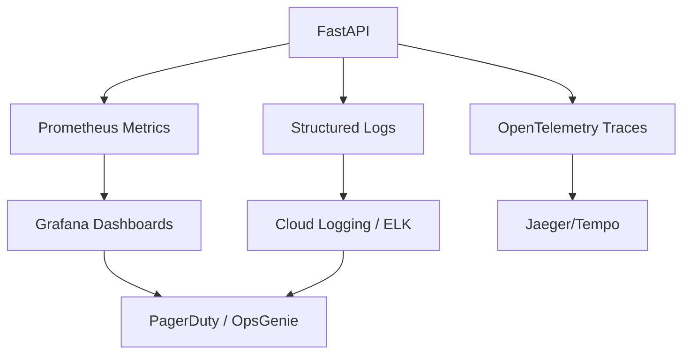

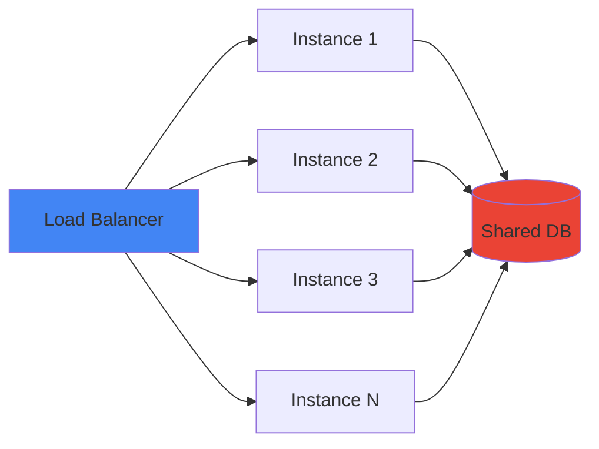

---

## 🔄 Background Tasks Flow

### Background Task Execution

```mermaid
sequenceDiagram
    participant Client
    participant FastAPI
    participant Handler
    participant Background
    participant Task
    
    Client->>FastAPI: Request
    FastAPI->>Handler: Process Request
    Handler->>Background: Add Task
    Handler-->>FastAPI: Immediate Response
    FastAPI-->>Client: 200 OK
    
    Background->>Task: Execute Task
    Task->>Task: Process (async)
    Task-->>Background: Complete
```

---

## 📈 Performance Optimization

### Caching Strategy

```mermaid
mindmap
  root((FastAPI Performance))
    Caching
      Response Cache
        Redis
        In-Memory
      Query Cache
        Database
        API Calls
    Async
      Non-blocking
      Concurrent
    Database
      Connection Pooling
      Query Optimization
    Load Balancing
      Multiple Instances
      Health Checks
```

---

## 🎯 Key Visual Takeaways

1. **Request Flow**: Client → FastAPI → Handler → Response
2. **Validation**: Automatic with Pydantic
3. **Dependencies**: Reusable, injectable logic
4. **Async**: Non-blocking, concurrent execution
5. **Security**: Authentication, CORS, validation
6. **Deployment**: Docker → Cloud → Scaling

---

## 📚 Next Steps

1. ✅ Review these diagrams
2. 🏗️ Draw them yourself
3. 💬 Use in interviews
4. 🔗 Connect to your POCs

---

**Visual learning helps!** Use these diagrams to explain FastAPI architecture in interviews.

