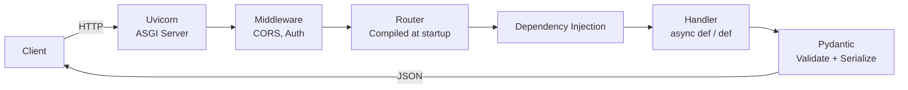

# FastAPI — Cheatsheet

## Architecture (30-second mental model)

## When to use vs alternatives
| Need | Use | Not |
|------|-----|-----|
| Async Python API with auto-docs | FastAPI | Flask (no native async, manual docs) |
| Type-safe request validation baked in | FastAPI + Pydantic | Django REST (serializers are verbose) |
| Microservice with <5ms framework overhead | FastAPI on Uvicorn | Flask/Gunicorn (higher per-request cost) |
| Full-stack app with ORM, admin, auth out of box | Django | FastAPI (you assemble everything yourself) |
| Quick prototype, minimal dependencies | Flask | FastAPI (heavier install, overkill for 2 routes) |

## 5 things you always forget
1. `def` endpoints run in a threadpool; `async def` endpoints block the event loop if you call sync I/O inside them -- use `def` for sync DB drivers, `async def` only when you `await` everything.
2. Dependency `yield` functions run teardown **after** the response is sent, but BackgroundTasks run even later -- order matters for DB session cleanup.
3. `response_model` strips fields not in the schema, so it silently hides data leaks -- always set it on endpoints that touch user data.
4. CORS `allow_origins` requires exact origins with scheme and port (e.g., `http://localhost:3000`); a bare domain like `example.com` silently fails -- use `["*"]` only for dev.
5. `TestClient` is synchronous (uses `requests`); for testing WebSocket or async deps use `httpx.AsyncClient` with `ASGITransport`.

## Interview killer answer
> "We learned the hard way that `async def` endpoints are single-threaded on the event loop -- our ML inference endpoint was CPU-bound and blocked every other request. The fix was switching to a plain `def` handler so Uvicorn offloads it to the threadpool automatically. We also leaned on dependency injection to compose auth, DB sessions, and feature-flag checks as a chain, which made swapping in test mocks trivial without touching handler code."
