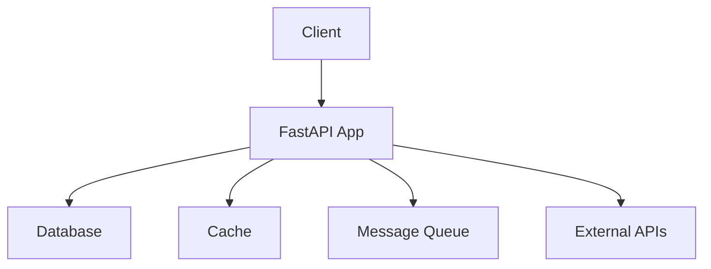

# FastAPI Guide – Basic → Architect

## Level 1 – Launch & Basics

### 1. **Quick Setup**
```bash
# Install FastAPI
pip install fastapi uvicorn

# Create app
# main.py
from fastapi import FastAPI

app = FastAPI()

@app.get("/")
def read_root():
    return {"Hello": "World"}

@app.get("/items/{item_id}")
def read_item(item_id: int, q: str = None):
    return {"item_id": item_id, "q": q}
```

```bash
# Run server
uvicorn main:app --reload
```

### 2. **Request/Response Models**
```python
from pydantic import BaseModel
from typing import Optional

class Item(BaseModel):
    name: str
    price: float
    description: Optional[str] = None

@app.post("/items/")
def create_item(item: Item):
    return item
```

### 3. **Dependency Injection**
```python
from fastapi import Depends

def get_db():
    db = SessionLocal()
    try:
        yield db
    finally:
        db.close()

@app.get("/users/")
def get_users(db: Session = Depends(get_db)):
    return db.query(User).all()
```

## Level 2 – Production Patterns

### Database Integration
```python
from sqlalchemy import create_engine, Column, Integer, String
from sqlalchemy.ext.declarative import declarative_base
from sqlalchemy.orm import sessionmaker

engine = create_engine("sqlite:///./test.db")
SessionLocal = sessionmaker(autocommit=False, autoflush=False, bind=engine)
Base = declarative_base()

class User(Base):
    __tablename__ = "users"
    id = Column(Integer, primary_key=True)
    name = Column(String)

@app.post("/users/")
def create_user(user: UserCreate, db: Session = Depends(get_db)):
    db_user = User(name=user.name)
    db.add(db_user)
    db.commit()
    db.refresh(db_user)
    return db_user
```

### Authentication
```python
from fastapi.security import OAuth2PasswordBearer
from jose import JWTError, jwt

oauth2_scheme = OAuth2PasswordBearer(tokenUrl="token")

def get_current_user(token: str = Depends(oauth2_scheme)):
    credentials_exception = HTTPException(
        status_code=401,
        detail="Could not validate credentials"
    )
    try:
        payload = jwt.decode(token, SECRET_KEY, algorithms=[ALGORITHM])
        username: str = payload.get("sub")
        if username is None:
            raise credentials_exception
    except JWTError:
        raise credentials_exception
    return username

@app.get("/users/me")
def read_users_me(current_user: str = Depends(get_current_user)):
    return {"username": current_user}
```

### Background Tasks
```python
from fastapi import BackgroundTasks

def send_email(email: str):
    # Send email logic
    pass

@app.post("/send-email/")
def send_email_endpoint(
    email: str,
    background_tasks: BackgroundTasks
):
    background_tasks.add_task(send_email, email)
    return {"message": "Email sent"}
```

## Level 3 – Architect Playbook

### WebSockets
```python
from fastapi import WebSocket

@app.websocket("/ws")
async def websocket_endpoint(websocket: WebSocket):
    await websocket.accept()
    while True:
        data = await websocket.receive_text()
        await websocket.send_text(f"Message: {data}")
```

### Advanced Routing
```python
from fastapi import APIRouter

router = APIRouter(prefix="/api/v1", tags=["items"])

@router.get("/items/")
def get_items():
    return {"items": []}

app.include_router(router)
```

### Deployment
```python
# Dockerfile
FROM python:3.9
WORKDIR /app
COPY requirements.txt .
RUN pip install -r requirements.txt
COPY . .
CMD ["uvicorn", "main:app", "--host", "0.0.0.0", "--port", "8000"]
```

## Ops Cheat Sheet

| Task | Command | Notes |
| --- | --- | --- |
| Run dev | `uvicorn main:app --reload` | Development server |
| Run prod | `uvicorn main:app --host 0.0.0.0 --port 8000` | Production server |
| Generate docs | Auto at `/docs` | Swagger UI |
| Test | `pytest` | Run tests |
| Check | `mypy main.py` | Type checking |

## Architecture Patterns



## Checklist Before Production

- [ ] Implement proper authentication/authorization
- [ ] Set up database connection pooling
- [ ] Configure CORS properly
- [ ] Implement rate limiting
- [ ] Set up logging and monitoring
- [ ] Use environment variables for config
- [ ] Implement proper error handling
- [ ] Set up health check endpoints
- [ ] Configure HTTPS/TLS
- [ ] Set up CI/CD pipeline
