# Kafka - Visual Learning Guide

## 🎨 Visual Learning: Architecture, Data Flow, Streaming Patterns, Operations

---

## 📊 Kafka Architecture

### High-Level Architecture

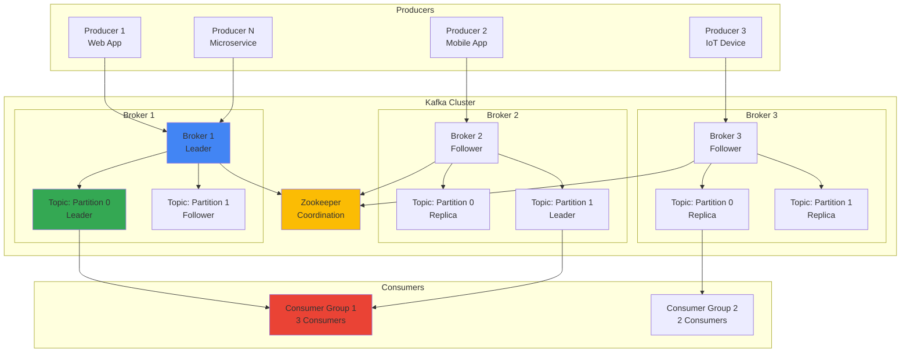
```mermaid
graph TB
    subgraph "Producers"
        P1[Producer 1<br/>Web App]
        P2[Producer 2<br/>Mobile App]
        P3[Producer 3<br/>IoT Device]
        P4[Producer N<br/>Microservice]
    end
    
    subgraph "Kafka Cluster"
        subgraph "Broker 1"
            B1[Broker 1<br/>Leader]
            T1_P0[Topic: Partition 0<br/>Leader]
            T1_P1[Topic: Partition 1<br/>Follower]
        end
        
        subgraph "Broker 2"
            B2[Broker 2<br/>Follower]
            T2_P0[Topic: Partition 0<br/>Replica]
            T2_P1[Topic: Partition 1<br/>Leader]
        end
        
        subgraph "Broker 3"
            B3[Broker 3<br/>Follower]
            T3_P0[Topic: Partition 0<br/>Replica]
            T3_P1[Topic: Partition 1<br/>Replica]
        end
        
        ZK[Zookeeper<br/>Coordination]
    end
    
    subgraph "Consumers"
        CG1[Consumer Group 1<br/>3 Consumers]
        CG2[Consumer Group 2<br/>2 Consumers]
    end
    
    P1 --> B1
    P2 --> B2
    P3 --> B3
    P4 --> B1
    
    B1 --> T1_P0
    B1 --> T1_P1
    B2 --> T2_P0
    B2 --> T2_P1
    B3 --> T3_P0
    B3 --> T3_P1
    
    T1_P0 --> CG1
    T2_P1 --> CG1
    T3_P0 --> CG2
    
    B1 --> ZK
    B2 --> ZK
    B3 --> ZK
    
    style B1 fill:#4285f4
    style T1_P0 fill:#34a853
    style CG1 fill:#ea4335
    style ZK fill:#fbbc04
```

### Kafka Cluster Architecture

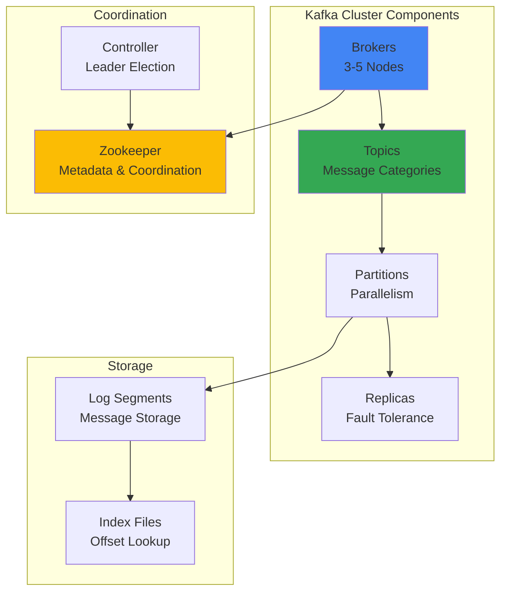
```mermaid
graph TB
    subgraph "Kafka Cluster Components"
        BROKERS[Brokers<br/>3-5 Nodes]
        TOPICS[Topics<br/>Message Categories]
        PARTITIONS[Partitions<br/>Parallelism]
        REPLICAS[Replicas<br/>Fault Tolerance]
    end
    
    subgraph "Coordination"
        ZOOKEEPER[Zookeeper<br/>Metadata & Coordination]
        CONTROLLER[Controller<br/>Leader Election]
    end
    
    subgraph "Storage"
        LOG_SEGMENTS[Log Segments<br/>Message Storage]
        INDEX[Index Files<br/>Offset Lookup]
    end
    
    BROKERS --> TOPICS
    TOPICS --> PARTITIONS
    PARTITIONS --> REPLICAS
    
    BROKERS --> ZOOKEEPER
    CONTROLLER --> ZOOKEEPER
    
    PARTITIONS --> LOG_SEGMENTS
    LOG_SEGMENTS --> INDEX
    
    style BROKERS fill:#4285f4
    style TOPICS fill:#34a853
    style ZOOKEEPER fill:#fbbc04
```

---

## 📦 Topic & Partition Architecture

### Topic Partitioning Strategy

```mermaid
graph TB
    subgraph "Topic: user-events"
        P0[Partition 0<br/>Messages: 0-999]
        P1[Partition 1<br/>Messages: 1000-1999]
        P2[Partition 2<br/>Messages: 2000-2999]
        P3[Partition 3<br/>Messages: 3000-3999]
    end
    
    subgraph "Partitioning Logic"
        KEY[Partition Key<br/>user_id]
        HASH[Hash Function<br/>hash(key) % 4]
    end
    
    subgraph "Distribution"
        USER1[user_id: 123<br/>→ Partition 3]
        USER2[user_id: 456<br/>→ Partition 0]
        USER3[user_id: 789<br/>→ Partition 1]
    end
    
    KEY --> HASH
    HASH --> P0
    HASH --> P1
    HASH --> P2
    HASH --> P3
    
    USER1 --> P3
    USER2 --> P0
    USER3 --> P1
    
    style P0 fill:#4285f4
    style P1 fill:#34a853
    style P2 fill:#ea4335
    style P3 fill:#fbbc04
```

### Partition Replication

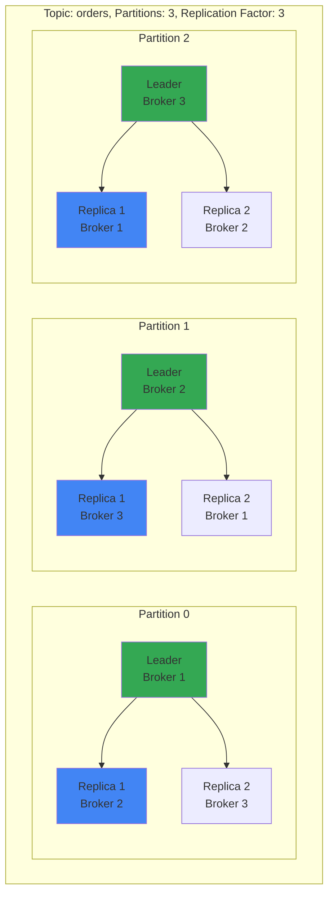
```mermaid
graph TB
    subgraph "Topic: orders, Partitions: 3, Replication Factor: 3"
        subgraph "Partition 0"
            P0_L[Leader<br/>Broker 1]
            P0_R1[Replica 1<br/>Broker 2]
            P0_R2[Replica 2<br/>Broker 3]
        end
        
        subgraph "Partition 1"
            P1_L[Leader<br/>Broker 2]
            P1_R1[Replica 1<br/>Broker 3]
            P1_R2[Replica 2<br/>Broker 1]
        end
        
        subgraph "Partition 2"
            P2_L[Leader<br/>Broker 3]
            P2_R1[Replica 1<br/>Broker 1]
            P2_R2[Replica 2<br/>Broker 2]
        end
    end
    
    P0_L --> P0_R1
    P0_L --> P0_R2
    P1_L --> P1_R1
    P1_L --> P1_R2
    P2_L --> P2_R1
    P2_L --> P2_R2
    
    style P0_L fill:#34a853
    style P1_L fill:#34a853
    style P2_L fill:#34a853
    style P0_R1 fill:#4285f4
    style P1_R1 fill:#4285f4
    style P2_R1 fill:#4285f4
```

### Log Segment Structure

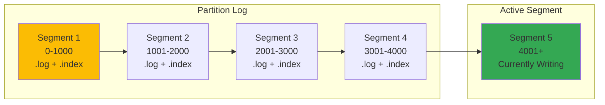
```mermaid
graph LR
    subgraph "Partition Log"
        SEG1[Segment 1<br/>0-1000<br/>.log + .index]
        SEG2[Segment 2<br/>1001-2000<br/>.log + .index]
        SEG3[Segment 3<br/>2001-3000<br/>.log + .index]
        SEG4[Segment 4<br/>3001-4000<br/>.log + .index]
    end
    
    subgraph "Active Segment"
        ACTIVE[Segment 5<br/>4001+<br/>Currently Writing]
    end
    
    SEG1 --> SEG2
    SEG2 --> SEG3
    SEG3 --> SEG4
    SEG4 --> ACTIVE
    
    style ACTIVE fill:#34a853
    style SEG1 fill:#fbbc04
```

---

## 🔄 Producer Architecture

### Producer Flow

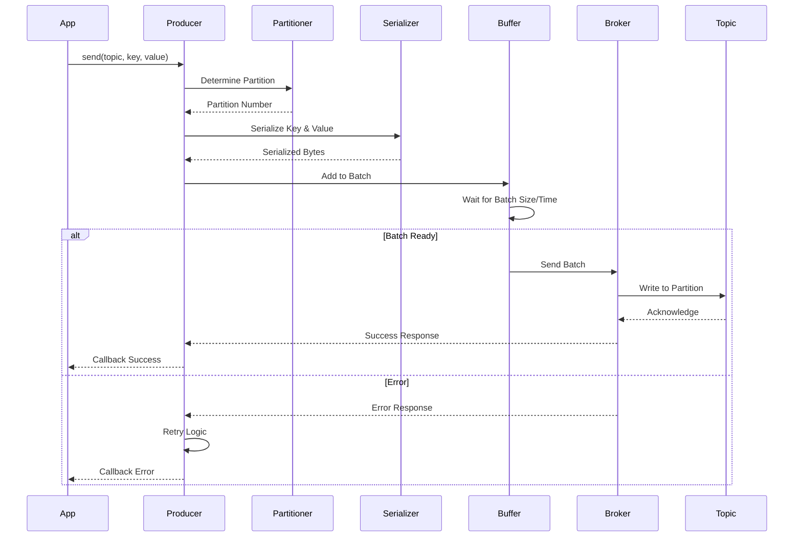
```mermaid
sequenceDiagram
    participant App
    participant Producer
    participant Partitioner
    participant Serializer
    participant Buffer
    participant Broker
    participant Topic
    
    App->>Producer: send(topic, key, value)
    Producer->>Partitioner: Determine Partition
    Partitioner-->>Producer: Partition Number
    Producer->>Serializer: Serialize Key & Value
    Serializer-->>Producer: Serialized Bytes
    Producer->>Buffer: Add to Batch
    Buffer->>Buffer: Wait for Batch Size/Time
    
    alt Batch Ready
        Buffer->>Broker: Send Batch
        Broker->>Topic: Write to Partition
        Topic-->>Broker: Acknowledge
        Broker-->>Producer: Success Response
        Producer-->>App: Callback Success
    else Error
        Broker-->>Producer: Error Response
        Producer->>Producer: Retry Logic
        Producer-->>App: Callback Error
    end
```

### Producer Batching & Compression

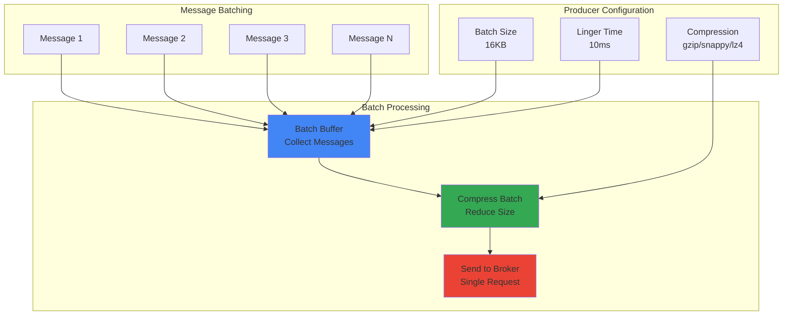
```mermaid
graph TB
    subgraph "Producer Configuration"
        BATCH_SIZE[Batch Size<br/>16KB]
        LINGER_MS[Linger Time<br/>10ms]
        COMPRESSION[Compression<br/>gzip/snappy/lz4]
    end
    
    subgraph "Message Batching"
        MSG1[Message 1]
        MSG2[Message 2]
        MSG3[Message 3]
        MSG4[Message N]
    end
    
    subgraph "Batch Processing"
        BATCH[Batch Buffer<br/>Collect Messages]
        COMPRESS[Compress Batch<br/>Reduce Size]
        SEND[Send to Broker<br/>Single Request]
    end
    
    MSG1 --> BATCH
    MSG2 --> BATCH
    MSG3 --> BATCH
    MSG4 --> BATCH
    
    BATCH_SIZE --> BATCH
    LINGER_MS --> BATCH
    
    BATCH --> COMPRESS
    COMPRESSION --> COMPRESS
    COMPRESS --> SEND
    
    style BATCH fill:#4285f4
    style COMPRESS fill:#34a853
    style SEND fill:#ea4335
```

### Producer Acknowledgment Modes

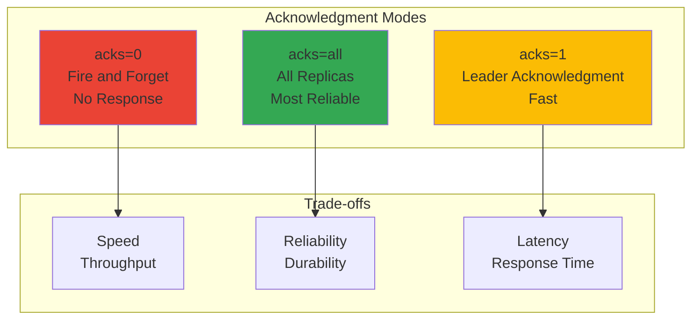
```mermaid
graph TB
    subgraph "Acknowledgment Modes"
        ACKS_0[acks=0<br/>Fire and Forget<br/>No Response]
        ACKS_1[acks=1<br/>Leader Acknowledgment<br/>Fast]
        ACKS_ALL[acks=all<br/>All Replicas<br/>Most Reliable]
    end
    
    subgraph "Trade-offs"
        SPEED[Speed<br/>Throughput]
        RELIABILITY[Reliability<br/>Durability]
        LATENCY[Latency<br/>Response Time]
    end
    
    ACKS_0 --> SPEED
    ACKS_1 --> LATENCY
    ACKS_ALL --> RELIABILITY
    
    style ACKS_0 fill:#ea4335
    style ACKS_1 fill:#fbbc04
    style ACKS_ALL fill:#34a853
```

---

## 👥 Consumer Architecture

### Consumer Group Architecture

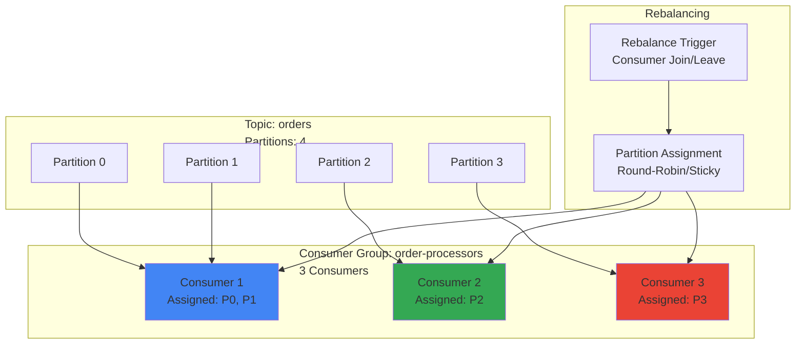
```mermaid
graph TB
    subgraph "Topic: orders<br/>Partitions: 4"
        TP0[Partition 0]
        TP1[Partition 1]
        TP2[Partition 2]
        TP3[Partition 3]
    end
    
    subgraph "Consumer Group: order-processors<br/>3 Consumers"
        C1[Consumer 1<br/>Assigned: P0, P1]
        C2[Consumer 2<br/>Assigned: P2]
        C3[Consumer 3<br/>Assigned: P3]
    end
    
    subgraph "Rebalancing"
        REBALANCE[Rebalance Trigger<br/>Consumer Join/Leave]
        ASSIGN[Partition Assignment<br/>Round-Robin/Sticky]
    end
    
    TP0 --> C1
    TP1 --> C1
    TP2 --> C2
    TP3 --> C3
    
    REBALANCE --> ASSIGN
    ASSIGN --> C1
    ASSIGN --> C2
    ASSIGN --> C3
    
    style C1 fill:#4285f4
    style C2 fill:#34a853
    style C3 fill:#ea4335
```

### Consumer Offset Management

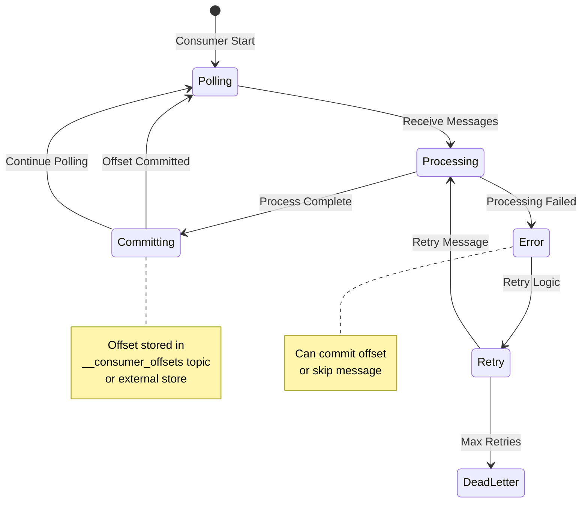
```mermaid
stateDiagram-v2
    [*] --> Polling: Consumer Start
    Polling --> Processing: Receive Messages
    Processing --> Committing: Process Complete
    Committing --> Polling: Offset Committed
    
    Processing --> Error: Processing Failed
    Error --> Retry: Retry Logic
    Retry --> Processing: Retry Message
    Retry --> DeadLetter: Max Retries
    
    Committing --> Polling: Continue Polling
    
    note right of Committing
        Offset stored in
        __consumer_offsets topic
        or external store
    end note
    
    note right of Error
        Can commit offset
        or skip message
    end note
```

### Consumer Polling Pattern

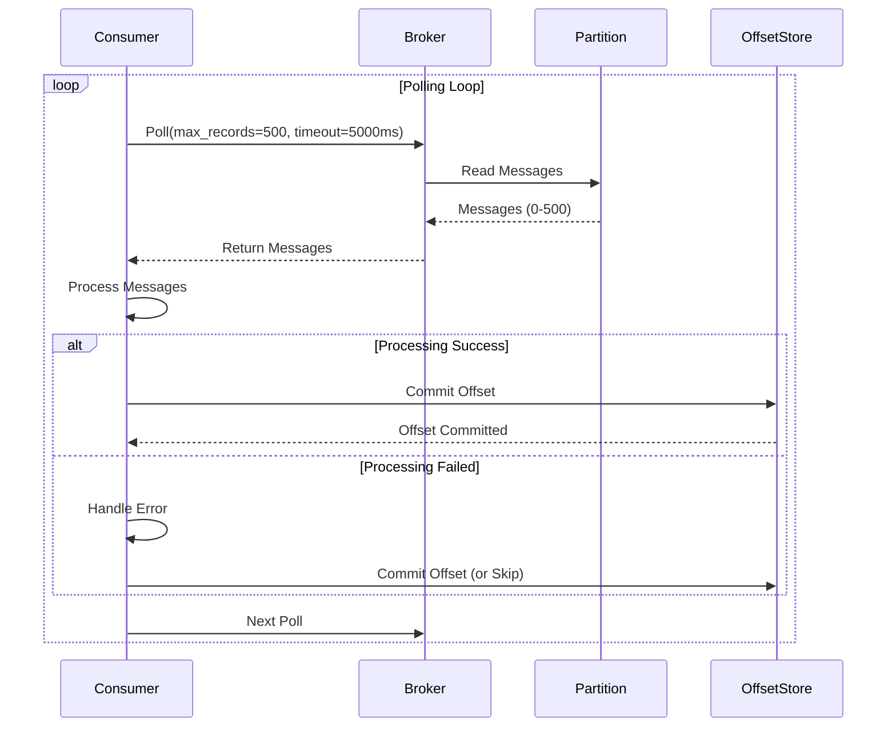
```mermaid
sequenceDiagram
    participant Consumer
    participant Broker
    participant Partition
    participant OffsetStore
    
    loop Polling Loop
        Consumer->>Broker: Poll(max_records=500, timeout=5000ms)
        Broker->>Partition: Read Messages
        Partition-->>Broker: Messages (0-500)
        Broker-->>Consumer: Return Messages
        
        Consumer->>Consumer: Process Messages
        
        alt Processing Success
            Consumer->>OffsetStore: Commit Offset
            OffsetStore-->>Consumer: Offset Committed
        else Processing Failed
            Consumer->>Consumer: Handle Error
            Consumer->>OffsetStore: Commit Offset (or Skip)
        end
        
        Consumer->>Broker: Next Poll
    end
```

### Consumer Rebalancing Flow

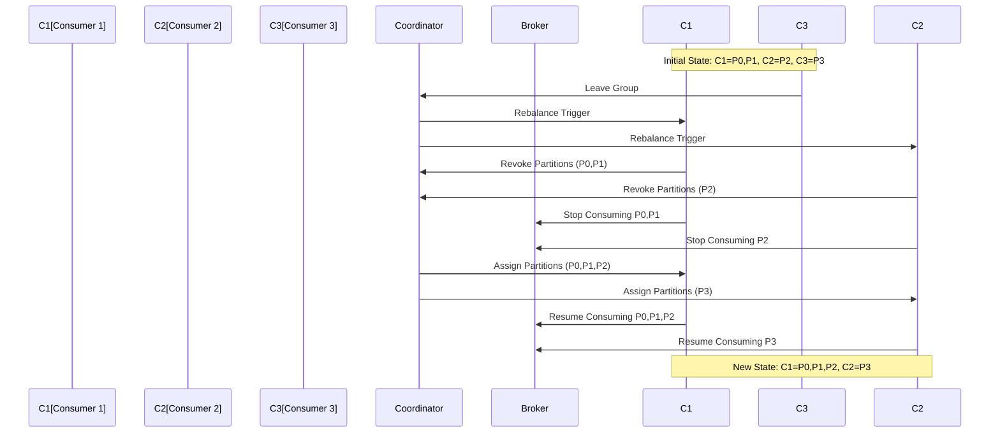
```mermaid
sequenceDiagram
    participant C1[Consumer 1]
    participant C2[Consumer 2]
    participant C3[Consumer 3]
    participant Coordinator
    participant Broker
    
    Note over C1,C3: Initial State: C1=P0,P1, C2=P2, C3=P3
    
    C3->>Coordinator: Leave Group
    Coordinator->>C1: Rebalance Trigger
    Coordinator->>C2: Rebalance Trigger
    
    C1->>Coordinator: Revoke Partitions (P0,P1)
    C2->>Coordinator: Revoke Partitions (P2)
    
    C1->>Broker: Stop Consuming P0,P1
    C2->>Broker: Stop Consuming P2
    
    Coordinator->>C1: Assign Partitions (P0,P1,P2)
    Coordinator->>C2: Assign Partitions (P3)
    
    C1->>Broker: Resume Consuming P0,P1,P2
    C2->>Broker: Resume Consuming P3
    
    Note over C1,C2: New State: C1=P0,P1,P2, C2=P3
```

---

## 🔄 Message Flow Patterns

### At-Least-Once Delivery

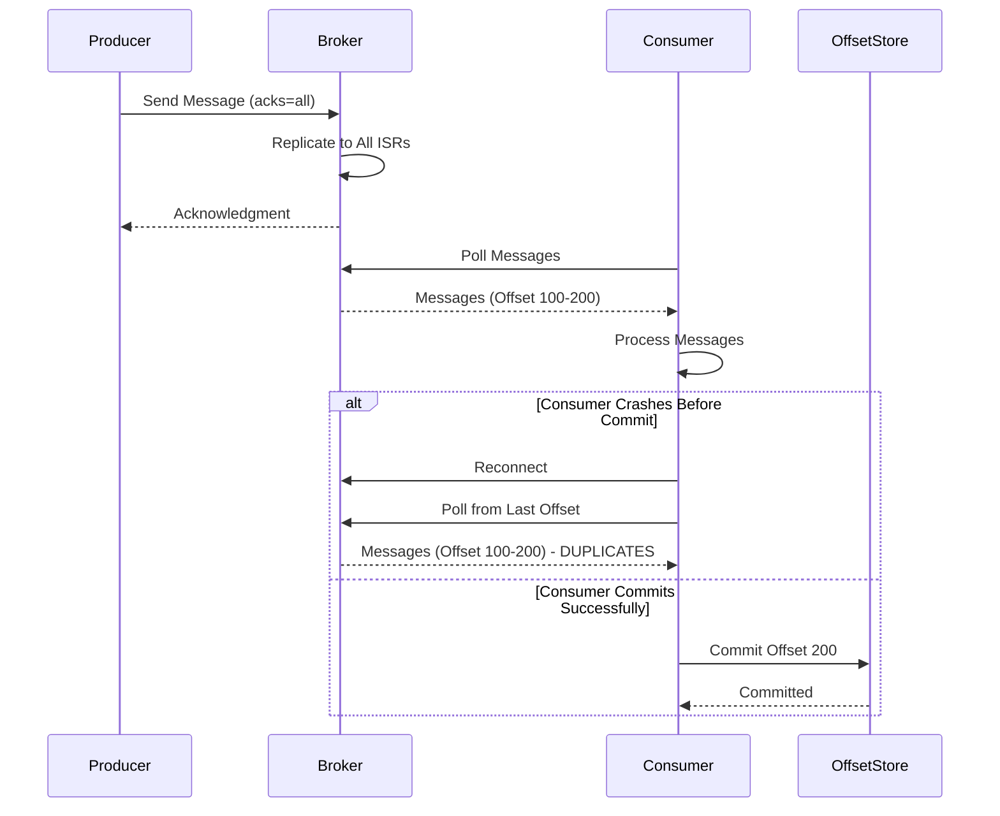
```mermaid
sequenceDiagram
    participant Producer
    participant Broker
    participant Consumer
    participant OffsetStore
    
    Producer->>Broker: Send Message (acks=all)
    Broker->>Broker: Replicate to All ISRs
    Broker-->>Producer: Acknowledgment
    
    Consumer->>Broker: Poll Messages
    Broker-->>Consumer: Messages (Offset 100-200)
    
    Consumer->>Consumer: Process Messages
    
    alt Consumer Crashes Before Commit
        Consumer->>Broker: Reconnect
        Consumer->>Broker: Poll from Last Offset
        Broker-->>Consumer: Messages (Offset 100-200) - DUPLICATES
    else Consumer Commits Successfully
        Consumer->>OffsetStore: Commit Offset 200
        OffsetStore-->>Consumer: Committed
    end
```

### Exactly-Once Semantics

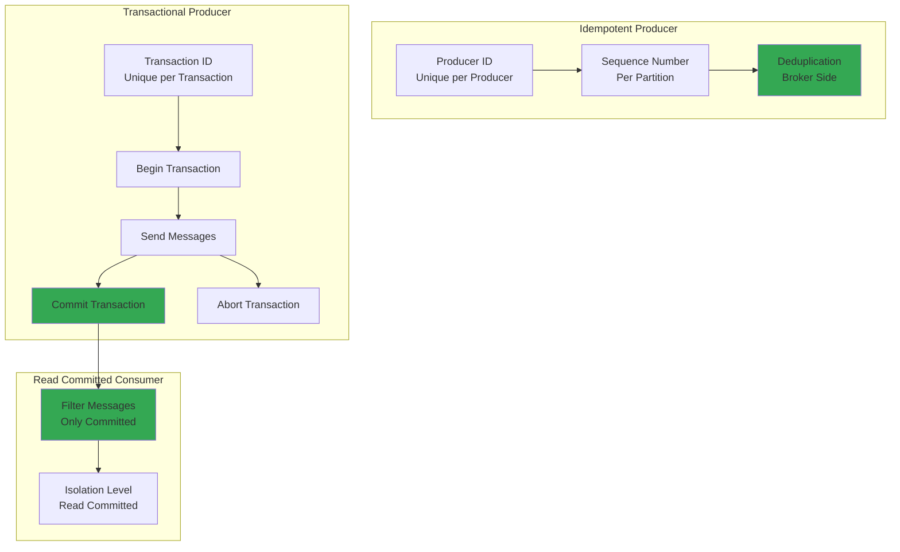
```mermaid
graph TB
    subgraph "Idempotent Producer"
        PROD_ID[Producer ID<br/>Unique per Producer]
        SEQ_NUM[Sequence Number<br/>Per Partition]
        DEDUP[Deduplication<br/>Broker Side]
    end
    
    subgraph "Transactional Producer"
        TXN_ID[Transaction ID<br/>Unique per Transaction]
        BEGIN[Begin Transaction]
        SEND[Send Messages]
        COMMIT[Commit Transaction]
        ABORT[Abort Transaction]
    end
    
    subgraph "Read Committed Consumer"
        FILTER[Filter Messages<br/>Only Committed]
        ISOLATION[Isolation Level<br/>Read Committed]
    end
    
    PROD_ID --> SEQ_NUM
    SEQ_NUM --> DEDUP
    
    TXN_ID --> BEGIN
    BEGIN --> SEND
    SEND --> COMMIT
    SEND --> ABORT
    
    COMMIT --> FILTER
    FILTER --> ISOLATION
    
    style DEDUP fill:#34a853
    style COMMIT fill:#34a853
    style FILTER fill:#34a853
```

---

## 🏗️ Stream Processing Patterns

### Kafka Streams Architecture

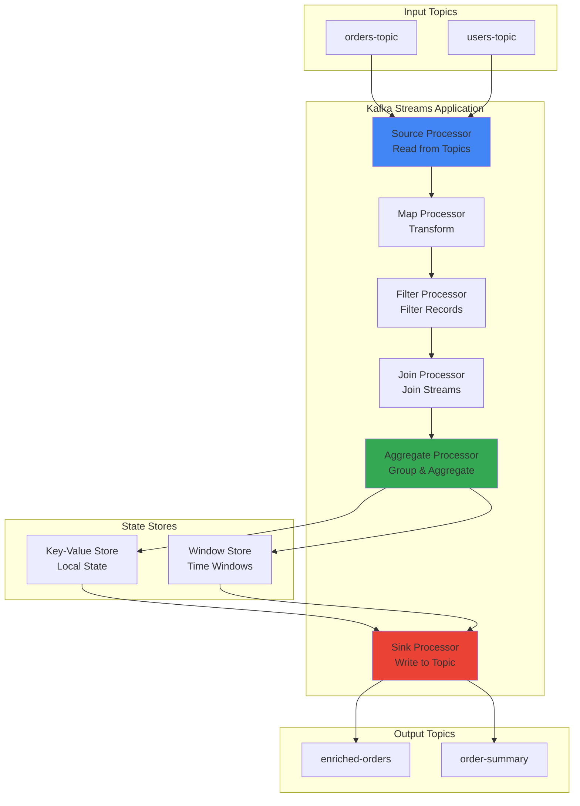
```mermaid
graph TB
    subgraph "Input Topics"
        IT1[orders-topic]
        IT2[users-topic]
    end
    
    subgraph "Kafka Streams Application"
        SOURCE[Source Processor<br/>Read from Topics]
        MAP[Map Processor<br/>Transform]
        FILTER[Filter Processor<br/>Filter Records]
        JOIN[Join Processor<br/>Join Streams]
        AGGREGATE[Aggregate Processor<br/>Group & Aggregate]
        SINK[Sink Processor<br/>Write to Topic]
    end
    
    subgraph "State Stores"
        KEY_VALUE[Key-Value Store<br/>Local State]
        WINDOW[Window Store<br/>Time Windows]
    end
    
    subgraph "Output Topics"
        OT1[enriched-orders]
        OT2[order-summary]
    end
    
    IT1 --> SOURCE
    IT2 --> SOURCE
    
    SOURCE --> MAP
    MAP --> FILTER
    FILTER --> JOIN
    JOIN --> AGGREGATE
    AGGREGATE --> KEY_VALUE
    AGGREGATE --> WINDOW
    KEY_VALUE --> SINK
    WINDOW --> SINK
    
    SINK --> OT1
    SINK --> OT2
    
    style SOURCE fill:#4285f4
    style AGGREGATE fill:#34a853
    style SINK fill:#ea4335
```

### Stream Processing Topology

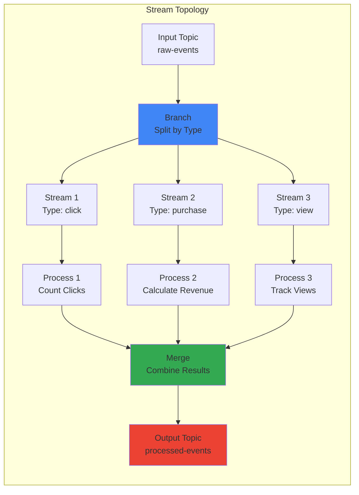
```mermaid
graph LR
    subgraph "Stream Topology"
        INPUT[Input Topic<br/>raw-events]
        
        BRANCH[Branch<br/>Split by Type]
        
        STREAM1[Stream 1<br/>Type: click]
        STREAM2[Stream 2<br/>Type: purchase]
        STREAM3[Stream 3<br/>Type: view]
        
        PROCESS1[Process 1<br/>Count Clicks]
        PROCESS2[Process 2<br/>Calculate Revenue]
        PROCESS3[Process 3<br/>Track Views]
        
        MERGE[Merge<br/>Combine Results]
        
        OUTPUT[Output Topic<br/>processed-events]
    end
    
    INPUT --> BRANCH
    BRANCH --> STREAM1
    BRANCH --> STREAM2
    BRANCH --> STREAM3
    
    STREAM1 --> PROCESS1
    STREAM2 --> PROCESS2
    STREAM3 --> PROCESS3
    
    PROCESS1 --> MERGE
    PROCESS2 --> MERGE
    PROCESS3 --> MERGE
    
    MERGE --> OUTPUT
    
    style BRANCH fill:#4285f4
    style MERGE fill:#34a853
    style OUTPUT fill:#ea4335
```

### Windowing & Aggregation

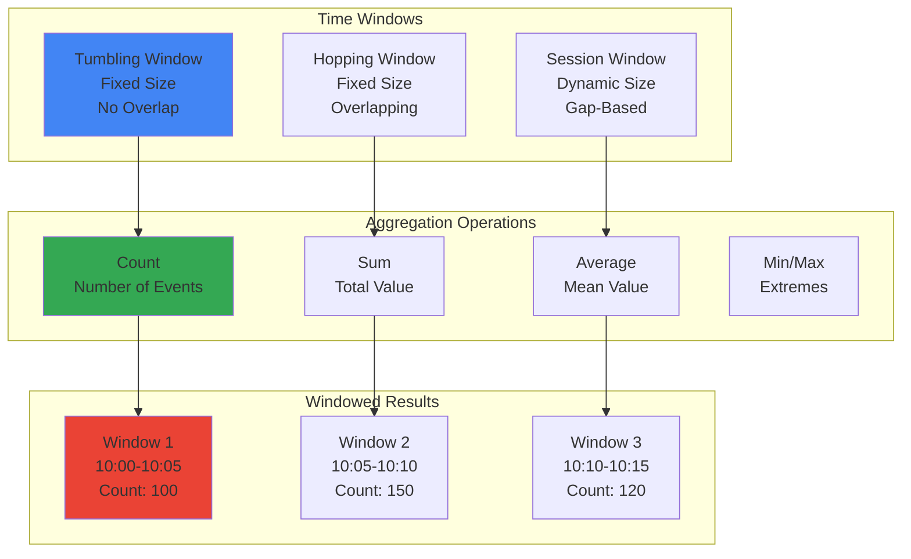
```mermaid
graph TB
    subgraph "Time Windows"
        TUMBLING[Tumbling Window<br/>Fixed Size<br/>No Overlap]
        HOPPING[Hopping Window<br/>Fixed Size<br/>Overlapping]
        SESSION[Session Window<br/>Dynamic Size<br/>Gap-Based]
    end
    
    subgraph "Aggregation Operations"
        COUNT[Count<br/>Number of Events]
        SUM[Sum<br/>Total Value]
        AVG[Average<br/>Mean Value]
        MIN_MAX[Min/Max<br/>Extremes]
    end
    
    subgraph "Windowed Results"
        RESULT1[Window 1<br/>10:00-10:05<br/>Count: 100]
        RESULT2[Window 2<br/>10:05-10:10<br/>Count: 150]
        RESULT3[Window 3<br/>10:10-10:15<br/>Count: 120]
    end
    
    TUMBLING --> COUNT
    HOPPING --> SUM
    SESSION --> AVG
    
    COUNT --> RESULT1
    SUM --> RESULT2
    AVG --> RESULT3
    
    style TUMBLING fill:#4285f4
    style COUNT fill:#34a853
    style RESULT1 fill:#ea4335
```

---

## 🔗 Integration Patterns

### Event-Driven Microservices

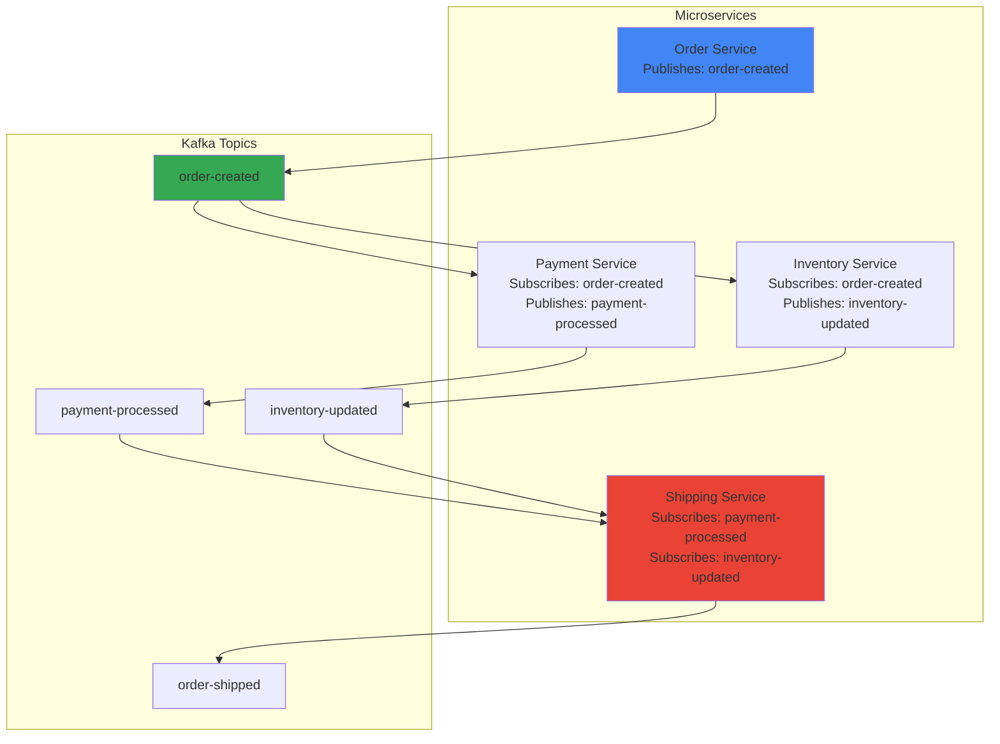
```mermaid
graph TB
    subgraph "Microservices"
        MS1[Order Service<br/>Publishes: order-created]
        MS2[Payment Service<br/>Subscribes: order-created<br/>Publishes: payment-processed]
        MS3[Inventory Service<br/>Subscribes: order-created<br/>Publishes: inventory-updated]
        MS4[Shipping Service<br/>Subscribes: payment-processed<br/>Subscribes: inventory-updated]
    end
    
    subgraph "Kafka Topics"
        T1[order-created]
        T2[payment-processed]
        T3[inventory-updated]
        T4[order-shipped]
    end
    
    MS1 --> T1
    T1 --> MS2
    T1 --> MS3
    
    MS2 --> T2
    MS3 --> T3
    
    T2 --> MS4
    T3 --> MS4
    
    MS4 --> T4
    
    style MS1 fill:#4285f4
    style T1 fill:#34a853
    style MS4 fill:#ea4335
```

### Change Data Capture (CDC) Pattern

```mermaid
sequenceDiagram
    participant DB[Database]
    participant CDC[CDC Connector<br/>Debezium]
    participant Kafka[Kafka Topic<br/>db-changes]
    participant Stream[Stream Processor]
    participant Target[Target System]
    
    DB->>DB: INSERT/UPDATE/DELETE
    DB->>CDC: Capture Change Log
    CDC->>CDC: Transform to Kafka Format
    CDC->>Kafka: Publish Change Event
    Kafka->>Stream: Stream Changes
    Stream->>Stream: Transform & Filter
    Stream->>Target: Apply Changes
    
    Note over DB,CDC: Real-time Database Replication
    Note over Kafka,Target: Event-Driven Sync
```

### Lambda Architecture

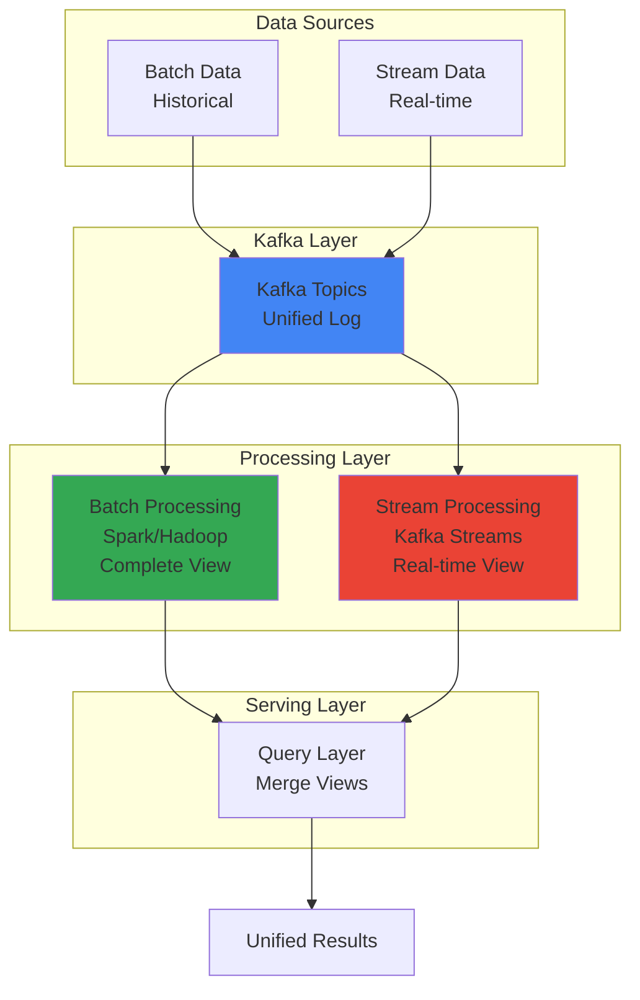
```mermaid
graph TB
    subgraph "Data Sources"
        BATCH[Batch Data<br/>Historical]
        STREAM[Stream Data<br/>Real-time]
    end
    
    subgraph "Kafka Layer"
        KAFKA[Kafka Topics<br/>Unified Log]
    end
    
    subgraph "Processing Layer"
        BATCH_PROC[Batch Processing<br/>Spark/Hadoop<br/>Complete View]
        STREAM_PROC[Stream Processing<br/>Kafka Streams<br/>Real-time View]
    end
    
    subgraph "Serving Layer"
        SERVING[Query Layer<br/>Merge Views]
    end
    
    BATCH --> KAFKA
    STREAM --> KAFKA
    
    KAFKA --> BATCH_PROC
    KAFKA --> STREAM_PROC
    
    BATCH_PROC --> SERVING
    STREAM_PROC --> SERVING
    
    SERVING --> RESULT[Unified Results]
    
    style KAFKA fill:#4285f4
    style BATCH_PROC fill:#34a853
    style STREAM_PROC fill:#ea4335
```

---

## 🔐 Security Architecture

### Kafka Security Model

```mermaid
graph TB
    subgraph "Authentication"
        SASL[SASL Mechanisms<br/>PLAIN/SCRAM/GSSAPI]
        SSL[SSL/TLS<br/>Certificate-based]
        OAUTH[OAuth 2.0<br/>Token-based]
    end
    
    subgraph "Authorization"
        ACL[ACLs<br/>Access Control Lists]
        RBAC[RBAC<br/>Role-Based Access]
        POLICY[Resource Policies<br/>Topic/Group Level]
    end
    
    subgraph "Encryption"
        TLS_TRANSIT[TLS in Transit<br/>Encrypted Communication]
        ENCRYPT_AT_REST[Encryption at Rest<br/>Disk Encryption]
    end
    
    subgraph "Audit & Monitoring"
        AUDIT[Audit Logs<br/>All Operations]
        METRICS[Security Metrics<br/>Failed Auth Attempts]
    end
    
    SASL --> ACL
    SSL --> RBAC
    OAUTH --> POLICY
    
    ACL --> TLS_TRANSIT
    RBAC --> ENCRYPT_AT_REST
    POLICY --> AUDIT
    
    TLS_TRANSIT --> METRICS
    ENCRYPT_AT_REST --> METRICS
    
    style SASL fill:#4285f4
    style ACL fill:#34a853
    style TLS_TRANSIT fill:#ea4335
```

### SASL/SCRAM Authentication Flow

```mermaid
sequenceDiagram
    participant Client
    participant Broker
    participant Auth[Authentication Server]
    
    Client->>Broker: Connect Request
    Broker->>Client: Challenge (SASL/SCRAM)
    
    Client->>Client: Generate Client Nonce
    Client->>Broker: First Message (username, nonce)
    
    Broker->>Auth: Validate User
    Auth-->>Broker: User Credentials (salt, iterations)
    
    Broker->>Client: Server Response (salt, iterations, server nonce)
    
    Client->>Client: Compute Client Proof
    Client->>Broker: Final Message (client proof)
    
    Broker->>Broker: Verify Client Proof
    Broker->>Client: Server Proof
    
    Client->>Broker: Verify Server Proof
    Broker-->>Client: Authentication Success
    
    Note over Client,Broker: Secure Mutual Authentication
```

---

## 📊 Performance Optimization

### Partitioning Strategy

```mermaid
mindmap
  root((Partitioning Strategy))
    Key-Based
      Consistent Hashing
        Same Key → Same Partition
      Ordering Guarantee
        Per-Partition Order
    Round-Robin
      Even Distribution
        No Key Required
      Load Balancing
        Equal Load
    Custom Partitioner
      Business Logic
        Custom Rules
      Performance
        Optimize Hot Partitions
```

### Compression Comparison

```mermaid
graph TB
    subgraph "Compression Algorithms"
        NONE[None<br/>No Compression<br/>Fastest]
        GZIP[GZIP<br/>High Compression<br/>CPU Intensive]
        SNAPPY[Snappy<br/>Balanced<br/>Fast & Good]
        LZ4[LZ4<br/>Very Fast<br/>Lower Compression]
        ZSTD[ZSTD<br/>Best Balance<br/>Modern]
    end
    
    subgraph "Trade-offs"
        CPU[CPU Usage]
        NETWORK[Network Bandwidth]
        STORAGE[Storage Space]
        LATENCY[Latency]
    end
    
    NONE --> LATENCY
    GZIP --> CPU
    GZIP --> NETWORK
    SNAPPY --> CPU
    SNAPPY --> NETWORK
    LZ4 --> LATENCY
    LZ4 --> NETWORK
    ZSTD --> CPU
    ZSTD --> NETWORK
    ZSTD --> STORAGE
    
    style SNAPPY fill:#34a853
    style ZSTD fill:#34a853
    style NONE fill:#ea4335
```

### Producer Performance Tuning

```mermaid
graph TD
    subgraph "Producer Configurations"
        BATCH[Batch Size<br/>32KB-1MB]
        LINGER[Linger MS<br/>0-100ms]
        COMPRESS[Compression<br/>snappy/lz4]
        BUFFER[Buffer Memory<br/>32MB-1GB]
        ACKS[Acks<br/>0/1/all]
    end
    
    subgraph "Performance Metrics"
        THROUGHPUT[Throughput<br/>Messages/sec]
        LATENCY[Latency<br/>P99 Latency]
        CPU_USAGE[CPU Usage<br/>% Utilization]
    end
    
    BATCH --> THROUGHPUT
    LINGER --> THROUGHPUT
    COMPRESS --> CPU_USAGE
    BUFFER --> THROUGHPUT
    ACKS --> LATENCY
    
    THROUGHPUT --> OPTIMIZE[Optimize Balance]
    LATENCY --> OPTIMIZE
    CPU_USAGE --> OPTIMIZE
    
    style THROUGHPUT fill:#34a853
    style LATENCY fill:#ea4335
```

---

## 🔍 Monitoring & Operations

### Key Metrics Dashboard

```mermaid
graph TB
    subgraph "Broker Metrics"
        BYTES_IN[Bytes In<br/>Producer Throughput]
        BYTES_OUT[Bytes Out<br/>Consumer Throughput]
        MESSAGES_IN[Messages In<br/>Producer Rate]
        REQUEST_HANDLER[Request Handler<br/>Thread Pool Usage]
    end
    
    subgraph "Topic Metrics"
        PARTITION_COUNT[Partition Count<br/>Per Topic]
        REPLICATION_LAG[Replication Lag<br/>Follower Delay]
        LOG_SIZE[Log Size<br/>Disk Usage]
    end
    
    subgraph "Consumer Metrics"
        LAG[Consumer Lag<br/>Messages Behind]
        FETCH_RATE[Fetch Rate<br/>Consumption Speed]
        COMMIT_RATE[Commit Rate<br/>Offset Commits]
    end
    
    subgraph "System Metrics"
        CPU[CPU Usage<br/>Broker CPU]
        MEMORY[Memory Usage<br/>Heap/Off-Heap]
        DISK[Disk I/O<br/>Read/Write]
        NETWORK[Network I/O<br/>Bandwidth]
    end
    
    BYTES_IN --> CPU
    BYTES_OUT --> NETWORK
    MESSAGES_IN --> MEMORY
    REQUEST_HANDLER --> CPU
    
    PARTITION_COUNT --> DISK
    REPLICATION_LAG --> NETWORK
    LOG_SIZE --> DISK
    
    LAG --> FETCH_RATE
    FETCH_RATE --> COMMIT_RATE
    
    style LAG fill:#ea4335
    style REPLICATION_LAG fill:#fbbc04
    style BYTES_IN fill:#34a853
```

### Consumer Lag Monitoring

```mermaid
flowchart TD
    A[Monitor Consumer Lag] --> B{Lag > Threshold?}
    
    B -->|No| C[Normal Operation]
    B -->|Yes| D{Identify Cause}
    
    D --> E[Slow Consumer]
    D --> F[High Producer Rate]
    D --> G[Partition Imbalance]
    
    E --> H[Scale Consumers]
    F --> I[Scale Partitions]
    G --> J[Rebalance Partitions]
    
    H --> K[Reduce Lag]
    I --> K
    J --> K
    
    K --> L{Still High?}
    L -->|Yes| M[Alert Team]
    L -->|No| C
    
    style B fill:#fbbc04
    style E fill:#ea4335
    style K fill:#34a853
```

---

## 🎯 Key Visual Takeaways

1. **Topics & Partitions**: Topics are divided into partitions for parallelism and scalability
2. **Replication**: Partitions are replicated across brokers for fault tolerance
3. **Consumer Groups**: Enable parallel processing and load balancing
4. **Offset Management**: Tracks consumer progress, enables replay and exactly-once semantics
5. **Producer Patterns**: Batching, compression, and acknowledgment modes optimize performance
6. **Stream Processing**: Kafka Streams enables real-time data transformation and aggregation
7. **Security**: Multi-layered security with authentication, authorization, and encryption
8. **Monitoring**: Key metrics include lag, throughput, replication, and system resources

---

## 📚 Next Steps

1. ✅ Review these diagrams
2. 🏗️ Draw them yourself (practice)
3. 💬 Use in interviews (explain architecture)
4. 🔗 Connect to your POCs (build streaming pipelines)

---

**Visual learning helps!** Use these diagrams to explain Kafka architecture, streaming patterns, and operations in interviews.
