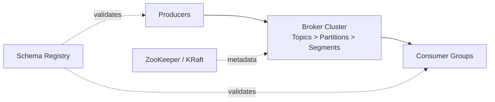

# Kafka -- Cheatsheet

## Architecture (30-second mental model)

## When to use vs alternatives
| Need | Use | Not |
|------|-----|-----|
| Ordered event log with replay | Kafka | RabbitMQ (no replay after ack) |
| Fan-out to many consumers | Kafka (consumer groups) | SQS (single consumer per msg) |
| Simple task queue / work dispatch | RabbitMQ / SQS | Kafka (overkill) |
| Sub-millisecond pub/sub, small payloads | Redis Streams / NATS | Kafka (higher latency) |
| Managed cloud-native eventing | Pub/Sub / EventBridge | Kafka (ops overhead) |

## 5 things you always forget
1. `acks=all` alone is not enough for durability -- you also need `min.insync.replicas=2` on the broker, otherwise a single-replica ISR still satisfies `acks=all`.
2. Adding partitions after the fact re-hashes keys, so messages for the same key land on a different partition -- plan partition count upfront or use a custom partitioner.
3. Consumer group rebalances pause ALL consumers in the group; use `partition.assignment.strategy=cooperative-sticky` to avoid stop-the-world rebalances.
4. `auto.offset.reset=latest` means a brand-new consumer group silently skips all existing messages -- almost never what you want in a backfill scenario.
5. `linger.ms=0` (default) sends every record as its own batch request; bump to 5-20ms in production to get real batching throughput gains.

## Interview killer answer
> "In our order pipeline we ran Kafka with replication factor 3, min.insync.replicas 2, and idempotent producers so we could guarantee exactly-once even during broker rolling restarts. The real lesson was consumer-side: we switched from eager to cooperative-sticky rebalancing after discovering that adding a single consumer triggered a 30-second processing stall across the entire consumer group, which was worse than the scaling benefit. That one config change cut our P99 processing latency during deploys from 45 seconds to under 2."
