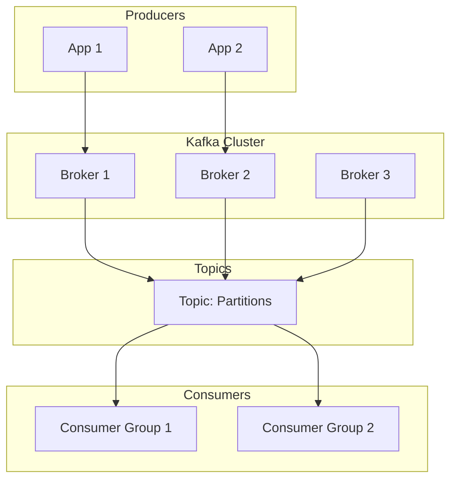

# Apache Kafka Guide – Basic → Architect

## Level 1 – Launch & Basics

### 1. **Quick Setup**
```bash
# Download Kafka
wget https://downloads.apache.org/kafka/2.13-3.5.0/kafka_2.13-3.5.0.tgz
tar -xzf kafka_2.13-3.5.0.tgz
cd kafka_2.13-3.5.0

# Start Zookeeper
bin/zookeeper-server-start.sh config/zookeeper.properties

# Start Kafka
bin/kafka-server-start.sh config/server.properties
```

### 2. **Basic Operations**
```bash
# Create topic
bin/kafka-topics.sh --create \
    --topic my-topic \
    --bootstrap-server localhost:9092 \
    --partitions 3 \
    --replication-factor 1

# List topics
bin/kafka-topics.sh --list --bootstrap-server localhost:9092

# Produce messages
bin/kafka-console-producer.sh \
    --topic my-topic \
    --bootstrap-server localhost:9092

# Consume messages
bin/kafka-console-consumer.sh \
    --topic my-topic \
    --from-beginning \
    --bootstrap-server localhost:9092
```

### 3. **Python Producer/Consumer**
```python
from kafka import KafkaProducer, KafkaConsumer
import json

# Producer
producer = KafkaProducer(
    bootstrap_servers=['localhost:9092'],
    value_serializer=lambda v: json.dumps(v).encode('utf-8')
)

producer.send('my-topic', {'key': 'value'})
producer.flush()

# Consumer
consumer = KafkaConsumer(
    'my-topic',
    bootstrap_servers=['localhost:9092'],
    value_deserializer=lambda m: json.loads(m.decode('utf-8')),
    group_id='my-group',
    auto_offset_reset='earliest'
)

for message in consumer:
    print(message.value)
```

## Level 2 – Production Patterns

### Advanced Producer
```python
from kafka import KafkaProducer
from kafka.errors import KafkaError

producer = KafkaProducer(
    bootstrap_servers=['localhost:9092'],
    acks='all',  # Wait for all replicas
    retries=3,
    max_in_flight_requests_per_connection=1,
    enable_idempotence=True,
    compression_type='snappy',
    value_serializer=lambda v: json.dumps(v).encode('utf-8')
)

# Send with callback
future = producer.send('my-topic', {'key': 'value'})

def on_send_success(record_metadata):
    print(f"Topic: {record_metadata.topic}")
    print(f"Partition: {record_metadata.partition}")
    print(f"Offset: {record_metadata.offset}")

def on_send_error(exception):
    print(f"Error: {exception}")

future.add_callback(on_send_success)
future.add_errback(on_send_error)
```

### Advanced Consumer
```python
from kafka import KafkaConsumer
from kafka.structs import TopicPartition

consumer = KafkaConsumer(
    bootstrap_servers=['localhost:9092'],
    group_id='my-group',
    enable_auto_commit=False,  # Manual commit
    auto_offset_reset='earliest',
    value_deserializer=lambda m: json.loads(m.decode('utf-8'))
)

try:
    for message in consumer:
        # Process message
        process_message(message.value)
        # Manual commit
        consumer.commit()
except Exception as e:
    print(f"Error: {e}")
    # Handle error, maybe send to DLQ
```

### Kafka Streams
```python
from kafka import KafkaStreams
from kafka.streams import StreamBuilder

builder = StreamBuilder()

# Read from topic
stream = builder.stream('input-topic')

# Transform
transformed = stream.map_values(lambda v: v.upper())

# Write to topic
transformed.to('output-topic')

# Build and start
streams = KafkaStreams(builder.build(), {
    'bootstrap.servers': 'localhost:9092',
    'application.id': 'my-app'
})
streams.start()
```

## Level 3 – Architect Playbook

### Exactly-Once Semantics
```python
producer = KafkaProducer(
    bootstrap_servers=['localhost:9092'],
    transactional_id='my-transactional-id',
    enable_idempotence=True,
    acks='all',
    retries=3
)

# Begin transaction
producer.begin_transaction()

try:
    producer.send('topic1', {'key': 'value1'})
    producer.send('topic2', {'key': 'value2'})
    producer.commit_transaction()
except Exception as e:
    producer.abort_transaction()
    raise e
```

### Schema Registry Integration
```python
from confluent_kafka import avro
from confluent_kafka.avro import AvroProducer, AvroConsumer

# Producer with Avro
producer = AvroProducer({
    'bootstrap.servers': 'localhost:9092',
    'schema.registry.url': 'http://localhost:8081'
}, default_value_schema=value_schema)

producer.produce(topic='my-topic', value={'name': 'John', 'age': 30})
producer.flush()

# Consumer with Avro
consumer = AvroConsumer({
    'bootstrap.servers': 'localhost:9092',
    'group.id': 'my-group',
    'schema.registry.url': 'http://localhost:8081'
})
consumer.subscribe(['my-topic'])
```

### Multi-Region Replication
```bash
# Configure replication
# server.properties
replication.factor=3
min.insync.replicas=2

# Create topic with replication
bin/kafka-topics.sh --create \
    --topic my-topic \
    --bootstrap-server localhost:9092 \
    --partitions 3 \
    --replication-factor 3
```

## Ops Cheat Sheet

| Task | Command | Notes |
| --- | --- | --- |
| List topics | `kafka-topics.sh --list` | View all topics |
| Describe topic | `kafka-topics.sh --describe --topic my-topic` | Topic details |
| Consumer groups | `kafka-consumer-groups.sh --list` | List consumer groups |
| Reset offset | `kafka-consumer-groups.sh --reset-offsets` | Reset consumer offset |
| Monitor lag | `kafka-consumer-groups.sh --describe --group my-group` | Check consumer lag |
| Delete topic | `kafka-topics.sh --delete --topic my-topic` | Delete topic |

## Architecture Patterns



## Checklist Before Production

- [ ] Configure appropriate replication factor (min 3)
- [ ] Set min.insync.replicas for durability
- [ ] Configure retention policies
- [ ] Set up monitoring (JMX, Prometheus)
- [ ] Implement proper security (SASL, SSL)
- [ ] Configure log compaction for keyed topics
- [ ] Set up Schema Registry
- [ ] Implement exactly-once semantics
- [ ] Configure consumer groups properly
- [ ] Set up alerting for lag and errors
