# Kubernetes - Visual Learning Guide

## 🎨 Visual Learning: Architecture, Pods, Services, Scaling, Networking

---

## 📊 Kubernetes Architecture

### High-Level Architecture

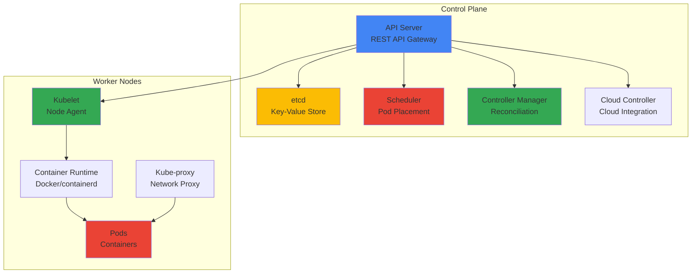
```mermaid
graph TB
    subgraph "Control Plane"
        A[API Server<br/>REST API Gateway]
        B[etcd<br/>Key-Value Store]
        C[Scheduler<br/>Pod Placement]
        D[Controller Manager<br/>Reconciliation]
        E[Cloud Controller<br/>Cloud Integration]
    end
    
    subgraph "Worker Nodes"
        F[Kubelet<br/>Node Agent]
        G[Kube-proxy<br/>Network Proxy]
        H[Container Runtime<br/>Docker/containerd]
        I[Pods<br/>Containers]
    end
    
    A --> B
    A --> C
    A --> D
    A --> E
    A --> F
    F --> H
    H --> I
    G --> I
    
    style A fill:#4285f4
    style B fill:#fbbc04
    style C fill:#ea4335
    style D fill:#34a853
    style F fill:#34a853
    style I fill:#ea4335
```

### Cluster Architecture

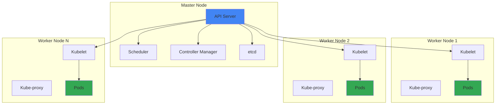
```mermaid
graph TB
    subgraph "Master Node"
        M1[API Server]
        M2[Scheduler]
        M3[Controller Manager]
        M4[etcd]
    end
    
    subgraph "Worker Node 1"
        W1[Kubelet]
        W2[Kube-proxy]
        W3[Pods]
    end
    
    subgraph "Worker Node 2"
        W4[Kubelet]
        W5[Kube-proxy]
        W6[Pods]
    end
    
    subgraph "Worker Node N"
        W7[Kubelet]
        W8[Kube-proxy]
        W9[Pods]
    end
    
    M1 --> W1
    M1 --> W4
    M1 --> W7
    M1 --> M2
    M1 --> M3
    M1 --> M4
    
    W1 --> W3
    W4 --> W6
    W7 --> W9
    
    style M1 fill:#4285f4
    style W3 fill:#34a853
    style W6 fill:#34a853
    style W9 fill:#34a853
```

---

## 🔄 Pod Lifecycle & States

### Pod State Diagram

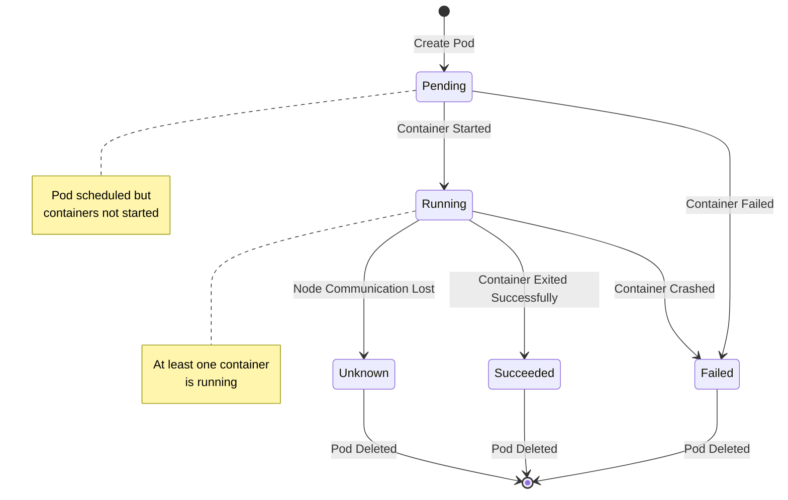
```mermaid
stateDiagram-v2
    [*] --> Pending: Create Pod
    Pending --> Running: Container Started
    Pending --> Failed: Container Failed
    Running --> Succeeded: Container Exited Successfully
    Running --> Failed: Container Crashed
    Running --> Unknown: Node Communication Lost
    Failed --> [*]: Pod Deleted
    Succeeded --> [*]: Pod Deleted
    Unknown --> [*]: Pod Deleted
    
    note right of Pending
        Pod scheduled but
        containers not started
    end note
    
    note right of Running
        At least one container
        is running
    end note
```

### Pod Lifecycle Sequence

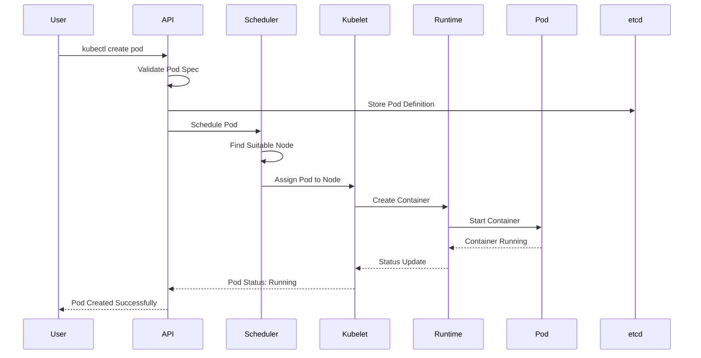
```mermaid
sequenceDiagram
    participant User
    participant API
    participant Scheduler
    participant Kubelet
    participant Runtime
    participant Pod
    
    User->>API: kubectl create pod
    API->>API: Validate Pod Spec
    API->>etcd: Store Pod Definition
    API->>Scheduler: Schedule Pod
    
    Scheduler->>Scheduler: Find Suitable Node
    Scheduler->>Kubelet: Assign Pod to Node
    Kubelet->>Runtime: Create Container
    Runtime->>Pod: Start Container
    Pod-->>Runtime: Container Running
    Runtime-->>Kubelet: Status Update
    Kubelet-->>API: Pod Status: Running
    API-->>User: Pod Created Successfully
```

---

## 🏗️ Deployment Architecture

### Deployment Flow

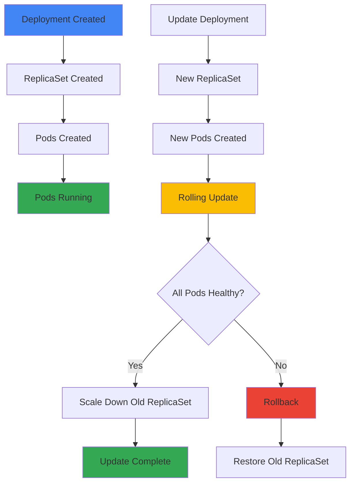
```mermaid
graph TB
    A[Deployment Created] --> B[ReplicaSet Created]
    B --> C[Pods Created]
    C --> D[Pods Running]
    
    E[Update Deployment] --> F[New ReplicaSet]
    F --> G[New Pods Created]
    G --> H[Rolling Update]
    H --> I{All Pods Healthy?}
    I -->|Yes| J[Scale Down Old ReplicaSet]
    I -->|No| K[Rollback]
    J --> L[Update Complete]
    K --> M[Restore Old ReplicaSet]
    
    style A fill:#4285f4
    style D fill:#34a853
    style H fill:#fbbc04
    style L fill:#34a853
    style K fill:#ea4335
```

### Rolling Update Strategy

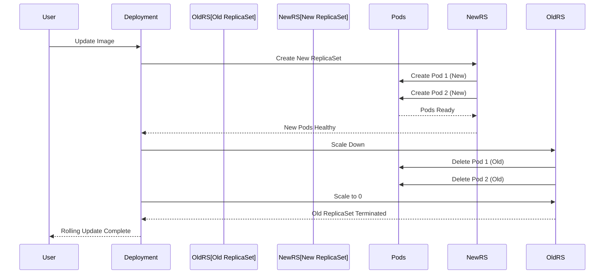
```mermaid
sequenceDiagram
    participant User
    participant Deployment
    participant OldRS[Old ReplicaSet]
    participant NewRS[New ReplicaSet]
    participant Pods
    
    User->>Deployment: Update Image
    Deployment->>NewRS: Create New ReplicaSet
    NewRS->>Pods: Create Pod 1 (New)
    NewRS->>Pods: Create Pod 2 (New)
    
    Pods-->>NewRS: Pods Ready
    NewRS-->>Deployment: New Pods Healthy
    
    Deployment->>OldRS: Scale Down
    OldRS->>Pods: Delete Pod 1 (Old)
    OldRS->>Pods: Delete Pod 2 (Old)
    
    Deployment->>OldRS: Scale to 0
    OldRS-->>Deployment: Old ReplicaSet Terminated
    Deployment-->>User: Rolling Update Complete
```

### Deployment vs StatefulSet vs DaemonSet

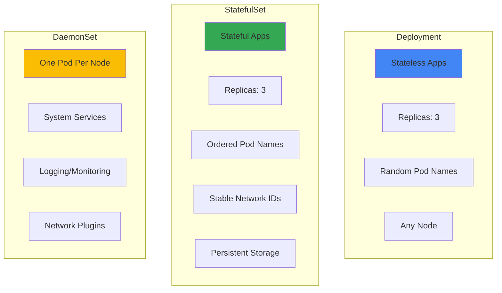
```mermaid
graph TB
    subgraph "Deployment"
        D1[Stateless Apps]
        D2[Replicas: 3]
        D3[Random Pod Names]
        D4[Any Node]
    end
    
    subgraph "StatefulSet"
        S1[Stateful Apps]
        S2[Replicas: 3]
        S3[Ordered Pod Names]
        S4[Stable Network IDs]
        S5[Persistent Storage]
    end
    
    subgraph "DaemonSet"
        DS1[One Pod Per Node]
        DS2[System Services]
        DS3[Logging/Monitoring]
        DS4[Network Plugins]
    end
    
    style D1 fill:#4285f4
    style S1 fill:#34a853
    style DS1 fill:#fbbc04
```

---

## 🌐 Service & Networking

### Service Types

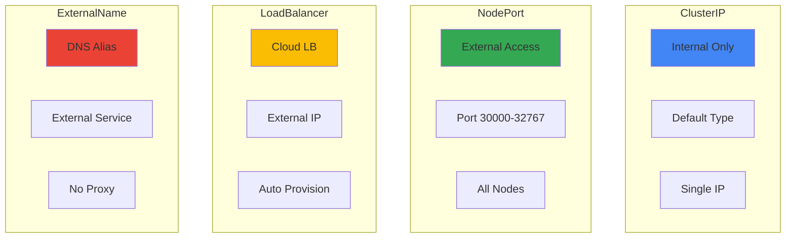
```mermaid
graph TB
    subgraph "ClusterIP"
        C1[Internal Only]
        C2[Default Type]
        C3[Single IP]
    end
    
    subgraph "NodePort"
        N1[External Access]
        N2[Port 30000-32767]
        N3[All Nodes]
    end
    
    subgraph "LoadBalancer"
        L1[Cloud LB]
        L2[External IP]
        L3[Auto Provision]
    end
    
    subgraph "ExternalName"
        E1[DNS Alias]
        E2[External Service]
        E3[No Proxy]
    end
    
    style C1 fill:#4285f4
    style N1 fill:#34a853
    style L1 fill:#fbbc04
    style E1 fill:#ea4335
```

### Service Discovery Flow

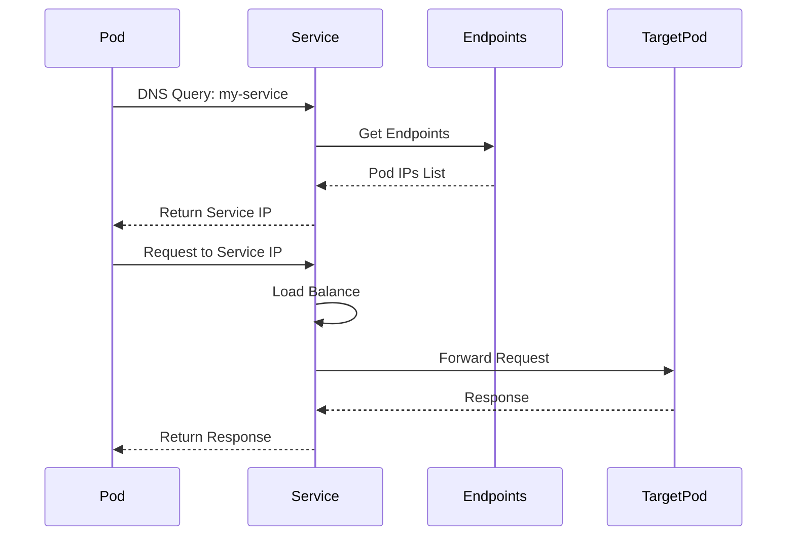
```mermaid
sequenceDiagram
    participant Pod
    participant Service
    participant Endpoints
    participant TargetPod
    
    Pod->>Service: DNS Query: my-service
    Service->>Endpoints: Get Endpoints
    Endpoints-->>Service: Pod IPs List
    Service-->>Pod: Return Service IP
    
    Pod->>Service: Request to Service IP
    Service->>Service: Load Balance
    Service->>TargetPod: Forward Request
    TargetPod-->>Service: Response
    Service-->>Pod: Return Response
```

### Network Policy

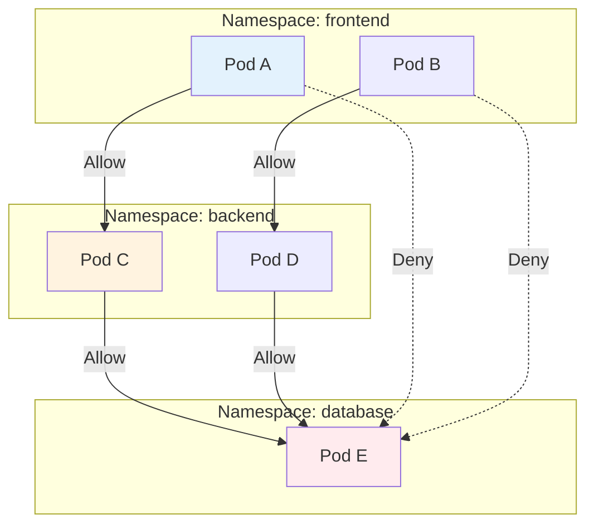
```mermaid
graph TB
    subgraph "Namespace: frontend"
        F1[Pod A]
        F2[Pod B]
    end
    
    subgraph "Namespace: backend"
        B1[Pod C]
        B2[Pod D]
    end
    
    subgraph "Namespace: database"
        D1[Pod E]
    end
    
    F1 -->|Allow| B1
    F2 -->|Allow| B2
    B1 -->|Allow| D1
    B2 -->|Allow| D1
    
    F1 -.->|Deny| D1
    F2 -.->|Deny| D1
    
    style F1 fill:#e3f2fd
    style B1 fill:#fff3e0
    style D1 fill:#ffebee
```

---

## 📦 ConfigMap & Secrets

### ConfigMap Flow

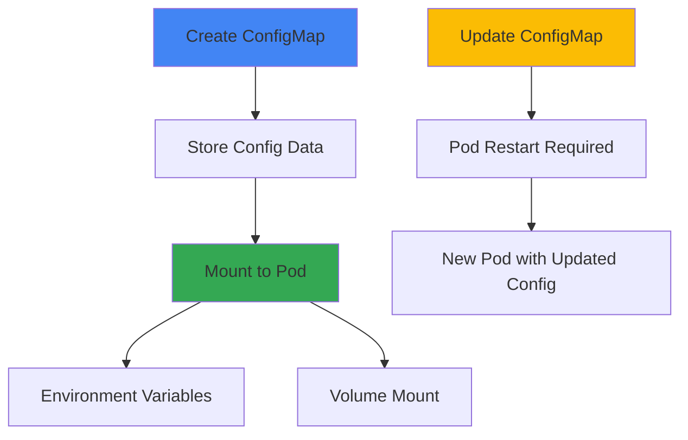
```mermaid
graph TB
    A[Create ConfigMap] --> B[Store Config Data]
    B --> C[Mount to Pod]
    C --> D[Environment Variables]
    C --> E[Volume Mount]
    
    F[Update ConfigMap] --> G[Pod Restart Required]
    G --> H[New Pod with Updated Config]
    
    style A fill:#4285f4
    style C fill:#34a853
    style F fill:#fbbc04
```

### Secret Management

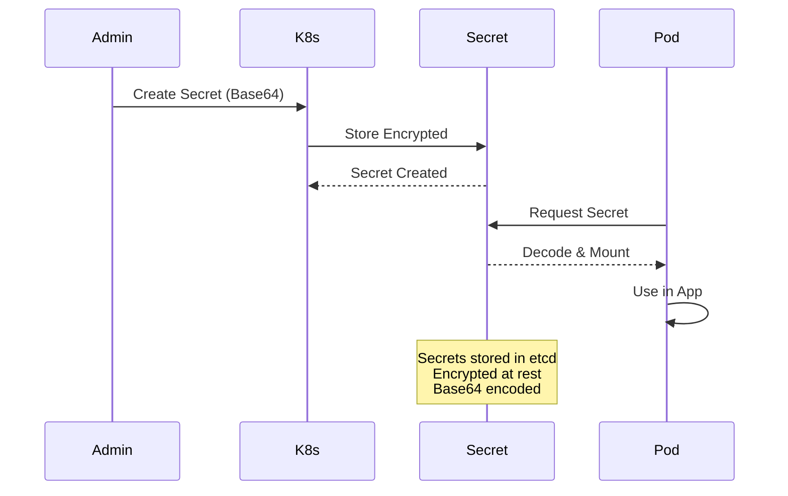
```mermaid
sequenceDiagram
    participant Admin
    participant K8s
    participant Secret
    participant Pod
    
    Admin->>K8s: Create Secret (Base64)
    K8s->>Secret: Store Encrypted
    Secret-->>K8s: Secret Created
    
    Pod->>Secret: Request Secret
    Secret-->>Pod: Decode & Mount
    Pod->>Pod: Use in App
    
    note over Secret: Secrets stored in etcd<br/>Encrypted at rest<br/>Base64 encoded
```

---

## 🔄 Scaling & Autoscaling

### Horizontal Pod Autoscaler (HPA)

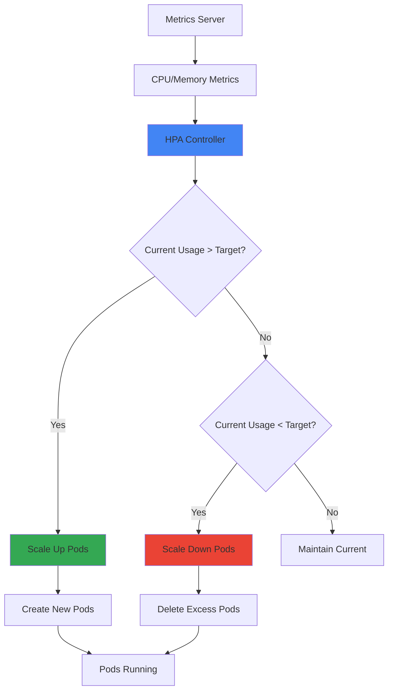
```mermaid
graph TB
    A[Metrics Server] --> B[CPU/Memory Metrics]
    B --> C[HPA Controller]
    C --> D{Current Usage > Target?}
    
    D -->|Yes| E[Scale Up Pods]
    D -->|No| F{Current Usage < Target?}
    
    F -->|Yes| G[Scale Down Pods]
    F -->|No| H[Maintain Current]
    
    E --> I[Create New Pods]
    G --> J[Delete Excess Pods]
    
    I --> K[Pods Running]
    J --> K
    
    style C fill:#4285f4
    style E fill:#34a853
    style G fill:#ea4335
```

### Vertical Pod Autoscaler (VPA)

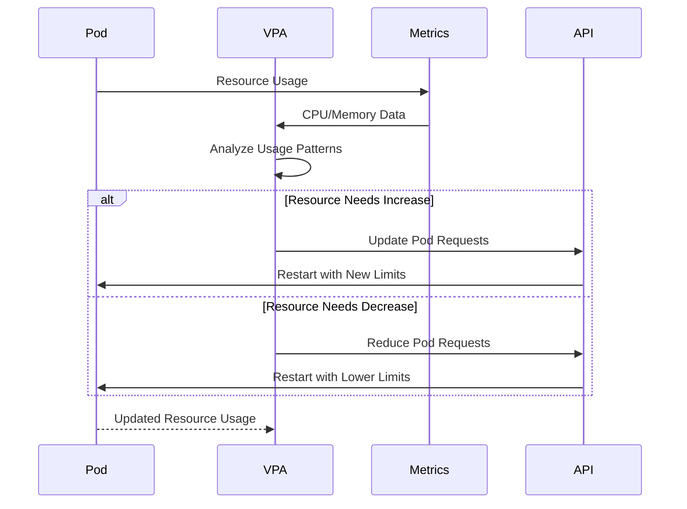
```mermaid
sequenceDiagram
    participant Pod
    participant VPA
    participant Metrics
    participant API
    
    Pod->>Metrics: Resource Usage
    Metrics->>VPA: CPU/Memory Data
    VPA->>VPA: Analyze Usage Patterns
    
    alt Resource Needs Increase
        VPA->>API: Update Pod Requests
        API->>Pod: Restart with New Limits
    else Resource Needs Decrease
        VPA->>API: Reduce Pod Requests
        API->>Pod: Restart with Lower Limits
    end
    
    Pod-->>VPA: Updated Resource Usage
```

### Cluster Autoscaler

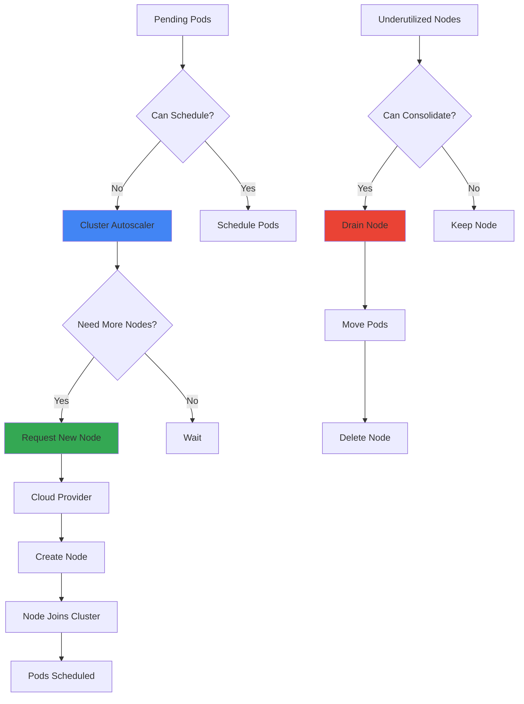
```mermaid
flowchart TD
    A[Pending Pods] --> B{Can Schedule?}
    B -->|No| C[Cluster Autoscaler]
    B -->|Yes| D[Schedule Pods]
    
    C --> E{Need More Nodes?}
    E -->|Yes| F[Request New Node]
    E -->|No| G[Wait]
    
    F --> H[Cloud Provider]
    H --> I[Create Node]
    I --> J[Node Joins Cluster]
    J --> K[Pods Scheduled]
    
    L[Underutilized Nodes] --> M{Can Consolidate?}
    M -->|Yes| N[Drain Node]
    M -->|No| O[Keep Node]
    
    N --> P[Move Pods]
    P --> Q[Delete Node]
    
    style C fill:#4285f4
    style F fill:#34a853
    style N fill:#ea4335
```

---

## 🔐 RBAC & Security

### RBAC Architecture

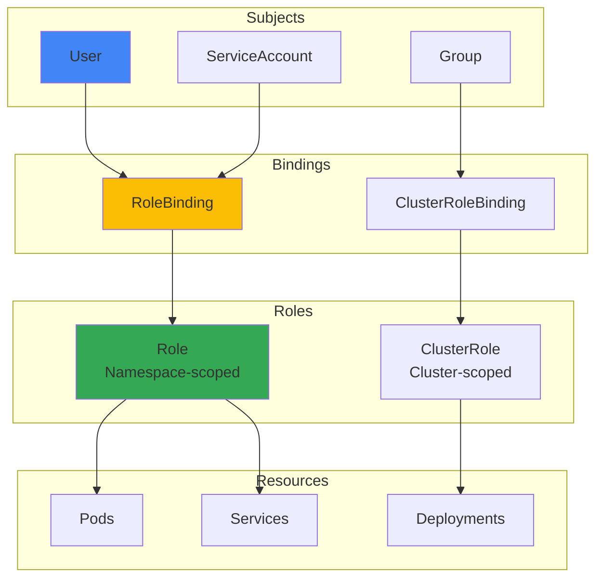
```mermaid
graph TB
    subgraph "Subjects"
        U1[User]
        U2[ServiceAccount]
        G1[Group]
    end
    
    subgraph "Roles"
        R1[Role<br/>Namespace-scoped]
        R2[ClusterRole<br/>Cluster-scoped]
    end
    
    subgraph "Bindings"
        B1[RoleBinding]
        B2[ClusterRoleBinding]
    end
    
    subgraph "Resources"
        RES1[Pods]
        RES2[Services]
        RES3[Deployments]
    end
    
    U1 --> B1
    U2 --> B1
    G1 --> B2
    
    B1 --> R1
    B2 --> R2
    
    R1 --> RES1
    R1 --> RES2
    R2 --> RES3
    
    style U1 fill:#4285f4
    style R1 fill:#34a853
    style B1 fill:#fbbc04
```

### ServiceAccount Flow

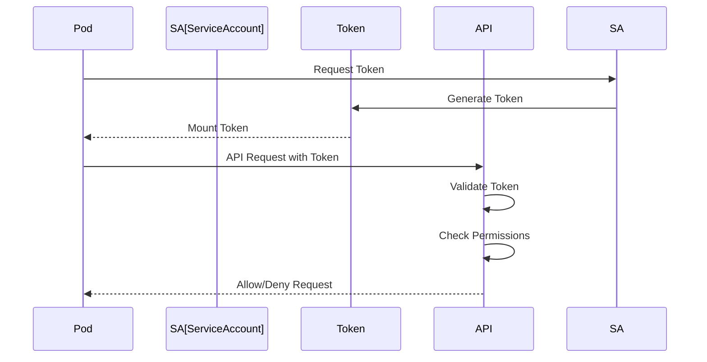
```mermaid
sequenceDiagram
    participant Pod
    participant SA[ServiceAccount]
    participant Token
    participant API
    
    Pod->>SA: Request Token
    SA->>Token: Generate Token
    Token-->>Pod: Mount Token
    
    Pod->>API: API Request with Token
    API->>API: Validate Token
    API->>API: Check Permissions
    API-->>Pod: Allow/Deny Request
```

---

## 🚀 Deployment Patterns

### Blue-Green Deployment

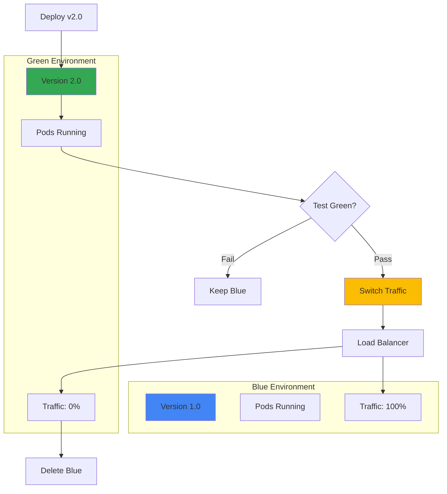
```mermaid
graph TB
    subgraph "Blue Environment"
        B1[Version 1.0]
        B2[Pods Running]
        B3[Traffic: 100%]
    end
    
    subgraph "Green Environment"
        G1[Version 2.0]
        G2[Pods Running]
        G3[Traffic: 0%]
    end
    
    A[Load Balancer] --> B3
    
    E[Deploy v2.0] --> G1
    G1 --> G2
    G2 --> T{Test Green?}
    
    T -->|Pass| S[Switch Traffic]
    T -->|Fail| R[Keep Blue]
    
    S --> A
    A --> G3
    G3 --> D[Delete Blue]
    
    style B1 fill:#4285f4
    style G1 fill:#34a853
    style S fill:#fbbc04
```

### Canary Deployment

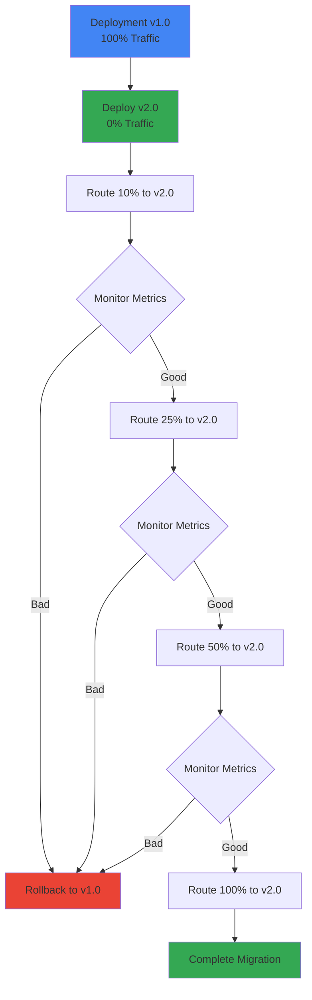
```mermaid
graph TB
    A[Deployment v1.0<br/>100% Traffic] --> B[Deploy v2.0<br/>0% Traffic]
    
    B --> C[Route 10% to v2.0]
    C --> D{Monitor Metrics}
    
    D -->|Good| E[Route 25% to v2.0]
    D -->|Bad| F[Rollback to v1.0]
    
    E --> G{Monitor Metrics}
    G -->|Good| H[Route 50% to v2.0]
    G -->|Bad| F
    
    H --> I{Monitor Metrics}
    I -->|Good| J[Route 100% to v2.0]
    I -->|Bad| F
    
    J --> K[Complete Migration]
    
    style A fill:#4285f4
    style B fill:#34a853
    style F fill:#ea4335
    style K fill:#34a853
```

---

## 📊 Monitoring & Observability

### Monitoring Stack

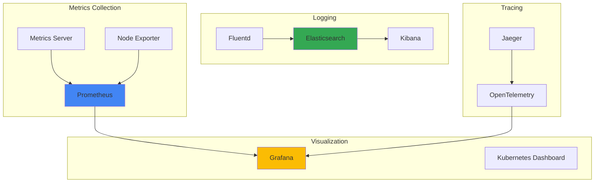
```mermaid
graph TB
    subgraph "Metrics Collection"
        M1[Metrics Server]
        M2[Prometheus]
        M3[Node Exporter]
    end
    
    subgraph "Logging"
        L1[Fluentd]
        L2[Elasticsearch]
        L3[Kibana]
    end
    
    subgraph "Tracing"
        T1[Jaeger]
        T2[OpenTelemetry]
    end
    
    subgraph "Visualization"
        V1[Grafana]
        V2[Kubernetes Dashboard]
    end
    
    M1 --> M2
    M3 --> M2
    M2 --> V1
    
    L1 --> L2
    L2 --> L3
    
    T1 --> T2
    T2 --> V1
    
    style M2 fill:#4285f4
    style L2 fill:#34a853
    style V1 fill:#fbbc04
```

### Pod Health Checks

```mermaid
sequenceDiagram
    participant Kubelet
    participant Pod
    participant Liveness[Liveness Probe]
    participant Readiness[Readiness Probe]
    participant Startup[Startup Probe]
    
    Kubelet->>Pod: Start Container
    Pod->>Startup: Startup Probe
    Startup-->>Pod: Container Starting
    
    loop Every Period
        Kubelet->>Liveness: Check Health
        Liveness->>Pod: HTTP/TCP/Exec
        Pod-->>Liveness: Success/Failure
        
        alt Liveness Fails
            Liveness-->>Kubelet: Restart Container
            Kubelet->>Pod: Restart
        end
    end
    
    Pod->>Readiness: Ready Check
    Readiness->>Pod: HTTP/TCP/Exec
    Pod-->>Readiness: Ready/Not Ready
    
    alt Readiness Fails
        Readiness-->>Kubelet: Remove from Service
    else Readiness Passes
        Readiness-->>Kubelet: Add to Service
    end
```

---

## 🔄 Resource Management

### Resource Requests & Limits

```mermaid
graph TB
    subgraph "Pod Spec"
        P1[Container 1]
        P2[Container 2]
    end
    
    subgraph "Requests"
        R1[CPU: 0.5 cores]
        R2[Memory: 512Mi]
        R3[CPU: 1 core]
        R4[Memory: 1Gi]
    end
    
    subgraph "Limits"
        L1[CPU: 1 core]
        L2[Memory: 1Gi]
        L3[CPU: 2 cores]
        L4[Memory: 2Gi]
    end
    
    P1 --> R1
    P1 --> R2
    P1 --> L1
    P1 --> L2
    
    P2 --> R3
    P2 --> R4
    P2 --> L3
    P2 --> L4
    
    style R1 fill:#34a853
    style L1 fill:#ea4335
```

### Quality of Service (QoS) Classes

```mermaid
graph TB
    subgraph "Guaranteed"
        G1[Requests = Limits]
        G2[All Containers Set]
        G3[Highest Priority]
    end
    
    subgraph "Burstable"
        B1[Requests < Limits]
        B2[Some Containers Set]
        B3[Medium Priority]
    end
    
    subgraph "BestEffort"
        BE1[No Requests/Limits]
        BE2[Lowest Priority]
        BE3[First to Evict]
    end
    
    style G1 fill:#34a853
    style B1 fill:#fbbc04
    style BE1 fill:#ea4335
```

---

## 🎯 Key Visual Takeaways

1. **Control Plane**: API Server, Scheduler, Controller Manager, etcd orchestrate the cluster
2. **Worker Nodes**: Kubelet, Kube-proxy, Container Runtime execute workloads
3. **Pods**: Smallest deployable unit, can contain multiple containers
4. **Deployments**: Manage ReplicaSets, enable rolling updates and rollbacks
5. **Services**: Provide stable networking and load balancing
6. **Scaling**: HPA, VPA, Cluster Autoscaler for dynamic resource management
7. **Security**: RBAC, Network Policies, Secrets for access control
8. **Monitoring**: Metrics, Logs, Traces for observability

---

## 📚 Next Steps

1. ✅ Review these diagrams
2. 🏗️ Draw them yourself (practice)
3. 💬 Use in interviews (explain architecture)
4. 🔗 Connect to your POCs (deploy apps)

---

**Visual learning helps!** Use these diagrams to explain Kubernetes architecture, scaling, and operations in interviews.
