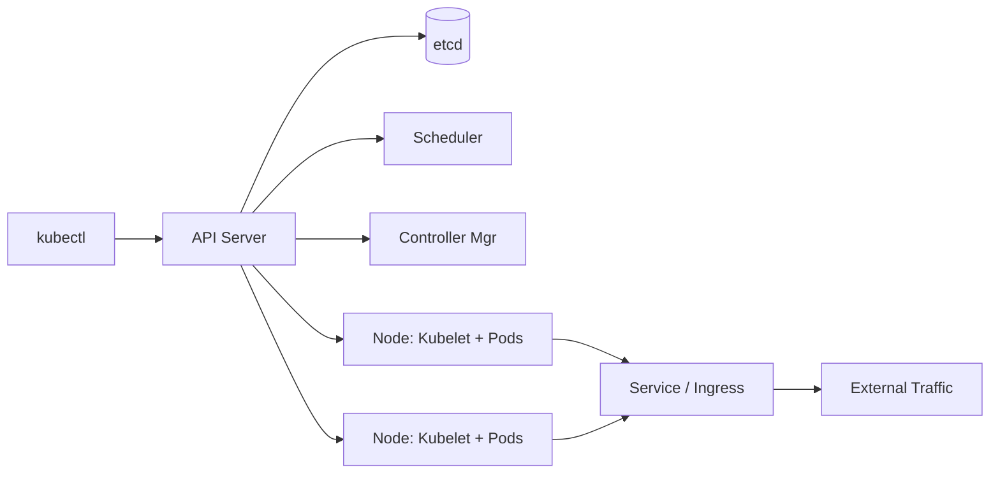

# Kubernetes -- Cheatsheet

## Architecture (30-second mental model)

## When to use vs alternatives
| Need | Use | Not |
|------|-----|-----|
| Multi-service production orchestration | Kubernetes | Docker Compose (no HA/auto-heal) |
| Simple single-container deployment | ECS Fargate / Cloud Run | K8s (operational overhead) |
| On-prem or multi-cloud portability | Kubernetes | Vendor-locked PaaS (Fargate, App Engine) |
| Edge / IoT with minimal footprint | K3s / Nomad | Full K8s (too heavy) |
| Batch job scheduling only | Airflow / Cloud Workflows | K8s (wrong abstraction) |

## 5 things you always forget
1. Pods without resource `requests` get QoS class BestEffort and are the FIRST evicted under memory pressure -- always set requests even if you skip limits.
2. `kubectl apply` stores last-applied config in an annotation; mixing it with `kubectl edit` or `kubectl create` causes three-way merge conflicts on the next apply.
3. Liveness probes that hit the same endpoint as readiness probes cause cascading restarts under load -- use a cheap `/healthz` for liveness and the real dependency check for readiness.
4. K8s Secrets are base64-encoded, NOT encrypted by default; enable etcd encryption-at-rest and use an external secrets operator (e.g., External Secrets, Sealed Secrets) for actual security.
5. HPA and VPA conflict when both target the same Deployment -- HPA adjusts replica count while VPA adjusts resource requests, and they fight each other. Use HPA for stateless apps; VPA for single-replica workloads.

## Interview killer answer
> "We ran 200+ microservices on EKS and the hardest lesson was health probes. We used the same heavy /ready endpoint for both liveness and readiness, which caused a cascading restart storm during a database blip -- K8s kept killing pods that were fine, just slow. The fix: a trivial in-process /healthz for liveness and the real dependency check for readiness. That single change eliminated 90% of false-positive pod restarts during incidents."
