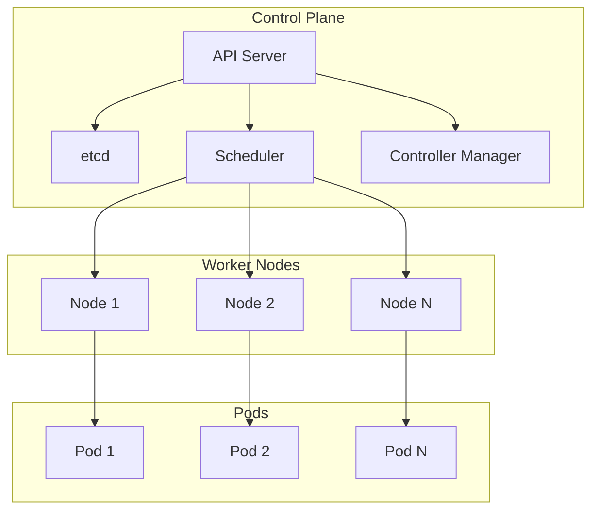

# Kubernetes Guide – Basic → Architect

## Level 1 – Launch & Basics

### 1. **Quick Setup (Minikube)**
```bash
# Install Minikube
curl -LO https://storage.googleapis.com/minikube/releases/latest/minikube-linux-amd64
sudo install minikube-linux-amd64 /usr/local/bin/minikube

# Start cluster
minikube start

# Verify
kubectl get nodes
```

### 2. **First Deployment**
```yaml
# deployment.yaml
apiVersion: apps/v1
kind: Deployment
metadata:
  name: nginx-deployment
spec:
  replicas: 3
  selector:
    matchLabels:
      app: nginx
  template:
    metadata:
      labels:
        app: nginx
    spec:
      containers:
      - name: nginx
        image: nginx:1.21
        ports:
        - containerPort: 80
```

```bash
# Apply deployment
kubectl apply -f deployment.yaml

# Get pods
kubectl get pods

# Expose service
kubectl expose deployment nginx-deployment --type=LoadBalancer --port=80
```

### 3. **Basic Commands**
```bash
# Get resources
kubectl get pods
kubectl get services
kubectl get deployments

# Describe resource
kubectl describe pod <pod-name>

# Logs
kubectl logs <pod-name>

# Execute command
kubectl exec -it <pod-name> -- /bin/bash

# Delete resource
kubectl delete deployment nginx-deployment
```

## Level 2 – Production Patterns

### ConfigMaps & Secrets
```yaml
# configmap.yaml
apiVersion: v1
kind: ConfigMap
metadata:
  name: app-config
data:
  database_url: "postgresql://localhost:5432/mydb"
  log_level: "info"

# secret.yaml
apiVersion: v1
kind: Secret
metadata:
  name: app-secret
type: Opaque
data:
  password: <base64-encoded>
```

```yaml
# Use in deployment
apiVersion: apps/v1
kind: Deployment
spec:
  template:
    spec:
      containers:
      - name: app
        env:
        - name: DB_URL
          valueFrom:
            configMapKeyRef:
              name: app-config
              key: database_url
        - name: PASSWORD
          valueFrom:
            secretKeyRef:
              name: app-secret
              key: password
```

### Persistent Volumes
```yaml
# pvc.yaml
apiVersion: v1
kind: PersistentVolumeClaim
metadata:
  name: data-pvc
spec:
  accessModes:
    - ReadWriteOnce
  resources:
    requests:
      storage: 10Gi
  storageClassName: standard
```

```yaml
# Use in deployment
spec:
  containers:
  - name: app
    volumeMounts:
    - name: data
      mountPath: /data
  volumes:
  - name: data
    persistentVolumeClaim:
      claimName: data-pvc
```

### Health Checks
```yaml
spec:
  containers:
  - name: app
    livenessProbe:
      httpGet:
        path: /health
        port: 8080
      initialDelaySeconds: 30
      periodSeconds: 10
    readinessProbe:
      httpGet:
        path: /ready
        port: 8080
      initialDelaySeconds: 5
      periodSeconds: 5
```

## Level 3 – Architect Playbook

### Horizontal Pod Autoscaler
```yaml
apiVersion: autoscaling/v2
kind: HorizontalPodAutoscaler
metadata:
  name: app-hpa
spec:
  scaleTargetRef:
    apiVersion: apps/v1
    kind: Deployment
    name: app-deployment
  minReplicas: 2
  maxReplicas: 10
  metrics:
  - type: Resource
    resource:
      name: cpu
      target:
        type: Utilization
        averageUtilization: 70
```

### Ingress
```yaml
apiVersion: networking.k8s.io/v1
kind: Ingress
metadata:
  name: app-ingress
  annotations:
    nginx.ingress.kubernetes.io/rewrite-target: /
spec:
  rules:
  - host: app.example.com
    http:
      paths:
      - path: /
        pathType: Prefix
        backend:
          service:
            name: app-service
            port:
              number: 80
```

### StatefulSets
```yaml
apiVersion: apps/v1
kind: StatefulSet
metadata:
  name: database
spec:
  serviceName: database
  replicas: 3
  selector:
    matchLabels:
      app: database
  template:
    metadata:
      labels:
        app: database
    spec:
      containers:
      - name: db
        image: postgres:13
        volumeMounts:
        - name: data
          mountPath: /var/lib/postgresql/data
  volumeClaimTemplates:
  - metadata:
      name: data
    spec:
      accessModes: ["ReadWriteOnce"]
      resources:
        requests:
          storage: 10Gi
```

## Ops Cheat Sheet

| Task | Command | Notes |
| --- | --- | --- |
| Apply manifest | `kubectl apply -f file.yaml` | Create/update resources |
| Get resources | `kubectl get <resource>` | List resources |
| Describe | `kubectl describe <resource> <name>` | Detailed info |
| Logs | `kubectl logs <pod>` | View pod logs |
| Exec | `kubectl exec -it <pod> -- /bin/bash` | Execute command |
| Port forward | `kubectl port-forward <pod> 8080:80` | Forward port |
| Scale | `kubectl scale deployment <name> --replicas=5` | Scale deployment |
| Rollout | `kubectl rollout status deployment/<name>` | Check rollout |

## Architecture Patterns



## Checklist Before Production

- [ ] Set up proper RBAC (Roles, RoleBindings)
- [ ] Configure resource requests and limits
- [ ] Implement health checks (liveness, readiness)
- [ ] Set up monitoring (Prometheus, Grafana)
- [ ] Configure network policies
- [ ] Implement proper secrets management
- [ ] Set up autoscaling (HPA, VPA)
- [ ] Configure persistent storage
- [ ] Implement backup and disaster recovery
- [ ] Set up logging and observability
