# LangChain - Visual Learning Guide

## 🎨 Visual Learning: Chains, Agents, RAG Flows

---

## 📊 Core Concepts

### LangChain Architecture

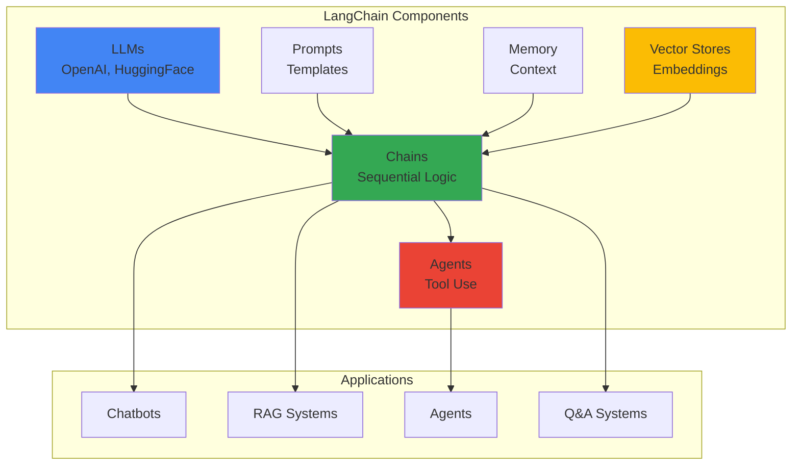

---

## 🔗 Chain Flows

### Simple Chain Flow

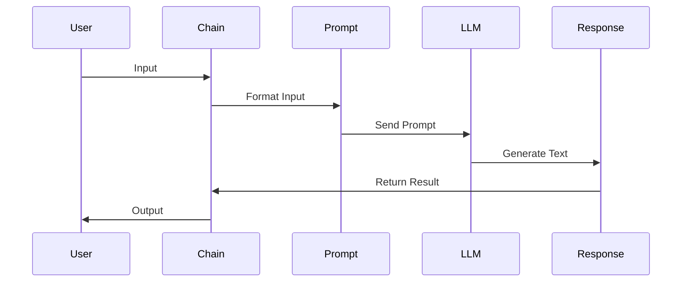

### Sequential Chain Flow

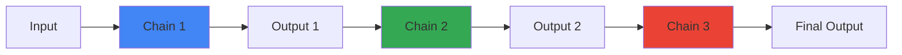

### Chain with Memory

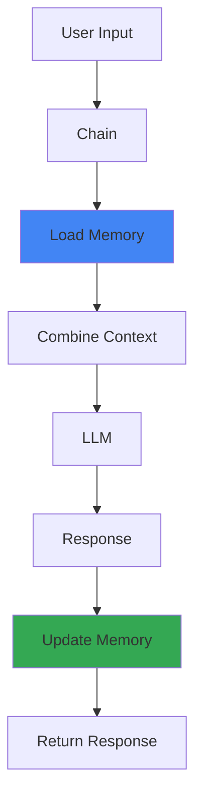

---

## 🔍 RAG (Retrieval-Augmented Generation) Flow

### Complete RAG Pipeline

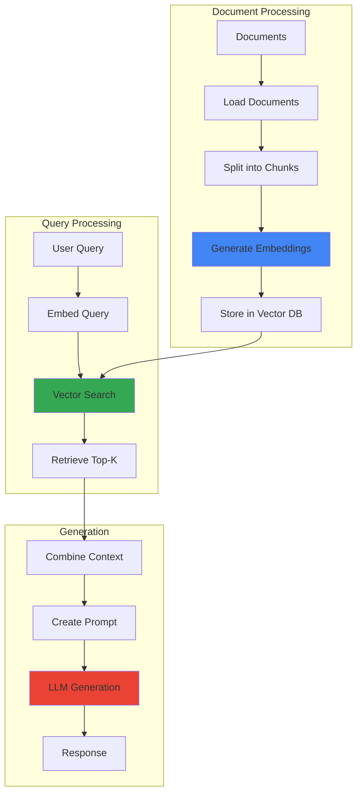

### RAG Detailed Flow

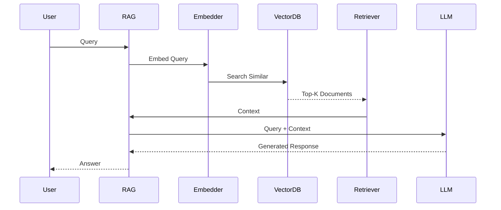

### RAG Architecture (Your Module 05)

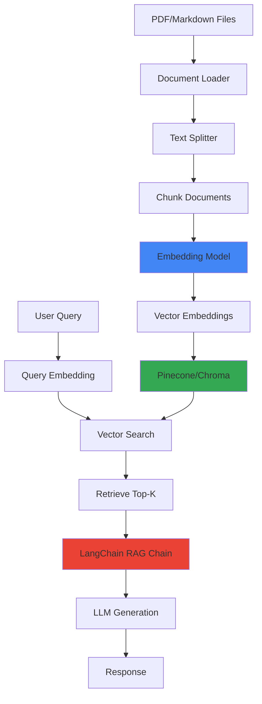

---

## 🤖 Agent Flows

### Agent Decision Flow

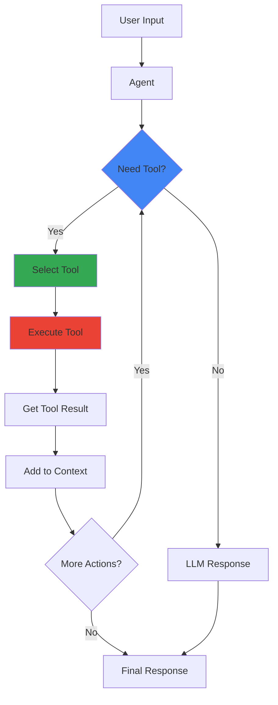

### ReAct Agent Flow

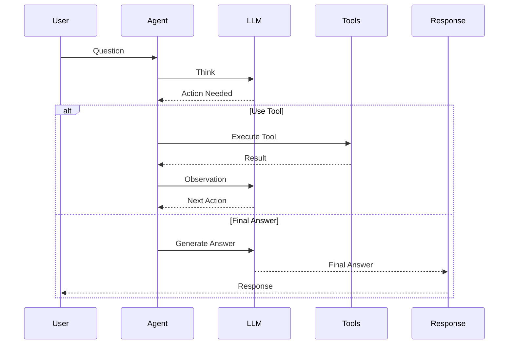

---

## 💬 Chatbot Flow (Module 03)

### Conversation Flow with Memory

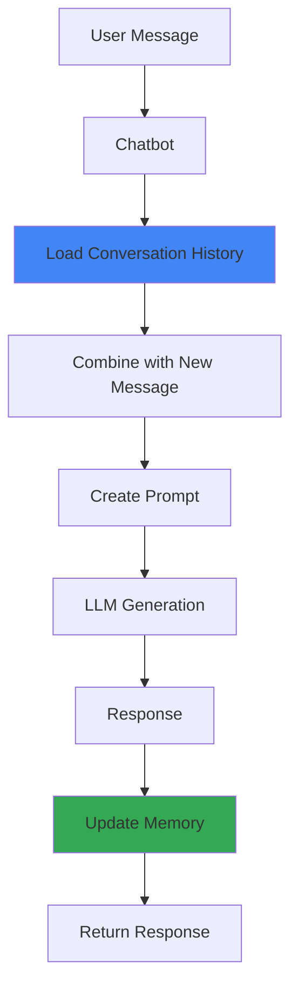

### Memory Types Comparison

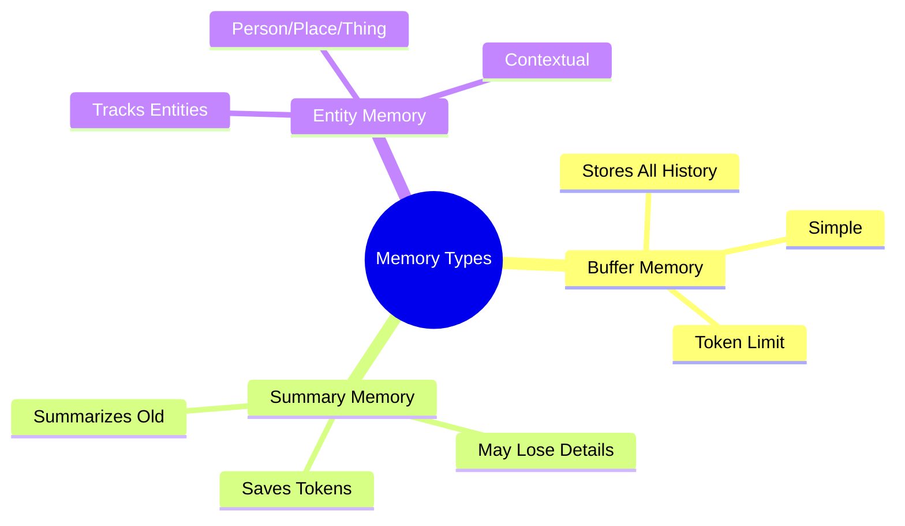

---

## 🔄 Document Processing Flow

### Document Loading and Chunking

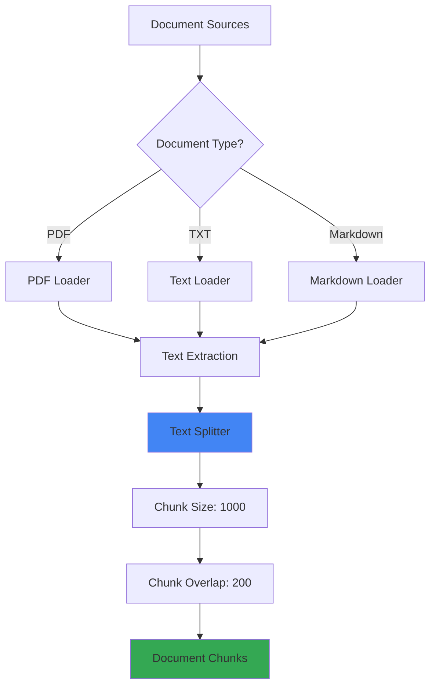

### Embedding and Storage

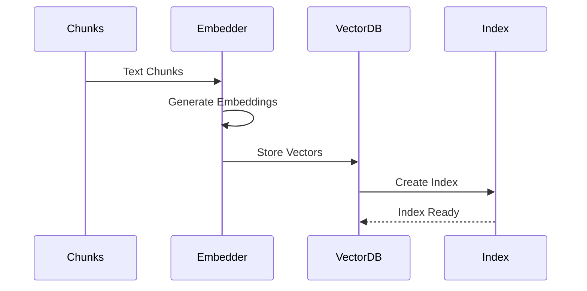

---

## 🎯 Query Processing Flow

### Query to Response Flow

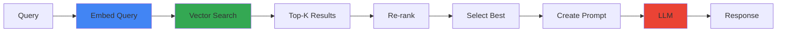

### Multi-Step Query Processing

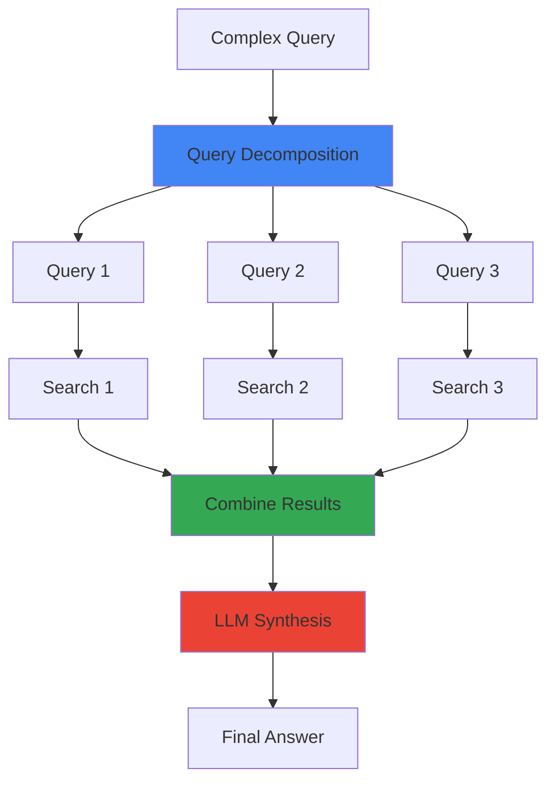

---

## 🛠️ Tool Integration Flow

### Agent with Tools

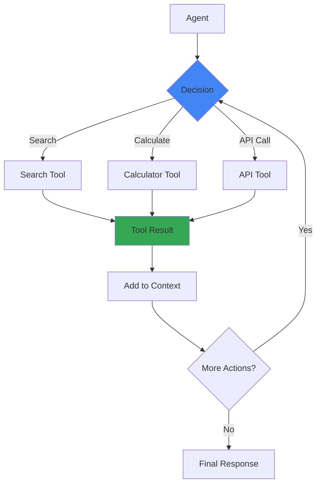

---

## 📊 Performance Optimization

### Caching Strategy

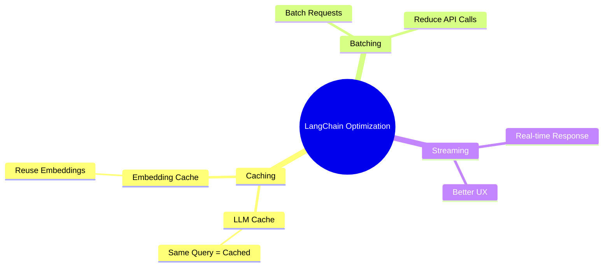

---

## 🎯 Key Visual Takeaways

1. **Chains**: Sequential LLM operations
2. **RAG**: Retrieve → Augment → Generate
3. **Agents**: Think → Act → Observe → Repeat
4. **Memory**: Context management
5. **Tools**: External integration

---

## 📚 Next Steps

1. ✅ Review these diagrams
2. 🏗️ Draw them yourself
3. 💬 Use in interviews
4. 🔗 Connect to your POCs

---

**Visual learning helps!** Use these to explain LangChain in interviews.

