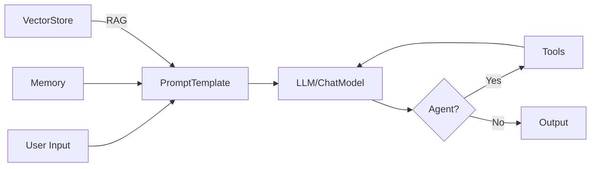

# LangChain -- Cheatsheet

## Architecture (30-second mental model)

## When to use vs alternatives
| Need | Use | Not |
|------|-----|-----|
| Orchestrate LLM chains with memory and tools | LangChain | Raw API calls |
| Stateful multi-agent with checkpointing | LangGraph | LangChain AgentExecutor |
| Simple single LLM call, no chaining | Direct OpenAI/Anthropic SDK | LangChain |
| Quick multi-agent role-play prototype | CrewAI | LangChain agents |
| Production RAG with retrieval pipeline | LangChain + VectorStore | Manual embedding + search |

## 5 things you always forget
1. `ConversationBufferMemory` stores everything and will blow past token limits -- switch to `ConversationSummaryMemory` for long chats
2. Chunk overlap matters: 100-200 token overlap between chunks prevents losing context at boundaries in RAG
3. `get_openai_callback()` context manager is the only reliable way to track token usage and cost across chains
4. `RetrievalQA` chain types: "stuff" concatenates all docs (small sets), "map_reduce" processes each separately (large sets) -- wrong choice = bad results or timeouts
5. Agent tool `description` field is what the LLM reads to decide when to use it -- vague descriptions cause wrong tool selection

## Interview killer answer
> "We built a RAG pipeline with LangChain where the key insight was that chunk size and overlap tuning mattered more than the embedding model choice. We went from 70% to 92% retrieval accuracy by switching from fixed 1000-token chunks to semantic chunking with 200-token overlap, and adding a cross-encoder reranker after the initial cosine similarity retrieval from Pinecone."
