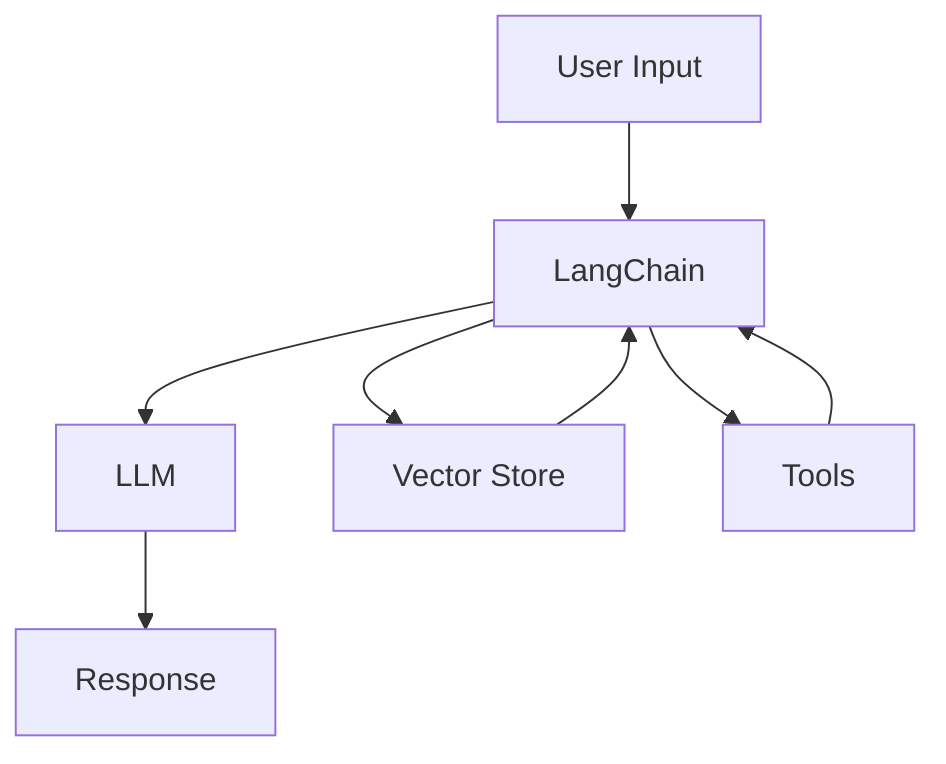

# LangChain Guide – Basic → Architect

## Level 1 – Launch & Basics

### 1. **Quick Setup**
```bash
pip install langchain openai

# Set API key
export OPENAI_API_KEY="your-key"
```

### 2. **Basic LLM Usage**
```python
from langchain.llms import OpenAI

llm = OpenAI(temperature=0.7)
response = llm("Explain quantum computing in simple terms")
print(response)
```

### 3. **Prompt Templates**
```python
from langchain.prompts import PromptTemplate

template = "What is a good name for a {company_type} company?"
prompt = PromptTemplate(
    input_variables=["company_type"],
    template=template
)

prompt.format(company_type="AI")
```

### 4. **Chains**
```python
from langchain.chains import LLMChain

chain = LLMChain(llm=llm, prompt=prompt)
result = chain.run("AI")
```

## Level 2 – Production Patterns

### Memory
```python
from langchain.memory import ConversationBufferMemory

memory = ConversationBufferMemory()
chain = LLMChain(llm=llm, prompt=prompt, memory=memory)

chain.run("Hello")
chain.run("What did I just say?")
```

### Agents
```python
from langchain.agents import initialize_agent, Tool
from langchain.agents import AgentType

tools = [
    Tool(
        name="Search",
        func=search_function,
        description="Search for information"
    )
]

agent = initialize_agent(
    tools,
    llm,
    agent=AgentType.ZERO_SHOT_REACT_DESCRIPTION,
    verbose=True
)

agent.run("What is the weather in San Francisco?")
```

### RAG (Retrieval-Augmented Generation)
```python
from langchain.document_loaders import TextLoader
from langchain.text_splitter import CharacterTextSplitter
from langchain.embeddings import OpenAIEmbeddings
from langchain.vectorstores import Chroma
from langchain.chains import RetrievalQA

loader = TextLoader("document.txt")
documents = loader.load()

text_splitter = CharacterTextSplitter(chunk_size=1000, chunk_overlap=0)
texts = text_splitter.split_documents(documents)

embeddings = OpenAIEmbeddings()
vectorstore = Chroma.from_documents(texts, embeddings)

qa = RetrievalQA.from_chain_type(
    llm=llm,
    chain_type="stuff",
    retriever=vectorstore.as_retriever()
)

qa.run("What is the document about?")
```

## Level 3 – Architect Playbook

### Custom Tools
```python
from langchain.tools import BaseTool
from typing import Optional

class CustomTool(BaseTool):
    name = "custom_tool"
    description = "Description of what the tool does"
    
    def _run(self, query: str) -> str:
        # Tool implementation
        return "Result"
    
    async def _arun(self, query: str) -> str:
        # Async implementation
        return "Result"
```

### Advanced RAG
```python
from langchain.retrievers import ContextualCompressionRetriever
from langchain.retrievers.document_compressors import LLMChainExtractor

compressor = LLMChainExtractor.from_llm(llm)
compression_retriever = ContextualCompressionRetriever(
    base_compressor=compressor,
    base_retriever=vectorstore.as_retriever()
)

qa = RetrievalQA.from_chain_type(
    llm=llm,
    retriever=compression_retriever
)
```

### Production Deployment
```python
from fastapi import FastAPI
from langchain.chains import LLMChain

app = FastAPI()

@app.post("/chat")
def chat(message: str):
    result = chain.run(message)
    return {"response": result}
```

## Ops Cheat Sheet

| Task | Command | Notes |
| --- | --- | --- |
| Install | `pip install langchain` | Core library |
| Set API key | `export OPENAI_API_KEY=key` | Environment variable |
| Test chain | `chain.run("input")` | Run chain |
| Save chain | `chain.save("chain.json")` | Persist chain |
| Load chain | `chain.load("chain.json")` | Load chain |

## Architecture Patterns



## Checklist Before Production

- [ ] Set up proper API key management
- [ ] Implement error handling
- [ ] Use appropriate temperature settings
- [ ] Implement rate limiting
- [ ] Set up monitoring and logging
- [ ] Optimize prompt templates
- [ ] Implement caching for responses
- [ ] Set up proper vector store
- [ ] Test agent tools thoroughly
- [ ] Implement cost tracking
