# LangGraph - Visual Learning Guide

## 🎨 Visual Learning: Graph Workflows, State Management, Multi-Agent Coordination

---

## 📊 LangGraph Architecture

### High-Level Architecture

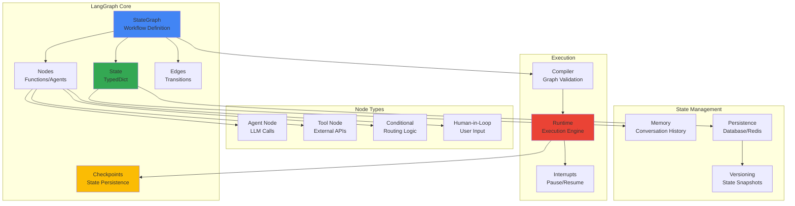
```mermaid
graph TB
    subgraph "LangGraph Core"
        STATEGRAPH[StateGraph<br/>Workflow Definition]
        STATE[State<br/>TypedDict]
        NODES[Nodes<br/>Functions/Agents]
        EDGES[Edges<br/>Transitions]
        CHECKPOINTS[Checkpoints<br/>State Persistence]
    end
    
    subgraph "Node Types"
        AGENT_NODE[Agent Node<br/>LLM Calls]
        TOOL_NODE[Tool Node<br/>External APIs]
        CONDITIONAL[Conditional<br/>Routing Logic]
        HUMAN[Human-in-Loop<br/>User Input]
    end
    
    subgraph "State Management"
        MEMORY[Memory<br/>Conversation History]
        PERSISTENCE[Persistence<br/>Database/Redis]
        VERSIONING[Versioning<br/>State Snapshots]
    end
    
    subgraph "Execution"
        COMPILER[Compiler<br/>Graph Validation]
        RUNTIME[Runtime<br/>Execution Engine]
        INTERRUPT[Interrupts<br/>Pause/Resume]
    end
    
    STATEGRAPH --> STATE
    STATEGRAPH --> NODES
    STATEGRAPH --> EDGES
    NODES --> AGENT_NODE
    NODES --> TOOL_NODE
    NODES --> CONDITIONAL
    NODES --> HUMAN
    
    STATE --> MEMORY
    STATE --> PERSISTENCE
    PERSISTENCE --> VERSIONING
    
    STATEGRAPH --> COMPILER
    COMPILER --> RUNTIME
    RUNTIME --> INTERRUPT
    RUNTIME --> CHECKPOINTS
    
    style STATEGRAPH fill:#4285f4
    style STATE fill:#34a853
    style RUNTIME fill:#ea4335
    style CHECKPOINTS fill:#fbbc04
```

### Graph Structure Components

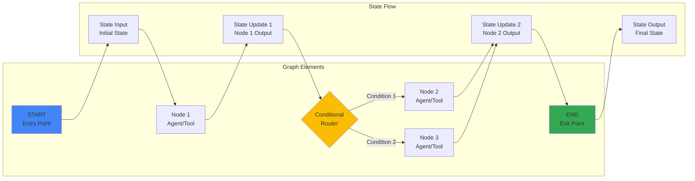
```mermaid
graph LR
    subgraph "Graph Elements"
        START[START<br/>Entry Point]
        NODE1[Node 1<br/>Agent/Tool]
        NODE2[Node 2<br/>Agent/Tool]
        CONDITION{Conditional<br/>Router}
        NODE3[Node 3<br/>Agent/Tool]
        END[END<br/>Exit Point]
    end
    
    subgraph "State Flow"
        STATE_IN[State Input<br/>Initial State]
        STATE_UPDATE1[State Update 1<br/>Node 1 Output]
        STATE_UPDATE2[State Update 2<br/>Node 2 Output]
        STATE_OUT[State Output<br/>Final State]
    end
    
    START --> STATE_IN
    STATE_IN --> NODE1
    NODE1 --> STATE_UPDATE1
    STATE_UPDATE1 --> CONDITION
    CONDITION -->|Condition 1| NODE2
    CONDITION -->|Condition 2| NODE3
    NODE2 --> STATE_UPDATE2
    NODE3 --> STATE_UPDATE2
    STATE_UPDATE2 --> END
    END --> STATE_OUT
    
    style START fill:#4285f4
    style CONDITION fill:#fbbc04
    style END fill:#34a853
```

---

## 🔄 State Management

### State Structure

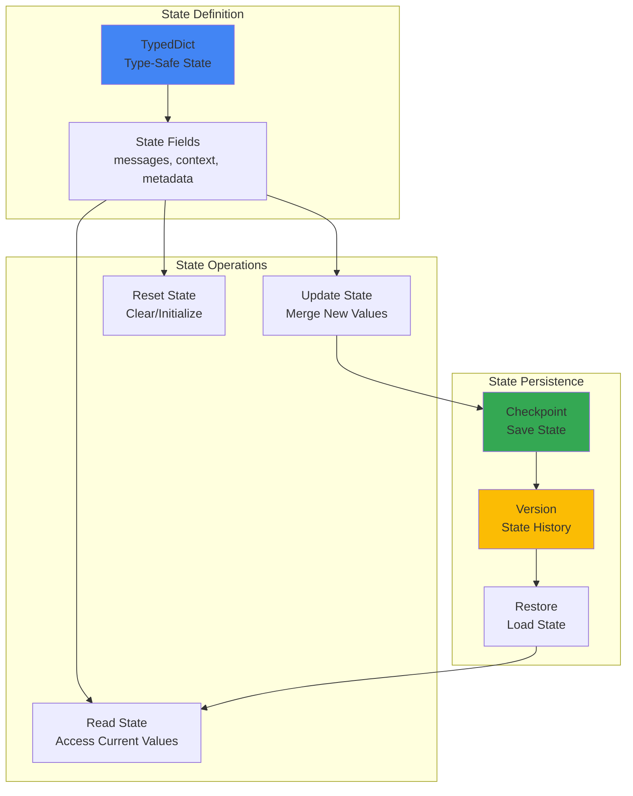
```mermaid
graph TB
    subgraph "State Definition"
        TYPEDDICT[TypedDict<br/>Type-Safe State]
        FIELDS[State Fields<br/>messages, context, metadata]
    end
    
    subgraph "State Operations"
        READ[Read State<br/>Access Current Values]
        UPDATE[Update State<br/>Merge New Values]
        RESET[Reset State<br/>Clear/Initialize]
    end
    
    subgraph "State Persistence"
        CHECKPOINT[Checkpoint<br/>Save State]
        RESTORE[Restore<br/>Load State]
        VERSION[Version<br/>State History]
    end
    
    TYPEDDICT --> FIELDS
    FIELDS --> READ
    FIELDS --> UPDATE
    FIELDS --> RESET
    
    UPDATE --> CHECKPOINT
    CHECKPOINT --> VERSION
    VERSION --> RESTORE
    RESTORE --> READ
    
    style TYPEDDICT fill:#4285f4
    style CHECKPOINT fill:#34a853
    style VERSION fill:#fbbc04
```

### State Flow Through Graph

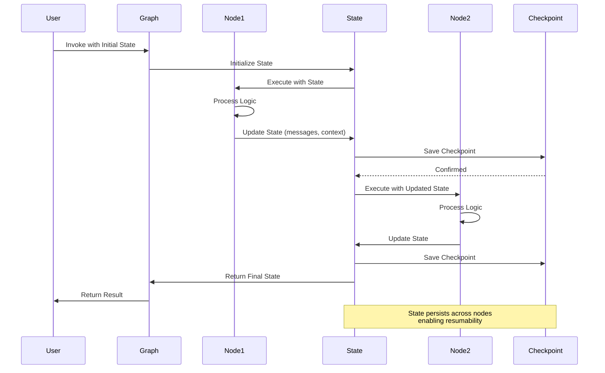
```mermaid
sequenceDiagram
    participant User
    participant Graph
    participant Node1
    participant State
    participant Node2
    participant Checkpoint
    
    User->>Graph: Invoke with Initial State
    Graph->>State: Initialize State
    State->>Node1: Execute with State
    Node1->>Node1: Process Logic
    Node1->>State: Update State (messages, context)
    State->>Checkpoint: Save Checkpoint
    Checkpoint-->>State: Confirmed
    State->>Node2: Execute with Updated State
    Node2->>Node2: Process Logic
    Node2->>State: Update State
    State->>Checkpoint: Save Checkpoint
    State->>Graph: Return Final State
    Graph->>User: Return Result
    
    Note over State,Checkpoint: State persists across nodes<br/>enabling resumability
```

### State Reducer Pattern

```mermaid
graph TB
    subgraph "State Reducers"
        REDUCER1[Reducer 1<br/>messages: append]
        REDUCER2[Reducer 2<br/>context: merge]
        REDUCER3[Reducer 3<br/>metadata: update]
    end
    
    subgraph "State Updates"
        UPDATE1[Node 1 Output<br/>new_message]
        UPDATE2[Node 2 Output<br/>context_data]
        UPDATE3[Node 3 Output<br/>metadata_info]
    end
    
    subgraph "Final State"
        CURRENT_STATE[Current State<br/>messages: [...],<br/>context: {...},<br/>metadata: {...}]
    end
    
    UPDATE1 --> REDUCER1
    UPDATE2 --> REDUCER2
    UPDATE3 --> REDUCER3
    
    REDUCER1 --> CURRENT_STATE
    REDUCER2 --> CURRENT_STATE
    REDUCER3 --> CURRENT_STATE
    
    style REDUCER1 fill:#4285f4
    style REDUCER2 fill:#34a853
    style REDUCER3 fill:#ea4335
```

---

## 🔀 Node Types and Execution

### Simple Linear Graph

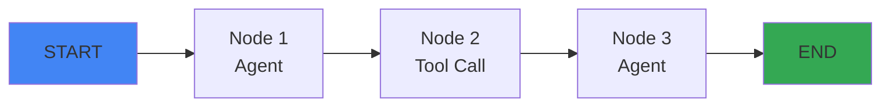
```mermaid
graph LR
    START[START] --> NODE1[Node 1<br/>Agent]
    NODE1 --> NODE2[Node 2<br/>Tool Call]
    NODE2 --> NODE3[Node 3<br/>Agent]
    NODE3 --> END[END]
    
    style START fill:#4285f4
    style END fill:#34a853
```

### Conditional Routing

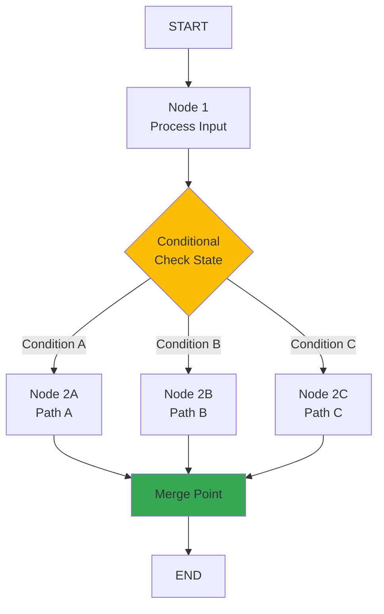
```mermaid
graph TB
    START[START] --> NODE1[Node 1<br/>Process Input]
    NODE1 --> CONDITION{Conditional<br/>Check State}
    
    CONDITION -->|Condition A| NODE2A[Node 2A<br/>Path A]
    CONDITION -->|Condition B| NODE2B[Node 2B<br/>Path B]
    CONDITION -->|Condition C| NODE2C[Node 2C<br/>Path C]
    
    NODE2A --> MERGE[Merge Point]
    NODE2B --> MERGE
    NODE2C --> MERGE
    MERGE --> END[END]
    
    style CONDITION fill:#fbbc04
    style MERGE fill:#34a853
```

### Graph with Cycles

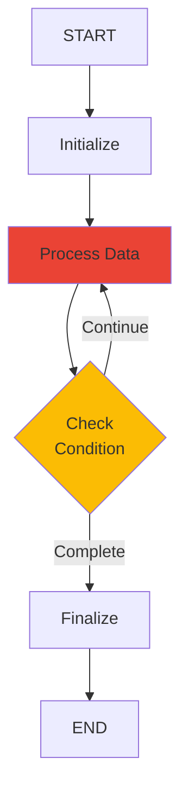
```mermaid
graph TB
    START[START] --> INIT[Initialize]
    INIT --> PROCESS[Process Data]
    PROCESS --> CHECK{Check<br/>Condition}
    
    CHECK -->|Continue| PROCESS
    CHECK -->|Complete| FINALIZE[Finalize]
    FINALIZE --> END[END]
    
    style CHECK fill:#fbbc04
    style PROCESS fill:#ea4335
```

### Parallel Execution

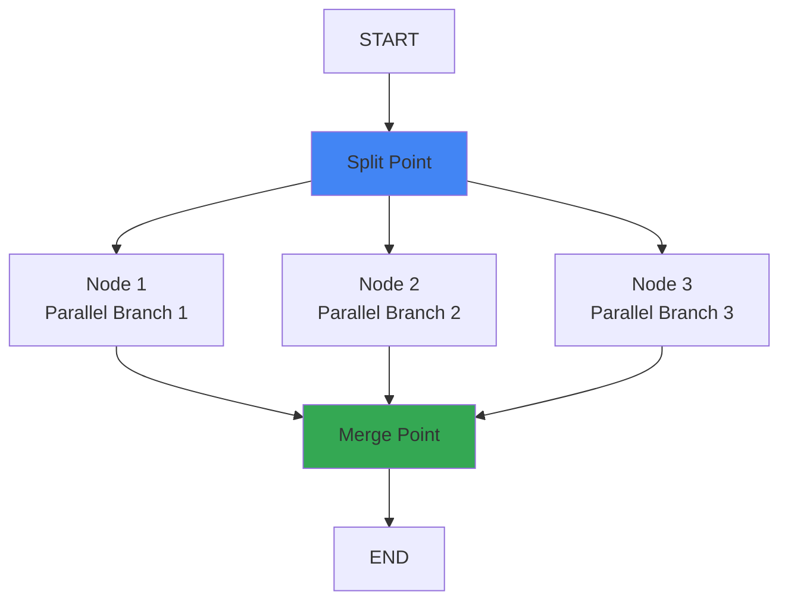
```mermaid
graph TB
    START[START] --> SPLIT[Split Point]
    
    SPLIT --> NODE1[Node 1<br/>Parallel Branch 1]
    SPLIT --> NODE2[Node 2<br/>Parallel Branch 2]
    SPLIT --> NODE3[Node 3<br/>Parallel Branch 3]
    
    NODE1 --> MERGE[Merge Point]
    NODE2 --> MERGE
    NODE3 --> MERGE
    
    MERGE --> END[END]
    
    style SPLIT fill:#4285f4
    style MERGE fill:#34a853
```

---

## 👥 Multi-Agent Coordination

### Multi-Agent Architecture

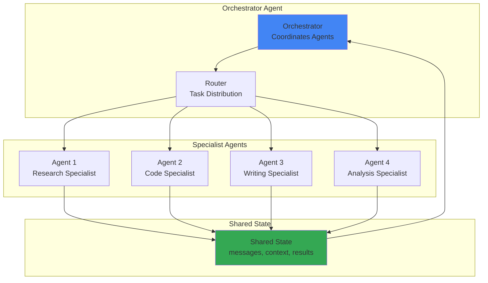
```mermaid
graph TB
    subgraph "Orchestrator Agent"
        ORCHESTRATOR[Orchestrator<br/>Coordinates Agents]
        ROUTER[Router<br/>Task Distribution]
    end
    
    subgraph "Specialist Agents"
        AGENT1[Agent 1<br/>Research Specialist]
        AGENT2[Agent 2<br/>Code Specialist]
        AGENT3[Agent 3<br/>Writing Specialist]
        AGENT4[Agent 4<br/>Analysis Specialist]
    end
    
    subgraph "Shared State"
        SHARED_STATE[Shared State<br/>messages, context, results]
    end
    
    ORCHESTRATOR --> ROUTER
    ROUTER --> AGENT1
    ROUTER --> AGENT2
    ROUTER --> AGENT3
    ROUTER --> AGENT4
    
    AGENT1 --> SHARED_STATE
    AGENT2 --> SHARED_STATE
    AGENT3 --> SHARED_STATE
    AGENT4 --> SHARED_STATE
    
    SHARED_STATE --> ORCHESTRATOR
    
    style ORCHESTRATOR fill:#4285f4
    style SHARED_STATE fill:#34a853
```

### Agent Communication Flow

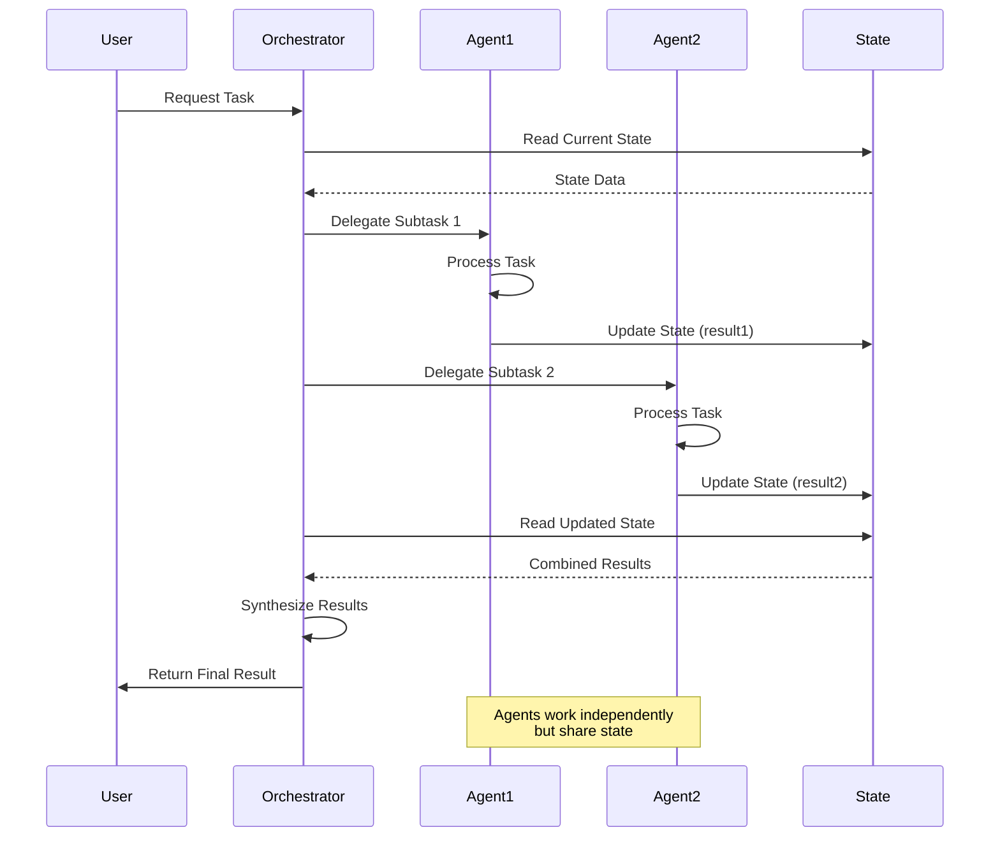
```mermaid
sequenceDiagram
    participant User
    participant Orchestrator
    participant Agent1
    participant Agent2
    participant State
    
    User->>Orchestrator: Request Task
    Orchestrator->>State: Read Current State
    State-->>Orchestrator: State Data
    
    Orchestrator->>Agent1: Delegate Subtask 1
    Agent1->>Agent1: Process Task
    Agent1->>State: Update State (result1)
    
    Orchestrator->>Agent2: Delegate Subtask 2
    Agent2->>Agent2: Process Task
    Agent2->>State: Update State (result2)
    
    Orchestrator->>State: Read Updated State
    State-->>Orchestrator: Combined Results
    
    Orchestrator->>Orchestrator: Synthesize Results
    Orchestrator->>User: Return Final Result
    
    Note over Agent1,Agent2: Agents work independently<br/>but share state
```

### Hierarchical Agent Structure

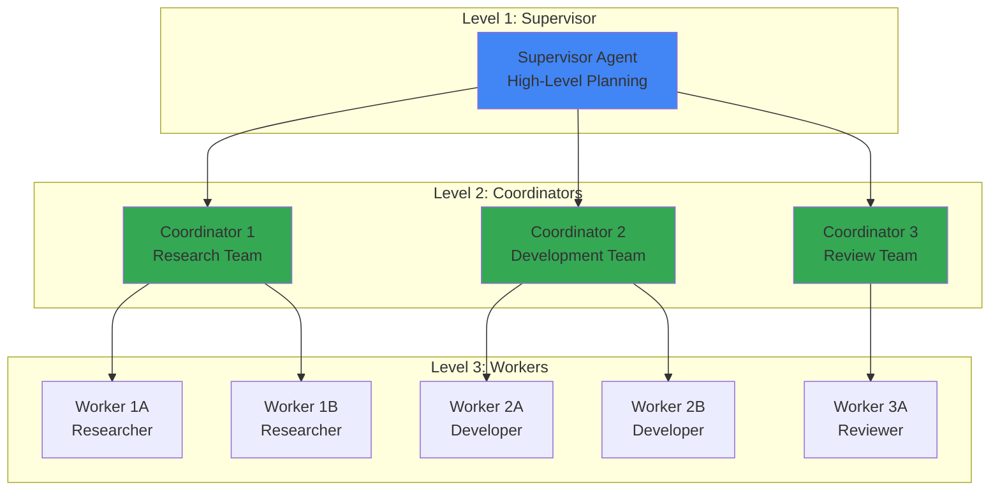
```mermaid
graph TB
    subgraph "Level 1: Supervisor"
        SUPERVISOR[Supervisor Agent<br/>High-Level Planning]
    end
    
    subgraph "Level 2: Coordinators"
        COORD1[Coordinator 1<br/>Research Team]
        COORD2[Coordinator 2<br/>Development Team]
        COORD3[Coordinator 3<br/>Review Team]
    end
    
    subgraph "Level 3: Workers"
        WORKER1A[Worker 1A<br/>Researcher]
        WORKER1B[Worker 1B<br/>Researcher]
        WORKER2A[Worker 2A<br/>Developer]
        WORKER2B[Worker 2B<br/>Developer]
        WORKER3A[Worker 3A<br/>Reviewer]
    end
    
    SUPERVISOR --> COORD1
    SUPERVISOR --> COORD2
    SUPERVISOR --> COORD3
    
    COORD1 --> WORKER1A
    COORD1 --> WORKER1B
    COORD2 --> WORKER2A
    COORD2 --> WORKER2B
    COORD3 --> WORKER3A
    
    style SUPERVISOR fill:#4285f4
    style COORD1 fill:#34a853
    style COORD2 fill:#34a853
    style COORD3 fill:#34a853
```

---

## 🔄 Checkpointing and Persistence

### Checkpoint System

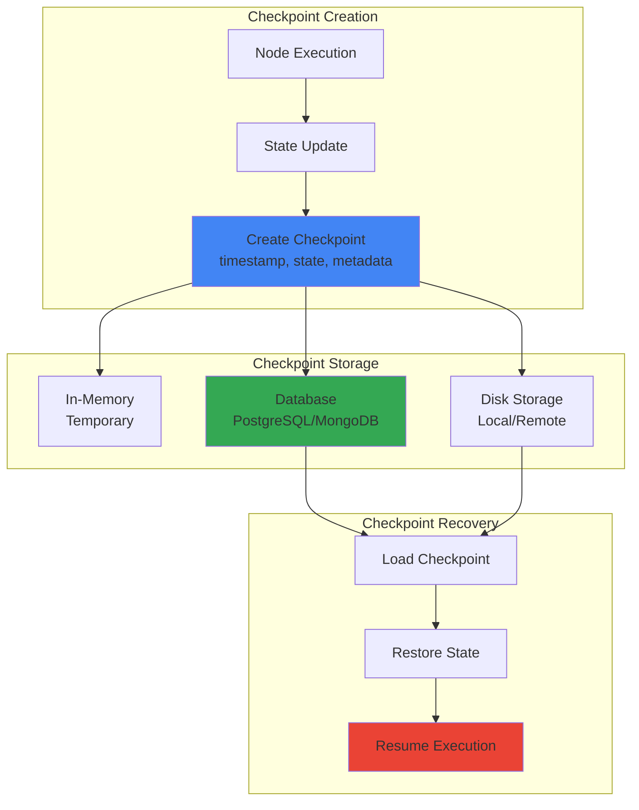
```mermaid
graph TB
    subgraph "Checkpoint Creation"
        NODE_EXEC[Node Execution]
        STATE_UPDATE[State Update]
        CHECKPOINT_CREATE[Create Checkpoint<br/>timestamp, state, metadata]
    end
    
    subgraph "Checkpoint Storage"
        MEMORY_STORE[In-Memory<br/>Temporary]
        DISK_STORE[Disk Storage<br/>Local/Remote]
        DB_STORE[Database<br/>PostgreSQL/MongoDB]
    end
    
    subgraph "Checkpoint Recovery"
        LOAD_CHECKPOINT[Load Checkpoint]
        RESTORE_STATE[Restore State]
        RESUME_EXEC[Resume Execution]
    end
    
    NODE_EXEC --> STATE_UPDATE
    STATE_UPDATE --> CHECKPOINT_CREATE
    CHECKPOINT_CREATE --> MEMORY_STORE
    CHECKPOINT_CREATE --> DISK_STORE
    CHECKPOINT_CREATE --> DB_STORE
    
    DB_STORE --> LOAD_CHECKPOINT
    DISK_STORE --> LOAD_CHECKPOINT
    LOAD_CHECKPOINT --> RESTORE_STATE
    RESTORE_STATE --> RESUME_EXEC
    
    style CHECKPOINT_CREATE fill:#4285f4
    style DB_STORE fill:#34a853
    style RESUME_EXEC fill:#ea4335
```

### Checkpoint Lifecycle

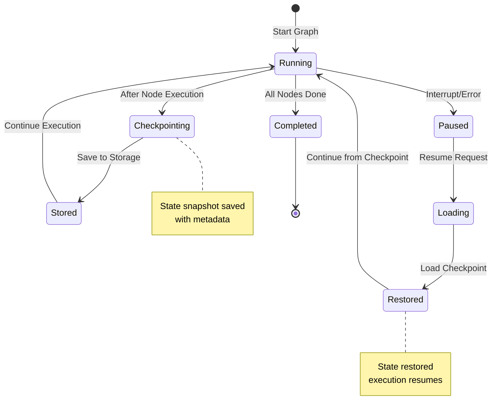
```mermaid
stateDiagram-v2
    [*] --> Running: Start Graph
    Running --> Checkpointing: After Node Execution
    Checkpointing --> Stored: Save to Storage
    Stored --> Running: Continue Execution
    Running --> Paused: Interrupt/Error
    Paused --> Loading: Resume Request
    Loading --> Restored: Load Checkpoint
    Restored --> Running: Continue from Checkpoint
    Running --> Completed: All Nodes Done
    Completed --> [*]
    
    note right of Checkpointing
        State snapshot saved
        with metadata
    end note
    
    note right of Restored
        State restored
        execution resumes
    end note
```

---

## 🛑 Interrupts and Human-in-the-Loop

### Interrupt Pattern

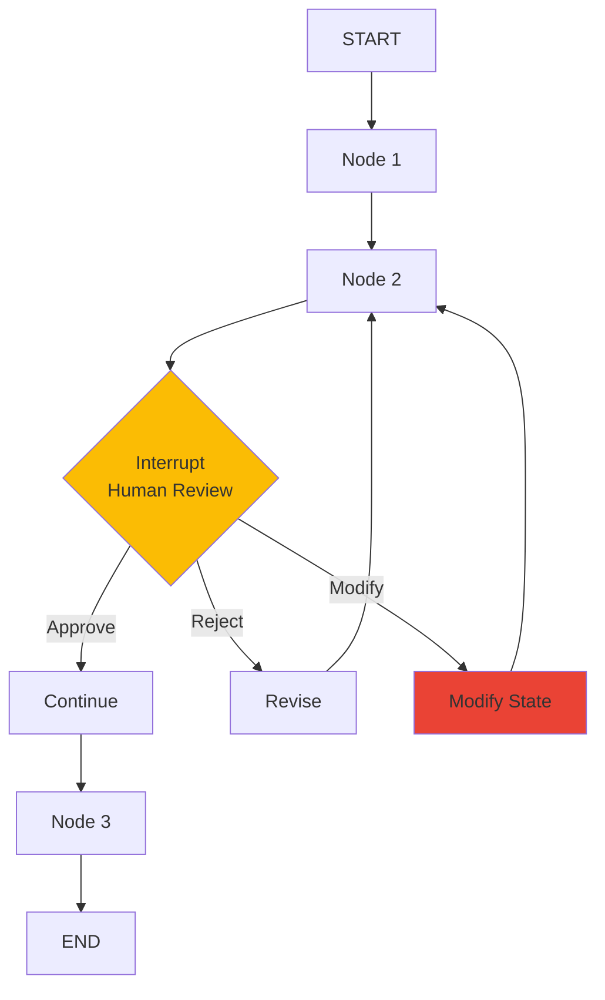
```mermaid
graph TB
    START[START] --> NODE1[Node 1]
    NODE1 --> NODE2[Node 2]
    NODE2 --> INTERRUPT{Interrupt<br/>Human Review}
    
    INTERRUPT -->|Approve| CONTINUE[Continue]
    INTERRUPT -->|Reject| REVISE[Revise]
    INTERRUPT -->|Modify| MODIFY[Modify State]
    
    CONTINUE --> NODE3[Node 3]
    REVISE --> NODE2
    MODIFY --> NODE2
    
    NODE3 --> END[END]
    
    style INTERRUPT fill:#fbbc04
    style MODIFY fill:#ea4335
```

### Human-in-the-Loop Flow

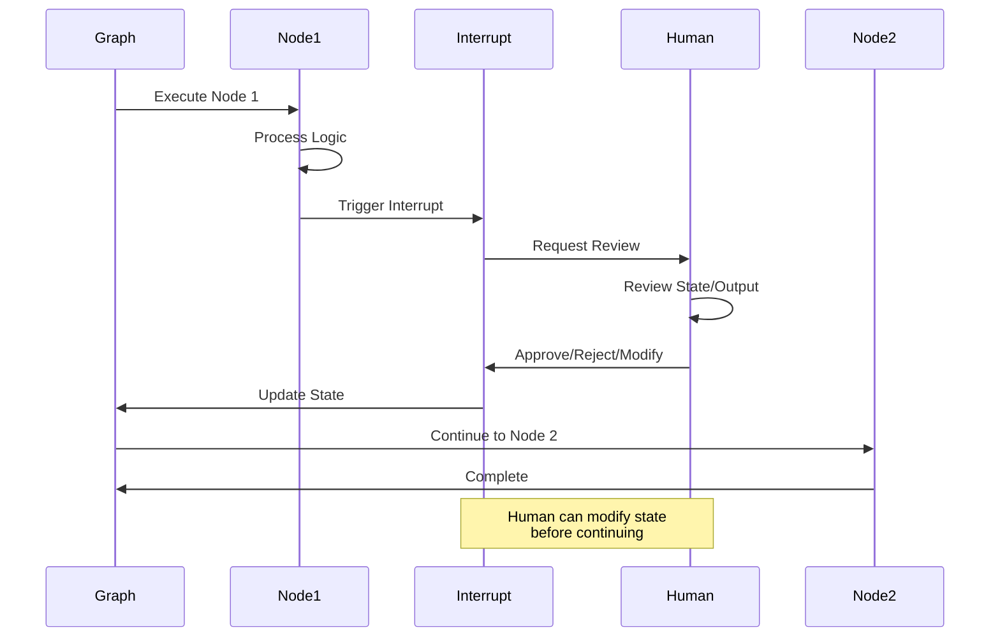
```mermaid
sequenceDiagram
    participant Graph
    participant Node1
    participant Interrupt
    participant Human
    participant Node2
    
    Graph->>Node1: Execute Node 1
    Node1->>Node1: Process Logic
    Node1->>Interrupt: Trigger Interrupt
    Interrupt->>Human: Request Review
    Human->>Human: Review State/Output
    Human->>Interrupt: Approve/Reject/Modify
    Interrupt->>Graph: Update State
    Graph->>Node2: Continue to Node 2
    Node2->>Graph: Complete
    
    Note over Interrupt,Human: Human can modify state<br/>before continuing
```

### Approval Workflow

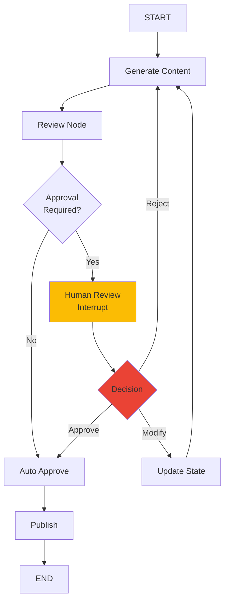
```mermaid
graph TB
    START[START] --> GENERATE[Generate Content]
    GENERATE --> REVIEW[Review Node]
    REVIEW --> APPROVAL{Approval<br/>Required?}
    
    APPROVAL -->|Yes| HUMAN_REVIEW[Human Review<br/>Interrupt]
    APPROVAL -->|No| AUTO_APPROVE[Auto Approve]
    
    HUMAN_REVIEW --> DECISION{Decision}
    DECISION -->|Approve| AUTO_APPROVE
    DECISION -->|Reject| GENERATE
    DECISION -->|Modify| UPDATE[Update State]
    UPDATE --> GENERATE
    
    AUTO_APPROVE --> PUBLISH[Publish]
    PUBLISH --> END[END]
    
    style HUMAN_REVIEW fill:#fbbc04
    style DECISION fill:#ea4335
```

---

## 🔧 Error Handling and Recovery

### Error Handling Flow

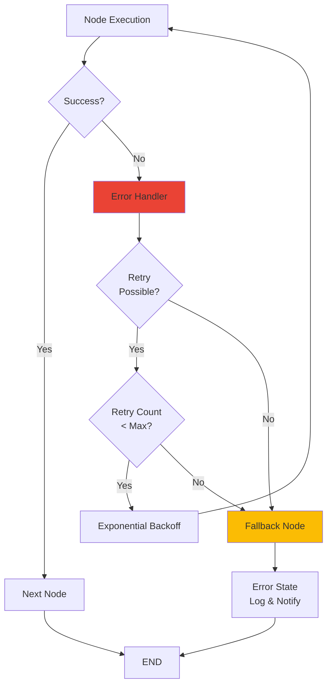
```mermaid
graph TB
    NODE_EXEC[Node Execution] --> SUCCESS{Success?}
    
    SUCCESS -->|Yes| NEXT_NODE[Next Node]
    SUCCESS -->|No| ERROR_HANDLER[Error Handler]
    
    ERROR_HANDLER --> RETRY{Retry<br/>Possible?}
    RETRY -->|Yes| RETRY_COUNT{Retry Count<br/>< Max?}
    RETRY_COUNT -->|Yes| BACKOFF[Exponential Backoff]
    BACKOFF --> NODE_EXEC
    RETRY_COUNT -->|No| FALLBACK[Fallback Node]
    
    RETRY -->|No| FALLBACK
    
    FALLBACK --> ERROR_STATE[Error State<br/>Log & Notify]
    ERROR_STATE --> END[END]
    
    NEXT_NODE --> END
    
    style ERROR_HANDLER fill:#ea4335
    style FALLBACK fill:#fbbc04
```

### Error Recovery with Checkpoints

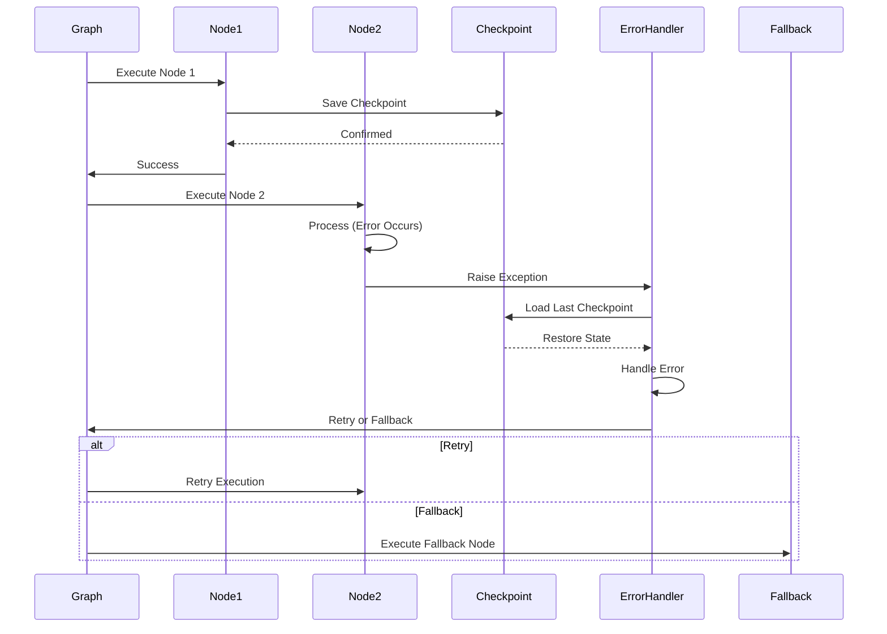
```mermaid
sequenceDiagram
    participant Graph
    participant Node1
    participant Node2
    participant Checkpoint
    participant ErrorHandler
    
    Graph->>Node1: Execute Node 1
    Node1->>Checkpoint: Save Checkpoint
    Checkpoint-->>Node1: Confirmed
    Node1->>Graph: Success
    
    Graph->>Node2: Execute Node 2
    Node2->>Node2: Process (Error Occurs)
    Node2->>ErrorHandler: Raise Exception
    
    ErrorHandler->>Checkpoint: Load Last Checkpoint
    Checkpoint-->>ErrorHandler: Restore State
    
    ErrorHandler->>ErrorHandler: Handle Error
    ErrorHandler->>Graph: Retry or Fallback
    
    alt Retry
        Graph->>Node2: Retry Execution
    else Fallback
        Graph->>Fallback: Execute Fallback Node
    end
```

---

## 🔀 Advanced Patterns

### Dynamic Graph Construction

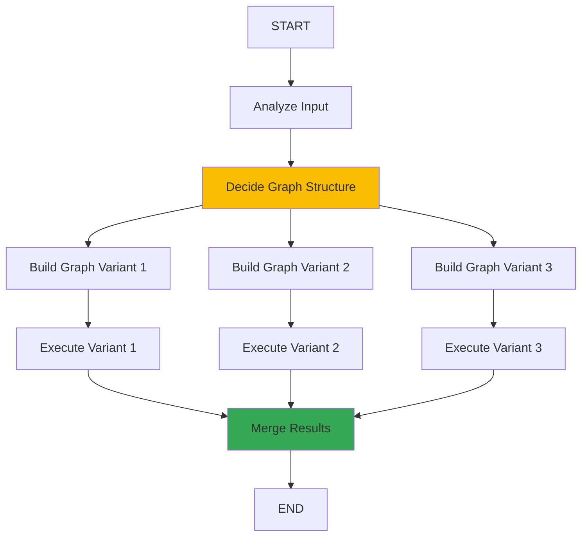
```mermaid
graph TB
    START[START] --> ANALYZE[Analyze Input]
    ANALYZE --> DECIDE[Decide Graph Structure]
    
    DECIDE --> BUILD1[Build Graph Variant 1]
    DECIDE --> BUILD2[Build Graph Variant 2]
    DECIDE --> BUILD3[Build Graph Variant 3]
    
    BUILD1 --> EXEC1[Execute Variant 1]
    BUILD2 --> EXEC2[Execute Variant 2]
    BUILD3 --> EXEC3[Execute Variant 3]
    
    EXEC1 --> MERGE[Merge Results]
    EXEC2 --> MERGE
    EXEC3 --> MERGE
    
    MERGE --> END[END]
    
    style DECIDE fill:#fbbc04
    style MERGE fill:#34a853
```

### Streaming Graph Execution

```mermaid
graph LR
    STREAM[Input Stream] --> BUFFER[Buffer Events]
    BUFFER --> PROCESS[Process Batch]
    PROCESS --> STATE_UPDATE[Update State]
    STATE_UPDATE --> OUTPUT[Output Stream]
    OUTPUT --> STREAM
    
    style STREAM fill:#4285f4
    style PROCESS fill:#34a853
```

### Graph Composition

```mermaid
graph TB
    subgraph "Parent Graph"
        START[START] --> SUBGRAPH1[Subgraph 1]
        SUBGRAPH1 --> SUBGRAPH2[Subgraph 2]
        SUBGRAPH2 --> END[END]
    end
    
    subgraph "Subgraph 1 Details"
        S1_START[S1 Start] --> S1_NODE1[S1 Node 1]
        S1_NODE1 --> S1_NODE2[S1 Node 2]
        S1_NODE2 --> S1_END[S1 End]
    end
    
    subgraph "Subgraph 2 Details"
        S2_START[S2 Start] --> S2_NODE1[S2 Node 1]
        S2_NODE1 --> S2_END[S2 End]
    end
    
    SUBGRAPH1 -.-> S1_START
    S1_END -.-> SUBGRAPH1
    
    SUBGRAPH2 -.-> S2_START
    S2_END -.-> SUBGRAPH2
    
    style SUBGRAPH1 fill:#4285f4
    style SUBGRAPH2 fill:#34a853
```

---

## 📊 Comparison: LangGraph vs LangChain

### Architecture Comparison

```mermaid
graph TB
    subgraph "LangChain"
        LC_CHAIN[Chain<br/>Sequential]
        LC_AGENT[Agent<br/>Tool Use]
        LC_MEMORY[Memory<br/>Context]
    end
    
    subgraph "LangGraph"
        LG_GRAPH[Graph<br/>Workflow]
        LG_STATE[State<br/>Persistent]
        LG_CHECKPOINT[Checkpoint<br/>Resumable]
        LG_CYCLES[Cycles<br/>Loops]
    end
    
    LC_CHAIN --> LC_AGENT
    LC_AGENT --> LC_MEMORY
    
    LG_GRAPH --> LG_STATE
    LG_STATE --> LG_CHECKPOINT
    LG_GRAPH --> LG_CYCLES
    
    style LC_CHAIN fill:#4285f4
    style LG_GRAPH fill:#34a853
```

### Use Case Comparison

```mermaid
mindmap
  root((LangGraph vs LangChain))
    LangChain
      Simple Chains
        Sequential Processing
        Q&A Systems
      Agents
        Tool Use
        Single Agent
      Memory
        Conversation History
        Context Management
    LangGraph
      Complex Workflows
        Multi-Step Processes
        Stateful Operations
      Multi-Agent
        Coordination
        Hierarchical Agents
      Production Features
        Checkpointing
        Interrupts
        Human-in-Loop
      Cycles
        Loops
        Iterative Processing
```

---

## 🎯 RAG with LangGraph

### RAG Workflow Graph

```mermaid
graph TB
    START[START] --> QUERY[Query Node]
    QUERY --> RETRIEVE[Retrieve Node<br/>Vector Search]
    RETRIEVE --> RERANK[Rerank Node<br/>Score & Filter]
    RERANK --> GENERATE[Generate Node<br/>LLM]
    GENERATE --> EVALUATE{Evaluate<br/>Quality}
    
    EVALUATE -->|Good| END[END]
    EVALUATE -->|Poor| EXPAND[Expand Query]
    EXPAND --> RETRIEVE
    
    style RETRIEVE fill:#4285f4
    style GENERATE fill:#34a853
    style EVALUATE fill:#fbbc04
```

### Multi-Step RAG

```mermaid
sequenceDiagram
    participant User
    participant QueryNode
    participant RetrieveNode
    participant RerankNode
    participant GenerateNode
    participant State
    
    User->>QueryNode: Input Query
    QueryNode->>State: Store Query
    QueryNode->>RetrieveNode: Trigger Retrieval
    
    RetrieveNode->>RetrieveNode: Vector Search
    RetrieveNode->>State: Update (documents)
    
    State->>RerankNode: Get Documents
    RerankNode->>RerankNode: Score & Filter
    RerankNode->>State: Update (top_docs)
    
    State->>GenerateNode: Get Query + Docs
    GenerateNode->>GenerateNode: LLM Generation
    GenerateNode->>State: Update (answer)
    
    State->>User: Return Answer
```

---

## 🔐 Security and Validation

### Input Validation Flow

```mermaid
graph TB
    INPUT[User Input] --> VALIDATE[Validate Node]
    VALIDATE --> VALID{Valid?}
    
    VALID -->|Yes| SANITIZE[Sanitize Node]
    VALID -->|No| REJECT[Reject Input]
    REJECT --> ERROR[Error Response]
    
    SANITIZE --> PROCESS[Process Node]
    PROCESS --> OUTPUT[Output]
    
    style VALIDATE fill:#fbbc04
    style REJECT fill:#ea4335
```

### Security Checkpoints

```mermaid
graph TB
    START[START] --> AUTH[Authentication Check]
    AUTH --> AUTH_OK{Auth OK?}
    AUTH_OK -->|No| REJECT_AUTH[Reject]
    AUTH_OK -->|Yes| AUTHORIZE[Authorization Check]
    
    AUTHORIZE --> AUTHZ_OK{Authz OK?}
    AUTHZ_OK -->|No| REJECT_AUTHZ[Reject]
    AUTHZ_OK -->|Yes| RATE_LIMIT[Rate Limit Check]
    
    RATE_LIMIT --> RATE_OK{Rate OK?}
    RATE_OK -->|No| REJECT_RATE[Reject]
    RATE_OK -->|Yes| PROCESS[Process Request]
    PROCESS --> END[END]
    
    style AUTH fill:#4285f4
    style AUTHORIZE fill:#34a853
    style RATE_LIMIT fill:#fbbc04
```

---

## 📈 Performance Optimization

### Parallel Node Execution

```mermaid
graph TB
    START[START] --> SPLIT[Split Node]
    
    SPLIT --> PARALLEL1[Parallel Node 1<br/>Independent Task]
    SPLIT --> PARALLEL2[Parallel Node 2<br/>Independent Task]
    SPLIT --> PARALLEL3[Parallel Node 3<br/>Independent Task]
    
    PARALLEL1 --> MERGE[Merge Node<br/>Combine Results]
    PARALLEL2 --> MERGE
    PARALLEL3 --> MERGE
    
    MERGE --> END[END]
    
    style SPLIT fill:#4285f4
    style MERGE fill:#34a853
```

### Caching Strategy

```mermaid
graph TB
    NODE_EXEC[Node Execution] --> CACHE_CHECK{Cache<br/>Exists?}
    
    CACHE_CHECK -->|Hit| CACHE_RETURN[Return Cached]
    CACHE_CHECK -->|Miss| EXECUTE[Execute Node]
    
    EXECUTE --> CACHE_STORE[Store in Cache]
    CACHE_STORE --> RETURN[Return Result]
    CACHE_RETURN --> RETURN
    
    style CACHE_CHECK fill:#fbbc04
    style CACHE_STORE fill:#34a853
```

---

## 🎯 Key Visual Takeaways

1. **Graph Structure**: LangGraph uses directed graphs with nodes (agents/tools) and edges (transitions)
2. **State Management**: Persistent state flows through nodes, enabling resumability and context preservation
3. **Checkpointing**: State snapshots allow recovery from failures and resuming interrupted workflows
4. **Multi-Agent**: Multiple agents can coordinate through shared state and orchestration
5. **Conditional Routing**: Dynamic path selection based on state conditions
6. **Cycles**: Support for loops and iterative processing
7. **Human-in-the-Loop**: Interrupts enable human review and approval
8. **Error Handling**: Robust error recovery with checkpoints and fallback mechanisms
9. **Composition**: Graphs can be nested and composed for complex workflows
10. **Production-Ready**: Built-in features for persistence, monitoring, and scalability

---

## 📚 Next Steps

1. ✅ Review these diagrams
2. 🏗️ Draw them yourself (practice)
3. 💬 Use in interviews (explain architecture)
4. 🔗 Connect to your POCs (build graph workflows)

---

**Visual learning helps!** Use these diagrams to explain LangGraph architecture, state management, and multi-agent coordination in interviews.
