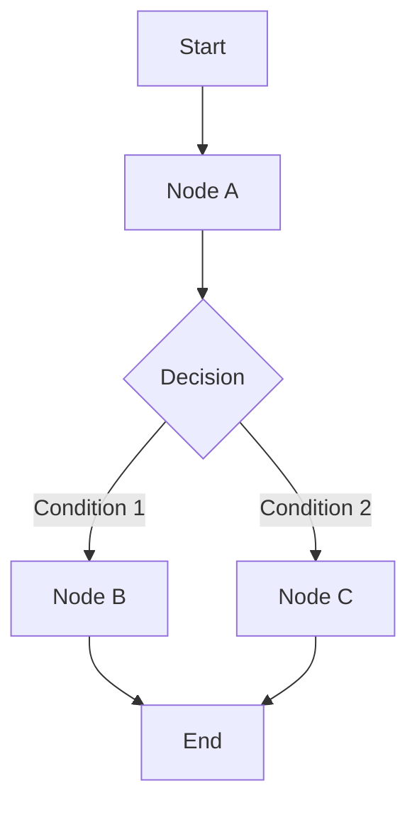

# LangGraph Guide – Basic → Architect

## Level 1 – Launch & Basics

### 1. **Quick Setup**
```bash
pip install langgraph langchain

# Set API key
export OPENAI_API_KEY="your-key"
```

### 2. **Basic Graph**
```python
from langgraph.graph import StateGraph, END
from typing import TypedDict

class State(TypedDict):
    messages: list

def node_a(state: State):
    return {"messages": state["messages"] + ["A"]}

def node_b(state: State):
    return {"messages": state["messages"] + ["B"]}

# Build graph
workflow = StateGraph(State)
workflow.add_node("a", node_a)
workflow.add_node("b", node_b)
workflow.set_entry_point("a")
workflow.add_edge("a", "b")
workflow.add_edge("b", END)

# Compile
app = workflow.compile()

# Run
result = app.invoke({"messages": []})
```

### 3. **Conditional Edges**
```python
def should_continue(state: State):
    if len(state["messages"]) > 5:
        return END
    return "continue"

workflow.add_conditional_edges(
    "a",
    should_continue,
    {
        "continue": "b",
        END: END
    }
)
```

## Level 2 – Production Patterns

### State Management
```python
from langgraph.graph.message import add_messages
from langchain_core.messages import HumanMessage, AIMessage

class State(TypedDict):
    messages: Annotated[list, add_messages]

def chatbot(state: State):
    return {"messages": [AIMessage(content="Hello!")]}

workflow.add_node("chatbot", chatbot)
```

### Human-in-the-Loop
```python
from langgraph.checkpoint.memory import MemorySaver
from langgraph.prebuilt import create_react_agent

memory = MemorySaver()
app = create_react_agent(llm, tools)
app = app.compile(checkpointer=memory)

config = {"configurable": {"thread_id": "1"}}
result = app.invoke({"messages": [HumanMessage("Hello")]}, config)
```

### Checkpointing
```python
from langgraph.checkpoint.sqlite import SqliteSaver

checkpointer = SqliteSaver.from_conn_string(":memory:")
app = workflow.compile(checkpointer=checkpointer)

config = {"configurable": {"thread_id": "1"}}
result = app.invoke({"messages": []}, config)
```

## Level 3 – Architect Playbook

### Multi-Agent Systems
```python
class AgentState(TypedDict):
    messages: Annotated[list, add_messages]
    next_agent: str

def agent_a(state: AgentState):
    # Agent A logic
    return {"next_agent": "agent_b"}

def agent_b(state: AgentState):
    # Agent B logic
    return {"next_agent": END}

workflow = StateGraph(AgentState)
workflow.add_node("agent_a", agent_a)
workflow.add_node("agent_b", agent_b)
workflow.add_conditional_edges(
    "agent_a",
    lambda x: x["next_agent"],
    {"agent_b": "agent_b", END: END}
)
```

### Streaming
```python
for event in app.stream({"messages": []}, config):
    print(event)
```

### Production Deployment
```python
from fastapi import FastAPI
from langgraph.graph import StateGraph

app = FastAPI()
graph = workflow.compile()

@app.post("/chat")
def chat(message: str, thread_id: str):
    config = {"configurable": {"thread_id": thread_id}}
    result = graph.invoke(
        {"messages": [HumanMessage(content=message)]},
        config
    )
    return {"response": result["messages"][-1].content}
```

## Ops Cheat Sheet

| Task | Command | Notes |
| --- | --- | --- |
| Create graph | `StateGraph(State)` | Initialize graph |
| Add node | `workflow.add_node(name, func)` | Add node |
| Add edge | `workflow.add_edge(a, b)` | Add edge |
| Compile | `workflow.compile()` | Compile graph |
| Invoke | `app.invoke(state)` | Run graph |
| Stream | `app.stream(state)` | Stream results |

## Architecture Patterns



## Checklist Before Production

- [ ] Define clear state schema
- [ ] Implement proper error handling
- [ ] Set up checkpointing for state persistence
- [ ] Configure human-in-the-loop where needed
- [ ] Implement streaming for real-time updates
- [ ] Set up monitoring and logging
- [ ] Test all conditional paths
- [ ] Optimize graph execution
- [ ] Implement proper state management
- [ ] Set up API endpoints for production
