# MLflow - Visual Learning Guide

## 🎨 Visual Learning: Experiment Tracking, Model Registry, Lifecycle

---

## 📊 MLflow Architecture

### High-Level Architecture

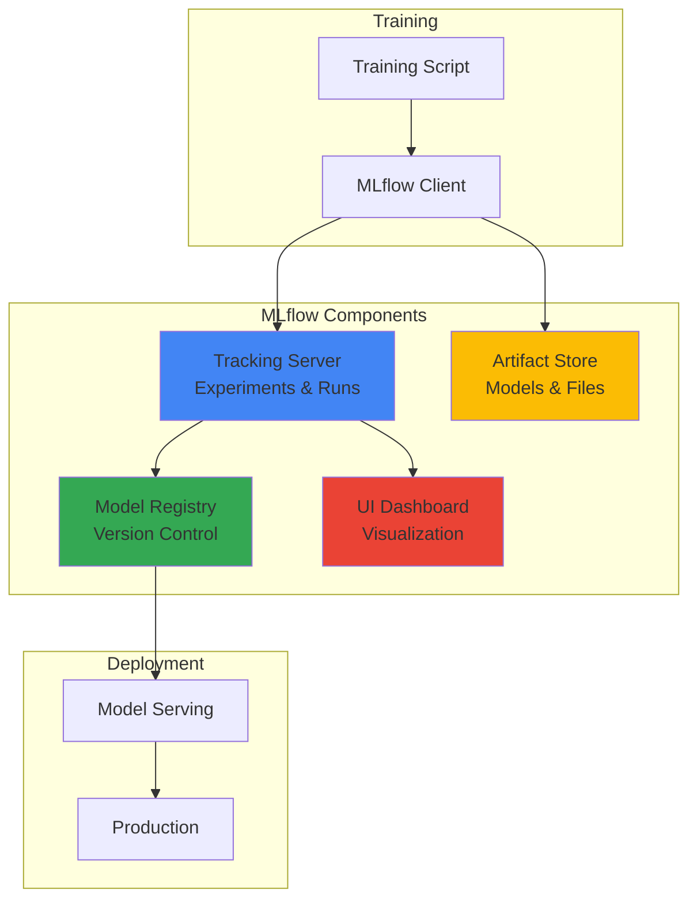

---

## 🔬 Experiment Tracking Flow

### Run Lifecycle

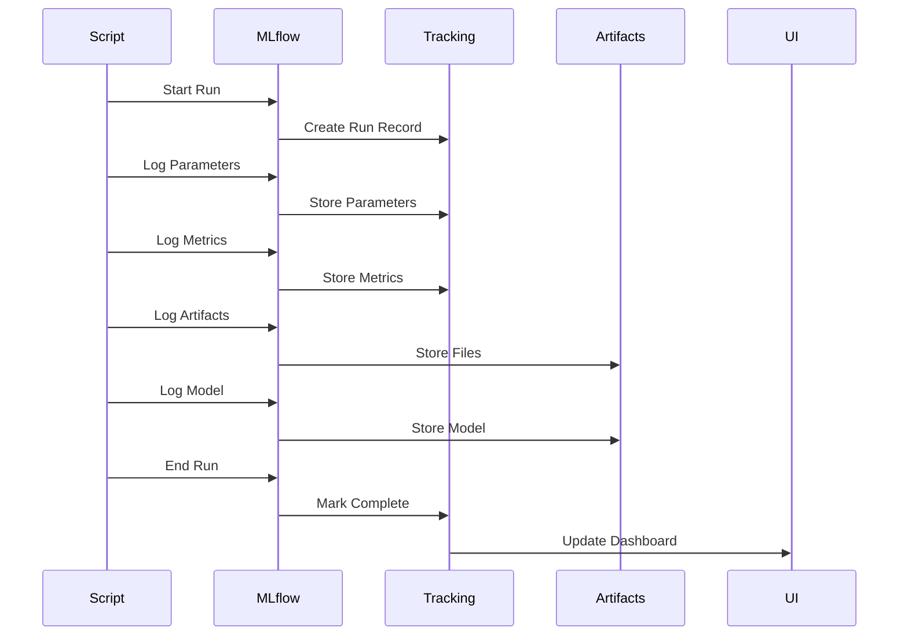

### Experiment Comparison

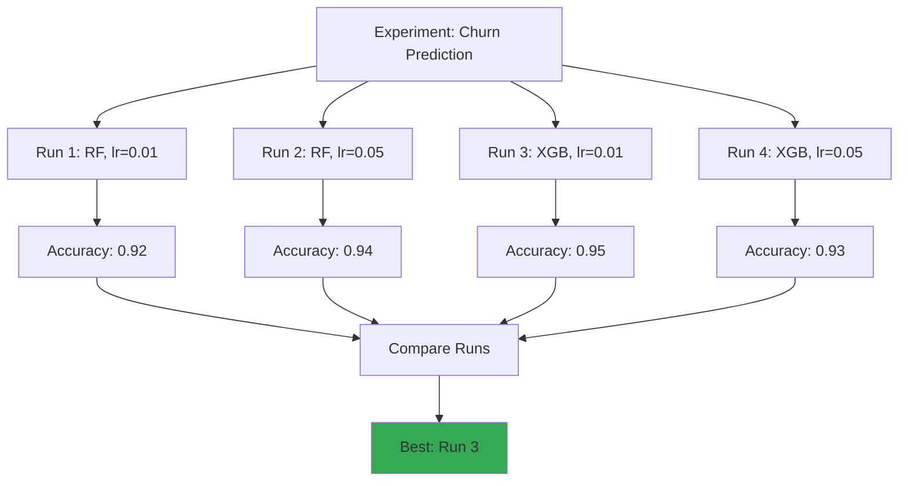

---

## 📦 Model Registry Flow

### Model Lifecycle

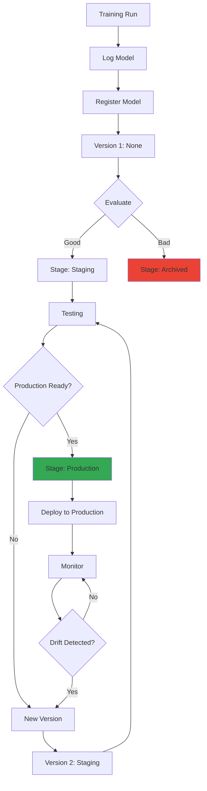

### Model Versioning

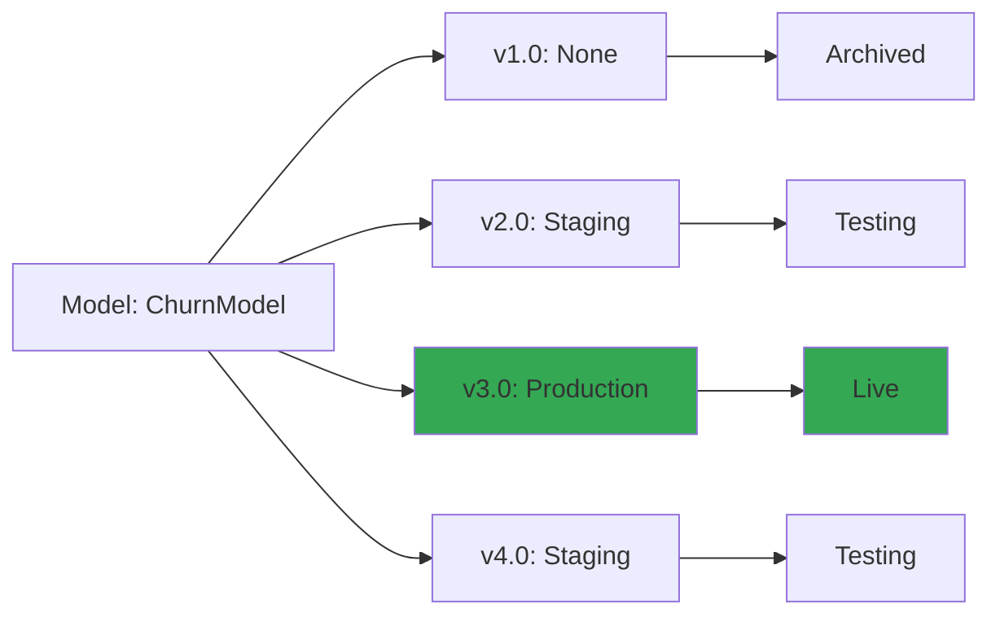

---

## 🔄 ML Lifecycle with MLflow

### Complete Lifecycle

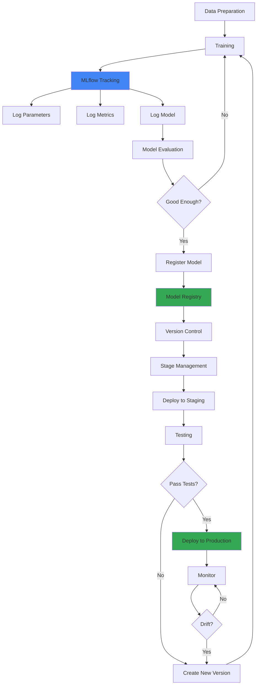

---

## 📊 Metric Tracking Over Time

### Training Metrics Visualization

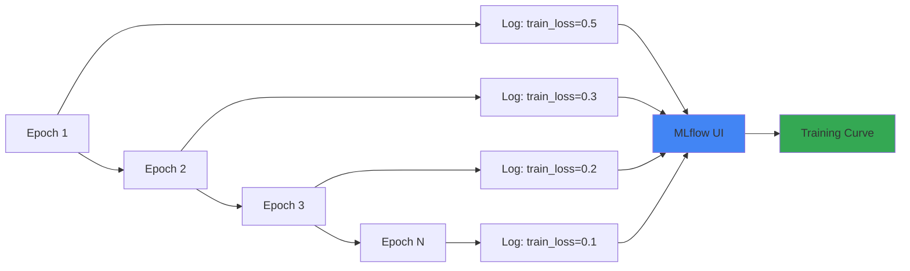

---

## 🎯 Model Comparison Flow

### Comparing Multiple Runs

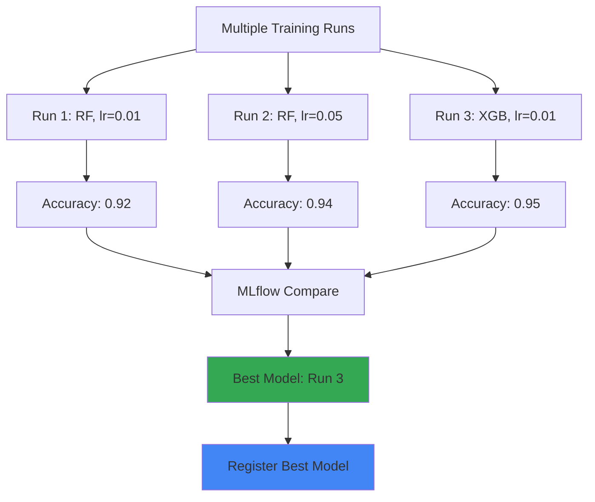

---

## 🚀 Deployment Flow

### Model Serving Architecture

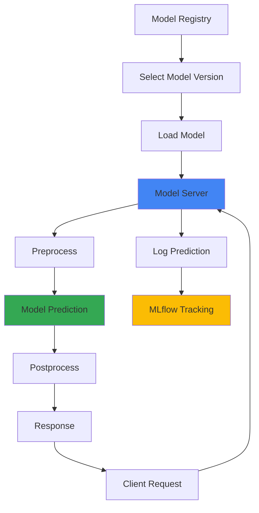

---

## 🔄 Integration with Vertex AI (Your POC)

### MLflow + Vertex AI Flow

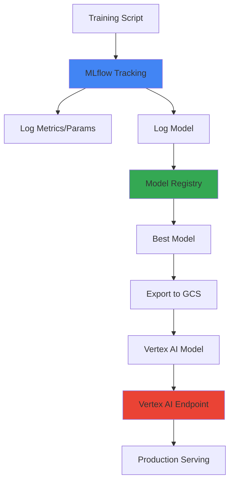

---

## 📈 Experiment Organization

### Experiment Structure

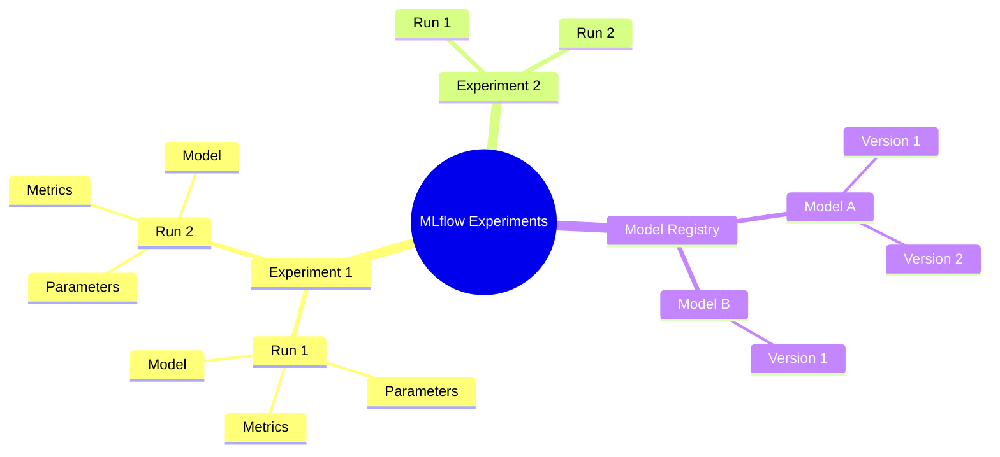

---

## 🎯 Key Visual Takeaways

1. **Tracking**: Log experiments, compare runs
2. **Registry**: Version models, manage lifecycle
3. **Artifacts**: Store models, plots, files
4. **UI**: Visualize and compare
5. **Deployment**: Serve models from registry

---

## 📚 Next Steps

1. ✅ Review these diagrams
2. 🏗️ Draw them yourself
3. 💬 Use in interviews
4. 🔗 Connect to your POCs

---

**Visual learning helps!** Use these to explain MLflow in interviews.

