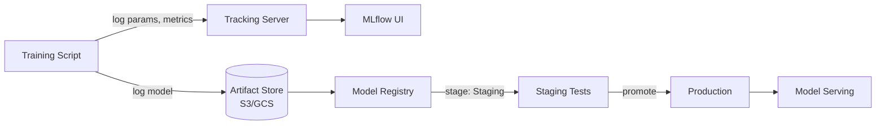

# MLflow -- Cheatsheet

## Architecture (30-second mental model)

## When to use vs alternatives
| Need | Use | Not |
|------|-----|-----|
| Track experiments, compare runs, log models | MLflow Tracking | Spreadsheets / TensorBoard alone |
| Model versioning with stage promotion | MLflow Model Registry | Manual file naming (model_v2_final_FINAL) |
| End-to-end managed ML platform | Vertex AI / SageMaker | MLflow alone (it is a tracking layer) |
| Distributed hyperparameter tuning | Optuna / Ray Tune (with MLflow logging) | MLflow (no built-in tuning) |
| Real-time model monitoring and drift detection | Evidently AI / Whylabs | MLflow (no drift detection) |

## 5 things you always forget
1. `mlflow.autolog()` exists and captures params, metrics, and model artifacts automatically for sklearn, PyTorch, XGBoost -- call it once before training
2. Use `mlflow.log_metrics(dict)` for batch logging instead of multiple `log_metric()` calls -- single network round-trip vs N calls
3. Model Registry stages are `None -> Staging -> Production -> Archived` -- you cannot skip stages without explicit API calls via `MlflowClient`
4. `runs:/{run_id}/model` loads from a specific run, `models:/ModelName/Production` loads the current production version -- mixing up these URI schemes is a common deploy bug
5. File-based tracking backend breaks above ~1000 runs -- switch to PostgreSQL backend (`--backend-store-uri postgresql://...`) before it becomes a problem

## Interview killer answer
> "We integrated MLflow into our CI/CD pipeline so every training job logged to a central tracking server with Postgres backend and GCS artifact store. The key decision was gating production deployment on the Model Registry -- the pipeline would only promote a model from Staging to Production if accuracy exceeded the current production model's baseline, and we kept the previous version in Staging for instant rollback, which saved us twice during data drift incidents."
