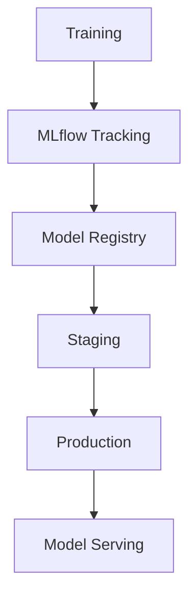

# MLflow Guide – Basic → Architect

## Level 1 – Launch & Basics

### 1. **Quick Setup**
```bash
pip install mlflow

# Start tracking server
mlflow ui --port 5000
```

### 2. **Basic Tracking**
```python
import mlflow
import mlflow.sklearn

mlflow.set_experiment("my-experiment")

with mlflow.start_run():
    # Log parameters
    mlflow.log_param("learning_rate", 0.01)
    mlflow.log_param("epochs", 10)
    
    # Train model
    model = train_model()
    
    # Log metrics
    mlflow.log_metric("accuracy", 0.95)
    mlflow.log_metric("loss", 0.05)
    
    # Log model
    mlflow.sklearn.log_model(model, "model")
```

### 3. **View Results**
```python
# Access UI at http://localhost:5000
# Or programmatically
runs = mlflow.search_runs(experiment_names=["my-experiment"])
print(runs)
```

## Level 2 – Production Patterns

### Model Registry
```python
# Register model
model_uri = f"runs:/{run_id}/model"
model_version = mlflow.register_model(
    model_uri,
    "churn_model"
)

# Transition to staging
client = mlflow.tracking.MlflowClient()
client.transition_model_version_stage(
    name="churn_model",
    version=model_version.version,
    stage="Staging"
)

# Load model
model = mlflow.sklearn.load_model(
    f"models:/churn_model/Staging"
)
```

### Projects
```python
# MLproject file
# name: my-project
# conda_env: conda.yaml
# entry_points:
#   main:
#     parameters:
#       learning_rate: {type: float, default: 0.01}
#     command: "python train.py {learning_rate}"

# Run project
mlflow.run("path/to/project", parameters={"learning_rate": 0.02})
```

### Model Serving
```bash
# Serve model
mlflow models serve -m "models:/churn_model/Production" -p 5001

# Predict
curl -X POST http://localhost:5001/invocations \
  -H 'Content-Type: application/json' \
  -d '{"inputs": [[1, 2, 3]]}'
```

## Level 3 – Architect Playbook

### Remote Tracking
```python
# Set remote tracking URI
mlflow.set_tracking_uri("http://mlflow-server:5000")

# With authentication
mlflow.set_tracking_uri("https://mlflow.example.com")
os.environ["MLFLOW_TRACKING_USERNAME"] = "user"
os.environ["MLFLOW_TRACKING_PASSWORD"] = "pass"
```

### Custom Flavors
```python
from mlflow.pyfunc import PythonModel

class CustomModel(PythonModel):
    def predict(self, context, model_input):
        # Custom prediction logic
        return predictions

mlflow.pyfunc.log_model(
    "custom_model",
    python_model=CustomModel(),
    artifacts={"model": model_path}
)
```

### Production Deployment
```python
# Batch inference
import mlflow.pyfunc

model = mlflow.pyfunc.load_model("models:/churn_model/Production")
predictions = model.predict(test_data)

# Real-time serving
# Use MLflow model serving or integrate with FastAPI
from fastapi import FastAPI
import mlflow.pyfunc

app = FastAPI()
model = mlflow.pyfunc.load_model("models:/churn_model/Production")

@app.post("/predict")
def predict(data: dict):
    return model.predict([data])
```

## Ops Cheat Sheet

| Task | Command | Notes |
| --- | --- | --- |
| Start UI | `mlflow ui` | Local tracking server |
| List experiments | `mlflow experiments list` | View experiments |
| Search runs | `mlflow.search_runs()` | Search runs |
| Register model | `mlflow.register_model()` | Register to registry |
| Serve model | `mlflow models serve` | Serve model |
| Load model | `mlflow.load_model()` | Load model |

## Architecture Patterns



## Checklist Before Production

- [ ] Set up remote tracking server
- [ ] Configure model registry
- [ ] Implement proper model versioning
- [ ] Set up model serving infrastructure
- [ ] Configure authentication and authorization
- [ ] Set up monitoring and alerting
- [ ] Implement model validation
- [ ] Set up CI/CD for model deployment
- [ ] Configure artifact storage (S3, GCS)
- [ ] Implement proper logging and auditing
