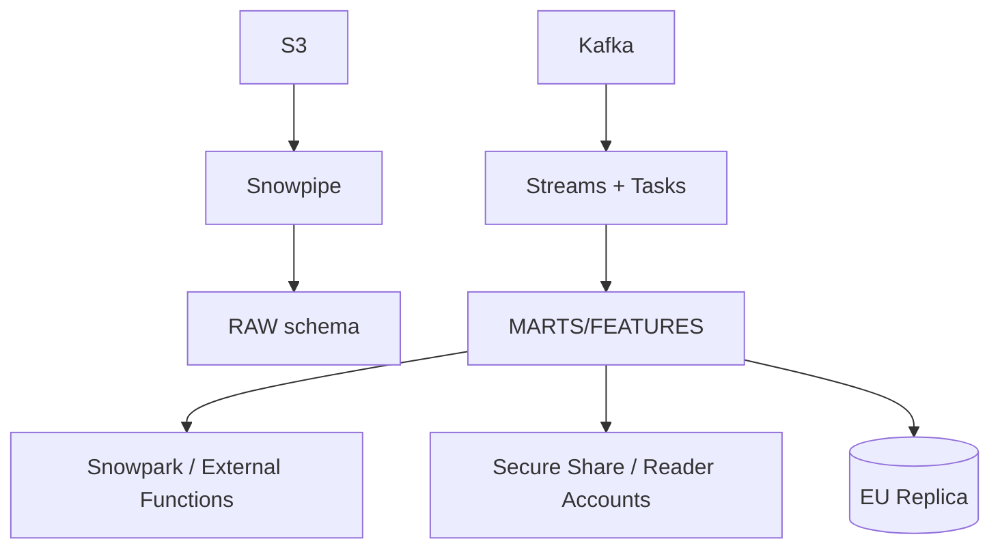

# Snowflake Architect / Interview Reference

## Top Questions
1. **Explain Snowflake’s three-layer architecture.**  
   - Storage: immutable micro-partitions in cloud object storage.  
   - Compute: virtual warehouses (independent, auto-suspend).  
   - Services: metadata, optimizer, security.  
   Highlight how separation enables elastic scaling and workload isolation.

2. **How do you control cost and performance?**  
   - Right-size warehouses + auto-suspend.  
   - Resource monitors + tagging for showback.  
   - Clustering keys/materialized views for heavy tables.  
   - Streams/Tasks vs external orchestration.

3. **Zero-copy clone vs Time Travel vs Fail-safe?**  
   - Clone = metadata pointer for instant envs/tests.  
   - Time Travel = configurable retention (1–90 days) for point-in-time queries/restores.  
   - Fail-safe = 7-day immutable backup controlled by Snowflake.

4. **Data sharing security?**  
   - Shares expose metadata only; consumers bring their own compute.  
   - Masking/row policies apply even in shares.  
   - Reader accounts when consumers lack Snowflake tenancy.

5. **Multi-region / multi-cloud design?**  
   - Database + account replication, failover/failback.  
   - External functions & Snowpipe for cross-cloud ingestion.  
   - Marketplace for syndicating curated data products.

## System Design Prompt – “Global Feature Store on Snowflake”
### Requirements
- ingest raw events from S3 + streaming sources  
- curate features for ML teams  
- enable read replicas in EU for GDPR  
- share subsets with partners

### Architecture Talking Points

- Use dedicated warehouses (INGEST_WH, FEATURE_WH, BI_WH).  
- Streams + Tasks handle incremental processing.  
- Zero-copy clones for dev/UAT.  
- Secure share for partners; reader accounts with masking policies.  
- Replication from primary (us-east) to eu-central for GDPR compliance.

## Troubleshooting Matrix
| Symptom | Root Cause | Fix |
| --- | --- | --- |
| Credit burn spike | Warehouse left running | Enable auto-suspend; add resource monitor alerts |
| Slow queries | Missing clustering or wrong warehouse size | Define clustering keys; scale warehouse up temporarily |
| Inconsistent data | Tasks failing silently | Monitor `TASK_HISTORY` + `ALERT` objects |
| Sharing issues | Consumer can’t access data | Ensure privileges granted on database/schema/table + network policies allow |
| Replica lag | Large DDL changes ongoing | Stagger replication, monitor `REPLICATION_USAGE_HISTORY` |

## Rapid Reference
- `ACCOUNT_USAGE` views for governance/ops.
- `SYSTEM$CLUSTERING_INFORMATION` to inspect clustering depth.
- Snowpark for Python/Scala to keep logic close to data.
- Snowflake Terraform provider to codify roles, warehouses, integrations.

## Practice Prompts
- Design a multi-tenant Snowflake deployment supporting multiple product teams.  
- Explain how you’d migrate from Redshift/BigQuery to Snowflake with minimal downtime.  
- Describe how to secure PII with masking policies and monitor access.  
- Discuss strategy for exposing curated data to external partners via marketplace.  
- Walk through hybrid lakehouse pattern using external tables + Iceberg.

