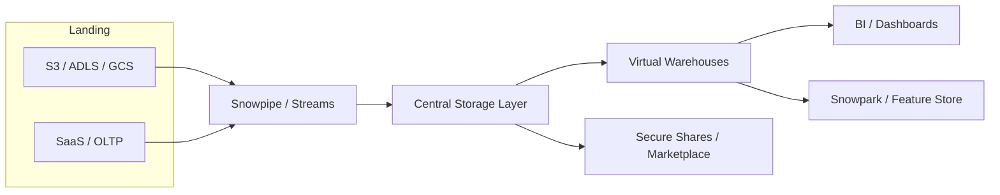
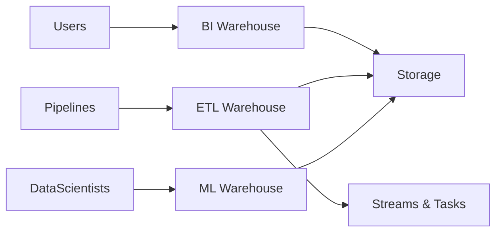
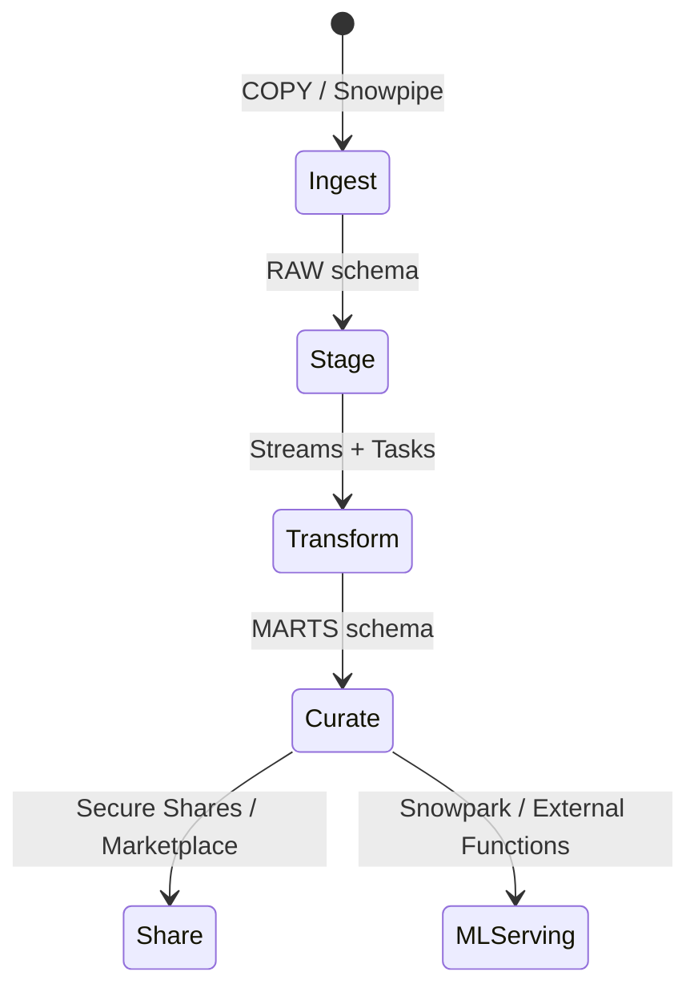
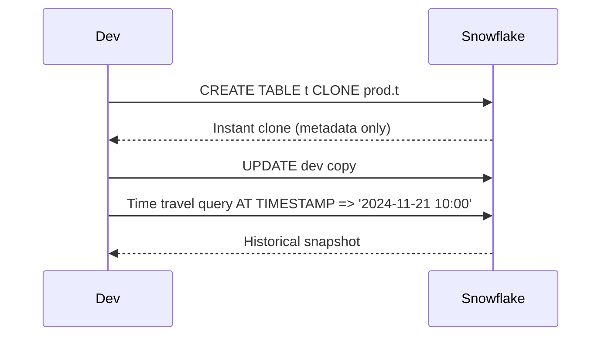

# Snowflake Visual Playbook

## Platform Architecture


## Warehouse & Workload Isolation


## Data Lifecycle


## Time Travel & Cloning Flow


## Multi-Cloud Replication
```mermaid
graph TB
    Primary[(Primary Region)]
    Secondary[(Secondary Region)]
    Tertiary[(Marketplace / Reader Account)]

    Primary --> Secondary: Database Replication
    Secondary --> Primary: Failover
    Primary --> Tertiary: Secure Share
```

## Comparison Grid
| Mode | Layout | State Strategy | Deployment |
| --- | --- | --- | --- |
| Speed Cards | Single warehouse, dashboards | Result cache + auto-suspend | Small warehouse, Streamlit BI |
| Deep Dive | Streams + Tasks + curated marts | Streams, Tasks, clustering | Dedicated ETL + BI warehouses |
| Architect | Multi-region replication, sharing | Resource monitors, tagging, policies | Multi-cloud, Infrastructure-as-code |

## Visual Cues
- Highlight separation between storage and compute.
- Emphasize Streams + Tasks for incremental pipelines.
- Show masking/row policies layered on curated schemas.
- Use annotation callouts for credit-saving levers (auto-suspend, multi-cluster).

