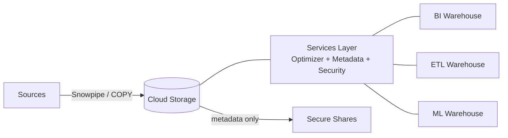

# Snowflake — Cheatsheet

## Architecture (30-second mental model)

## When to use vs alternatives
| Need | Use | Not |
|------|-----|-----|
| Zero-ops warehouse with per-second billing | Snowflake | Redshift (resize clusters, pay idle) |
| Cross-org data sharing without copying data | Snowflake Secure Shares | S3 exports + IAM (ops burden, stale copies) |
| Serverless, pay-per-query analytics on GCP | BigQuery | Snowflake (warehouse must spin up) |
| Unified compute for SQL + Spark + ML notebooks | Databricks Lakehouse | Snowflake (Snowpark is narrower than Spark) |
| Sub-second OLTP reads alongside analytics | AlloyDB / Aurora | Snowflake (not designed for point-lookup OLTP) |

## 5 things you always forget
1. `AUTO_SUSPEND = 60` is seconds, not minutes -- a warehouse left at default (600s) burns 10x more idle credits than you expect.
2. Zero-copy clones are instant and free **until** the clone diverges -- writes to the clone allocate new micro-partitions and start incurring storage cost.
3. Time Travel retention on transient tables maxes at 1 day; only permanent tables support up to 90 days -- and Fail-safe only applies to permanent tables.
4. `COPY INTO` is idempotent by file name for 64 days (load metadata cache) -- re-staging the same file name silently skips it unless you set `FORCE = TRUE`.
5. `ACCOUNT_USAGE` views have up to 45-minute latency; use `INFORMATION_SCHEMA` for real-time metadata but remember its 10K row limit per query.

## Interview killer answer
> "The key insight with Snowflake is that storage and compute are truly decoupled -- we ran separate warehouses for ingest, BI, and ML so a heavy feature-engineering job never blocked dashboard queries. We used Streams + Tasks for incremental ELT instead of external orchestration, and zero-copy clones let every developer spin a full-size dev environment in seconds without doubling storage cost. For cross-team data products, Secure Shares meant consumers queried live data on their own compute with masking policies still enforced, which eliminated the stale-export problem we had before."
