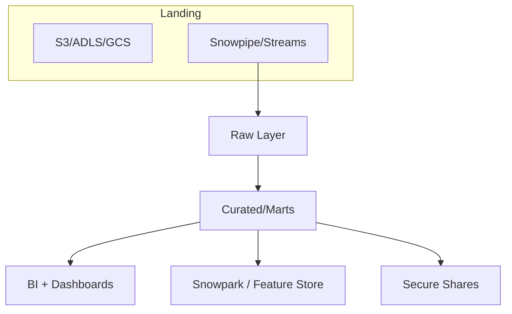

# Snowflake Guide – Basic → Architect

## Level 1 – Launch & Load
1. **Set up account objects**
   ```sql
   CREATE DATABASE analytics;
   CREATE SCHEMA analytics.raw;
   CREATE WAREHOUSE loader_wh WITH WAREHOUSE_SIZE='SMALL' AUTO_SUSPEND=60;
   ```
2. **Stages + file formats**
   ```sql
   CREATE STORAGE INTEGRATION s3_int TYPE=EXTERNAL_STAGE ...;
   CREATE FILE FORMAT csv_ff TYPE=CSV FIELD_DELIMITER=',' SKIP_HEADER=1;
   CREATE STAGE @raw_stage URL='s3://bucket/raw/' STORAGE_INTEGRATION=s3_int FILE_FORMAT=csv_ff;
   ```
3. **Load + query**
   ```sql
   COPY INTO analytics.raw.events FROM @raw_stage PATTERN='.*events.*.csv';
   SELECT region, SUM(amount) FROM analytics.raw.events GROUP BY 1;
   ```

## Level 2 – Production Patterns
### Warehouses & workloads
- Separate warehouses for ingest, BI, ML; size appropriately.
- Enable **multi-cluster** for concurrency: `MIN_CLUSTER_COUNT=1 MAX_CLUSTER_COUNT=3`.
- Attach **resource monitors** to auto-suspend or alert on credits.

### Clustering & performance
```sql
ALTER TABLE analytics.raw.events CLUSTER BY (event_date, customer_id);
CREATE MATERIALIZED VIEW analytics.marts.daily_sales AS
  SELECT event_date, SUM(amount) total FROM analytics.raw.events GROUP BY 1;
```
- Use `EXPLAIN`, `QUERY_HISTORY`, and `AUTOMATIC_CLUSTERING_HISTORY`.

### Streams & Tasks (ELT)
```sql
CREATE STREAM raw_events_stream ON TABLE analytics.raw.events;

CREATE OR REPLACE TASK load_mart
  WAREHOUSE = etl_wh
  SCHEDULE = '5 MINUTE'
AS
MERGE INTO analytics.marts.daily_sales dst
USING (
  SELECT event_date, SUM(amount) total
  FROM raw_events_stream
  GROUP BY 1
) src
ON dst.event_date = src.event_date
WHEN MATCHED THEN UPDATE SET total = src.total
WHEN NOT MATCHED THEN INSERT VALUES (src.event_date, src.total);
```

### Governance
- **Row access / masking policies**
```sql
CREATE MASKING POLICY mask_phone AS (val STRING) RETURNS STRING ->
    CASE WHEN CURRENT_ROLE() IN ('FINANCE_ROLE') THEN val ELSE '***-***-****' END;
ALTER TABLE analytics.marts.customers ALTER COLUMN phone SET MASKING POLICY mask_phone;
```
- Tag sensitive objects, audit via `ACCOUNT_USAGE`.

## Level 3 – Architect Playbook
### Zero-copy clones & branching
```sql
CREATE TABLE analytics.dev.events_dev CLONE analytics.raw.events;
CREATE DATABASE analytics_uat CLONE analytics;
```
- Pair with GitOps: Terraform + Snowflake Provider to manage roles, warehouses, integrations.

### Data sharing & marketplace
```sql
CREATE SHARE partner_share;
GRANT USAGE ON DATABASE analytics TO SHARE partner_share;
GRANT SELECT ON ALL TABLES IN SCHEMA analytics.marts TO SHARE partner_share;
ALTER SHARE partner_share ADD ACCOUNT = 'ORG_NAME.ACCOUNT_NAME';
```
- Use reader accounts for consumers without their own Snowflake subscription.

### Multi-cloud replication / failover
```sql
ALTER DATABASE analytics ENABLE REPLICATION TO ACCOUNTS = ('ORG_NAME.US_WEST', 'ORG_NAME.EU_CENTRAL');
ALTER DATABASE analytics REFRESH;
ALTER DATABASE analytics FAILOVER TO ORG_NAME.EU_CENTRAL;
```

### Snowpark + ML
- Use Snowpark Python/Scala to push down logic.
- Store models via external functions or integrate with Vertex AI/SageMaker.

## Ops Cheat Sheet
| Task | Command / Tool | Notes |
| --- | --- | --- |
| Monitor credit usage | `SNOWFLAKE.ACCOUNT_USAGE.WAREHOUSE_METERING_HISTORY` | Join with RESOURCE_MONITORS for alerting |
| Cost allocation | TAG warehouses/tables (`ALTER WAREHOUSE ... SET TAG department='AI'`) | Query `TAG_REFERENCES_ALL_COLUMNS` |
| CI/CD | Terraform, Snowflake CLI, schemachange | Manage roles/objects as code |
| Access audit | `SNOWFLAKE.ACCOUNT_USAGE.ACCESS_HISTORY` | Works with masking policies |

## Reference Architectures


## Checklist Before Production
- [ ] Separate warehouses per workload, auto-suspend configured  
- [ ] Resource monitor + tagging for cost control  
- [ ] Time Travel retention validated; Fail-safe understood  
- [ ] Masking/row policies for sensitive columns  
- [ ] Streams/Tasks monitored (use TASK_HISTORY)  
- [ ] Backups/replication tested  
- [ ] Zero-copy clone pipeline for dev/UAT ready  

Snowflake rewarded teams move fast when the platform is treated like code—template every database, secure every column, and let the platform handle the heavy lifting.

