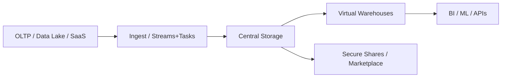

# Snowflake – Snapshot
> Multi-cloud data platform separating storage and compute for elastic analytics, governed sharing, and near-zero ops.

## TL;DR
- 🧊 Decoupled virtual warehouses for elastic compute
- ☁️ Multi-cloud (AWS, Azure, GCP) + cross-region replication
- 🪞 Zero-copy cloning & Time Travel for rapid experimentation and recovery
- 🔗 Secure data sharing & marketplace for collaboration
- 🧠 Snowpark + native functions for ML workloads

## When to Reach for Snowflake
| Scenario | Why Snowflake | Alternative |
| --- | --- | --- |
| Enterprise warehouse | Consistent SQL, zero admin, elastic compute | BigQuery, Redshift |
| Global analytics | Replication, reader accounts, failover | DIY lakehouse |
| Data sharing | Metadata-only, governed access | S3/ADLS exports |
| Feature store | Materialized views, Snowpark, UDFs | Databricks Feature Store |

## First 60 Seconds
```sql
CREATE DATABASE ai_platform;
CREATE WAREHOUSE demo_wh WITH WAREHOUSE_SIZE='XSMALL' AUTO_SUSPEND=60;
USE WAREHOUSE demo_wh;

CREATE TABLE metrics (region STRING, total NUMBER);
COPY INTO metrics
  FROM '@stage/metrics.csv'
  FILE_FORMAT = (TYPE=CSV SKIP_HEADER=1);

SELECT region, SUM(total) FROM metrics GROUP BY 1;
```

## Architecture Glance


## Learning Path – Basic → Architect

### Level 1 – Foundations
- Account hierarchy (account → database → schema → table/view)
- Virtual warehouses: auto-suspend/resume, scaling policies
- Loading patterns: COPY, stages, file formats

### Level 2 – Production Patterns
- Clustering keys, materialized views, result cache
- Streams + Tasks for incremental pipelines
- External tables + Hybrid tables for lakehouse scenarios
- Time Travel vs Fail-safe retention

### Level 3 – Architect Playbook
- Multi-cluster warehouses + resource monitors
- Replication/failover across regions/clouds
- Secure data sharing, reader accounts, data marketplace
- Governance: masking policies, row access policies, tagging, access history

## Interview Hooks
1. **Storage/compute separation** – warehouses are stateless compute; storage is single copy; billing per-second.
2. **Zero-copy clone** – metadata pointers, instantaneous env spins, cost-effective dev/test.
3. **Time Travel vs Fail-safe** – configurable retention vs 7-day disaster recovery.
4. **Data sharing security** – shares expose metadata only; consumers pay for their own compute; policies enforced.
5. **Workload isolation** – dedicated warehouses per workload, multi-cluster for concurrency scaling.

## POC Integration
- `POC-04-Multi-Cloud-Data-Lake` – Snowflake as curated analytics layer across clouds.
- `02-Cloud-AI-Platform` – Vertex AI pipelines reading from Snowflake via Snowpark/Python connector.
- `01-ML-Fundamentals` – use as feature store feeding training notebooks.

## Best Practices Checklist
| Area | Checklist |
| --- | --- |
| Cost | Auto-suspend warehouses, resource monitors, tagging, per-task warehouses |
| Performance | Choose clustering keys, use result cache, prune columns |
| Security | RBAC, masking policies, row access policies, network policies, MFA |
| Ops | Monitor ACCOUNT_USAGE views, set alerts on credit burn, version IaC via Terraform |

## Next Steps
1. Open `guide.md` for layered patterns and SQL recipes.  
2. Study `Visual.md` diagrams for architecture & pipelines.  
3. Rehearse answers in `Interview.md`.  
4. Connect POCs via connector/Snowpark and demonstrate zero-copy clones.  
5. Publish a secure data share for stakeholders to consume.

