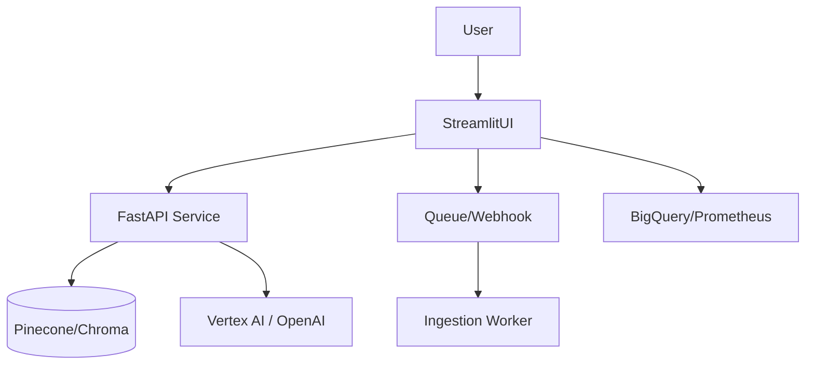

# Streamlit Architect / Interview Reference

## Top Questions
1. **How does Streamlit’s execution model work?**  
   - Script reruns top-to-bottom on every interaction.  
   - Widgets store values in `st.session_state`.  
   - Use caching + forms to avoid duplicate work.

2. **How do you manage state and avoid flicker?**  
   - Initialize keys in `session_state`.  
   - Use forms for grouped submission.  
   - Persist expensive objects with `cache_resource`.

3. **Streamlit vs Dash vs Gradio?**  
   - Streamlit = Python + reruns (fast prototyping).  
   - Dash = callback graph, better for complex multi-user flows.  
   - Gradio = ML demo focus, less suited for dashboards.

4. **Scaling strategy?**  
   - Containerize, run behind Cloud Run/ECS/K8s.  
   - Offload heavy compute to APIs / async workers.  
   - Use CDN for static assets, add caching layers.

5. **Securing apps?**  
   - Store secrets in `.streamlit/secrets.toml`.  
   - Front with OAuth/IAP; enable HTTPS + auth proxy.  
   - Sanitize uploads, validate user inputs, hide sensitive configs.

## System Design Prompt – “RAG Ops Console”
### Requirements
- Chat with knowledge base, show retrieved chunks, monitor pipeline health.
- Support 100 concurrent team members.

### High-Level Design

### Talking Points
- Use Streamlit tabs for “Chat”, “Sources”, “Pipelines”.
- Leverage async background ingestion via Pub/Sub or Celery.
- Persist chat history in Redis/Postgres keyed by user.
- Streamlit handles UI + orchestrates API calls; scaling handled by container platform.

## Troubleshooting Matrix
| Symptom | Root Cause | Fix |
| --- | --- | --- |
| Sluggish UI | Loading model/data every rerun | Move to `cache_resource`, call external API |
| “Attribute already defined” | Duplicate `session_state` initialization | Guard with `if key not in st.session_state` |
| Memory blow-up | Storing large DataFrames in state | Use `cache_data`, limit rows, stream to disk |
| Blank page on deploy | Wrong port / base URL | Set `PORT` env + `streamlit run app.py --server.port=$PORT` |
| Auth bypass | Secrets committed to repo | Use env vars / secrets manager, rotate creds |

## Rapid Reference
- `st.status` for long-running tasks (1.31+).
- `st.experimental_connection` for Snowflake, SQL, etc.
- `st.chat_message` + `st.chat_input` for conversational UX.
- `streamlit-component-lib` for embedding React/JS widgets.

## Practice Prompts
- Design a KPI dashboard that compares training vs serving stats with auto-refresh.  
- Show how you’d add role-based views (admin vs analyst) without rewriting the app.  
- Explain how to package Streamlit with Docker + Cloud Run and enable GCP IAP.

