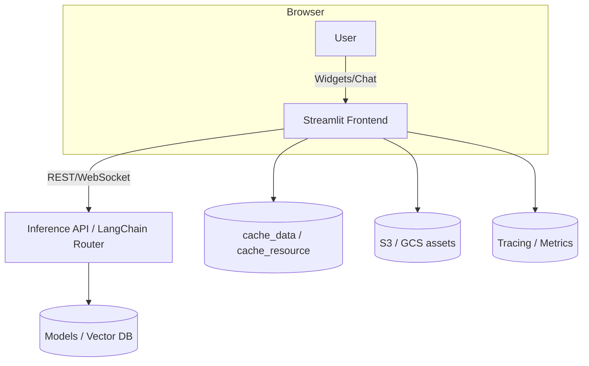
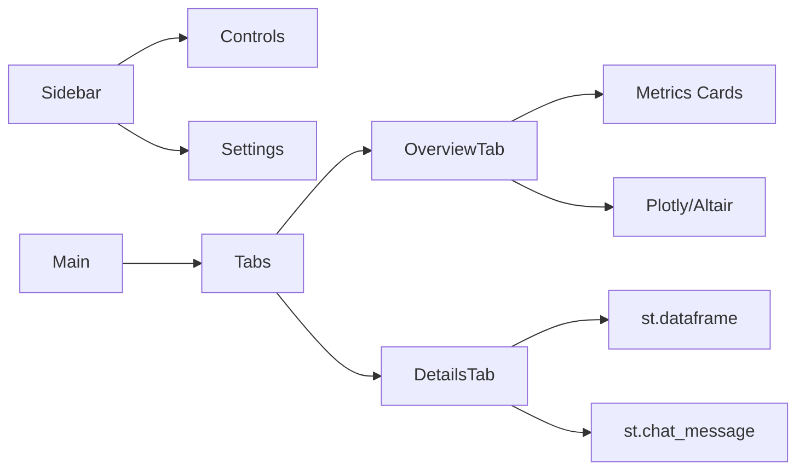
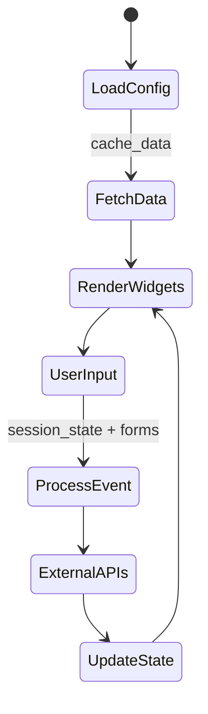
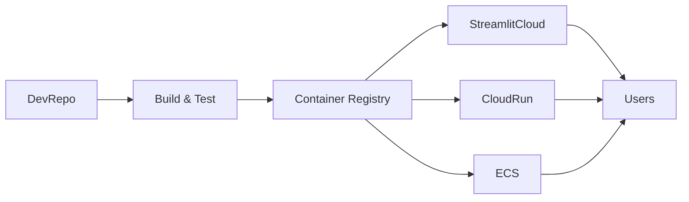

# Streamlit Visual Playbook

## Architecture Flow

## Layout Blueprint

## Data Journey

## Deployment Topology

## Comparison Grid
| Mode | Layout | State Strategy | Deployment |
| --- | --- | --- | --- |
| Speed Cards | Single page, top metrics | Minimal `session_state`, no cache | Streamlit Cloud preview |
| Deep Dive | Multi-page, sidebar filters | `session_state`, `cache_data` | Docker + Cloud Run |
| Architect | Tabs + chat + diagnostics | `session_state`, background APIs, feature flags | ECS/Fargate or GKE |

## Visual Cues
- **Color coding**: use primary color for actions, neutral gray for data tables, accent for alerts.
- **Status panels**: `st.metric`, `st.progress`, `st.status` (1.31+) for pipeline health.
- **Diagram embed**: `st.image` for exported PNGs or `components.html` for Mermaid-in-iframe when needed.

