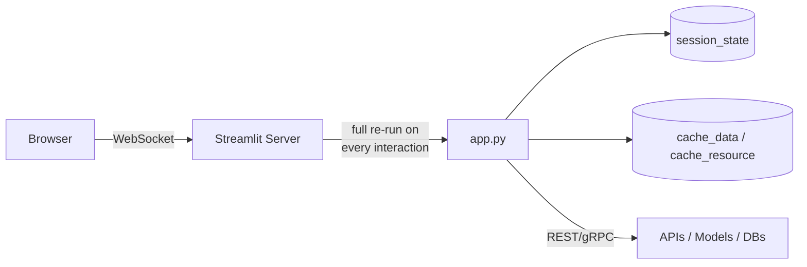

# Streamlit -- Cheatsheet

## Architecture (30-second mental model)

## When to use vs alternatives

| Need | Use | Not |
|---|---|---|
| Internal ML/data tool, small team | Streamlit | Dash (overkill callback wiring) |
| Complex multi-user dashboards with callbacks | Dash | Streamlit (rerun model fights you) |
| One-off model demo for a conference | Gradio | Streamlit (more setup) |
| Customer-facing production SPA | React / Next.js | Streamlit (not designed for it) |
| Notebook-style exploration with widgets | Jupyter + ipywidgets | Streamlit (separate process) |

## 5 things you always forget

1. **Every widget interaction reruns the entire script top-to-bottom.** Guard expensive work with `@st.cache_data` (serializable) or `@st.cache_resource` (connections, models) -- not both on the same object.
2. **`st.session_state` keys must be initialized before first read** -- use `if "k" not in st.session_state:` guard or you get silent `None` bugs, not errors.
3. **Forms (`st.form`) are the only way to batch inputs without triggering intermediate reruns.** Without them, every slider drag fires a rerun.
4. **`st.cache_resource` objects are shared across all users/sessions.** Mutating a cached DB connection's state in one session leaks to others.
5. **Multi-page apps require a `pages/` directory with one `.py` per page** -- Streamlit auto-generates sidebar nav, but page ordering is alphabetical unless you prefix filenames with numbers.

## Interview killer answer

> "We built an internal RAG validation console with Streamlit where SMEs could query the knowledge base, see retrieved chunks with highlighted provenance, and flag bad answers. The key architectural decision was offloading all embedding and retrieval work to a FastAPI service behind `cache_resource`, so the Streamlit rerun model only handled UI state. We deployed on Cloud Run with IAP for auth, which gave us zero-config scaling and SSO without touching Streamlit's own auth layer."
