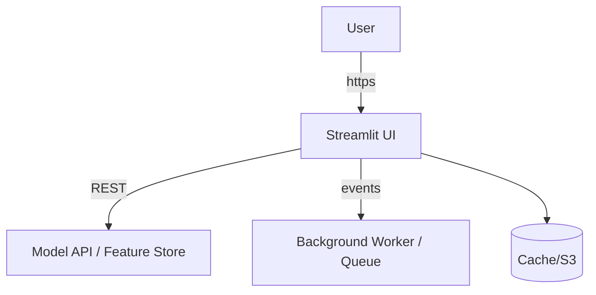
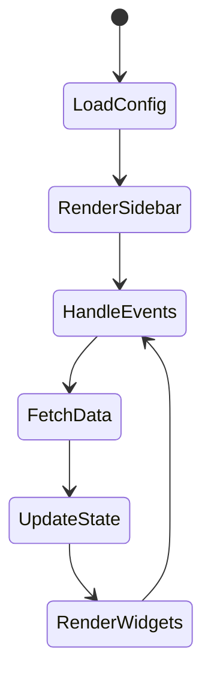

# Streamlit Guide – Basic → Architect

## Level 1 – Launch Quickly
1. **Project skeleton**
   ```bash
   mkdir streamlit-rag && cd streamlit-rag
   python -m venv .venv && source .venv/bin/activate
   pip install streamlit pandas plotly langchain
   streamlit hello  # smoke-test install
   ```
2. **Base app structure**
   ```python
   import streamlit as st
   st.set_page_config(page_title="Feature Store", layout="wide")
   st.title("Feature Monitor")
   left, right = st.columns([2, 1])
   with left:
       st.dataframe(feature_df)
   with right:
       st.metric("Drift", "0.12", "-0.03 vs last week")
   ```
3. **Core widgets**
   - `st.sidebar.*` for filters + config
   - `st.file_uploader`, `st.download_button`
   - `st.tabs(["Overview", "Details"])`
   - `st.chat_input`, `st.chat_message` for conversational UX

## Level 2 – Production Patterns
### State & caching
```python
if "history" not in st.session_state:
    st.session_state.history = []

@st.cache_data(ttl=1800)
def load_embeddings():
    return parquet.read_table("gs://fs/embeddings.parquet")

@st.cache_resource
def load_vector_client():
    return chromadb.HttpClient()
```

### Multi-page layout
```
streamlit_app/
├─ Home.py
├─ pages/
│   ├─ 01_Chat.py
│   └─ 02_Analytics.py
└─ components/
    └─ json_viewer.py
```
- Use `st.navigation` (1.36+) or sidebar links for simple routing.

### Forms & validation
```python
with st.form("ingest_form"):
    file = st.file_uploader("Upload CSV", type="csv")
    dry_run = st.checkbox("Dry run", True)
    submitted = st.form_submit_button("Ingest")
    if submitted:
        st.info("Kicking off ingestion…")
```

### Theming & branding
- `.streamlit/config.toml`
  ```toml
  [theme]
  primaryColor="#10B981"
  backgroundColor="#0F172A"
  font="sans serif"
  ```
- Use `st.logo`, `st.sidebar.image`, and custom CSS injected via `st.markdown("<style>…</style>", unsafe_allow_html=True)` for quick polish.

## Level 3 – Architect Playbook
### Custom components
```python
import streamlit.components.v1 as components
components.html(
    "<div id='vega'></div><script>renderVegaLite()</script>",
    height=420
)
```
- Build full React component via `streamlit-component-template` when you need advanced charts (Mapbox, Cytoscape, vis-network).

### External APIs & async tasks
```python
import httpx

@st.cache_resource
def get_client():
    return httpx.Client(timeout=30)

def ask_llm(prompt):
    resp = get_client().post(f"{API_URL}/chat", json={"prompt": prompt})
    resp.raise_for_status()
    return resp.json()
```
- Offload GPU work to FastAPI, Vertex AI, Bedrock, or Lambda; Streamlit remains the orchestration + UI layer.

### Deployment patterns
| Target | Notes |
| --- | --- |
| Streamlit Cloud | Zero-ops, built-in secrets + auth |
| Docker + Cloud Run | `gcloud run deploy` with `port 8501`, use IAP |
| ECS/Fargate | Use ALB health checks, autoscale tasks |
| Hugging Face Spaces | Great for public demos, free tier |

### Observability & Ops
- Forward logs to Cloud Logging or Datadog via `logging` + handler.
- Feature flags via environment variables + `st.secrets`.
- Health endpoints: use a thin FastAPI sidecar or simple `/healthz` page.
- Secure uploads: scan with `clamd`, limit file size, scrub PII.

## Ops Cheat Sheet
| Task | Command | Notes |
| --- | --- | --- |
| Dev server | `streamlit run app.py --server.port=8080` | align with Docker port |
| Export requirements | `pip freeze > requirements.txt` | feed into CI/CD |
| Cache reset | `streamlit cache clear` | after schema changes |
| Headless run | `streamlit run app.py --server.headless true` | for container deployments |

## Architecture Patterns




## Integrations
- **LLM Console** – combine `st.chat_input`, LangChain chains, and retrieval metadata tables.
- **Feature Store Monitor** – compare training vs serving distributions using Plotly histograms.
- **RAG Control Tower** – tabs for “Chat”, “Sources”, “Pipelines”, hooking into POC-05.

## Troubleshooting
| Symptom | Root Cause | Fix |
| --- | --- | --- |
| “Attribute already defined” | `st.session_state` misuse | Namespace-check + `if key not in…` |
| Slow reruns | Loading models each execution | Move to `cache_resource`, call backend |
| Crashes under load | Running heavy inference inline | Offload to GPU API and stream results |
| Blank page on deploy | Wrong port/URL | Set `PORT` env + `streamlit run ... --server.port=$PORT` |

## Checklist before Ship
- [ ] `.streamlit/secrets.toml` populated (API keys, DB creds)
- [ ] Health + readiness screens respond
?- [ ] Static assets (images/css) served from CDN/S3
- [ ] Observability hooks tested
- [ ] README updated with `streamlit run` + deployment steps

