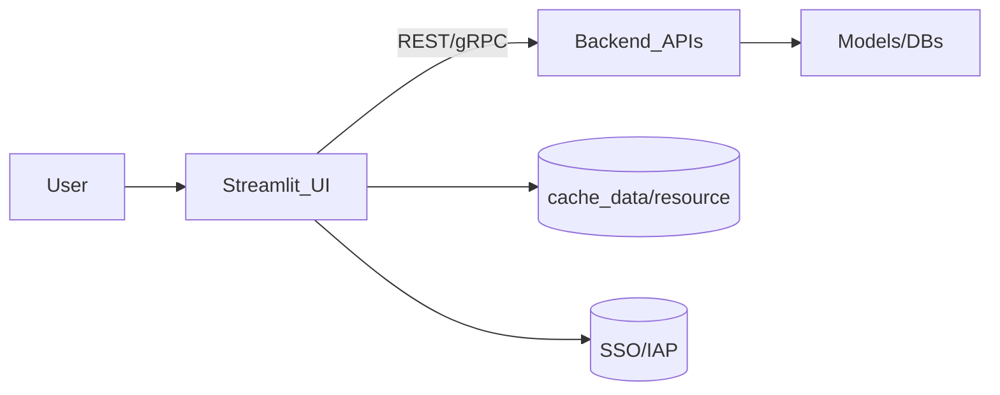

# Streamlit – Snapshot
> Python-only UI framework to turn notebooks + models into shareable apps in minutes.

## TL;DR
- ⚡ Instant prototypes (`streamlit run app.py`)
- 🎛️ Widgets + charts + chat out of the box
- 🧠 Built for ML tooling (pandas, LangChain, Torch)
- ☁️ Deploy anywhere (Streamlit Cloud / Cloud Run / ECS)
- 👥 Stakeholder-friendly sharing & auth

## When to Reach for Streamlit
| Scenario | Why Streamlit | Alternative |
| --- | --- | --- |
| RAG/Chatbot console | Pythonic chat widgets + session state | React/Next.js |
| Internal data app | 100% Python, zero JS | Dash/Panel |
| Model validation | Capture SME feedback quickly | Gradio |

## First 60 Seconds
```bash
pip install streamlit
echo "import streamlit as st; st.title('Hello Architect')" > app.py
streamlit run app.py
```

## Architecture Glance


## Learning Path (Basic → Advanced)

### Level 1 – Foundations
- Widgets (`st.text_input`, `st.selectbox`, `st.button`)
- Layout (`st.columns`, `st.tabs`, `st.sidebar`)
- Minimal predictor:
```python
import streamlit as st, joblib
model = joblib.load("model.pkl")
f1 = st.number_input("Feature 1")
f2 = st.number_input("Feature 2")
if st.button("Predict"):
    st.success(model.predict([[f1, f2]])[0])
```

### Level 2 – Production Patterns
- Session State
```python
if "chat" not in st.session_state:
    st.session_state.chat = []
msg = st.chat_input("Ask a question")
if msg:
    st.session_state.chat.append({"role": "user", "content": msg})
```
- Cache tiers (`@st.cache_data`, `@st.cache_resource`)
- Multi-page apps (`pages/`), forms, file uploads, `st.experimental_connection`

### Level 3 – Architect Playbook
- Custom components + theming
- Externalize long-running tasks to FastAPI/Cloud Functions
- Deployment targets (Streamlit Cloud, Cloud Run, ECS, Hugging Face)
- Observability: logs, feature flags, secrets via `.streamlit/secrets.toml`

## Interview Hooks
1. **Streamlit vs Dash?** – Rerun model vs callback graph; Streamlit faster for small teams.
2. **State handling?** – `st.session_state`, forms, caching, `st.experimental_memo`.
3. **Scaling strategy?** – Move heavy compute to backend services, cache responses, horizontal scale containers.
4. **Security** – Use `st.secrets`, environment variables, reverse proxy with IAP/OAuth, sanitize uploaded files.
5. **Performance pitfalls** – Re-loading models inside UI, no caching, blocking in main thread.

## POC Integration
- `03-LLM-Essentials` – chatbot console with streaming responses.
- `05-Generative-AI-RAG` – document retrieval explorer (chunks + citations).
- `POC-02-Enterprise-RAG-System` – multi-panel operations dashboard.

## Best Practices
| Area | Checklist |
| --- | --- |
| Build | `st.set_page_config`, multi-page structure, `.streamlit` configs |
| State | Use `session_state`, forms, caching to avoid rerun glitches |
| UX | Provide sidebar filters, tabs, status indicators, downloads |
| Ops | Containerize, use `.streamlit/secrets.toml`, central logging |

## Next Steps
1. Dive deeper via `guide.md`.  
2. Study diagrams in `Visual.md`.  
3. Drill `Interview.md`.  
4. Launch `14-TechStack/Frontend/Streamlit/interactive-streamlit.html`.  
5. Deploy with Docker + Cloud Run or Streamlit Cloud.
# Streamlit - Complete Guide (Basic to Advanced)

## 🎯 What is Streamlit?

**Streamlit** is a Python framework for building interactive web apps for data science and ML. You use it in Modules 03 and 05 for chatbot and RAG UIs.

### Why Streamlit?
- **Simple**: Build apps with Python only
- **Fast**: Rapid prototyping
- **Interactive**: Widgets and real-time updates
- **No Frontend**: No HTML/CSS/JS needed
- **Perfect for ML**: Built for data apps

---

## 📚 Learning Path: Basic → Intermediate → Advanced

---

## 🟢 LEVEL 1: BASIC (Getting Started)

### Basic Streamlit App

```python
import streamlit as st

st.title("My App")
st.write("Hello, World!")

name = st.text_input("Enter your name")
if name:
    st.write(f"Hello, {name}!")
```

### Key Components

#### 1. **Text Elements**
```python
st.title("Title")
st.header("Header")
st.subheader("Subheader")
st.write("Text")
st.markdown("**Bold** text")
```

#### 2. **Input Widgets**
```python
text = st.text_input("Enter text")
number = st.number_input("Enter number")
select = st.selectbox("Choose", ["Option 1", "Option 2"])
checkbox = st.checkbox("Check me")
```

#### 3. **Display Data**
```python
st.dataframe(df)
st.table(df)
st.json(data)
st.plotly_chart(fig)
```

### Basic Example: ML Prediction UI

```python
import streamlit as st
import joblib

st.title("ML Prediction App")

# Load model
model = joblib.load("model.pkl")

# Inputs
feature1 = st.number_input("Feature 1")
feature2 = st.number_input("Feature 2")

# Predict
if st.button("Predict"):
    prediction = model.predict([[feature1, feature2]])
    st.write(f"Prediction: {prediction[0]}")
```

---

## 🟡 LEVEL 2: INTERMEDIATE (Production Patterns)

### Session State

```python
if "counter" not in st.session_state:
    st.session_state.counter = 0

if st.button("Increment"):
    st.session_state.counter += 1

st.write(f"Counter: {st.session_state.counter}")
```

### Caching

```python
@st.cache_data
def load_data():
    return pd.read_csv("data.csv")

@st.cache_resource
def load_model():
    return joblib.load("model.pkl")

data = load_data()  # Cached
model = load_model()  # Cached
```

### Layouts

```python
col1, col2 = st.columns(2)
with col1:
    st.write("Column 1")
with col2:
    st.write("Column 2")

with st.sidebar:
    st.write("Sidebar content")
```

---

## 🔴 LEVEL 3: ADVANCED (Production Excellence)

### Custom Components

```python
import streamlit.components.v1 as components

components.html("""
    <div>Custom HTML</div>
""")
```

### Forms

```python
with st.form("my_form"):
    name = st.text_input("Name")
    submitted = st.form_submit_button("Submit")
    if submitted:
        st.write(f"Submitted: {name}")
```

### File Upload

```python
uploaded_file = st.file_uploader("Upload file")
if uploaded_file:
    df = pd.read_csv(uploaded_file)
    st.dataframe(df)
```

---

## 🔗 Integration with Your POCs

### Module 03: LLM Chatbot
- **File**: `03-LLM-Essentials/src/streamlit_app.py`
- **Usage**: Chatbot interface

### Module 05: RAG System
- **File**: `05-Generative-AI-RAG/src/streamlit_app.py`
- **Usage**: RAG query interface

---

## 📊 Best Practices

### 1. **Use Caching**
```python
@st.cache_data
def expensive_function():
    # Expensive operation
    pass
```

### 2. **Organize with Sidebar**
```python
with st.sidebar:
    st.title("Settings")
    # Configuration options
```

### 3. **Use Session State**
```python
# Persist data across reruns
st.session_state.data = data
```

### 4. **Error Handling**
```python
try:
    result = process()
    st.success("Success!")
except Exception as e:
    st.error(f"Error: {e}")
```

---

## 🎯 Key Takeaways

1. **Streamlit = Python Web Apps**
2. **Simple = No Frontend Code**
3. **Interactive = Widgets**
4. **Fast = Rapid Prototyping**
5. **Perfect for ML = Data Apps**

---

## 📚 Next Steps

1. ✅ Read this guide
2. 📊 Review `Visual.md` for flows
3. 💬 Practice `Interview.md` questions
4. 🏗️ Build with Module 03/05
5. 🎯 Explain it confidently

