# Vector Databases - Visual Learning Guide

## 🎨 Visual Learning: RAG Flows, Search Architecture, Optimization

---

## 📊 Vector Database Architecture

### High-Level Architecture

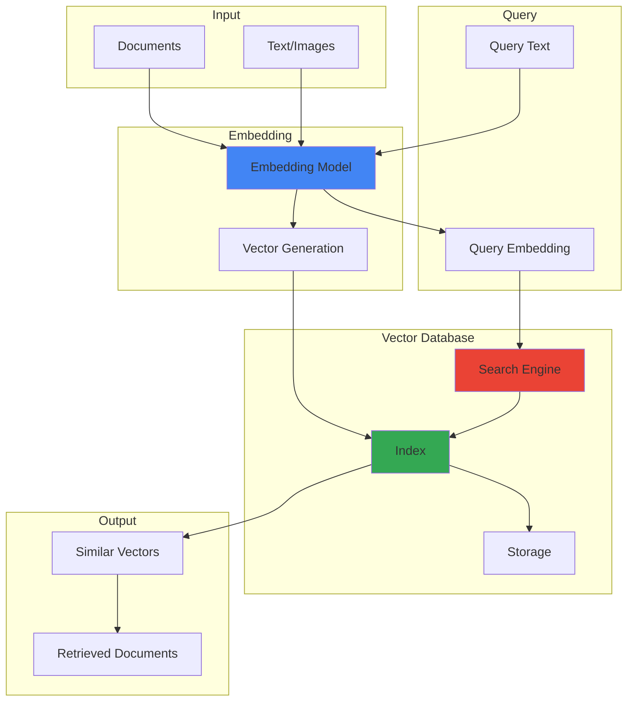

---

## 🔍 RAG System Flow

### Complete RAG Pipeline

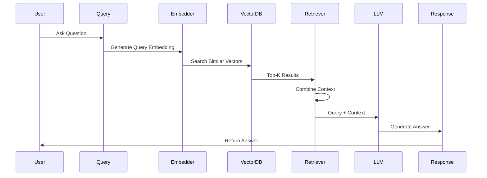

### Document Indexing Flow

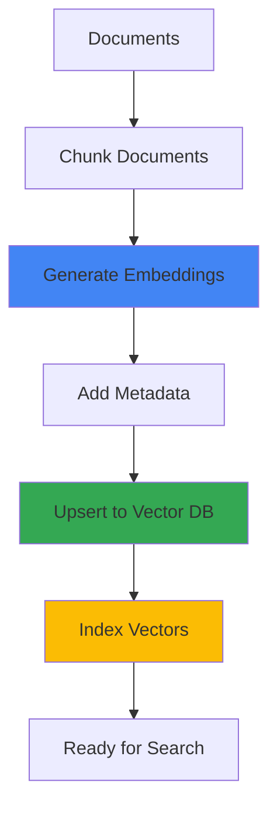

---

## 🔎 Similarity Search Flow

### Vector Search Process

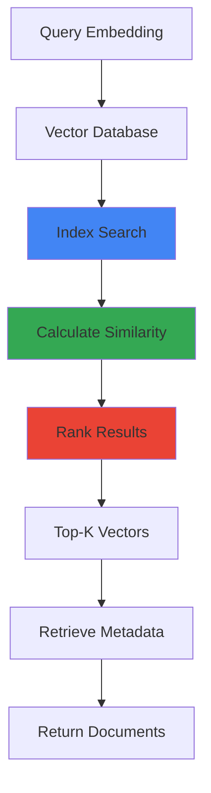

### Similarity Metrics

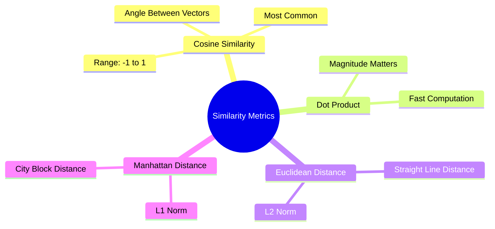

---

## 🔄 Hybrid Search Flow

### Vector + Keyword Search

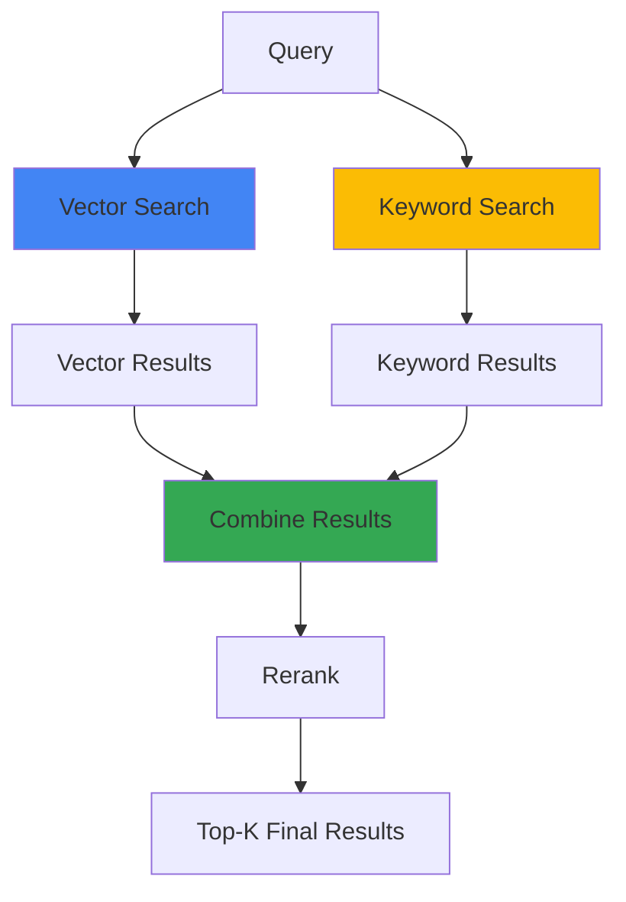

---

## 📊 Index Types

### HNSW Index

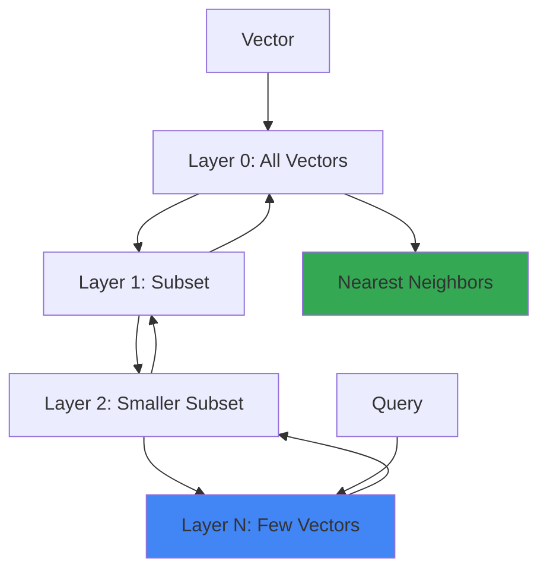

### IVF Index

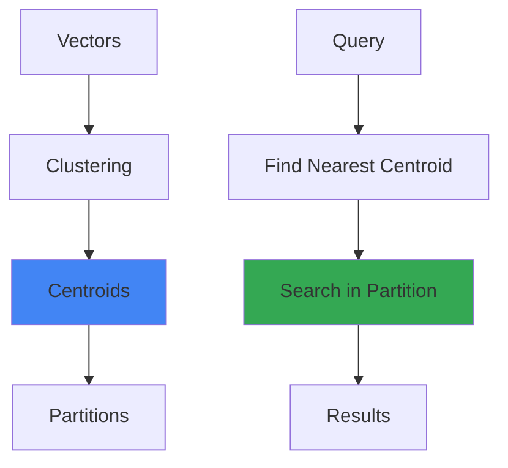

---

## 🎯 Multi-Stage Retrieval

### Coarse-to-Fine Search

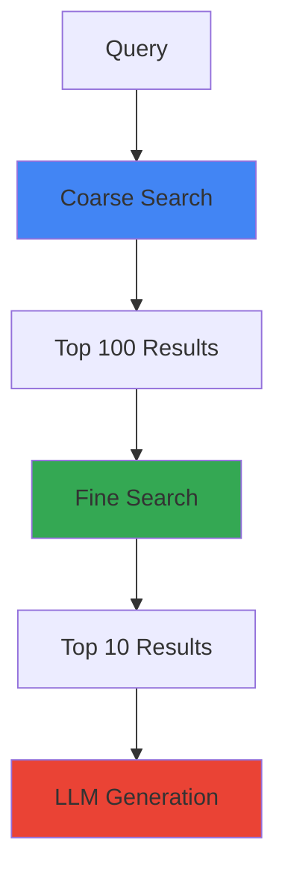

---

## 🔗 Integration Patterns

### LangChain Integration

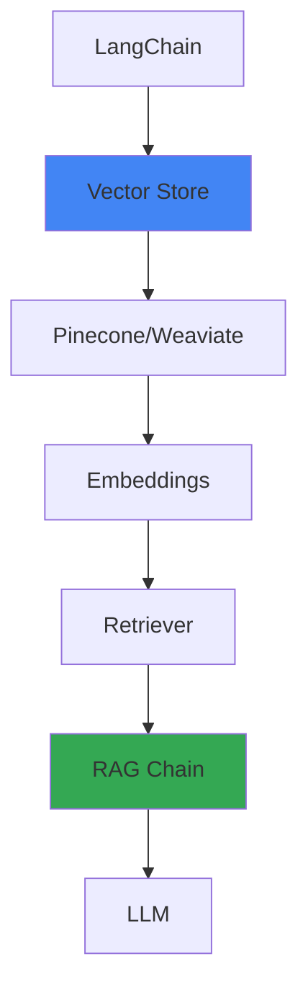

---

## 📈 Performance Optimization

### Chunking Strategy

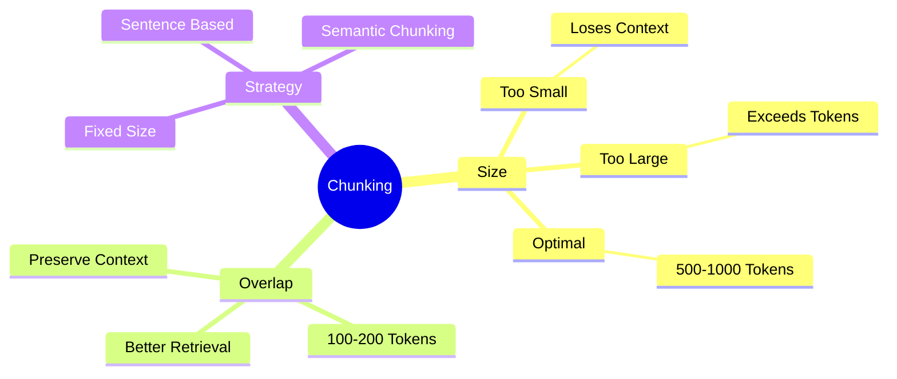

---

## 🎯 Key Visual Takeaways

1. **Embeddings = Vector Representations**
2. **Similarity = Distance Calculation**
3. **Index = Fast Search Structure**
4. **RAG = Retrieve + Generate**
5. **Hybrid = Vector + Keyword**

---

## 📚 Next Steps

1. ✅ Review these diagrams
2. 🏗️ Draw them yourself
3. 💬 Use in interviews
4. 🔗 Connect to your projects

---

**Visual learning helps!** Use these to explain Vector Databases in interviews.

