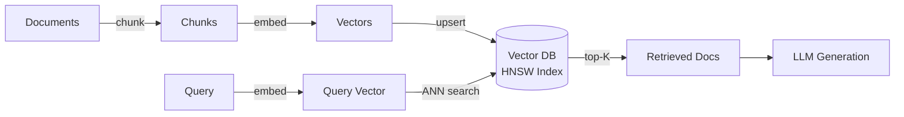

# Vector Databases -- Cheatsheet

## Architecture (30-second mental model)

## When to use vs alternatives
| Need | Use | Not |
|------|-----|-----|
| Semantic similarity search for RAG | Vector DB (Pinecone, Weaviate) | PostgreSQL with LIKE queries |
| Local prototyping, no infra | FAISS or ChromaDB | Pinecone (needs account) |
| Managed, zero-ops production scale | Pinecone Serverless | Self-hosted FAISS |
| Exact keyword match on structured data | Traditional RDBMS / Elasticsearch | Vector DB alone |
| Best of both worlds: meaning + keywords | Hybrid search (vector + BM25) | Pure vector search |

## 5 things you always forget
1. Cosine similarity ignores vector magnitude -- always use it for text embeddings; dot product only when magnitude carries meaning (e.g., popularity-weighted)
2. HNSW index trades memory for speed (keep everything in RAM) while IVF trades accuracy for memory -- pick based on your constraint, not habit
3. Chunk overlap (100-200 tokens) is not optional -- without it, answers that span chunk boundaries are silently lost
4. Metadata filters run **before** vector search in Pinecone -- filter on category/date to shrink the search space, not after retrieval
5. Embedding dimension directly impacts cost and latency: 384-dim (MiniLM) is 4x cheaper to store/query than 1536-dim (OpenAI ada) with only ~3% quality drop for most use cases

## Interview killer answer
> "In our production RAG system, switching from pure vector search to hybrid search with BM25 keyword matching and a cross-encoder reranker improved precision from 78% to 88%. The real win was adding metadata filtering by document date before the vector search -- it cut our P95 latency from 320ms to 85ms because Pinecone filters narrow the candidate set before the ANN traversal, not after."
