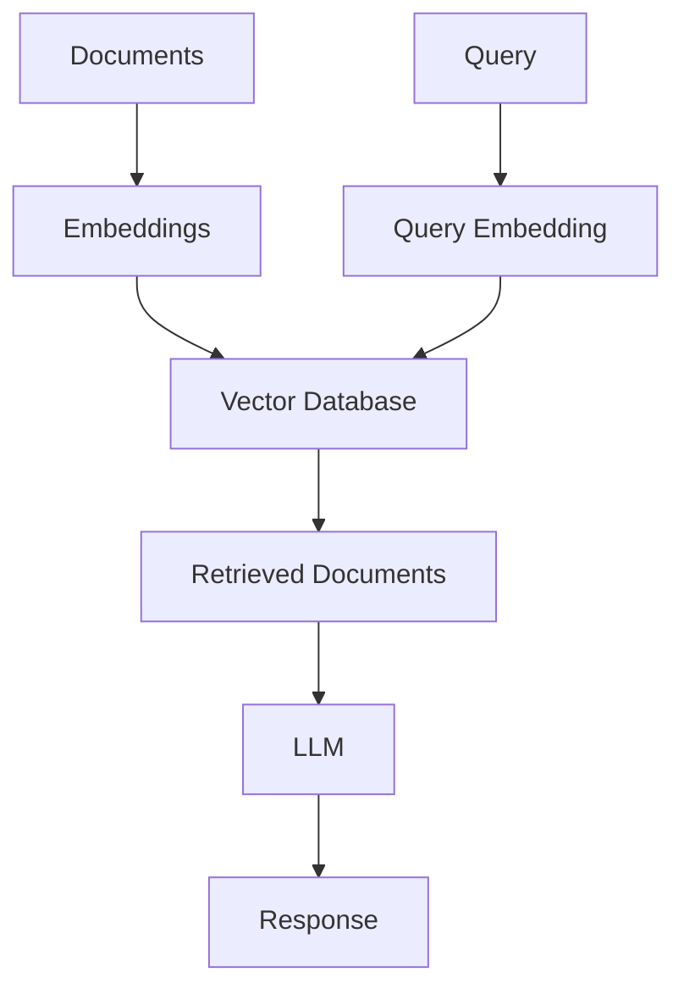

# Vector Databases Guide – Basic → Architect

## Level 1 – Launch & Basics

### 1. **Pinecone Setup**
```python
import pinecone

pinecone.init(api_key="your-key", environment="us-west1-gcp")
index = pinecone.Index("my-index")

# Upsert vectors
index.upsert(vectors=[
    ("id1", [0.1, 0.2, 0.3], {"text": "Hello"}),
    ("id2", [0.4, 0.5, 0.6], {"text": "World"})
])

# Query
results = index.query(
    vector=[0.1, 0.2, 0.3],
    top_k=5
)
```

### 2. **Chroma Setup**
```python
import chromadb

client = chromadb.Client()
collection = client.create_collection("my-collection")

# Add documents
collection.add(
    documents=["Hello world", "Hi there"],
    ids=["id1", "id2"],
    embeddings=[[0.1, 0.2], [0.3, 0.4]]
)

# Query
results = collection.query(
    query_texts=["Hello"],
    n_results=2
)
```

### 3. **FAISS Setup**
```python
import faiss
import numpy as np

# Create index
dimension = 128
index = faiss.IndexFlatL2(dimension)

# Add vectors
vectors = np.random.random((1000, dimension)).astype('float32')
index.add(vectors)

# Search
query = np.random.random((1, dimension)).astype('float32')
distances, indices = index.search(query, k=5)
```

## Level 2 – Production Patterns

### Embeddings Integration
```python
from sentence_transformers import SentenceTransformer

model = SentenceTransformer('all-MiniLM-L6-v2')
texts = ["Hello world", "Hi there"]
embeddings = model.encode(texts)

# Store in vector DB
index.upsert(vectors=[
    (f"id{i}", embedding.tolist(), {"text": text})
    for i, (embedding, text) in enumerate(zip(embeddings, texts))
])
```

### RAG System
```python
from langchain.vectorstores import Pinecone
from langchain.embeddings import OpenAIEmbeddings

embeddings = OpenAIEmbeddings()
vectorstore = Pinecone.from_documents(
    documents,
    embeddings,
    index_name="my-index"
)

retriever = vectorstore.as_retriever()
docs = retriever.get_relevant_documents("query")
```

### Metadata Filtering
```python
# Pinecone
results = index.query(
    vector=query_vector,
    top_k=5,
    filter={"category": "tech", "year": 2024}
)

# Chroma
results = collection.query(
    query_embeddings=[query_vector],
    n_results=5,
    where={"category": "tech"}
)
```

## Level 3 – Architect Playbook

### Hybrid Search
```python
# Combine vector and keyword search
def hybrid_search(query, vector_db, keyword_index):
    # Vector search
    vector_results = vector_db.query(query_vector, top_k=10)
    
    # Keyword search
    keyword_results = keyword_index.search(query, top_k=10)
    
    # Combine and rerank
    combined = combine_results(vector_results, keyword_results)
    return rerank(combined, query)
```

### Advanced RAG
```python
from langchain.retrievers import ContextualCompressionRetriever
from langchain.retrievers.document_compressors import LLMChainExtractor

compressor = LLMChainExtractor.from_llm(llm)
compression_retriever = ContextualCompressionRetriever(
    base_compressor=compressor,
    base_retriever=vectorstore.as_retriever()
)
```

### Production Deployment
```python
from fastapi import FastAPI
import pinecone

app = FastAPI()
index = pinecone.Index("production-index")

@app.post("/search")
def search(query: str, top_k: int = 5):
    embedding = model.encode(query)
    results = index.query(
        vector=embedding.tolist(),
        top_k=top_k
    )
    return results
```

## Ops Cheat Sheet

| Task | Command | Notes |
| --- | --- | --- |
| Create index | `pinecone.create_index()` | Create new index |
| Upsert vectors | `index.upsert()` | Add/update vectors |
| Query | `index.query()` | Search vectors |
| Delete | `index.delete()` | Delete vectors |
| Stats | `index.describe_index_stats()` | Index statistics |

## Architecture Patterns



## Checklist Before Production

- [ ] Choose appropriate vector database (Pinecone, Chroma, Weaviate)
- [ ] Set up proper embedding model
- [ ] Implement chunking strategy
- [ ] Configure metadata filtering
- [ ] Set up hybrid search if needed
- [ ] Implement proper indexing
- [ ] Set up monitoring and alerting
- [ ] Configure backup and recovery
- [ ] Optimize for performance
- [ ] Implement proper security and access control
