# Vertex AI - Visual Learning Guide

## 🎨 Visual Learning: Flowcharts, Diagrams, and Architecture

This guide uses **visual diagrams** to help you understand Vertex AI concepts. Perfect for visual learners!

---

## 📊 Table of Contents

1. [Vertex AI Overview](#vertex-ai-overview)
2. [Training Flow](#training-flow)
3. [Deployment Flow](#deployment-flow)
4. [Prediction Flow](#prediction-flow)
5. [Pipeline Architecture](#pipeline-architecture)
6. [Monitoring Flow](#monitoring-flow)
7. [Cost Optimization](#cost-optimization)

---

## 🏗️ Vertex AI Overview

### High-Level Architecture

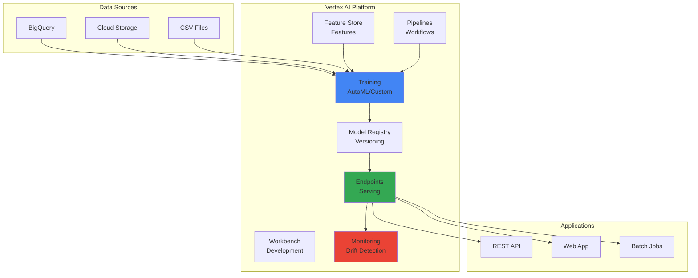

### Component Relationships

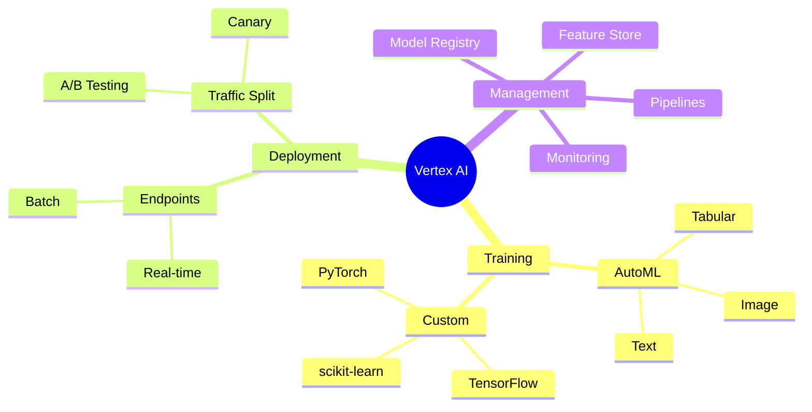

---

## 🚀 Training Flow

### AutoML Training Process

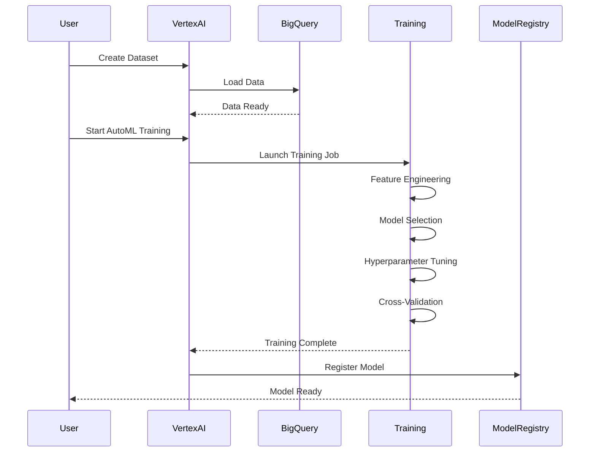

### Custom Training Process

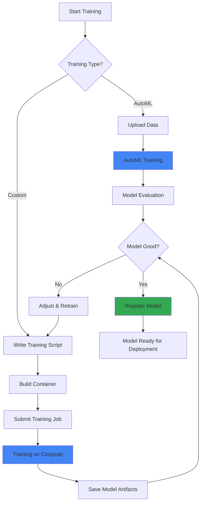

### Training Decision Tree

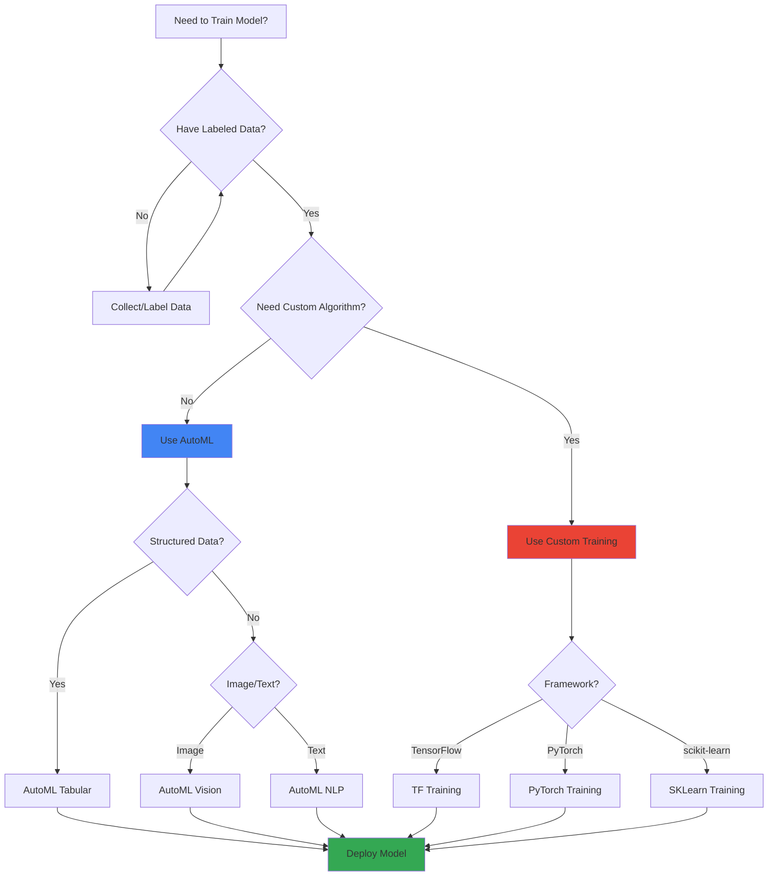

---

## 🎯 Deployment Flow

### Model Deployment Process

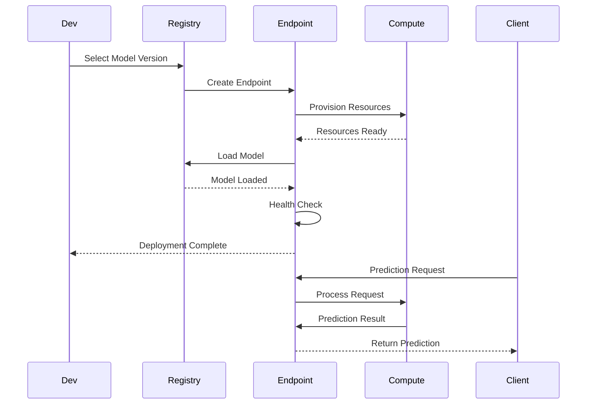

### Deployment Architecture

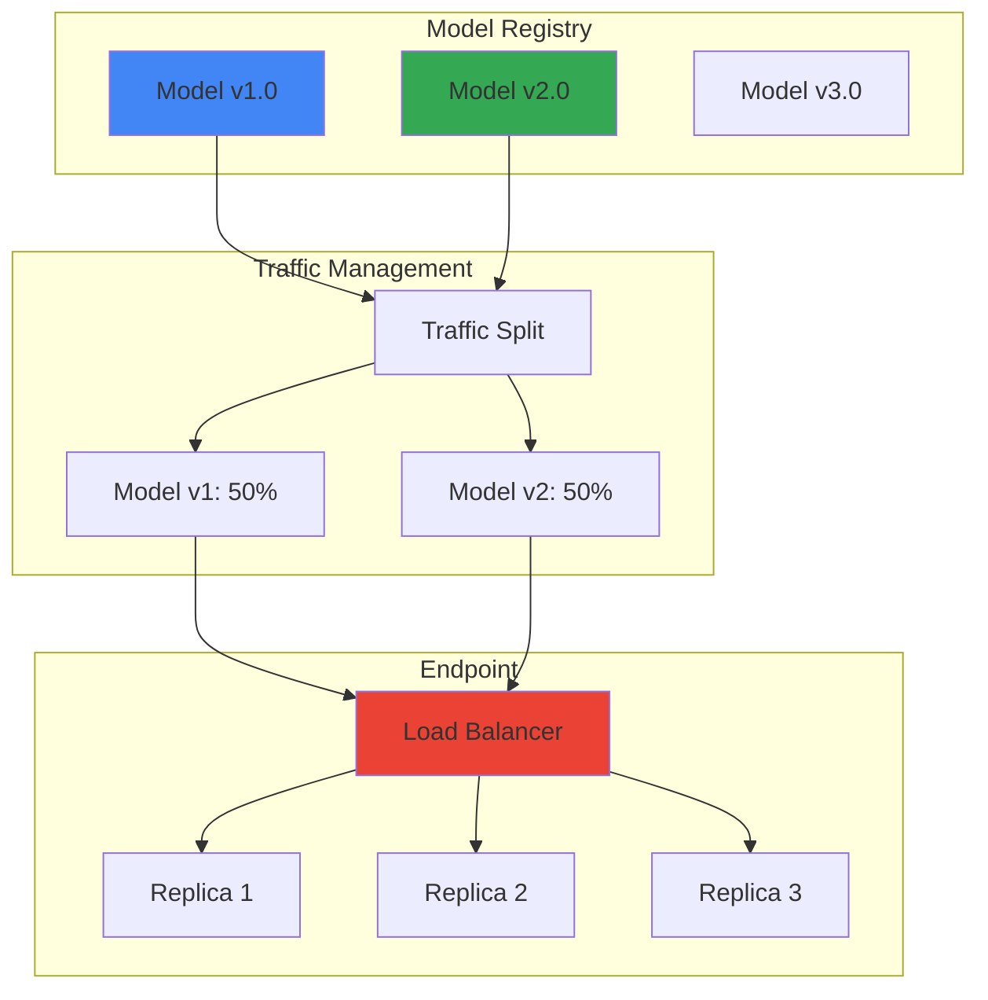

### A/B Testing Flow

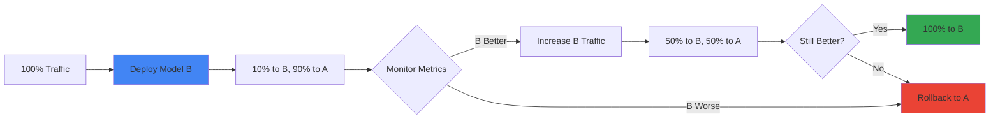

---

## 🔮 Prediction Flow

### Real-Time Prediction

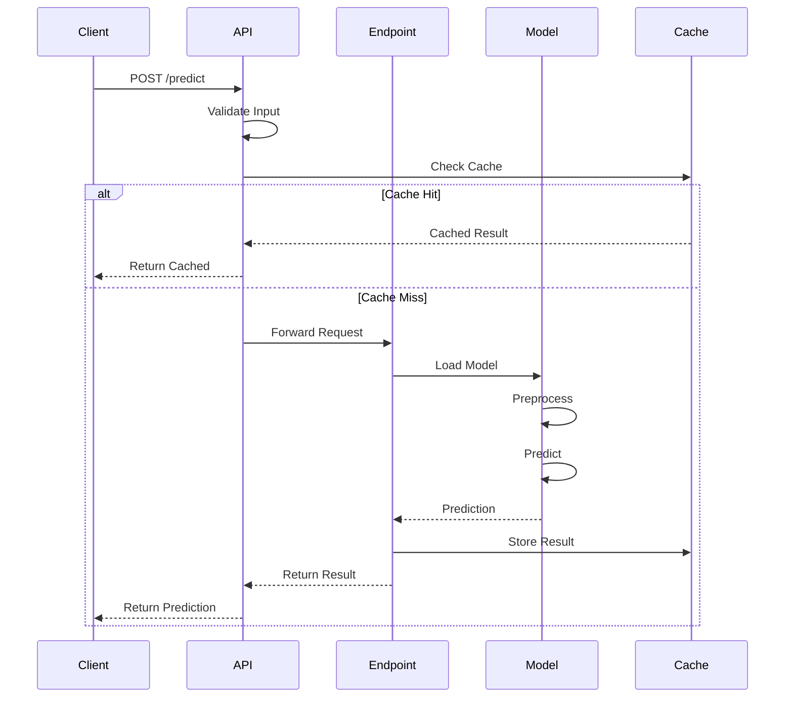

### Batch Prediction Flow

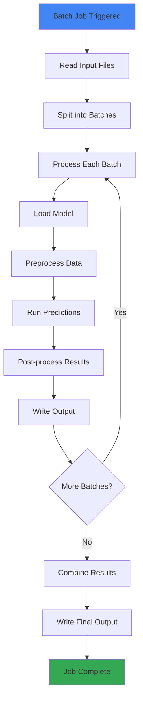

---

## 🔄 Pipeline Architecture

### ML Pipeline Flow

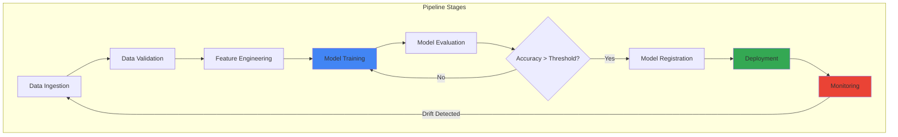

### Pipeline Components

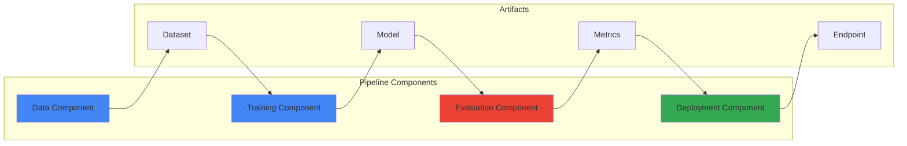

---

## 📊 Monitoring Flow

### Model Monitoring Process

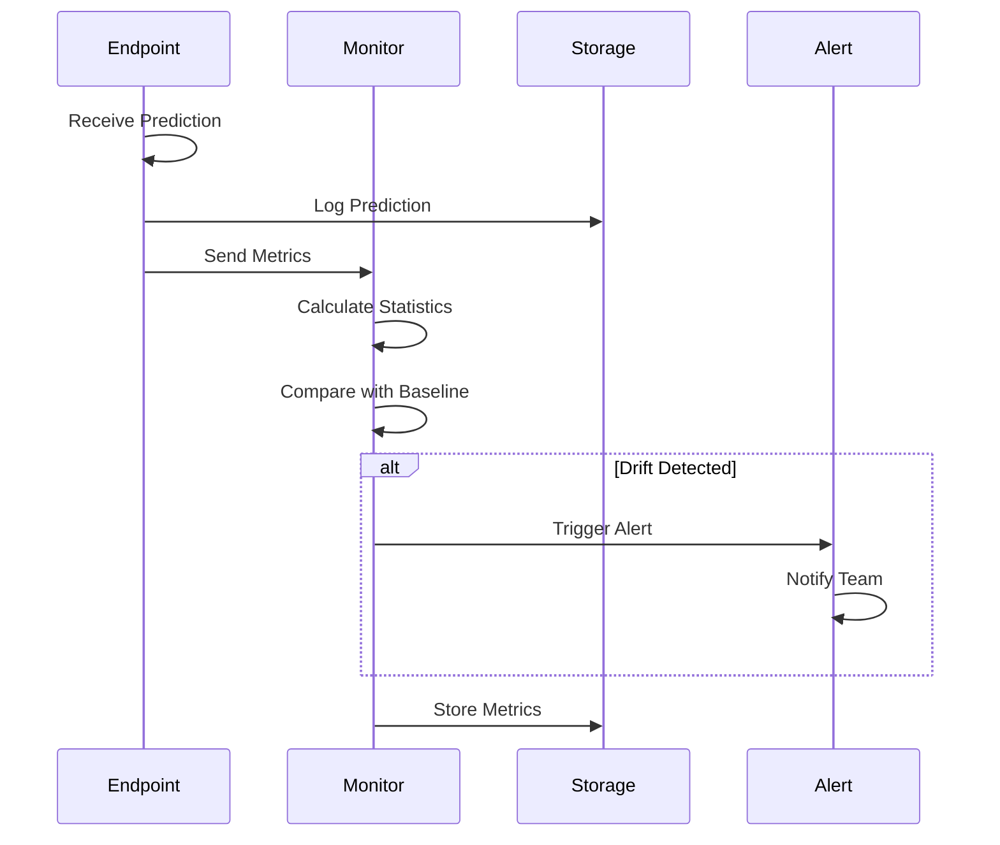

### Drift Detection Flow

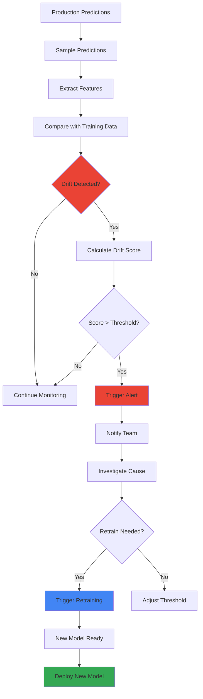

---

## 💰 Cost Optimization

### Cost Optimization Strategies

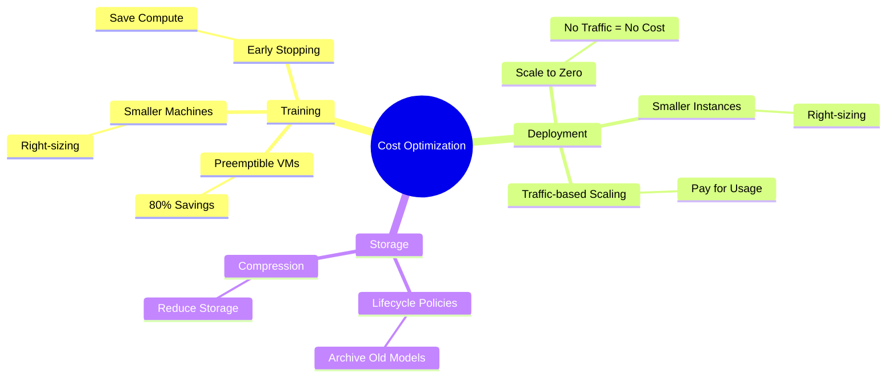

### Scaling Strategy

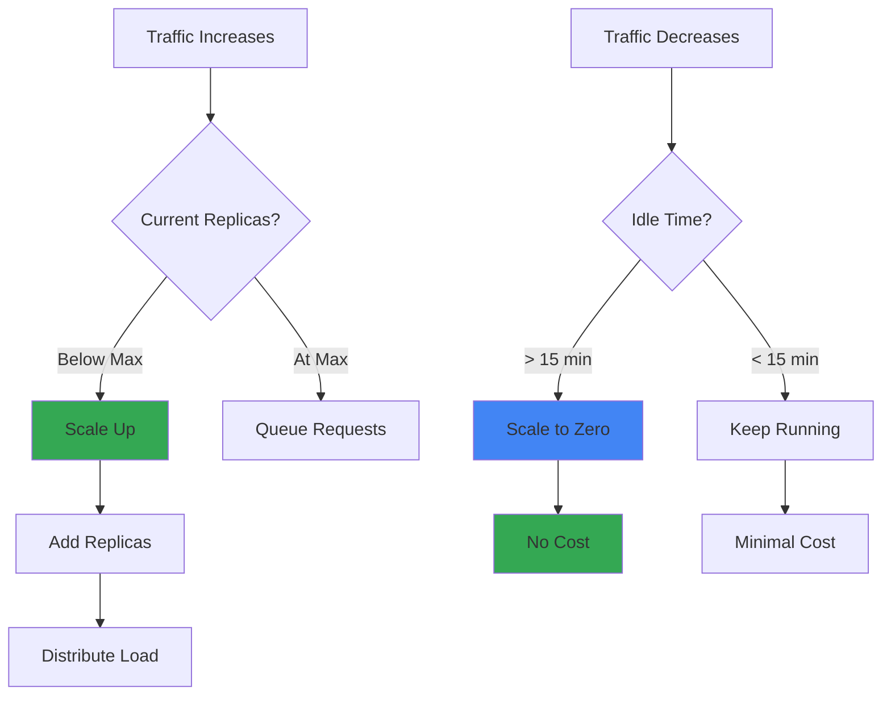

---

## 🎯 Key Visual Takeaways

1. **Training**: Data → Training → Model Registry
2. **Deployment**: Model → Endpoint → Traffic Management
3. **Prediction**: Request → Endpoint → Model → Response
4. **Pipeline**: Automated workflow with stages
5. **Monitoring**: Continuous drift detection
6. **Cost**: Optimize with scaling and preemptible VMs

---

## 📚 Next Steps

1. ✅ Review these diagrams
2. 🏗️ Draw them yourself (practice)
3. 💬 Use in interviews (explain flows)
4. 🔗 Connect to your POCs

---

**Visual learning helps!** Draw these diagrams when explaining Vertex AI in interviews.

