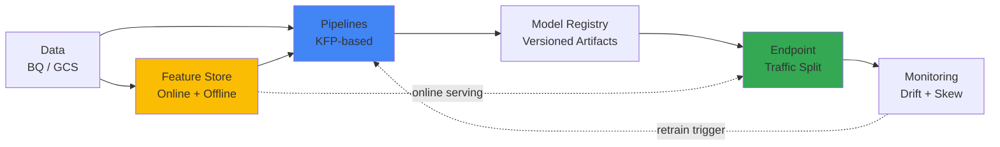

# Vertex AI -- Cheatsheet

## Architecture (30-second mental model)

Vertex-specific: KFP Pipelines orchestrate, Feature Store feeds both training and serving, Model Registry versions artifacts, Endpoints handle traffic splits, Monitoring closes the loop.

## When to use vs alternatives
| Need | Use | Not |
|------|-----|-----|
| End-to-end ML on GCP with managed infra | Vertex AI | SageMaker (AWS-locked) |
| Quick baseline model, no code | Vertex AutoML | Vertex Custom Training (overkill) |
| Full framework control (PyTorch, custom loops) | Vertex Custom Training | AutoML (black box) |
| Experiment tracking as primary workflow | MLflow / W&B standalone | Vertex Experiments (less mature) |
| Real-time serving at massive scale with custom containers | Vertex Endpoints | Cloud Run (no built-in model monitoring) |

## 5 things you always forget
1. `min_replica_count=0` enables scale-to-zero on endpoints -- saves 80%+ serving cost during off-hours, but cold start adds ~30s latency.
2. Preemptible VMs (`use_preemptible_vms=True`) for training jobs save 80% but can be preempted -- always enable checkpointing.
3. Traffic split keys are platform-assigned deployed model IDs (strings like `"1234567890"`), not model names or indices -- always fetch IDs from `endpoint.list_models()` before updating splits.
4. Feature Store online serving requires a fixed node count provisioned upfront; it does NOT auto-scale, so over-provision or face latency spikes.
5. Pipeline components need `packages_to_install` declared in the `@component` decorator -- imports inside the function body alone will fail at runtime.

## Interview killer answer
> "We ran AutoML for a baseline AUC of 0.82, then custom XGBoost training hit 0.91. In production, we deployed both behind one endpoint with a 90/10 traffic split and set Vertex Model Monitoring to alert on 5% prediction drift. When drift fired, a Cloud Function kicked off the Vertex Pipeline to retrain, evaluate against the champion, and auto-promote only if the challenger was statistically better. The moment that saved us was catching a silent feature distribution shift that AutoML would have missed."
