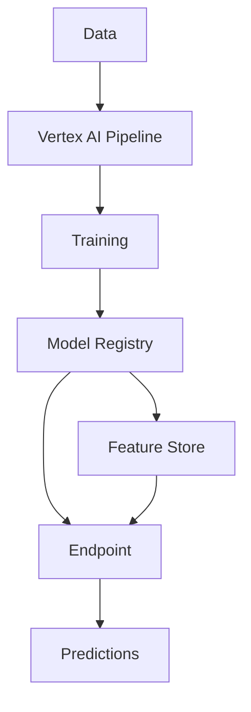

# Vertex AI Guide – Basic → Architect

## Level 1 – Launch & Basics

### 1. **Setup**
```bash
# Install SDK
pip install google-cloud-aiplatform

# Authenticate
gcloud auth application-default login
```

### 2. **AutoML**
```python
from google.cloud import aiplatform

aiplatform.init(project="my-project", location="us-central1")

# AutoML Tabular
dataset = aiplatform.TabularDataset.create(
    display_name="my-dataset",
    gcs_source="gs://bucket/data.csv"
)

job = aiplatform.AutoMLTabularTrainingJob(
    display_name="train-automl",
    optimization_objective="minimize-rmse"
)

model = job.run(
    dataset=dataset,
    target_column="target",
    training_fraction_split=0.8,
    model_display_name="my-model"
)
```

### 3. **Custom Training**
```python
from google.cloud import aiplatform

# Create custom training job
job = aiplatform.CustomTrainingJob(
    display_name="my-training-job",
    script_path="train.py",
    container_uri="gcr.io/my-project/trainer:latest"
)

model = job.run(
    args=["--epochs", "10"],
    replica_count=1,
    machine_type="n1-standard-4"
)
```

## Level 2 – Production Patterns

### Pipelines
```python
from kfp.v2 import dsl
from google.cloud import aiplatform

@dsl.pipeline(name="ml-pipeline")
def pipeline():
    # Component 1: Data preprocessing
    preprocess_op = preprocess_component()
    
    # Component 2: Training
    train_op = train_component(
        input_data=preprocess_op.outputs["processed_data"]
    )
    
    # Component 3: Evaluation
    eval_op = evaluate_component(
        model=train_op.outputs["model"]
    )

# Compile and run
from kfp.v2 import compiler
compiler.Compiler().compile(pipeline_func=pipeline, package_path="pipeline.json")

job = aiplatform.PipelineJob(
    display_name="my-pipeline",
    template_path="pipeline.json"
)
job.run()
```

### Feature Store
```python
from google.cloud import aiplatform

# Create feature store
featurestore = aiplatform.Featurestore.create(
    featurestore_id="my-featurestore",
    online_serving_config={
        "fixed_node_count": 1
    }
)

# Create entity type
entity_type = featurestore.create_entity_type(
    entity_type_id="users"
)

# Create feature
entity_type.create_feature(
    feature_id="age",
    value_type="INT64"
)
```

### Model Deployment
```python
# Deploy to endpoint
endpoint = model.deploy(
    deployed_model_display_name="my-deployed-model",
    machine_type="n1-standard-2",
    min_replica_count=1,
    max_replica_count=3
)

# Predict
predictions = endpoint.predict(instances=[[1, 2, 3]])
```

## Level 3 – Architect Playbook

### Distributed Training
```python
job = aiplatform.CustomTrainingJob(
    display_name="distributed-training",
    script_path="train.py",
    container_uri="gcr.io/my-project/trainer:latest"
)

model = job.run(
    args=["--epochs", "100"],
    replica_count=4,
    machine_type="n1-standard-8",
    accelerator_type="NVIDIA_TESLA_V100",
    accelerator_count=1
)
```

### MLOps Integration
```python
from google.cloud import aiplatform
from google.cloud.aiplatform import pipeline_jobs

# Trigger pipeline on schedule
pipeline_job = aiplatform.PipelineJob(
    display_name="scheduled-pipeline",
    template_path="pipeline.json",
    parameter_values={"epochs": 10}
)

# Set up Cloud Scheduler to trigger this
```

### Model Monitoring
```python
# Set up model monitoring
from google.cloud.aiplatform import model_monitoring

monitoring = model_monitoring.ModelMonitoring(
    model=model,
    objective_config={
        "target": "prediction",
        "data_source": "gs://bucket/predictions"
    }
)
```

## Ops Cheat Sheet

| Task | Command | Notes |
| --- | --- | --- |
| List models | `aiplatform.Model.list()` | View all models |
| Get model | `aiplatform.Model(model_id)` | Get model |
| Deploy | `model.deploy()` | Deploy to endpoint |
| Predict | `endpoint.predict()` | Make predictions |
| List endpoints | `aiplatform.Endpoint.list()` | View endpoints |
| Delete endpoint | `endpoint.delete()` | Remove endpoint |

## Architecture Patterns



## Checklist Before Production

- [ ] Set up proper IAM roles and permissions
- [ ] Configure VPC for network isolation
- [ ] Set up model registry for versioning
- [ ] Implement proper monitoring and alerting
- [ ] Configure auto-scaling for endpoints
- [ ] Set up feature store for ML features
- [ ] Implement proper logging and auditing
- [ ] Configure cost monitoring and optimization
- [ ] Set up CI/CD for model deployment
- [ ] Implement proper security and encryption
