# Machine Learning Guide

## Table of Contents
1. [Introduction](#introduction)
2. [History](#history)
3. [Relationships to Other Fields](#relationships-to-other-fields)
4. [Theory](#theory)
5. [Approaches](#approaches)
6. [Models](#models)
7. [Applications](#applications)
8. [Limitations](#limitations)
9. [Model Assessments](#model-assessments)
10. [Ethics](#ethics)
11. [Hardware](#hardware)
12. [Software](#software)
13. [Journals and Conferences](#journals-and-conferences)

## Introduction
Machine learning (ML) is a field of study in artificial intelligence concerned with the development and study of statistical algorithms that can learn from data and generalize to unseen data, performing tasks without explicit instructions. ML finds application in natural language processing, computer vision, speech recognition, email filtering, agriculture, and medicine.

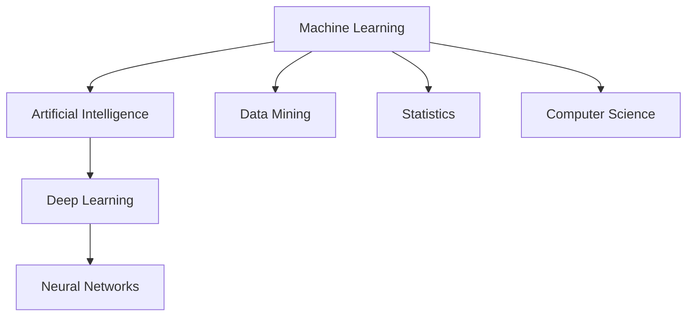

## History
The term machine learning was coined in 1959 by Arthur Samuel. Early work included pattern recognition in the 1970s and neural networks in the 1980s. Key milestones include backpropagation in the mid-1980s, generative adversarial networks in 2014, and AlphaGo's victory in 2016.

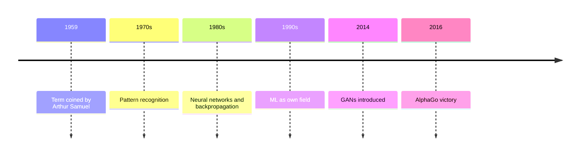

## Relationships to Other Fields
ML is a subset of AI. It overlaps with data mining for prediction vs. discovery. Statistics provides foundations like bias-variance decomposition. Statistical physics applies to neural networks. Data compression uses ML for prediction.

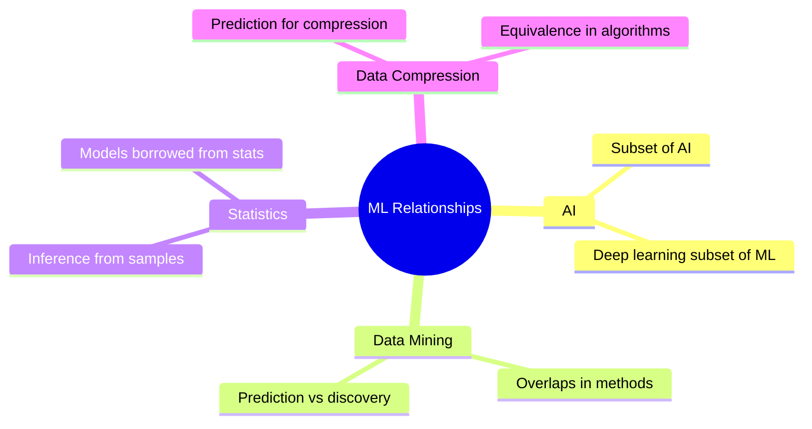

## Theory
ML focuses on generalization: ability to perform accurately on new data. Training sets are finite, so probabilistic bounds are used. Bias-variance decomposition quantifies generalization error. Complexity matching between hypothesis and data is key.

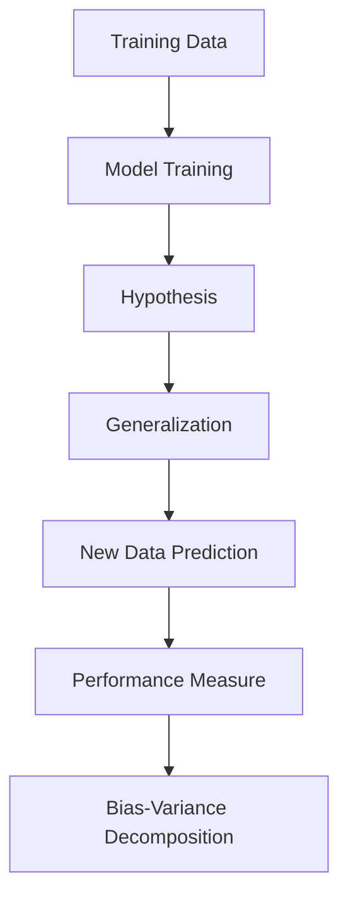

## Approaches
ML approaches divide into supervised (labeled data), unsupervised (unlabeled data), semi-supervised (mixed), and reinforcement (actions and rewards). Other types include self-learning, feature learning, anomaly detection, and association rules.

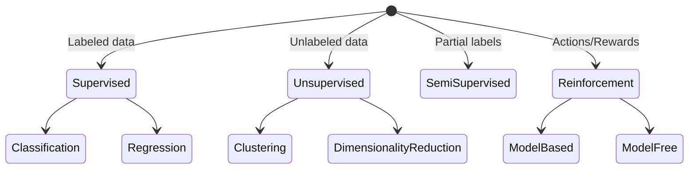

## Models
Models include artificial neural networks (layers of neurons), decision trees (branching predictions), support-vector machines (linear boundaries), regression analysis (relationship estimation), Bayesian networks (probabilistic graphs), Gaussian processes (stochastic processes), genetic algorithms (evolution-inspired), belief functions (uncertainty handling), and rule-based models (interpretable rules).

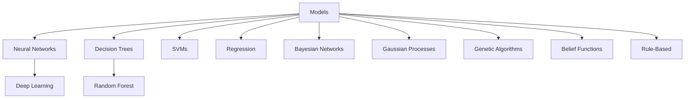

## Applications
ML applies to agriculture, anatomy, adaptive websites, affective computing, astronomy, automated decision-making, banking, bioinformatics, brain-machine interfaces, cheminformatics, citizen science, climate science, computer networks, computer vision, credit-card fraud detection, data quality, DNA sequence classification, economics, financial data analysis, general game playing, handwriting recognition, healthcare, information retrieval, insurance, internet fraud detection, investment management, knowledge graph embedding, linguistics, machine learning control, machine perception, machine translation, material engineering, marketing, medical diagnosis, natural language processing, natural language understanding, online advertising, optimisation, recommender systems, robot locomotion, search engines, sentiment analysis, sequence mining, software engineering, speech recognition, structural health monitoring, syntactic pattern recognition, telecommunications, theorem proving, time-series forecasting, tomographic reconstruction, user behaviour analytics.

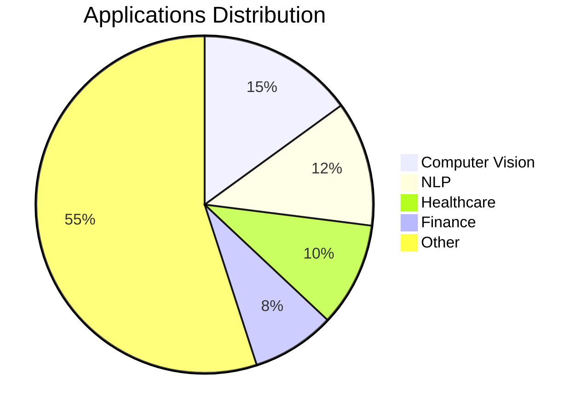

## Limitations
ML can fail due to lack of data, biased data, wrong algorithms, or evaluation problems. Black box nature lacks explainability. Overfitting occurs when models fit training data too closely. Vulnerabilities include adversarial attacks and backdoors.

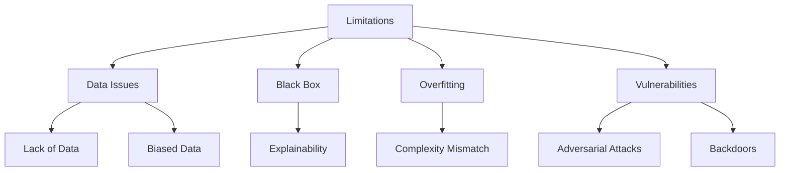

## Model Assessments
Models are validated using holdout method (train/test split), K-fold cross-validation, and bootstrap. Metrics include accuracy, sensitivity, specificity, false positive/negative rates, ROC curves, and AUC.

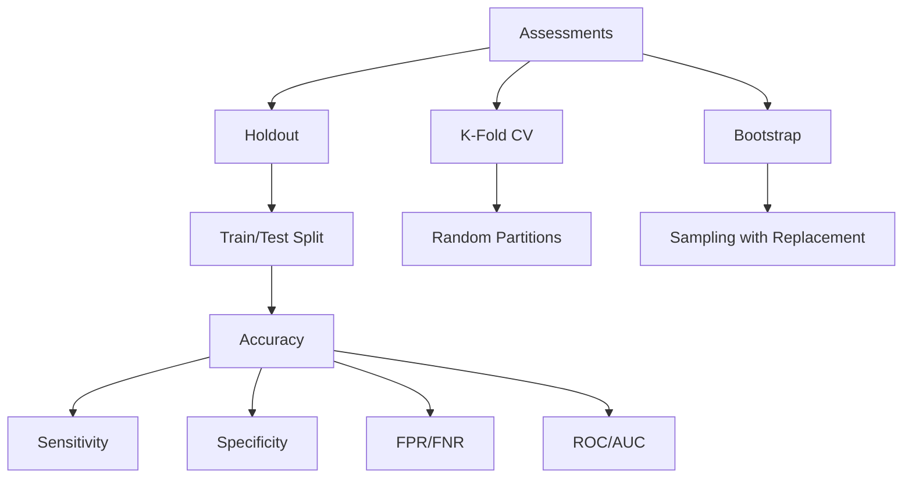

## Ethics
Ethics cover algorithmic biases, fairness, automated decision-making, accountability, privacy, and regulation. Issues include financial incentives, bias in data, and societal impacts like job losses or misuse.

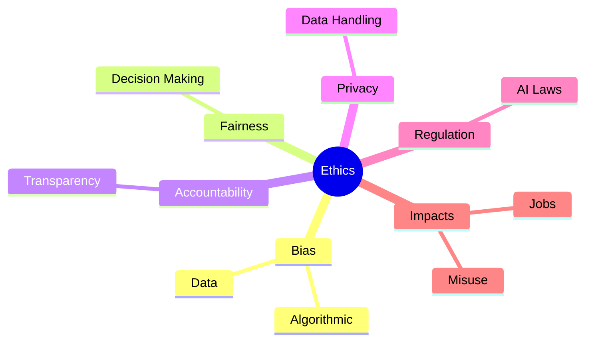

## Hardware
Advances in GPUs and AI-specific enhancements enabled efficient deep learning training. Embedded ML uses limited resources like wearables and edge devices, with techniques like hardware acceleration and model optimization.

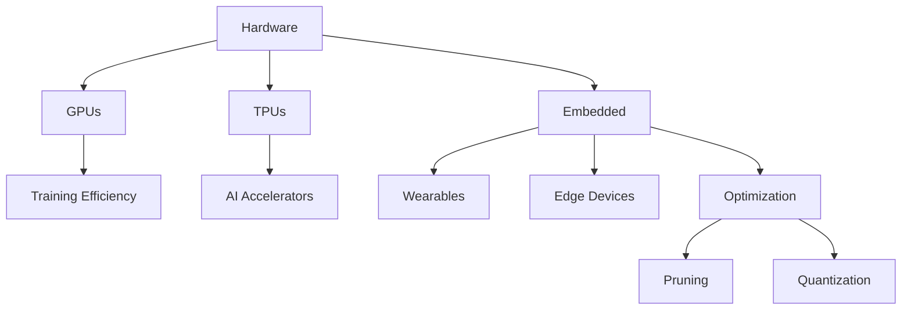

## Software
Free/open-source: scikit-learn, TensorFlow, PyTorch, Keras, MXNet, etc. Proprietary: Amazon ML, Azure ML, Google Cloud Vertex AI, etc. Suites like TensorFlow, PyTorch for frameworks.

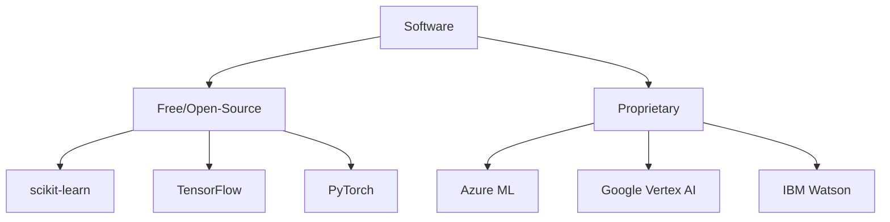

## Journals and Conferences
Journals: Journal of Machine Learning Research, Machine Learning, Nature Machine Intelligence, Neural Computation, IEEE Transactions on Pattern Analysis and Machine Intelligence. Conferences: AAAI, ACL, ECML PKDD, ICML, ICLR, NeurIPS, KDD.

```mermaid
graph TD
    A[Journals] --> B[JMLR]
    A --> C[Machine Learning]
    A --> D[Nature MI]
    A --> E[Neural Computation]
    A --> F[IEEE TPAMI]
    G[Conferences] --> H[AAAI]
    G --> I[ACL]
    G --> J[ECML PKDD]
    G --> K[ICML]
    G --> L[ICLR]
    G --> M[NeurIPS]
    G --> N[KDD]
```</content>
<parameter name="filePath">/Users/sivarajumalladi/Documents/GitHub/LearningBot/14-TechStack/MachineLearning/guide.md
