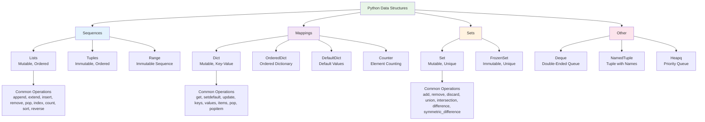
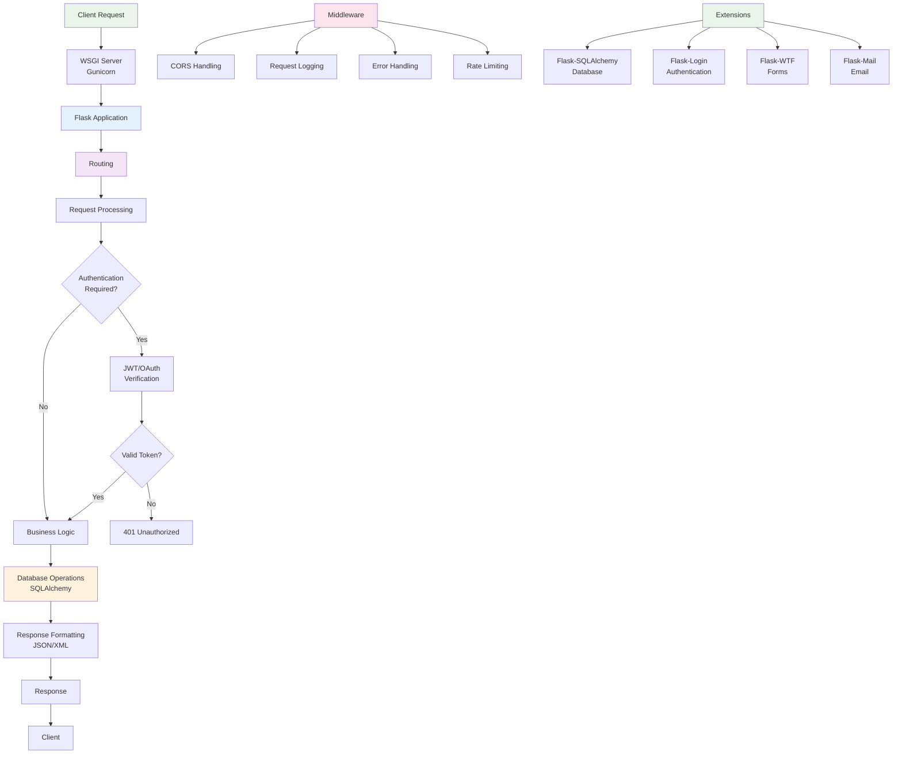
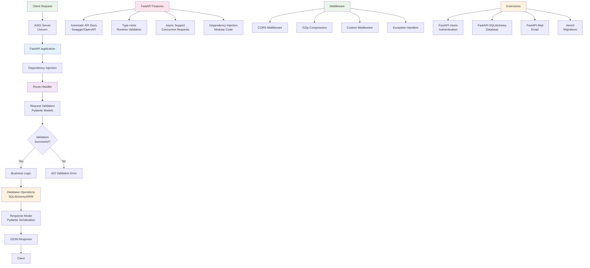
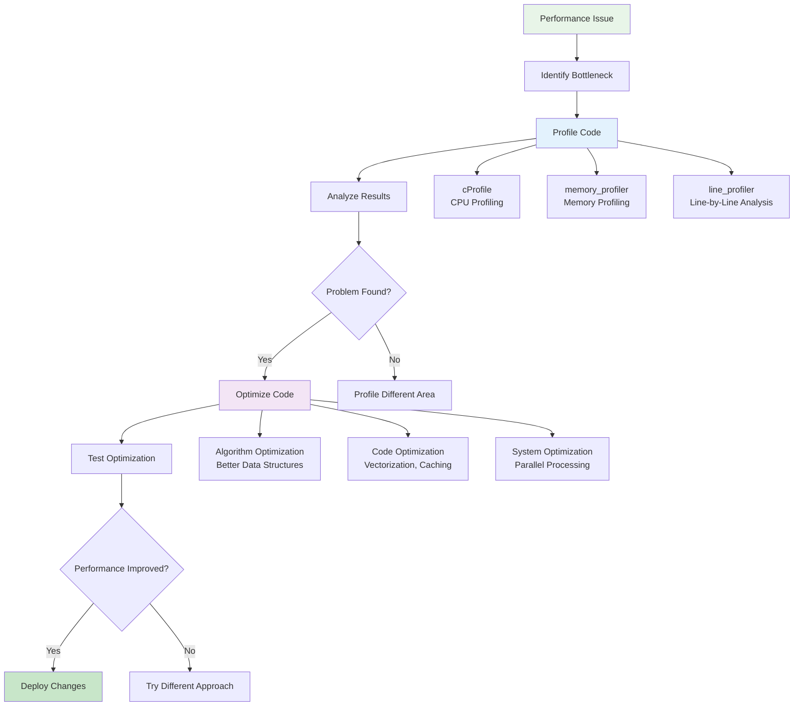
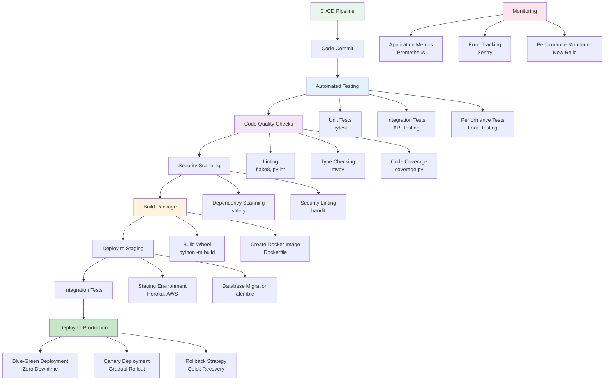

# Python: Visual Guide

## Core Language Features

### Python Data Structures Hierarchy



### Function Types and Features

```mermaid
graph TD
    A[Python Functions] --> B[Built-in Functions]
    A --> C[User-defined Functions]
    A --> D[Lambda Functions]
    A --> E[Generator Functions]

    C --> C1[Regular Functions]
    C --> C2[Decorated Functions]
    C --> C3[Recursive Functions]

    C2 --> C2a[@staticmethod]
    C2 --> C2b[@classmethod]
    C2 --> C2c[@property]
    C2 --> C2d[Custom Decorators]

    E --> E1[Generator Expressions]
    E --> E2[Generator Functions<br/>with yield]

    F[Function Features] --> F1[Default Arguments]
    F --> F2[Keyword Arguments]
    F --> F3[*args - Variable Positional]
    F --> F4[**kwargs - Variable Keyword]
    F --> F5[Type Hints]
    F --> F6[Docstrings]

    G[Advanced Patterns] --> G1[Closures]
    G --> G2[Partial Functions]
    G --> G3[Function Composition]
    G --> G4[Memoization with lru_cache]

    style A fill:#e8f5e8
    style C fill:#e3f2fd
    style E fill:#f3e5f5
    style F fill:#fff3e0
    style G fill:#fce4ec
```

### Object-Oriented Programming Structure

```mermaid
graph TD
    A[OOP in Python] --> B[Classes]
    A --> C[Objects/Instances]
    A --> D[Inheritance]
    A --> E[Polymorphism]
    A --> F[Encapsulation]

    B --> B1[Class Attributes]
    B --> B2[Instance Attributes]
    B --> B3[Methods]
    B --> B4[Class Methods]
    B --> B5[Static Methods]
    B --> B6[Properties]

    D --> D1[Single Inheritance]
    D --> D2[Multiple Inheritance]
    D --> D3[Method Resolution Order]

    E --> E1[Method Overriding]
    E --> E2[Operator Overloading]
    E --> E3[Duck Typing]

    F --> F1[Public Attributes]
    F --> F2[Protected Attributes<br/>_single_underscore]
    F --> F3[Private Attributes<br/>__double_underscore]

    G[Special Methods] --> G1[__init__<br/>Constructor]
    G --> G2[__str__<br/>String Representation]
    G --> G3[__repr__<br/>Official Representation]
    G --> G4[__len__<br/>Length]
    G --> G5[__getitem__<br/>Indexing]
    G --> G6[__call__<br/>Callable Objects]

    H[Advanced Concepts] --> H1[Abstract Base Classes]
    H --> H2[Data Classes]
    H --> H3[Context Managers]
    H --> H4[Descriptors]

    style A fill:#e8f5e8
    style B fill:#e3f2fd
    style D fill:#f3e5f5
    style G fill:#fff3e0
    style H fill:#fce4ec
```



## Data Science and Machine Learning

### NumPy Array Operations

```mermaid
graph TD
    A[NumPy Operations] --> B[Array Creation]
    A --> C[Array Manipulation]
    A --> D[Mathematical Operations]
    A --> E[Broadcasting]

    B --> B1[np.array()<br/>From Lists]
    B --> B2[np.zeros()<br/>Zero Arrays]
    B --> B3[np.ones()<br/>One Arrays]
    B --> B4[np.random<br/>Random Arrays]
    B --> B5[np.arange()<br/>Ranges]
    B --> B6[np.linspace()<br/>Linear Spaces]

    C --> C1[Reshaping<br/>reshape()]
    C --> C2[Transposing<br/>T, transpose()]
    C --> C3[Concatenation<br/>concatenate(), vstack(), hstack()]
    C --> C4[Splitting<br/>split(), vsplit(), hsplit()]
    C --> C5[Indexing<br/>Boolean, Fancy, Slicing]

    D --> D1[Element-wise<br/>+, -, *, /, **]
    D --> D2[Matrix Operations<br/>dot(), @, matmul()]
    D --> D3[Aggregation<br/>sum(), mean(), std(), min(), max()]
    D --> D4[Linear Algebra<br/>eig(), svd(), inv()]

    E --> E1[Shape Compatibility]
    E --> E2[Automatic Expansion]
    E --> E3[Dimension Alignment]

    F[Performance Features] --> F1[Vectorization]
    F --> F2[Memory Efficiency]
    F --> F3[C API Integration]

    style A fill:#e8f5e8
    style B fill:#e3f2fd
    style C fill:#f3e5f5
    style D fill:#fff3e0
    style E fill:#fce4ec
    style F fill:#e8f5e8
```

### Pandas DataFrame Operations

```mermaid
graph TD
    A[Pandas Operations] --> B[DataFrame Creation]
    A --> C[Data Selection]
    A --> D[Data Manipulation]
    A --> E[Grouping & Aggregation]
    A --> F[Time Series]

    B --> B1[From Dict<br/>pd.DataFrame(dict)]
    B --> B2[From CSV<br/>pd.read_csv()]
    B --> B3[From SQL<br/>pd.read_sql()]
    B --> B4[From Excel<br/>pd.read_excel()]

    C --> C1[Column Selection<br/>df['col'], df.col]
    C --> C2[Row Selection<br/>df.loc[], df.iloc[]]
    C --> C3[Boolean Indexing<br/>df[df['col'] > value]]
    C --> C4[Conditional Selection<br/>df.query('condition')]

    D --> D1[Adding Columns<br/>df['new_col'] = ...]
    D --> D2[Applying Functions<br/>df.apply(), df.map()]
    D --> D3[String Operations<br/>df.str.method()]
    D --> D4[Missing Data<br/>df.dropna(), df.fillna()]

    E --> E1[df.groupby('col')]
    E --> E2[Aggregation Functions<br/>sum, mean, count, std]
    E --> E3[Transform<br/>group.transform()]
    E --> E4[Filter<br/>group.filter()]

    F --> F1[DateTime Indexing<br/>df.set_index('date')]
    F --> F2[Resampling<br/>df.resample('D')]
    F --> F3[Time Zone Handling<br/>df.tz_localize()]
    F --> F4[Rolling Windows<br/>df.rolling(window)]

    G[Advanced Features] --> G1[MultiIndex]
    G --> G2[Categorical Data]
    G --> G3[Memory Optimization]
    G --> G4[Method Chaining]

    style A fill:#e8f5e8
    style B fill:#e3f2fd
    style C fill:#f3e5f5
    style D fill:#fff3e0
    style E fill:#fce4ec
    style F fill:#e8f5e8
    style G fill:#fff3e0
```

### Machine Learning Pipeline

```mermaid
graph TD
    A[ML Pipeline] --> B[Data Collection]
    A --> C[Data Preprocessing]
    A --> D[Feature Engineering]
    A --> E[Model Training]
    A --> F[Model Evaluation]
    A --> G[Model Deployment]

    B --> B1[CSV Files]
    B --> B2[Databases]
    B --> B3[APIs]
    B --> B4[Streaming Data]

    C --> C1[Data Cleaning<br/>Missing Values, Outliers]
    C --> C2[Data Transformation<br/>Scaling, Encoding]
    C --> C3[Train/Test Split<br/>Stratified Sampling]

    D --> D1[Feature Selection<br/>Filter, Wrapper, Embedded]
    D --> D2[Feature Creation<br/>Polynomial, Interaction]
    D --> D3[Dimensionality Reduction<br/>PCA, t-SNE]

    E --> E1[Algorithm Selection<br/>Linear, Tree, Neural]
    E --> E2[Hyperparameter Tuning<br/>Grid Search, Random Search]
    E --> E3[Cross-Validation<br/>K-Fold, Stratified]

    F --> F1[Metrics Calculation<br/>Accuracy, Precision, Recall]
    F --> F2[Model Validation<br/>Confusion Matrix, ROC]
    F --> F3[Overfitting Check<br/>Learning Curves]

    G --> G1[Model Serialization<br/>Pickle, Joblib]
    G --> G2[API Creation<br/>Flask, FastAPI]
    G --> G3[Model Monitoring<br/>Performance Tracking]
    G --> G4[Model Retraining<br/>Automated Pipeline]

    H[Scikit-learn Tools] --> H1[Pipeline<br/>Sequential Processing]
    H --> H2[GridSearchCV<br/>Hyperparameter Tuning]
    H --> H3[ColumnTransformer<br/>Feature Processing]
    H --> H4[Cross-validation<br/>Model Evaluation]

    style A fill:#e8f5e8
    style B fill:#e3f2fd
    style C fill:#f3e5f5
    style D fill:#fff3e0
    style E fill:#fce4ec
    style F fill:#e8f5e8
    style G fill:#fff3e0
    style H fill:#fce4ec
```



## Web Development

### Flask Application Architecture



### FastAPI Application Structure



### REST API Design Patterns

```mermaid
graph TD
    A[REST API Patterns] --> B[Resource Design]
    A --> C[HTTP Methods]
    A --> D[Status Codes]
    A --> E[Content Negotiation]
    A --> F[Versioning]

    B --> B1[Noun-Based URLs<br/>/users, /posts/123]
    B --> B2[Hierarchical Resources<br/>/users/123/posts]
    B --> B3[Query Parameters<br/>/users?page=1&limit=10]
    B --> B4[Resource Relationships<br/>/posts/123/comments]

    C --> C1[GET<br/>Retrieve Resources]
    C --> C2[POST<br/>Create Resources]
    C --> C3[PUT<br/>Update Resources]
    C --> C4[PATCH<br/>Partial Updates]
    C --> C5[DELETE<br/>Remove Resources]

    D --> D1[200 OK<br/>Success]
    D --> D2[201 Created<br/>Resource Created]
    D --> D3[400 Bad Request<br/>Invalid Input]
    D --> D4[401 Unauthorized<br/>Authentication Required]
    D --> D5[404 Not Found<br/>Resource Missing]
    D --> D6[500 Internal Error<br/>Server Error]

    E --> E1[Content-Type<br/>application/json]
    E --> E2[Accept<br/>Client Preferences]
    E --> E3[Accept-Language<br/>Localization]

    F --> F1[URL Versioning<br/>/v1/users]
    F --> F2[Header Versioning<br/>Accept: application/vnd.api.v1+json]
    F --> F3[Media Type Versioning<br/>application/vnd.myapp.v2+json]

    G[Best Practices] --> G1[HATEOAS<br/>Hypermedia Links]
    G --> G2[Idempotent Operations<br/>Safe Retries]
    G --> G3[Pagination<br/>Large Result Sets]
    G --> G4[Caching<br/>Performance Optimization]

    style A fill:#e8f5e8
    style B fill:#e3f2fd
    style C fill:#f3e5f5
    style D fill:#fff3e0
    style E fill:#fce4ec
    style F fill:#e8f5e8
    style G fill:#fff3e0
```



## Automation and System Administration

### Process Management Architecture

```mermaid
graph TD
    A[Process Management] --> B[Subprocess Module]
    A --> C[Multiprocessing]
    A --> D[Threading]
    A --> E[AsyncIO]

    B --> B1[subprocess.run()<br/>One-time Commands]
    B --> B2[subprocess.Popen()<br/>Background Processes]
    B --> B3[PIPE Communication<br/>Stdout/Stderr Handling]
    B --> B4[Timeout Handling<br/>Process Limits]

    C --> C1[Process Class<br/>Individual Processes]
    C --> C2[Pool Class<br/>Process Pools]
    C --> C3[Queue Communication<br/>Inter-process Data]
    C --> C4[Shared Memory<br/>Array, Value]

    D --> D1[Thread Class<br/>Concurrent Execution]
    D --> D2[ThreadPoolExecutor<br/>Managed Thread Pools]
    D --> D3[Lock, RLock<br/>Synchronization]
    D --> D4[Queue, Event<br/>Thread Communication]

    E --> E1[async/await<br/>Coroutines]
    E --> E2[asyncio.gather()<br/>Concurrent Tasks]
    E --> E3[asyncio.Queue<br/>Async Communication]
    E --> E4[uvloop<br/>Performance Boost]

    F[Use Cases] --> F1[CPU-bound Tasks<br/>Multiprocessing]
    F --> F2[I/O-bound Tasks<br/>AsyncIO/Threading]
    F --> F3[System Commands<br/>Subprocess]
    F --> F4[GUI Applications<br/>Threading]

    style A fill:#e8f5e8
    style B fill:#e3f2fd
    style C fill:#f3e5f5
    style D fill:#fff3e0
    style E fill:#fce4ec
    style F fill:#e8f5e8
```

### File System Operations

```mermaid
graph TD
    A[File Operations] --> B[Pathlib Module]
    A --> C[OS Module]
    A --> D[Shutil Module]
    A --> E[Tempfile Module]

    B --> B1[Path Objects<br/>Cross-platform Paths]
    B --> B2[Path Operations<br/>exists(), mkdir(), rmdir()]
    B --> B3[Path Properties<br/>name, suffix, parent]
    B --> B4[Pattern Matching<br/>glob(), rglob()]

    C --> C1[File Operations<br/>open(), read(), write()]
    C --> C2[Directory Operations<br/>listdir(), mkdir(), rmdir()]
    C --> C3[Path Operations<br/>join(), split(), exists()]
    C --> C4[Permissions<br/>chmod(), chown()]

    D --> D1[High-level Operations<br/>copy(), move(), rmtree()]
    D --> D2[Archive Operations<br/>make_archive(), unpack_archive()]
    D --> D3[Directory Operations<br/>copytree(), rmtree()]

    E --> E1[Temporary Files<br/>NamedTemporaryFile()]
    E --> E2[Temporary Directories<br/>TemporaryDirectory()]
    E --> E3[Secure Deletion<br/>Automatic Cleanup]

    F[Best Practices] --> F1[Context Managers<br/>with open()]
    F --> F2[Error Handling<br/>try/except]
    F --> F3[Path Validation<br/>Path.exists()]
    F --> F4[Atomic Operations<br/>Temporary Files]

    style A fill:#e8f5e8
    style B fill:#e3f2fd
    style C fill:#f3e5f5
    style D fill:#fff3e0
    style E fill:#fce4ec
    style F fill:#e8f5e8
```

### System Monitoring Dashboard

```mermaid
graph TD
    A[System Monitoring] --> B[CPU Monitoring]
    A --> C[Memory Monitoring]
    A --> D[Disk Monitoring]
    A --> E[Network Monitoring]
    A --> F[Process Monitoring]

    B --> B1[psutil.cpu_percent()<br/>CPU Usage %]
    B --> B2[psutil.cpu_count()<br/>CPU Cores]
    B --> B3[psutil.cpu_freq()<br/>CPU Frequency]

    C --> C1[psutil.virtual_memory()<br/>RAM Usage]
    C --> C2[psutil.swap_memory()<br/>Swap Usage]
    C --> C3[Memory per Process<br/>Process Memory]

    D --> D1[psutil.disk_usage()<br/>Disk Space]
    D --> D2[psutil.disk_io_counters()<br/>Disk I/O]
    D --> D3[psutil.disk_partitions()<br/>Partition Info]

    E --> E1[psutil.net_io_counters()<br/>Network I/O]
    E --> E2[psutil.net_connections()<br/>Active Connections]
    E --> E3[psutil.net_if_addrs()<br/>Network Interfaces]

    F --> F1[psutil.process_iter()<br/>Process List]
    F --> F2[Process CPU/Memory<br/>Per Process Stats]
    F --> F3[Process Children<br/>Process Hierarchy]

    G[Alerting] --> G1[Threshold Monitoring<br/>CPU > 80%]
    G --> G2[Resource Alerts<br/>Memory Low]
    G --> G3[Process Monitoring<br/>Process Crashes]

    style A fill:#e8f5e8
    style B fill:#e3f2fd
    style C fill:#f3e5f5
    style D fill:#fff3e0
    style E fill:#fce4ec
    style F fill:#e8f5e8
    style G fill:#fff3e0
```

## Testing and Quality Assurance

### Testing Pyramid

```mermaid
graph TD
    A[Testing Pyramid] --> B[Unit Tests<br/>80% of Tests]
    A --> C[Integration Tests<br/>15% of Tests]
    A --> D[End-to-End Tests<br/>5% of Tests]

    B --> B1[Test Individual Functions]
    B --> B2[Test Classes and Methods]
    B --> B3[Mock External Dependencies]
    B --> B4[Fast Execution<br/>< 0.1s per test]

    C --> C1[Test Component Integration]
    C --> C2[Test Database Operations]
    C --> C3[Test API Endpoints]
    C --> C4[Moderate Speed<br/>1-10s per test]

    D --> D1[Test Complete User Flows]
    D --> D2[Test Across Multiple Systems]
    D --> D3[Test Real User Scenarios]
    D --> D4[Slow Execution<br/>10s+ per test]

    E[Testing Tools] --> E1[pytest<br/>Test Framework]
    E --> E2[unittest<br/>Standard Library]
    E --> E3[Hypothesis<br/>Property Testing]
    E --> E4[Coverage<br/>Code Coverage]

    F[Test Types] --> F1[Functional Tests<br/>What code does]
    F --> F2[Non-functional Tests<br/>Performance, Security]
    F --> F3[Regression Tests<br/>Prevent bugs]
    F --> F4[Smoke Tests<br/>Basic functionality]

    style A fill:#e8f5e8
    style B fill:#e3f2fd
    style C fill:#f3e5f5
    style D fill:#fff3e0
    style E fill:#fce4ec
    style F fill:#e8f5e8
```



### Code Quality Pipeline

```mermaid
graph TD
    A[Code Quality] --> B[Static Analysis]
    A --> C[Code Formatting]
    A --> D[Import Sorting]
    A --> E[Type Checking]
    A --> F[Security Scanning]

    B --> B1[pylint<br/>Code Quality]
    B --> B2[flake8<br/>Style Guide]
    B --> B3[bandit<br/>Security Issues]
    B --> B4[mypy<br/>Type Checking]

    C --> C1[black<br/>Code Formatter]
    C --> C2[autopep8<br/>PEP8 Formatting]

    D --> D1[isort<br/>Import Organization]
    D --> D2[Import Sorting Rules]

    E --> E1[mypy<br/>Static Type Checking]
    E --> E2[Type Annotations<br/>Function Signatures]

    F --> F1[bandit<br/>Security Vulnerabilities]
    F --> F2[safety<br/>Dependency Vulnerabilities]

    G[CI/CD Integration] --> G1[Pre-commit Hooks<br/>Local Quality Checks]
    G --> G2[GitHub Actions<br/>Automated Testing]
    G --> G3[Code Quality Gates<br/>Block Merges]

    style A fill:#e8f5e8
    style B fill:#e3f2fd
    style C fill:#f3e5f5
    style D fill:#fff3e0
    style E fill:#fce4ec
    style F fill:#e8f5e8
    style G fill:#fff3e0
```



## Performance Optimization

### Performance Profiling Workflow



### Optimization Techniques

```mermaid
graph TD
    A[Optimization Techniques] --> B[Algorithm Optimization]
    A --> C[Code Optimization]
    A --> D[System Optimization]
    A --> E[Memory Optimization]

    B --> B1[Better Algorithms<br/>O(n log n) vs O(n²)]
    B --> B2[Data Structure Choice<br/>Dict vs List]
    B --> B3[Caching Strategies<br/>LRU, TTL Cache]
    B --> B4[Memoization<br/>@lru_cache]

    C --> C1[Vectorization<br/>NumPy Operations]
    C --> C2[List Comprehensions<br/>vs Loops]
    C --> C3[Generator Expressions<br/>Memory Efficient]
    C --> C4[Built-in Functions<br/>sum() vs manual loop]

    D --> D1[Multiprocessing<br/>CPU-bound Tasks]
    D --> D2[AsyncIO<br/>I/O-bound Tasks]
    D --> D3[Threading<br/>Concurrent I/O]
    D --> D4[C Extensions<br/>Cython, Numba]

    E --> E1[Generator Functions<br/>Lazy Evaluation]
    E --> E2[Chunked Processing<br/>Large Files]
    E --> E3[Garbage Collection<br/>del, gc.collect()]
    E --> E4[Memory Mapping<br/>numpy.memmap]

    F[Measurement Tools] --> F1[timeit<br/>Timing Functions]
    F --> F2[cProfile<br/>CPU Profiling]
    F --> F3[memory_profiler<br/>Memory Usage]
    F --> F4[tracemalloc<br/>Memory Tracing]

    style A fill:#e8f5e8
    style B fill:#e3f2fd
    style C fill:#f3e5f5
    style D fill:#fff3e0
    style E fill:#fce4ec
    style F fill:#e8f5e8
```

## Deployment and Packaging

### Python Packaging Ecosystem

```mermaid
graph TD
    A[Python Packaging] --> B[setup.py<br/>Legacy]
    A --> C[setup.cfg<br/>Configuration]
    A --> D[pyproject.toml<br/>Modern Standard]
    A --> E[MANIFEST.in<br/>Include Files]

    B --> B1[setup()<br/>Package Definition]
    B --> B2[find_packages()<br/>Auto-discovery]

    D --> D1[build-system<br/>Build Backend]
    D --> D2[project<br/>Package Metadata]
    D --> D3[tool<br/>Tool Configurations]

    F[Build Tools] --> F1[setuptools<br/>Standard Build]
    F --> F2[poetry<br/>Dependency Management]
    F --> F3[flit<br/>Simple Packaging]

    G[Distribution] --> G1[Source Distribution<br/>.tar.gz]
    G --> G2[Wheel Distribution<br/>.whl]
    G --> G3[PyPI Upload<br/>twine upload]

    H[Virtual Environments] --> H1[venv<br/>Standard Library]
    H --> H2[virtualenv<br/>Enhanced venv]
    H --> H3[conda<br/>Data Science]
    H --> H4[poetry env<br/>Poetry Managed]

    style A fill:#e8f5e8
    style B fill:#e3f2fd
    style C fill:#f3e5f5
    style D fill:#fff3e0
    style F fill:#fce4ec
    style G fill:#e8f5e8
    style H fill:#fff3e0
```

### CI/CD Pipeline for Python



This visual guide provides comprehensive diagrams covering Python's core concepts, advanced features, ecosystem tools, and best practices. Each diagram illustrates complex concepts in an accessible way, helping developers understand Python's capabilities across different domains and use cases.