# RAG Visual Guide

## RAG System Architecture

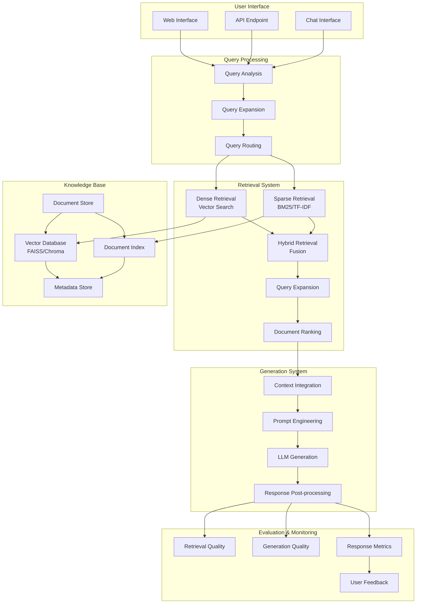

## Vector Database Architecture

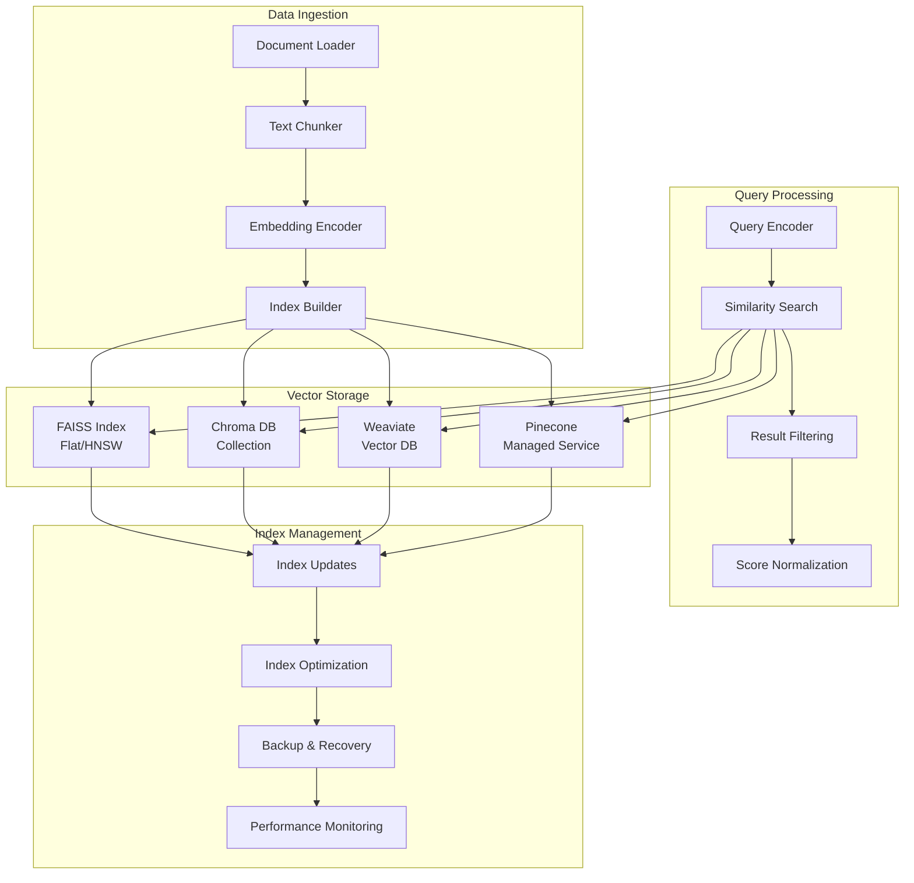

## Retrieval Mechanisms Comparison

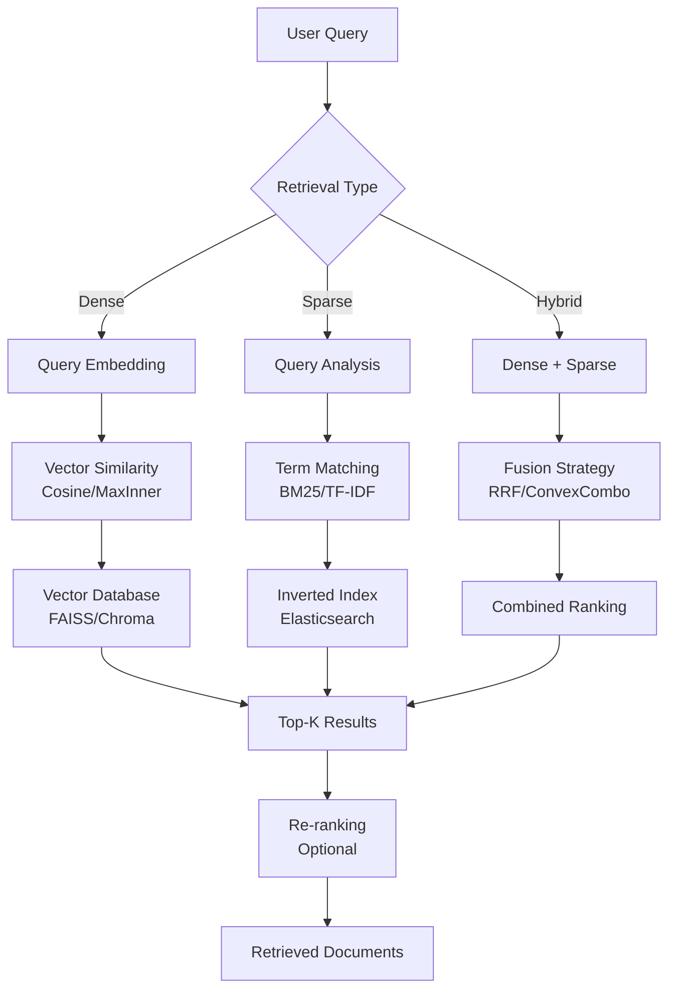

## Hybrid Retrieval Pipeline

```mermaid
flowchart TD
    A[Query: "What is machine learning?"] --> B[Dense Retrieval]
    A --> C[Sparse Retrieval]

    B --> D[Vector Search<br/>Top-20 Results]
    C --> E[BM25 Search<br/>Top-20 Results]

    D --> F[Reciprocal Rank Fusion]
    E --> F

    F --> G[RRF Scores<br/>Combined Ranking]

    G --> H[Top-5 Documents]
    H --> I[Re-ranking<br/>Cross-encoder]

    I --> J[Final Ranking]
    J --> K[Context Preparation]

    K --> L[Generation]
```

## RAG Generation Patterns

```mermaid
graph TB
    subgraph "Basic RAG"
        BR1[Retrieve Documents]
        BR2[Concatenate Context]
        BR3[Generate Response]
    end

    subgraph "Chain-of-Thought RAG"
        CR1[Retrieve Documents]
        CR2[Reasoning Steps]
        CR3[Step-by-Step Generation]
        CR4[Final Answer Extraction]
    end

    subgraph "Multi-Step RAG"
        MR1[Query Decomposition]
        MR2[Parallel Retrieval]
        MR3[Individual Answers]
        MR4[Answer Synthesis]
    end

    subgraph "Iterative RAG"
        IR1[Initial Retrieval]
        IR2[Generate Partial Answer]
        IR3[Follow-up Queries]
        IR4[Refined Retrieval]
        IR5[Final Generation]
    end

    BR1 --> BR2 --> BR3
    CR1 --> CR2 --> CR3 --> CR4
    MR1 --> MR2 --> MR3 --> MR4
    IR1 --> IR2 --> IR3 --> IR4 --> IR5
```

## Document Processing Pipeline

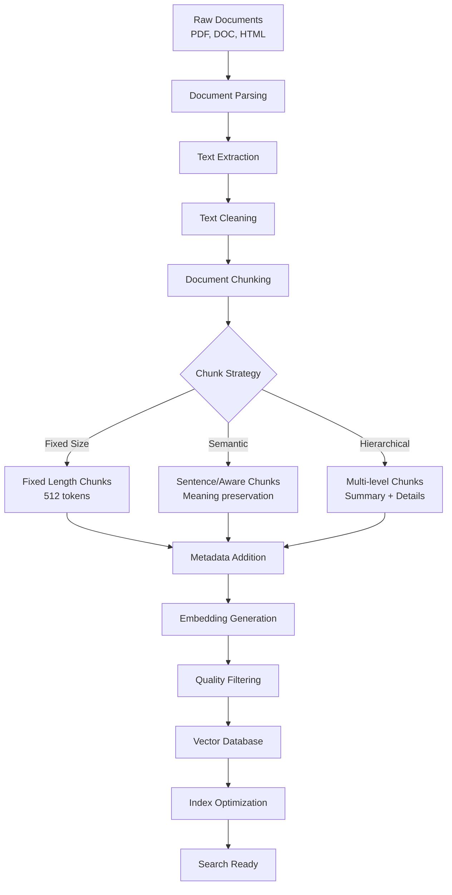

## Evaluation Framework

```mermaid
graph TB
    subgraph "Retrieval Evaluation"
        RE1[Precision@K]
        RE2[Recall@K]
        RE3[Mean Reciprocal Rank]
        RE4[Mean Average Precision]
        RE5[NDCG]
    end

    subgraph "Generation Evaluation"
        GE1[BLEU Score]
        GE2[ROUGE Scores]
        GE3[BERTScore]
        GE4[Factual Consistency]
        GE5[Answer Relevance]
    end

    subgraph "End-to-End Evaluation"
        EE1[User Satisfaction]
        EE2[Response Quality]
        EE3[Latency Metrics]
        EE4[Error Rates]
        EE5[Cost Analysis]
    end

    subgraph "Ground Truth"
        GT1[Reference Answers]
        GT2[Relevant Documents]
        GT3[Quality Annotations]
    end

    GT1 --> GE1
    GT1 --> GE2
    GT1 --> GE3

    GT2 --> RE1
    GT2 --> RE2
    GT2 --> RE3
    GT2 --> RE4
    GT2 --> RE5

    GT3 --> EE1
    GT3 --> EE2
    GT3 --> EE3
    GT3 --> EE4
    GT3 --> EE5

    RE1 --> EE1
    GE1 --> EE2
    EE3 --> EE5
```

## RAG Optimization Workflow

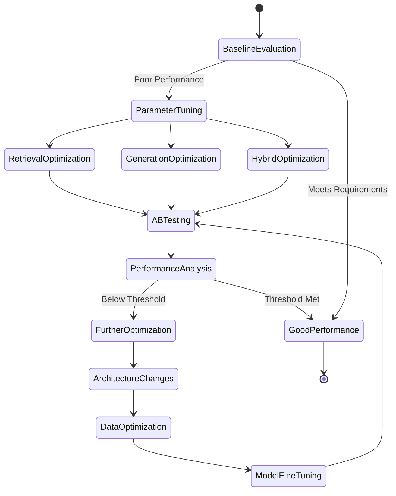

## Deployment Architecture

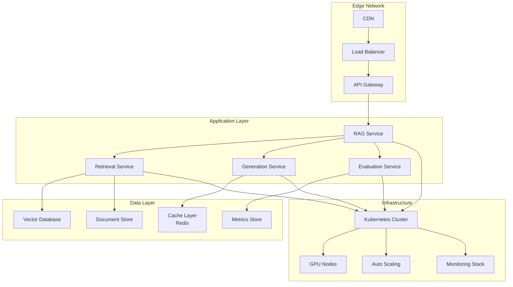

## Cost Optimization Strategies

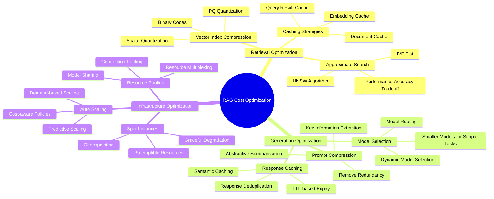

## Monitoring Dashboard

```mermaid
graph LR
    subgraph "Retrieval Metrics"
        RM1[Query Latency]
        RM2[Hit Rate]
        RM3[Precision@K]
        RM4[Recall@K]
        RM5[Index Size]
    end

    subgraph "Generation Metrics"
        GM1[Token Usage]
        GM2[Response Time]
        GM3[Error Rate]
        GM4[Model Load]
        GM5[GPU Utilization]
    end

    subgraph "System Metrics"
        SM1[Throughput]
        SM2[Availability]
        SM3[Cost per Query]
        SM4[User Satisfaction]
        SM5[Data Freshness]
    end

    subgraph "Alerts"
        A1[High Latency]
        A2[Low Accuracy]
        A3[System Errors]
        A4[Cost Spikes]
    end

    RM1 --> A1
    RM3 --> A2
    GM3 --> A3
    SM3 --> A4

    RM1 --> SM1
    GM1 --> SM3
    RM2 --> SM4
    GM4 --> SM2
```

## Data Pipeline Architecture

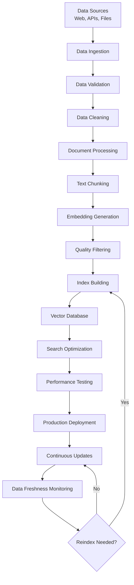

## Security Architecture

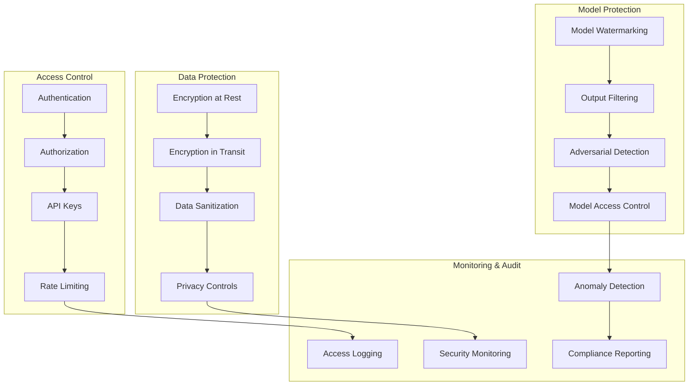

## A/B Testing Framework

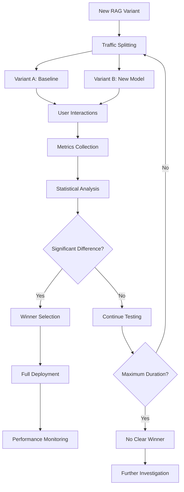

## Scalability Patterns

```mermaid
graph TB
    subgraph "Horizontal Scaling"
        HS1[Load Balancer]
        HS2[Multiple RAG Instances]
        HS3[Shared Vector DB]
        HS4[Distributed Cache]
    end

    subgraph "Vertical Scaling"
        VS1[GPU Scaling]
        VS2[Memory Optimization]
        VS3[Batch Processing]
        VS4[Model Sharding]
    end

    subgraph "Data Scaling"
        DS1[Index Sharding]
        DS2[Read Replicas]
        DS3[Distributed Storage]
        DS4[Data Partitioning]
    end

    subgraph "Caching Layers"
        CL1[Query Cache]
        CL2[Embedding Cache]
        CL3[Result Cache]
        CL4[Multi-level Cache]
    end

    HS1 --> HS2
    HS2 --> HS3
    HS2 --> HS4

    VS1 --> VS2
    VS2 --> VS3
    VS3 --> VS4

    DS1 --> DS2
    DS2 --> DS3
    DS3 --> DS4

    CL1 --> CL2
    CL2 --> CL3
    CL3 --> CL4
```

## Continuous Learning Pipeline

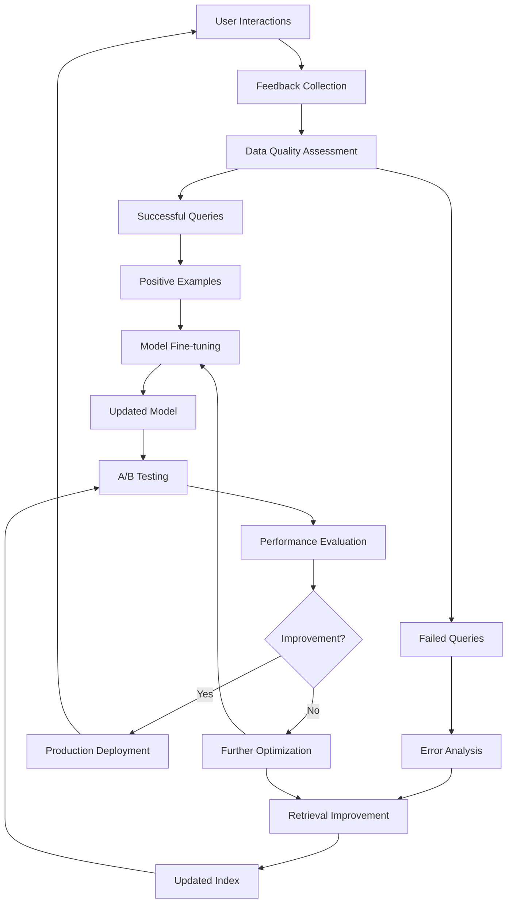

This comprehensive visual guide covers all aspects of RAG systems including architecture, vector databases, retrieval mechanisms, generation patterns, evaluation frameworks, deployment strategies, and optimization techniques. The diagrams provide clear visualizations of complex RAG workflows and system designs.
