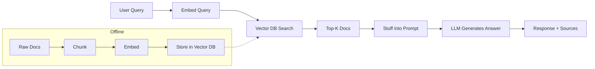

# RAG — Cheatsheet

## Architecture (30-second mental model)

## When to use vs alternatives
| Need | Use | Not |
|------|-----|-----|
| Up-to-date knowledge without retraining | RAG | Fine-tuning |
| Consistent style/tone across outputs | Fine-tuning | RAG |
| Cite sources and explain provenance | RAG | Vanilla LLM |
| Sub-100ms latency, no retrieval overhead | Fine-tuning / prompt engineering | RAG |
| Knowledge base changes weekly or more | RAG | Fine-tuning |

## 5 things you always forget
1. Lost-in-the-middle effect: LLMs attend more to the beginning and end of retrieved context -- put the most relevant chunks first and last, not buried in the middle of a 5-doc context window.
2. You must use the SAME embedding model at ingest and query time -- mixing models produces garbage similarity scores; version your embedding model alongside your index.
3. BM25 sparse retrieval needs separate tokenization and indexing from dense vectors -- add a parallel BM25 index and fuse with RRF (k=60 is the standard constant) before tuning anything else.
4. Re-ranking with a cross-encoder after initial retrieval is the single highest-ROI optimization -- it costs one extra model call but lifts Precision@5 dramatically.
5. Evaluation needs three separate metrics: retrieval quality (Recall@K), faithfulness (is the answer grounded in context?), and answer relevance -- optimizing only one hides failures in the others.

## Interview killer answer
> "We ran RAG in production serving 50K queries/day. The biggest lesson was that chunking strategy and re-ranking mattered far more than which LLM we used -- we switched from naive fixed-size chunks to semantic chunking with a cross-encoder re-ranker and saw our faithfulness score jump from 0.72 to 0.91, while a model upgrade alone only moved it from 0.72 to 0.76. We also cached embeddings in Redis and routed simple queries to a smaller model, which cut our per-query cost by 60%."
