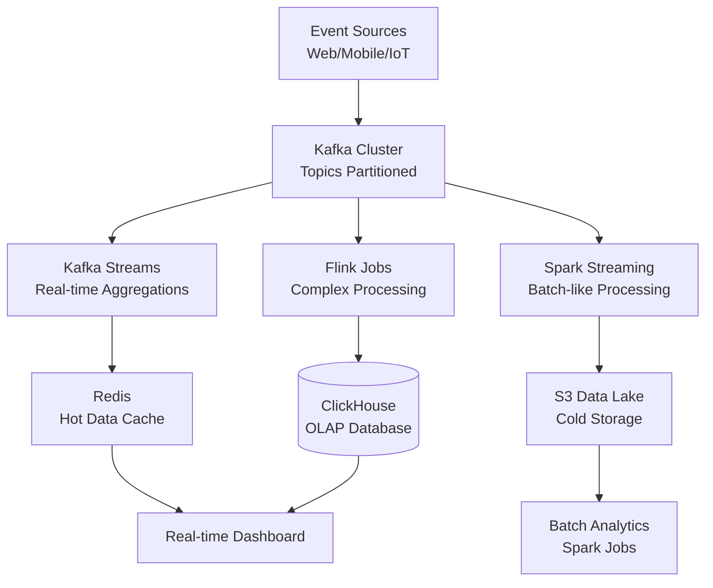

# Real-Time Processing Architect / Interview Reference

## Top Questions

1. **Explain the differences between batch processing and stream processing.**
   - **Batch Processing**: Process data in fixed-size chunks, scheduled intervals, higher latency, easier to reason about
   - **Stream Processing**: Process data as it arrives, continuous processing, low latency, complex state management
   - **Use Cases**: Batch for ETL, analytics, reporting; Stream for real-time analytics, monitoring, event-driven systems
   - **Trade-offs**: Batch is simpler but slower, stream is faster but more complex

2. **What are the different delivery semantics in stream processing?**
   - **At-Least-Once**: Messages may be delivered multiple times, simpler to implement, requires idempotent processing
   - **At-Most-Once**: Messages may be lost, no duplicates, suitable for loss-tolerant applications
   - **Exactly-Once**: Each message processed exactly once, most complex, requires idempotency + deduplication
   - **Implementation**: Kafka transactions, Flink checkpointing, idempotent producers, deduplication logic

3. **Explain windowing strategies in stream processing.**
   - **Tumbling Windows**: Fixed-size, non-overlapping windows (e.g., every 5 minutes)
   - **Sliding Windows**: Fixed-size, overlapping windows (e.g., 5-minute window sliding every 1 minute)
   - **Session Windows**: Dynamic windows based on activity gaps (e.g., 30-minute inactivity)
   - **Global Windows**: All data in single window, requires custom triggers
   - **Time vs Count**: Time-based (event time, processing time) vs count-based windows

4. **How do you handle late-arriving data in stream processing?**
   - **Watermarks**: Define how late data can arrive, drop data beyond watermark
   - **Allowed Lateness**: Accept late data within tolerance, update window results
   - **Side Outputs**: Route late data to separate stream for handling
   - **Event Time**: Use event timestamps instead of processing time for ordering
   - **Strategies**: Bounded out-of-orderness, periodic watermarks, custom watermark generators

5. **Explain backpressure and how to handle it in stream processing.**
   - **Backpressure**: Downstream can't keep up with upstream, causes memory pressure
   - **Causes**: Slow sinks, network bottlenecks, expensive operations, insufficient resources
   - **Handling**: Flow control, adaptive processing rates, buffering, dropping data (last resort)
   - **Monitoring**: Track lag, throughput, memory usage, processing time
   - **Solutions**: Scale consumers, optimize processing, increase parallelism, use backpressure-aware frameworks

## System Design Prompt – "Real-Time Analytics Platform"

### Requirements
- Process 1M+ events/second
- Real-time dashboards with < 1 second latency
- Historical data retention (1 year)
- Fault-tolerant with 99.9% uptime
- Support multiple tenants

### Architecture Talking Points



**Key Technologies:**
- **Kafka**: Event streaming platform, partitioning, replication, consumer groups
- **Kafka Streams**: Stream processing library, state stores, windowing, exactly-once semantics
- **Apache Flink**: Stream processing engine, event time, stateful processing, CEP
- **Apache Spark**: Structured streaming, micro-batching, integration with batch processing
- **Redis**: In-memory cache, pub/sub, real-time data serving
- **ClickHouse**: Columnar OLAP database, fast aggregations, time-series data

**Design Considerations:**
- **Partitioning**: Partition by tenant_id for isolation, use consistent hashing
- **State Management**: Distributed state stores, checkpointing, state recovery
- **Scaling**: Horizontal scaling, auto-scaling based on lag, dynamic partition assignment
- **Fault Tolerance**: Replication, checkpointing, exactly-once processing, dead letter queues
- **Monitoring**: Lag monitoring, throughput metrics, error rates, latency percentiles

## Troubleshooting Matrix

| Symptom | Root Cause | Fix |
| --- | --- | --- |
| High consumer lag | Slow processing, insufficient consumers | Scale consumers, optimize processing logic, increase parallelism |
| Memory pressure | Large state, backpressure | Increase memory, optimize state size, implement state TTL, scale up |
| Data loss | Consumer crashes before commit | Use idempotent processing, implement retry logic, monitor offsets |
| Late data issues | Incorrect watermark strategy | Adjust watermark delay, use allowed lateness, handle side outputs |
| Duplicate processing | At-least-once without deduplication | Implement idempotency keys, use exactly-once semantics, deduplication logic |
| Slow aggregations | Inefficient windowing, large state | Optimize window size, use incremental aggregations, partition by key |

## Performance Optimization

### Kafka Consumer Optimization
```python
# Increase parallelism
consumer = KafkaConsumer(
    'topic',
    bootstrap_servers=['localhost:9092'],
    group_id='consumer-group',
    max_poll_records=500,  # Process more records per poll
    fetch_min_bytes=1024,  # Wait for more data
    fetch_max_wait_ms=500   # Max wait time
)

# Use multiple consumers in consumer group
# Scale horizontally by adding more consumer instances
```

### Flink Optimization
```scala
// Configure parallelism
env.setParallelism(4)

// Enable checkpointing
env.enableCheckpointing(60000) // 1 minute

// Optimize state backend
env.setStateBackend(new RocksDBStateBackend("hdfs://checkpoints"))

// Use keyed streams for better partitioning
val keyedStream = stream.keyBy(_.userId)
```

### State Management
```python
# Implement state TTL
class StateStore:
    def __init__(self, ttl_seconds=3600):
        self.state = {}
        self.ttl = ttl_seconds
    
    def get(self, key):
        if key in self.state:
            value, timestamp = self.state[key]
            if time.time() - timestamp < self.ttl:
                return value
            else:
                del self.state[key]
        return None
    
    def put(self, key, value):
        self.state[key] = (value, time.time())
```

## Common Patterns

### Event Sourcing Pattern
```python
class EventStore:
    def __init__(self):
        self.events = defaultdict(list)
        self.snapshots = {}
    
    def append_event(self, entity_id, event):
        self.events[entity_id].append(event)
        
        # Create snapshot periodically
        if len(self.events[entity_id]) % 100 == 0:
            self.create_snapshot(entity_id)
    
    def get_current_state(self, entity_id):
        # Rebuild from events or use snapshot
        if entity_id in self.snapshots:
            state = self.snapshots[entity_id].copy()
            start_version = len(self.events[entity_id]) - 100
        else:
            state = {}
            start_version = 0
        
        for event in self.events[entity_id][start_version:]:
            self.apply_event(state, event)
        
        return state
```

### CQRS Pattern
```python
class CommandHandler:
    def handle_create_order(self, command):
        # Validate command
        if self.event_store.get_current_state(command.order_id):
            raise ValueError("Order already exists")
        
        # Create event
        event = {
            'type': 'order_created',
            'order_id': command.order_id,
            'data': command.data,
            'timestamp': datetime.utcnow()
        }
        
        # Store event
        self.event_store.append_event(command.order_id, event)
        
        # Update read model
        self.read_model.update_order(event)

class ReadModel:
    def __init__(self):
        self.orders = {}
    
    def update_order(self, event):
        order_id = event['order_id']
        if event['type'] == 'order_created':
            self.orders[order_id] = event['data']
        elif event['type'] == 'order_updated':
            if order_id in self.orders:
                self.orders[order_id].update(event['data'])
```

### Windowing Pattern
```python
class WindowedAggregator:
    def __init__(self, window_size_seconds=60):
        self.window_size = window_size_seconds
        self.windows = defaultdict(lambda: {'count': 0, 'sum': 0})
    
    def process_event(self, event):
        window_key = self.get_window_key(event.timestamp)
        
        # Update window
        self.windows[window_key]['count'] += 1
        self.windows[window_key]['sum'] += event.value
        
        # Cleanup old windows
        self.cleanup_old_windows(event.timestamp)
    
    def get_window_key(self, timestamp):
        return int(timestamp / self.window_size)
    
    def cleanup_old_windows(self, current_timestamp):
        current_window = self.get_window_key(current_timestamp)
        cutoff_window = current_window - 10  # Keep last 10 windows
        
        for window_key in list(self.windows.keys()):
            if window_key < cutoff_window:
                del self.windows[window_key]
```

## Practice Prompts

1. **Design a real-time recommendation system processing user events.**
   - Event ingestion from multiple sources
   - Real-time feature computation
   - Model serving with low latency
   - A/B testing and experimentation

2. **Implement a fraud detection system with sub-second latency.**
   - Pattern matching on event streams
   - Stateful aggregations (sliding windows)
   - Alert generation and routing
   - Model updates without downtime

3. **Explain how you'd migrate from batch to real-time processing.**
   - Incremental migration strategy
   - Dual-write pattern
   - Data consistency validation
   - Rollback procedures

4. **Design a multi-tenant real-time analytics platform.**
   - Tenant isolation (partitioning, resources)
   - Quota management and rate limiting
   - Cost allocation and billing
   - Security and compliance

5. **How would you handle exactly-once processing at scale?**
   - Idempotent operations
   - Transactional producers
   - Deduplication strategies
   - Performance implications

## Rapid Reference

- **Delivery Semantics**: At-least-once (may duplicate), At-most-once (may lose), Exactly-once (guaranteed once)
- **Windowing**: Tumbling (fixed, non-overlapping), Sliding (fixed, overlapping), Session (activity-based)
- **Time Concepts**: Event time (when event occurred), Processing time (when processed), Ingestion time (when ingested)
- **State Management**: In-memory (fast, limited), RocksDB (persistent, scalable), Distributed (shared state)
- **Scaling**: Horizontal (add consumers), Vertical (increase resources), Auto-scaling (based on lag/metrics)
- **Best Practices**: Idempotent processing, proper partitioning, state TTL, monitoring lag, backpressure handling

