# Real-Time Processing: Visual Guide

## Core Concepts

### Real-Time vs Batch Processing Comparison

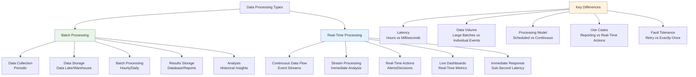

### Event Processing Models

```mermaid
graph TD
    A[Event Processing Models] --> B[Record-at-a-Time]
    A --> C[Micro-Batching]
    A --> D[Windowed Processing]
    A --> E[Session Processing]

    B --> B1[Process Each Event<br/>Immediately]
    B --> B2[Low Latency<br/>< 100ms]
    B --> B3[High Throughput<br/>Individual Records]
    B --> B4[Use Case<br/>Real-Time Alerts]

    C --> C1[Process Small Batches<br/>Every Few Seconds]
    C --> C2[Balanced Latency<br/>100ms - 10s]
    C --> C3[Optimized Throughput<br/>Batch Efficiency]
    C --> C4[Use Case<br/>Near Real-Time Analytics]

    D --> D1[Process Events in Windows<br/>Time-Based Groups]
    D --> D2[Tumbling Windows<br/>Fixed Time Periods]
    D --> D3[Sliding Windows<br/>Overlapping Periods]
    D --> D4[Use Case<br/>Aggregations & Trends]

    E --> E1[Process User Sessions<br/>Activity-Based Groups]
    E --> E2[Session Gap Detection<br/>Inactivity Timeout]
    E --> E3[Variable Duration<br/>User-Driven]
    E --> E4[Use Case<br/>User Behavior Analysis]

    F[Common Patterns] --> F1[Filtering<br/>Event Selection]
    F --> F2[Transformation<br/>Data Enrichment]
    F --> F3[Aggregation<br/>Statistics Calculation]
    F --> F4[Joining<br/>Event Correlation]

    style A fill:#e8f5e8
    style B fill:#e3f2fd
    style C fill:#f3e5f5
    style D fill:#fff3e0
    style E fill:#fce4ec
    style F fill:#e8f5e8
```

## Apache Kafka Architecture

### Kafka Cluster Architecture

```mermaid
graph TD
    A[Kafka Cluster] --> B[Zookeeper Ensemble]
    A --> C[Kafka Brokers]
    A --> D[Topics]
    A --> E[Producers]
    A --> F[Consumers]

    B --> B1[Metadata Management<br/>Broker Registration]
    B --> B2[Leader Election<br/>Partition Leaders]
    B --> B3[Controller Election<br/>Cluster Coordination]
    B --> B4[Configuration<br/>Topic Settings]

    C --> C1[Broker 1<br/>Port 9092]
    C --> C2[Broker 2<br/>Port 9093]
    C --> C3[Broker 3<br/>Port 9094]

    D --> D1[Topic: user_events<br/>Partitions: 3]
    D --> D2[Topic: sensor_data<br/>Partitions: 6]
    D --> D3[Topic: analytics<br/>Partitions: 12]

    E --> E1[Producer App 1<br/>acks=all]
    E --> E2[Producer App 2<br/>acks=1]
    E --> E3[IoT Sensors<br/>acks=0]

    F --> F1[Consumer Group A<br/>Real-Time Processing]
    F --> F2[Consumer Group B<br/>Batch Analytics]
    F --> F3[Consumer Group C<br/>Data Lake]

    G[Data Flow] --> G1[Producer → Broker → Partition]
    G --> G2[Partition → Consumer Group]
    G --> G3[Replication Factor = 3]
    G --> G4[ISR: In-Sync Replicas]

    style A fill:#e8f5e8
    style B fill:#e3f2fd
    style C fill:#f3e5f5
    style D fill:#fff3e0
    style E fill:#fce4ec
    style F fill:#e8f5e8
    style G fill:#fff3e0
```

### Kafka Message Flow

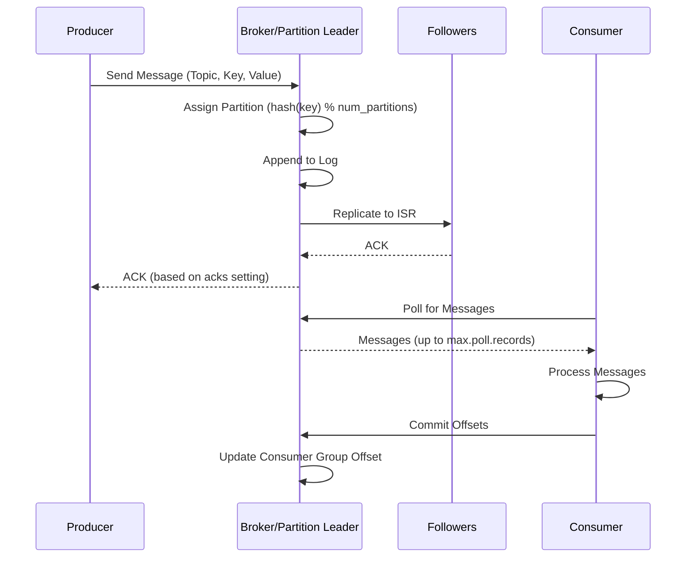

### Kafka Streams Topology

```mermaid
graph TD
    A[Kafka Streams Application] --> B[Source Processors]
    A --> C[Stream Processors]
    A --> D[State Stores]
    A --> E[Sink Processors]

    B --> B1[Kafka Source<br/>user_events]
    B --> B2[Kafka Source<br/>sensor_data]

    C --> C1[Filter Processor<br/>event_type == 'purchase']
    C --> C2[Map Processor<br/>extract amount]
    C --> C3[Aggregate Processor<br/>sum by user_id]
    C --> C4[Join Processor<br/>user + purchase data]

    D --> D1[KTable<br/>User Profiles]
    D --> D2[KTable<br/>Product Catalog]
    D --> D3[Window Store<br/>Time-based Aggregations]

    E --> E1[Kafka Sink<br/>user_analytics]
    E --> E2[Kafka Sink<br/>real_time_alerts]

    F[Processing Topology] --> F1[KStream<br/>Continuous Processing]
    F --> F2[KTable<br/>Changelog Processing]
    F --> F3[GlobalKTable<br/>Reference Data]

    G[Time Semantics] --> G1[Event Time<br/>When event occurred]
    G --> G2[Processing Time<br/>When event processed]
    G --> G3[Ingestion Time<br/>When event received]

    style A fill:#e8f5e8
    style B fill:#e3f2fd
    style C fill:#f3e5f5
    style D fill:#fff3e0
    style E fill:#fce4ec
    style F fill:#e8f5e8
    style G fill:#fff3e0
```

## Apache Flink Architecture

### Flink Job Execution

```mermaid
graph TD
    A[Flink Job Execution] --> B[JobManager]
    A --> C[TaskManagers]
    A --> D[Client]

    B --> B1[Job Scheduling<br/>Task Assignment]
    B --> B2[Checkpoint Coordination<br/>Fault Tolerance]
    B --> B3[Resource Management<br/>Task Slots]
    B --> B4[Job Status Monitoring<br/>Metrics Collection]

    C --> C1[TaskManager 1<br/>4 Task Slots]
    C --> C2[TaskManager 2<br/>4 Task Slots]
    C --> C3[TaskManager 3<br/>4 Task Slots]

    D --> D1[Job Submission<br/>JAR/Flink Program]
    D --> D2[Configuration<br/>Parallelism, Resources]
    D --> D3[Execution Monitoring<br/>Web UI Access]

    E[DataFlow Graph] --> E1[Source Operators<br/>Kafka, Files, Sockets]
    E --> E2[Transformation Operators<br/>Map, Filter, Window]
    E --> E3[Stateful Operators<br/>KeyBy, Aggregations]
    E --> E4[Sink Operators<br/>Kafka, Databases, Files]

    F[Execution Modes] --> F1[Local<br/>Single JVM]
    F --> F2[Standalone<br/>Flink Cluster]
    F --> F3[YARN<br/>Hadoop Integration]
    F --> F4[Kubernetes<br/>Container Orchestration]

    style A fill:#e8f5e8
    style B fill:#e3f2fd
    style C fill:#f3e5f5
    style D fill:#fff3e0
    style E fill:#fce4ec
    style F fill:#e8f5e8
```

### Flink Windowing Concepts

```mermaid
graph TD
    A[Flink Windowing] --> B[Tumbling Windows]
    A --> C[Sliding Windows]
    A --> D[Session Windows]
    A --> E[Global Windows]

    B --> B1[Fixed Size<br/>No Overlap]
    B --> B2[Example<br/>5-minute windows]
    B --> B3[Use Case<br/>Periodic aggregations]

    C --> C1[Fixed Size<br/>With Overlap]
    C --> C2[Example<br/>10-min window, 5-min slide]
    C --> C3[Use Case<br/>Rolling averages]

    D --> D1[Dynamic Size<br/>Activity-based]
    D --> D2[Example<br/>30-min inactivity gap]
    D --> D3[Use Case<br/>User sessions]

    E --> E1[No Windowing<br/>Global aggregations]
    E --> E2[Example<br/>Count all events]
    E --> E3[Use Case<br/>Global statistics]

    F[Time Characteristics] --> F1[Processing Time<br/>System clock]
    F --> F2[Event Time<br/>Event timestamp]
    F --> F3[Ingestion Time<br/>Flink receipt time]

    G[Triggers & Evictors] --> G1[Event Count Trigger<br/>After N events]
    G --> G2[Time Trigger<br/>After time period]
    G --> G3[Purging Trigger<br/>Cleanup old data]

    style A fill:#e8f5e8
    style B fill:#e3f2fd
    style C fill:#f3e5f5
    style D fill:#fff3e0
    style E fill:#fce4ec
    style F fill:#e8f5e8
    style G fill:#fff3e0
```

### Flink State Management

```mermaid
graph TD
    A[Flink State Management] --> B[Keyed State]
    A --> C[Operator State]
    A --> D[Broadcast State]

    B --> B1[Per Key State<br/>KeyBy operation]
    B --> B2[ValueState<br/>Single values]
    B --> B3[ListState<br/>Lists of values]
    B --> B4[MapState<br/>Key-value maps]

    C --> C1[Per Operator State<br/>Non-keyed operations]
    C --> C2[ListState<br/>Operator lists]
    C --> C3[UnionListState<br/>Redistributed state]

    D --> D1[Broadcast State<br/>All parallel instances]
    D --> D2[Rules Engine<br/>Configuration broadcast]
    D --> D3[Pattern Matching<br/>Reference data]

    E[State Backends] --> E1[MemoryStateBackend<br/>Development]
    E --> E2[FsStateBackend<br/>Small state]
    E --> E3[RocksDBStateBackend<br/>Large state]

    F[Checkpointing] --> F1[Barrier Injection<br/>Snapshot coordination]
    F --> F2[State Snapshot<br/>Consistent state]
    F --> F3[Checkpoint Storage<br/>Distributed storage]
    F --> F4[Recovery<br/>State restoration]

    G[Exactly-Once Semantics] --> G1[Idempotent Operations<br/>Safe retries]
    G --> G2[Transactional Sinks<br/>Two-phase commit]
    G --> G3[End-to-End Guarantees<br/>Source to sink]

    style A fill:#e8f5e8
    style B fill:#e3f2fd
    style C fill:#f3e5f5
    style D fill:#fff3e0
    style E fill:#fce4ec
    style F fill:#e8f5e8
    style G fill:#fff3e0
```

## Real-Time Analytics Pipeline

### Lambda Architecture for Analytics

```mermaid
graph TD
    A[Lambda Architecture] --> B[Batch Layer]
    A --> C[Speed Layer]
    A --> D[Serving Layer]

    B --> B1[Historical Data<br/>HDFS/S3]
    B --> B2[Batch Processing<br/>MapReduce/Spark]
    B --> B3[Pre-computed Views<br/>Hourly/Daily]
    B --> B4[High Accuracy<br/>Complete dataset]

    C --> C1[Real-Time Data<br/>Kafka/Kinesis]
    C --> C2[Stream Processing<br/>Flink/Storm]
    C --> C3[Real-Time Views<br/>Low latency]
    C --> C4[Approximate Results<br/>Incremental updates]

    D --> D1[Query Merging<br/>Batch + Real-Time]
    D --> D2[Unified Results<br/>Druid/Elasticsearch]
    D --> D3[API Services<br/>REST/GraphQL]
    D --> D4[Dashboards<br/>Real-Time Updates]

    E[Data Flow] --> E1[Raw Data → Batch Layer]
    E --> E2[Raw Data → Speed Layer]
    E --> E3[Batch Views → Serving Layer]
    E --> E4[Real-Time Views → Serving Layer]

    F[Trade-offs] --> F1[Complexity<br/>Two processing paths]
    F --> F2[Accuracy vs Latency<br/>Batch accurate, Speed approximate]
    F --> F3[Resource Intensive<br/>Duplicate processing]
    F --> F4[Evolution<br/>Towards Kappa architecture]

    style A fill:#e8f5e8
    style B fill:#e3f2fd
    style C fill:#f3e5f5
    style D fill:#fff3e0
    style E fill:#fce4ec
    style F fill:#e8f5e8
```

### Kappa Architecture

```mermaid
graph TD
    A[Kappa Architecture] --> B[Unified Stream Processing]
    A --> C[Data Lake]
    A --> D[Stream Processing Engine]
    A --> E[Serving Layer]

    B --> B1[Single Processing Path<br/>Stream-only]
    B --> B2[Reprocessing<br/>Replay streams]
    B --> B3[Simplified Architecture<br/>No batch layer]
    B --> B4[Real-Time Focus<br/>Everything is streaming]

    C --> C1[Raw Event Storage<br/>Long-term retention]
    C --> C2[Immutable Data<br/>Append-only]
    C --> C3[Reprocessing<br/>Stream replay]
    C --> C4[Schema Evolution<br/>Flexible schemas]

    D --> D1[Stream Processor<br/>Flink/Kafka Streams]
    D --> D2[State Management<br/>Fault-tolerant state]
    D --> D3[Windowing<br/>Time-based processing]
    D --> D4[Exactly-Once<br/>Processing guarantees]

    E --> E1[Materialized Views<br/>Real-time aggregations]
    E --> E2[Query Engine<br/>Druid/ClickHouse]
    E --> E3[API Layer<br/>Real-time queries]
    E --> E4[Dashboards<br/>Live updates]

    F[Reprocessing Flow] --> F1[New Logic Version<br/>Updated processing]
    F --> F2[Stream Replay<br/>From beginning]
    F --> F3[Parallel Processing<br/>Old + new logic]
    F --> F4[Switchover<br/>Atomic transition]

    style A fill:#e8f5e8
    style B fill:#e3f2fd
    style C fill:#f3e5f5
    style D fill:#fff3e0
    style E fill:#fce4ec
    style F fill:#e8f5e8
```

### Real-Time Dashboard Architecture

```mermaid
graph TD
    A[Real-Time Dashboard] --> B[Data Sources]
    A --> C[Stream Processing]
    A --> D[WebSocket Server]
    A --> E[Frontend Client]

    B --> B1[Kafka Topics<br/>Event streams]
    B --> B2[Database Changes<br/>CDC streams]
    B --> B3[API Metrics<br/>Performance data]
    B --> B4[IoT Sensors<br/>Device data]

    C --> C1[Stream Aggregator<br/>Real-time metrics]
    C --> C2[Anomaly Detector<br/>Threshold alerts]
    C --> C3[Trend Analyzer<br/>Pattern recognition]
    C --> C4[Data Enricher<br/>Context addition]

    D --> D1[WebSocket Connections<br/>Persistent links]
    D --> D2[Message Broadcasting<br/>Real-time updates]
    D --> D3[Connection Management<br/>Client tracking]
    D --> D4[Message Filtering<br/>Client subscriptions]

    E --> E1[React/Vue Frontend<br/>Dynamic UI]
    E --> E2[Chart Libraries<br/>D3.js, Chart.js]
    E --> E3[Real-Time Updates<br/>WebSocket messages]
    E --> E4[Interactive Filters<br/>Dynamic queries]

    F[Data Pipeline] --> F1[Event Ingestion<br/>Kafka producers]
    F --> F2[Stream Processing<br/>Flink topology]
    F --> F3[Metric Calculation<br/>Rolling aggregations]
    F --> F4[Alert Generation<br/>Rule evaluation]

    G[Scalability] --> G1[Horizontal Scaling<br/>Multiple processors]
    G --> G2[Load Balancing<br/>Event distribution]
    G --> G3[Connection Pooling<br/>Database efficiency]
    G --> G4[Caching Layer<br/>Redis/Memcached]

    style A fill:#e8f5e8
    style B fill:#e3f2fd
    style C fill:#f3e5f5
    style D fill:#fff3e0
    style E fill:#fce4ec
    style F fill:#e8f5e8
    style G fill:#fff3e0
```

## Event-Driven Architecture

### Event-Driven Microservices

```mermaid
graph TD
    A[Event-Driven Architecture] --> B[Event Producers]
    A --> C[Event Bus]
    A --> D[Event Consumers]
    A --> E[Event Store]

    B --> B1[User Service<br/>UserCreated event]
    B --> B2[Order Service<br/>OrderPlaced event]
    B --> B3[Payment Service<br/>PaymentProcessed event]
    B --> B4[Inventory Service<br/>StockUpdated event]

    C --> C1[Message Broker<br/>Kafka/RabbitMQ]
    C --> C2[Event Routing<br/>Topic-based]
    C --> C3[Event Filtering<br/>Content-based]
    C --> C4[Event Transformation<br/>Schema conversion]

    D --> D1[Notification Service<br/>Email/SMS alerts]
    D --> D2[Analytics Service<br/>Event aggregation]
    D --> D3[Search Service<br/>Index updates]
    D --> D4[Audit Service<br/>Compliance logging]

    E --> E1[Event Persistence<br/>Long-term storage]
    E --> E2[Event Replay<br/>System recovery]
    E --> E3[Event Sourcing<br/>State reconstruction]
    E --> E4[Temporal Queries<br/>Point-in-time views]

    F[Communication Patterns] --> F1[Fire and Forget<br/>Asynchronous]
    F --> F2[Request-Reply<br/>Synchronous response]
    F --> F3[Publish-Subscribe<br/>Multiple consumers]
    F --> F4[Event Carried State<br/>Stateful events]

    style A fill:#e8f5e8
    style B fill:#e3f2fd
    style C fill:#f3e5f5
    style D fill:#fff3e0
    style E fill:#fce4ec
    style F fill:#e8f5e8
```

### CQRS Pattern Implementation

```mermaid
graph TD
    A[CQRS Architecture] --> B[Command Side]
    A --> C[Query Side]
    A --> D[Event Store]

    B --> B1[Command Handlers<br/>Write Operations]
    B --> B2[Domain Validation<br/>Business Rules]
    B --> B3[Event Generation<br/>State Changes]
    B --> B4[Aggregate Roots<br/>Consistency Boundaries]

    C --> C1[Query Handlers<br/>Read Operations]
    C --> C2[Read Models<br/>Optimized Views]
    C --> C3[Materialized Views<br/>Pre-computed Data]
    C --> C4[Query Optimization<br/>Indexing Strategies]

    D --> D1[Event Persistence<br/>Append-only Log]
    D --> D2[Event Publishing<br/>Async Notifications]
    D --> D3[Event Replay<br/>State Reconstruction]
    D --> D4[Event Versioning<br/>Schema Evolution]

    E[Data Flow] --> E1[Command → Validation → Event]
    E --> E2[Event → Event Store → Publishers]
    E --> E3[Event → Read Model Updates]
    E --> E4[Query → Read Model → Response]

    F[Benefits] --> F1[Scalability<br/>Separate scaling]
    F --> F2[Performance<br/>Optimized reads]
    F --> F3[Flexibility<br/>Different models]
    F --> F4[Audit Trail<br/>Complete history]

    style A fill:#e8f5e8
    style B fill:#e3f2fd
    style C fill:#f3e5f5
    style D fill:#fff3e0
    style E fill:#fce4ec
    style F fill:#e8f5e8
```

## Monitoring and Alerting

### Real-Time Monitoring Stack

```mermaid
graph TD
    A[Monitoring Stack] --> B[Metrics Collection]
    A --> C[Log Aggregation]
    A --> D[Distributed Tracing]
    A --> E[Alerting Engine]
    A --> F[Visualization]

    B --> B1[Application Metrics<br/>Custom business metrics]
    B --> B2[System Metrics<br/>CPU, Memory, Disk]
    B --> B3[Infrastructure Metrics<br/>Network, Load balancers]
    B --> B4[Business Metrics<br/>Revenue, User activity]

    C --> C1[Application Logs<br/>Error, Debug, Info]
    C --> C2[System Logs<br/>OS, Application servers]
    C --> C3[Audit Logs<br/>Security, Compliance]
    C --> C4[Access Logs<br/>API requests, User actions]

    D --> D1[Request Tracing<br/>End-to-end latency]
    D --> D2[Service Dependencies<br/>Call graphs]
    D --> D3[Performance Profiling<br/>Bottleneck identification]
    D --> D4[Error Correlation<br/>Root cause analysis]

    E --> E1[Threshold Alerts<br/>Metric-based rules]
    E --> E2[Anomaly Detection<br/>Statistical analysis]
    E --> E3[Composite Alerts<br/>Multi-condition rules]
    E --> E4[Escalation Policies<br/>Progressive notifications]

    F --> F1[Real-Time Dashboards<br/>Live metrics]
    F --> F2[Historical Trends<br/>Time-series analysis]
    F --> F3[Custom Reports<br/>Business intelligence]
    F --> F4[Alert History<br/>Incident tracking]

    G[Tools Integration] --> G1[Prometheus<br/>Metrics collection]
    G --> G2[ELK Stack<br/>Log aggregation]
    G --> G3[Jaeger<br/>Distributed tracing]
    G --> G4[PagerDuty<br/>Alert management]

    style A fill:#e8f5e8
    style B fill:#e3f2fd
    style C fill:#f3e5f5
    style D fill:#fff3e0
    style E fill:#fce4ec
    style F fill:#e8f5e8
    style G fill:#fff3e0
```

### Alert Escalation Flow

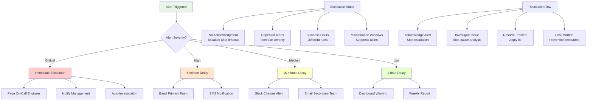

## Stream Processing Patterns

### Complex Event Processing

```mermaid
graph TD
    A[Complex Event Processing] --> B[Event Patterns]
    A --> C[Event Correlation]
    A --> D[Temporal Relationships]
    A --> E[Event Aggregation]

    B --> B1[Sequence Patterns<br/>A followed by B]
    B --> B2[AND Patterns<br/>A and B together]
    B --> B3[OR Patterns<br/>A or B or C]
    B --> B4[NEGATION Patterns<br/>A without B]

    C --> C1[Event Joining<br/>Correlate multiple streams]
    C --> C2[Event Filtering<br/>Select relevant events]
    C --> C3[Event Enrichment<br/>Add context data]
    C --> C4[Event Transformation<br/>Modify event structure]

    D --> D1[Time Windows<br/>Events within time frame]
    D --> D2[Event Ordering<br/>Causal relationships]
    D --> D3[Temporal Logic<br/>Allen temporal operators]
    D --> D4[Event Lifecycles<br/>State transitions]

    E --> E1[Count Aggregation<br/>Number of events]
    E --> E2[Sum Aggregation<br/>Total values]
    E --> E3[Average Aggregation<br/>Mean calculations]
    E --> E4[Statistical Functions<br/>Min, Max, StdDev]

    F[CEP Engines] --> F1[Esper<br/>Java-based CEP]
    F --> F2[Apache Flink CEP<br/>Stream processing CEP]
    F --> F3[WSO2 Siddhi<br/>Cloud-native CEP]
    F --> F4[Apama<br/>Financial trading CEP]

    style A fill:#e8f5e8
    style B fill:#e3f2fd
    style C fill:#f3e5f5
    style D fill:#fff3e0
    style E fill:#fce4ec
    style F fill:#e8f5e8
```

### Stream Processing Topologies

```mermaid
graph TD
    A[Stream Processing Topologies] --> B[Linear Topology]
    A --> C[Fan-Out Topology]
    A --> D[Fan-In Topology]
    A --> E[Diamond Topology]
    A --> F[Iterative Topology]

    B --> B1[Source → Process → Sink]
    B --> B2[Simple Pipeline<br/>Single path]
    B --> B3[Use Case<br/>Basic ETL]

    C --> C1[Source → Multiple Processes]
    C --> C2[Parallel Processing<br/>Independent branches]
    C --> C3[Use Case<br/>Multi-system updates]

    D --> D1[Multiple Sources → Single Process]
    D --> D2[Data Consolidation<br/>Merge streams]
    D --> D3[Use Case<br/>Data aggregation]

    E --> E1[Source → Process A → Process C]
    E --> E2[Source → Process B → Process C]
    E --> E3[Converging Paths<br/>Join results]
    E --> E4[Use Case<br/>Multi-step processing]

    F --> F1[Process → Loop Back → Process]
    F --> F2[Iterative Refinement<br/>Model training]
    F --> F3[Use Case<br/>Machine learning]

    G[Topology Patterns] --> G1[Stateless Processing<br/>No state maintained]
    G --> G2[Stateful Processing<br/>State across events]
    G --> G3[Windowed Processing<br/>Time-based grouping]
    G --> G4[Keyed Processing<br/>Per-key operations]

    style A fill:#e8f5e8
    style B fill:#e3f2fd
    style C fill:#f3e5f5
    style D fill:#fff3e0
    style E fill:#fce4ec
    style F fill:#e8f5e8
    style G fill:#fff3e0
```

This visual guide provides comprehensive diagrams covering real-time processing concepts, Apache Kafka and Flink architectures, analytics pipelines, event-driven patterns, monitoring systems, and stream processing topologies. Each diagram illustrates complex concepts in an accessible way, helping developers understand real-time processing architectures and implementation patterns.
