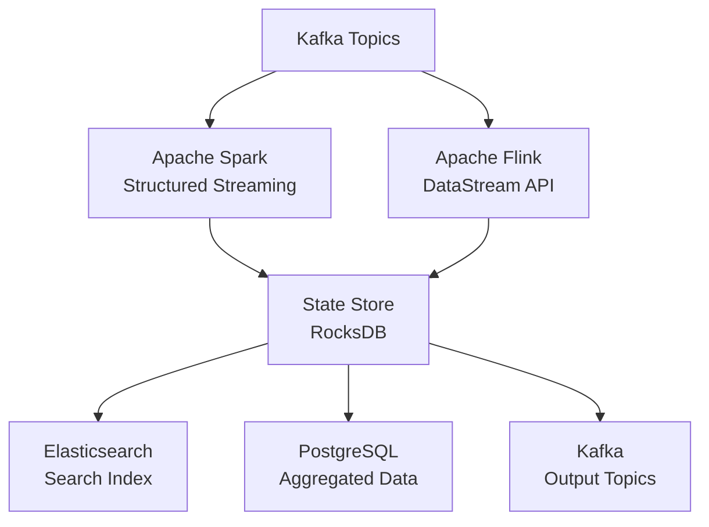

# Scala Architect / Interview Reference

## Top Questions

1. **Explain the difference between `val`, `var`, and `def` in Scala.**
   - **val**: Immutable reference (final in Java), value cannot be reassigned
   - **var**: Mutable reference, can be reassigned (discouraged in functional style)
   - **def**: Method definition, evaluated each time it's called (call-by-name)
   - **lazy val**: Evaluated once on first access, useful for expensive computations
   - **Best Practice**: Prefer `val` and `def`, avoid `var` for functional programming

2. **What is pattern matching and how does it differ from Java switch?**
   - **Pattern Matching**: Exhaustive matching, type checking, destructuring, guards, extractors
   - **vs Switch**: More powerful, can match on types/structures, returns values, exhaustiveness checking
   - **Use Cases**: Matching on case classes, sealed traits, collections, tuples
   - **Advanced**: Partial functions, pattern matching in for comprehensions, unapply extractors

3. **Explain Scala's type system: variance, bounds, and implicits.**
   - **Variance**: Covariant (+T), Contravariant (-T), Invariant (T)
   - **Bounds**: Upper bounds (T <: U), Lower bounds (T >: U), Context bounds (T : Ordering)
   - **Implicits**: Implicit parameters, implicit conversions, implicit classes (extension methods)
   - **Type Classes**: Using implicits to implement type classes (Show, Ordering, etc.)

4. **What are the differences between `List`, `Array`, `Vector`, and `Seq`?**
   - **List**: Immutable, linked list, O(1) prepend, O(n) random access, good for functional operations
   - **Array**: Mutable, indexed, O(1) access, Java interop, fixed size
   - **Vector**: Immutable, tree structure, O(1) append/prepend, O(log n) random access, balanced performance
   - **Seq**: Trait, abstract interface for sequences, List and Vector are implementations
   - **When to Use**: List for functional transformations, Vector for random access, Array for performance-critical code

5. **Explain Futures, Promises, and async programming in Scala.**
   - **Future**: Represents asynchronous computation, non-blocking, composable with map/flatMap
   - **Promise**: Producer side of Future, can complete Future with success/failure
   - **ExecutionContext**: Thread pool for executing Futures, implicit execution context
   - **Composition**: for-comprehensions, Future.sequence, Future.traverse, error handling with recover
   - **vs Java CompletableFuture**: More functional, better composition, integrated with Scala collections

## System Design Prompt – "Real-Time Data Processing Pipeline"

### Requirements
- Process millions of events per second
- Transform and aggregate streaming data
- Fault-tolerant with exactly-once semantics
- Low latency (< 100ms processing)
- Scale horizontally

### Architecture Talking Points



**Key Scala Technologies:**
- **Apache Spark**: Distributed processing, RDD/DataFrame/Dataset APIs, structured streaming
- **Apache Flink**: Stream processing, event time, stateful computations, CEP
- **Akka**: Actor model, message passing, supervision, clustering
- **Kafka Streams**: Stream processing library, state stores, windowing
- **Cats/Typelevel**: Functional programming libraries, type classes, effect systems

**Design Considerations:**
- **State Management**: RocksDB for state stores, checkpointing for fault tolerance
- **Windowing**: Tumbling, sliding, session windows for time-based aggregations
- **Exactly-Once**: Idempotent operations, transactional producers, offset management
- **Backpressure**: Flow control, adaptive processing rates
- **Monitoring**: Metrics collection, distributed tracing, alerting

## Troubleshooting Matrix

| Symptom | Root Cause | Fix |
| --- | --- | --- |
| OutOfMemoryError | Large RDDs, insufficient executor memory | Increase executor memory, use broadcast variables, repartition data |
| Slow Spark jobs | Skewed data, small partitions | Repartition with better keys, use salting, increase parallelism |
| Actor system deadlock | Circular message dependencies | Redesign message flow, use ask pattern with timeouts |
| Future timeout | Blocking operations, slow external calls | Use non-blocking APIs, increase timeout, use circuit breakers |
| Type mismatch errors | Implicit resolution failures | Check implicit imports, verify type bounds, use explicit types |
| Serialization errors | Non-serializable closures | Ensure closures capture only serializable values, use broadcast variables |

## Performance Optimization

### Spark Optimization
```scala
// Repartition for better parallelism
val repartitioned = df.repartition(200)

// Use broadcast joins for small tables
val broadcast = spark.sparkContext.broadcast(smallTable)
val joined = df.join(broadcast.value, "key")

// Cache frequently used DataFrames
df.cache()

// Use columnar formats
df.write.parquet("path")

// Optimize shuffle operations
spark.conf.set("spark.sql.shuffle.partitions", "200")
```

### Akka Optimization
```scala
// Configure dispatchers
val config = ConfigFactory.parseString("""
  akka.actor.default-dispatcher {
    type = "Dispatcher"
    executor = "fork-join-executor"
    fork-join-executor {
      parallelism-min = 8
      parallelism-max = 64
    }
  }
""")
```

## Common Patterns

### Actor Pattern
```scala
import akka.actor.{Actor, ActorSystem, Props}

class WorkerActor extends Actor {
  def receive: Receive = {
    case ProcessData(data) =>
      val result = process(data)
      sender() ! Result(result)
    case Shutdown =>
      context.stop(self)
  }
  
  def process(data: String): String = {
    // Processing logic
    data.toUpperCase
  }
}

case class ProcessData(data: String)
case class Result(data: String)
case object Shutdown
```

### Type Class Pattern
```scala
trait Show[T] {
  def show(value: T): String
}

object Show {
  implicit val intShow: Show[Int] = (value: Int) => value.toString
  implicit val stringShow: Show[String] = (value: String) => s""""$value""""
  
  implicit def listShow[T](implicit showT: Show[T]): Show[List[T]] =
    (value: List[T]) => value.map(showT.show).mkString("[", ", ", "]")
  
  def show[T](value: T)(implicit showInstance: Show[T]): String =
    showInstance.show(value)
}
```

### Future Composition
```scala
import scala.concurrent.{Future, ExecutionContext}
import ExecutionContext.Implicits.global

def fetchUserData(userId: String): Future[User] = Future {
  // Fetch from database
  User(userId, "John Doe")
}

def fetchUserPosts(userId: String): Future[List[Post]] = Future {
  // Fetch from API
  List(Post("1", "Post 1"), Post("2", "Post 2"))
}

// Sequential composition
val userProfile: Future[UserProfile] = for {
  user <- fetchUserData("123")
  posts <- fetchUserPosts("123")
} yield UserProfile(user, posts)

// Parallel composition
val userFuture = fetchUserData("123")
val postsFuture = fetchUserPosts("123")

val profile: Future[UserProfile] = for {
  user <- userFuture
  posts <- postsFuture
} yield UserProfile(user, posts)

// Error handling
val resilient: Future[User] = fetchUserData("123").recover {
  case ex: Exception => User("default", "Default User")
}
```

## Practice Prompts

1. **Design a distributed cache using Akka actors.**
   - Actor hierarchy and supervision
   - Consistent hashing for key distribution
   - Replication and fault tolerance
   - Cache eviction policies

2. **Implement a real-time aggregation system using Spark Structured Streaming.**
   - Windowed aggregations
   - State management
   - Exactly-once processing
   - Performance optimization

3. **Explain how you'd implement a type-safe configuration system using implicits.**
   - Type classes for configuration
   - Implicit resolution
   - Default values
   - Validation

4. **Design a fault-tolerant stream processing pipeline.**
   - Error handling strategies
   - Retry mechanisms
   - Dead letter queues
   - Monitoring and alerting

5. **How would you optimize a Spark job processing terabytes of data?**
   - Partitioning strategy
   - Broadcast variables
   - Caching decisions
   - Shuffle optimization

## Rapid Reference

- **Collections**: List (immutable, linked), Vector (immutable, indexed), Map (key-value), Set (unique elements)
- **Pattern Matching**: `match` expressions, case classes, sealed traits, guards (`if`), extractors (`unapply`)
- **Futures**: `Future.apply`, `map`/`flatMap`, `for` comprehensions, `Future.sequence`, `recover`/`recoverWith`
- **Akka**: ActorSystem, Props, Actor, `!` (tell), `?` (ask), supervision strategies
- **Spark**: RDD (resilient distributed dataset), DataFrame (structured), Dataset (typed), transformations vs actions
- **Best Practices**: Immutability, pure functions, type safety, avoid null (use Option), use case classes for data

